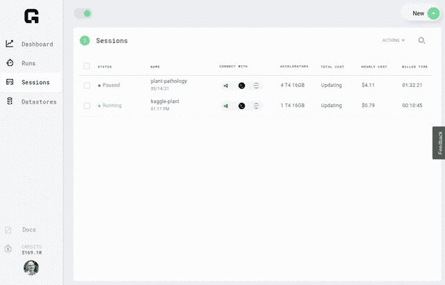
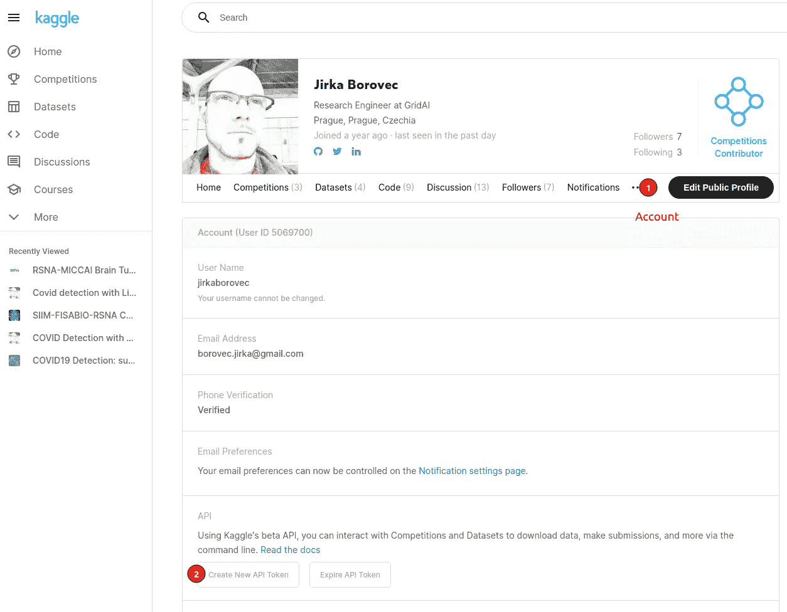
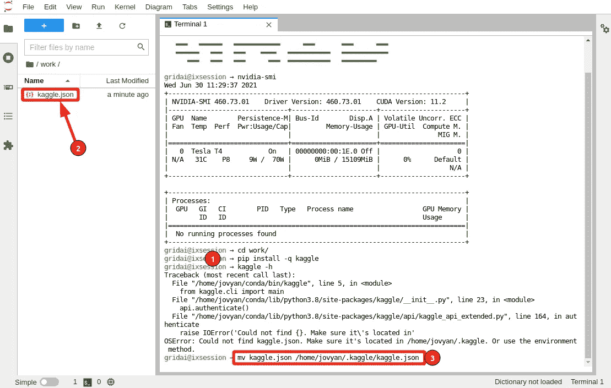

# 如何准备您的开发环境以便在 Kaggle 上排名

> 原文：<https://towardsdatascience.com/how-to-prepare-your-development-environment-to-rank-on-kaggle-1a0fa1032b84?source=collection_archive---------16----------------------->


插图照片由 [Pexels](https://www.pexels.com/photo/silver-laptop-450035/?utm_content=attributionCopyText&utm_medium=referral&utm_source=pexels) 的 [Mateusz Dach](https://www.pexels.com/@mateusz-dach-99805?utm_content=attributionCopyText&utm_medium=referral&utm_source=pexels) 拍摄。

## 这篇文章介绍了为 Kaggle 影像分类挑战配置定制开发环境的最佳实践。

在这个故事中，我将介绍如何为参加 Kaggle 挑战赛设置开发环境:
1)选择一个最近有趣的比赛，
2)在云中启动一个 JupyterLab 环境，
3)下载完整的数据集，
4)执行初始图像预处理。

# 初步选择:竞赛、深度学习框架、云平台


显示每个串联类别组合的样本图像和计数。

我们将使用最近的 Kaggle [植物病理学 2021 — FGVC8](https://www.kaggle.com/c/plant-pathology-2021-fgvc8) 来展示完整的数据科学周期。这场比赛的一个好的方面是，它非常简单，代表了 CIFAR 和 MNIST 以外的真实世界图像分类任务所面临的挑战。

我为这些比赛选择的框架是 [PyTorch Lightning](https://github.com/PyTorchLightning/pytorch-lightning) ，它允许我专注于迭代我的数据处理和模型架构，而不用担心训练循环和设备管理的繁重工程。关于为什么你应该查看下面的 [PyTorch 闪电贴](https://devblog.pytorchlightning.ai/why-should-i-use-pytorch-lightning-488760847b8b)的更多信息。

[](https://devblog.pytorchlightning.ai/why-should-i-use-pytorch-lightning-488760847b8b) [## 我为什么要用 PyTorch Lightning？

devblog.pytorchlightning.ai](https://devblog.pytorchlightning.ai/why-should-i-use-pytorch-lightning-488760847b8b) 

作为一个计算平台，我选择了 [Grid.ai](https://docs.grid.ai) ，它可以让我精确地指定我想要使用的机器，里面预装了 JupiterLab。作为奖励，Grid 使我能够用 Github 同步我所有的 Kaggle 代码。稍后，我将使用它来运行超参数搜索，为我的模型找到最佳配置。

> 完全公开——我目前在 [Grid.ai](https://www.grid.ai/)
> 担任高级研究工程师。注意，还有其他替代方案可以用来利用这些最佳实践，例如 Kaggle 内核或 Colab，但 Grid 是我的首选平台，因为它使我能够使用云轻松地扩展训练我的模型。

[](/trivially-scale-pytorch-on-aws-4cfde16e6d37) [## AWS 上的普通比例 PyTorch

### 在 AWS 上运行 PyTorch 工作负载，无需更改代码

towardsdatascience.com](/trivially-scale-pytorch-on-aws-4cfde16e6d37) 

本教程中包含的所有代码和可视化都可以在[本报告](https://github.com/Borda/kaggle_plant-pathology)中获得，您可以免费使用和贡献。

# 准备 Kaggle 开发环境

我选择 Grid.ai 作为我的开发环境，因为它提供了三个主要的构建模块:

1.  [数据存储](https://docs.grid.ai/products/add-data-to-grid-datastores)(使我能够一次上传数据，并在任何地方使用；他们确保我们所有的原型和实验使用相同的数据，并且是可重复的)
2.  [会话](https://docs.grid.ai/products/sessions)(这使我能够专注于机器学习本身。我发现网格实例的 CPU/GPU/RAM 性能优于 Kaggle 和 Colab 内核)
3.  [运行](https://docs.grid.ai/products/run-run-and-sweep-github-files)(这使我能够扩大实验规模；我可以实时密切监控多个实验，及早停止次优配置，比较结果，并在一个地方为 Kaggle 导出最佳模型。

## 启动网格会话



在网格会话中启动 Jupyter 实验室。

首先用 GitHub 或者 Google 账号登录 [Grid.ai](https://platform.grid.ai/) 。然后您可以创建一个会话——配置您的实例类型并设置所需的存储大小(当您想要处理大型数据集时会很方便)。新的交互式会话实例带有一个内置的 JupyterLab。


为完整旅程创建网格会话的步骤[点击此处](https://platform.grid.ai/#/dashboard?product_tour_id=221973)

我可以轻松地启动 JupyterLab，并使用 cli 工具[glasses](https://glances.readthedocs.io/en/latest/quickstart.html)来监控实时资源使用情况，这让我知道是否存在任何资源瓶颈，如预处理期间的 CPU 利用率或训练期间的 GPU 利用率，从而导致训练批量增加。

[](https://docs.grid.ai/products/sessions) [## ⚡Sessions

### 会话是为开发而优化的交互式机器(带有多个 GPU)。

doc . grid . ai](https://docs.grid.ai/products/sessions) 

## 设置 Kaggle CLI 并下载数据集

为了在我们的会话中获得[植物病理学 2021 — FGVC8](https://www.kaggle.com/c/plant-pathology-2021-fgvc8) 数据集，我们使用由 Kaggle 直接提供的 Kaggle CLI，并在 [PyPI](https://pypi.org/project/kaggle/) 上进行索引。

```
pip install kaggle
```

对于任何使用 Kaggle CLI 的用户，您需要设置[您的凭证](https://medium.com/@ankushchoubey/how-to-download-dataset-from-kaggle-7f700d7f9198)——登录 Kaggle web 并创建您的个人密钥，该密钥将作为`kaggle.json`自动下载。



从个人 Kaggle 帐户下载凭证文件的步骤如下:(1)选择帐户，(2)向下滚动并“创建新的 API 令牌”。

当我们有了`kaggle.json`密钥后，我们可以使用 JupyterLab 将其上传到我们的会话(简单的拖放)并将其移动到 Kaggle CLI 的正确目的地，如下所示:



逐步如何设置 Kaggle CLI: (1)安装`kaggle`包，(2)拖放带有凭证的文件，(3)将其移动到预期的系统文件夹。

```
mv kaggle.json /home/jovyan/.kaggle/kaggle.json
```

现在，我们将数据集下载到我们的会话中。要下载的特定竞赛名称与 URL 名称相同。此外，每场比赛的数据部分都提供了确切的下载命令。大多数数据集以压缩的形式分发，我们需要将它解压缩到一个目的地文件夹(我通常将该文件夹命名为与竞争对手相同的文件夹)。因此，在我们的竞争中，我们调用以下命令:

```
# doanload dataset via Kaggle CLI
kaggle competitions download plant-pathology-2021-fgvc8
# unzip the dataset to a folder
unzip plant-pathology-2021-fgvc8.zip -d plant-pathology
```

## 数据集预处理

提取之后，我们可以对数据集进行预处理。原始数据集以 4K 分辨率分布，这对于大多数应用程序来说太大了，所以我们将图像缩小到大约 640px。在[如何在排行榜上排名](https://devblog.pytorchlightning.ai/how-to-boost-your-image-classification-with-pytorch-lightning-242e2e533429)中描述了这种观察和推理。我们使用一个简单的 CLI 工具 [ImageMagick](https://imagemagick.org/) 。

```
apt install imagemagick
# apply to all JPEG images in given folder
mogrify -resize 640 plant-pathology/train_images/*.jpg
```

最终，您可以编写自己的小脚本来探索 python 多处理并加速这种转换…

用于多处理图像缩放的简单[脚本](https://gist.github.com/Borda/17a6ace0f7568b4d460bc0c1ce44a852)。

这就是你需要知道的准备 Kaggle 开发环境和 Grid.ai 的一切。概括地说，我们选择了一个有趣的 *Kaggle* 竞赛，展示了如何开始交互式会话，以及如何为任何(本地或云)环境配置 Kaggle 凭证。

我将在未来的博客文章中继续探索这个下载的数据集，并准备一个基线计算机视觉模型来解决这个任务。我还将回顾一些帮助我在排行榜上排名的技巧，敬请关注。稍后，我们还将分享如何轻松地从离线内核提交内容。

[](/intuitive-kaggle-task-exploration-and-model-baselining-e5f641943d08) [## 直观的 Kaggle 任务探索和模型基线

### 用 PyTorch 闪电和网格点实例在 Kaggle 上排名的最佳实践(第 2/5 部分)

towardsdatascience.com](/intuitive-kaggle-task-exploration-and-model-baselining-e5f641943d08) 

**敬请关注，并跟随我了解更多！**

[](https://devblog.pytorchlightning.ai/best-practices-to-rank-on-kaggle-competition-with-pytorch-lightning-and-grid-ai-spot-instances-54aa5248aa8e) [## 使用 PyTorch Lightning 和 Grid.ai Spot 实例对 Kaggle 竞争进行排名的最佳实践

### 通过交互式会话、超参数解决图像分类挑战的完整数据科学周期…

devblog.pytorchlightning.ai](https://devblog.pytorchlightning.ai/best-practices-to-rank-on-kaggle-competition-with-pytorch-lightning-and-grid-ai-spot-instances-54aa5248aa8e) 

# 关于作者

[**Jirka boro vec**](https://medium.com/@jborovec)**已经在几家不同的 IT 公司从事机器学习和数据科学工作好几年了。特别是，他喜欢探索有趣的世界问题，并用最先进的技术解决它们。此外，他开发了几个开源 python 包，并积极参与其他知名项目。在 [*Grid.ai*](https://www.grid.ai/) 工作，担任研究工程师，是[*pytorchlightning . ai*](https://pytorchlightning.ai/)的主要撰稿人。**