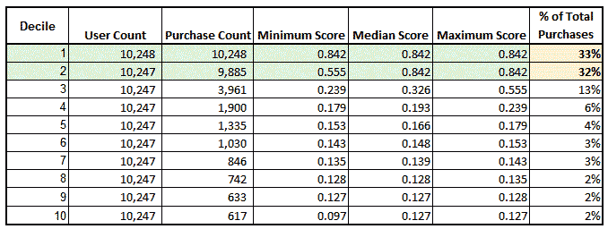
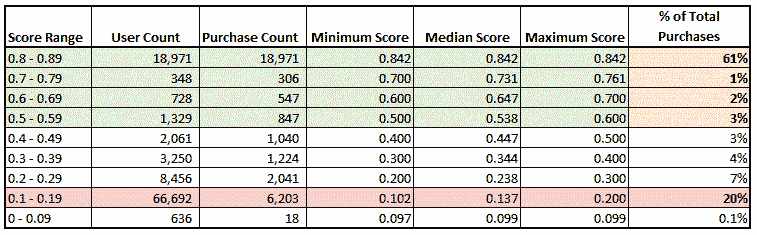

# 如何向非技术人员展示机器学习结果

> 原文：<https://towardsdatascience.com/how-to-present-machine-learning-results-to-non-technical-people-e096cc1b9f76?source=collection_archive---------18----------------------->

## 展示利益相关者能够理解的模型结果

照片由[亚历山大·奈特](https://www.pexels.com/@agk42?utm_content=attributionCopyText&utm_medium=referral&utm_source=pexels)从[派克斯](https://www.pexels.com/photo/high-angle-photo-of-robot-2599244/?utm_content=attributionCopyText&utm_medium=referral&utm_source=pexels)拍摄

作为一名数据科学家，很难向非技术利益相关者解释机器学习的结果。经过反复试验，我想出了一种将模型结果转换成利益相关者能够理解的格式的方法。今天，我想和大家分享我的方法，我用它取得了巨大的成功。

## 方法 1

这种方法可以应用于生成 0 到 1 之间的概率分值的任何模型。

1.  首先将你的模型分数从高到低排序，并对其进行十分制。十分位数 1 将包含最高分，十分位数 10 将包含最低分。
2.  接下来计算每个十分位数的最小值、中值和最大值。
3.  通过十分位数计算真阳性的数量，然后将真阳性的数量除以您的评分人群中的真阳性总数。

下面是在购买倾向模型得分样本集上使用此方法的输出示例。总购买量百分比栏中的百分比是用十分位数的购买量除以总购买量 31，197 计算出来的。

按十分位数购买——按作者分类的表格

这些是这张表上的关键要点。

1.  第一和第二个十分位数分别预测了 33%和 32%，合计购买量的 65%。这表明该模型能够预测出*购买了*的大多数顾客位于前两个十分位数。
2.  与上面的十分位数相比，每个十分位数在总购买量中所占的百分比较低。这是我们对一个好模型的预期趋势，因为大部分购买发生在最高的十分之一，而最低的十分之一包含很少的购买。请注意，十分位数 10 只包含 2%的购买量，而十分位数 1 包含 33%的购买量。
3.  十分位数 3 的分数在 0.239 到 0.555 之间。十分位数 3 是模型变得不太可能准确预测客户购买的时候。

我见过数据科学演示，其模型结果超出了非技术人员的理解范围。

> 然而，如果你用一个表格来展示模型结果，显示前 20%的顾客获得了 65%的购买量，那么你的利益相关者就很容易理解了。

## 方法 2

第二种方法类似于第一种方法，也是一种让数据科学家更容易评估模型结果的视图。

1.  bin 模型在 0 到 1 之间以十分之一为增量进行评分，而不是十分之一。
2.  计算每个条柱的最小值、中值和最大值。
3.  计算每个箱子中真阳性的数量，然后将真阳性的数量除以真阳性的总数。

下面是使用同一组购买倾向得分样本的输出示例。

按分数范围列出的购买情况—按作者列出的表格

这些是使用此输出按分值分类的要点。

1.  使用 0.5 作为映射到 true 的阈值，如果我们将突出显示的“总购买量的百分比”列中的百分比相加，该模型能够预测总购买量的 67%。
2.  但是，得分在 0.1 到 0.19 之间的客户占总购买量的 20%。这表明可能有其他特征可以改进模型，并保证进一步的分析。如果我们没有看到 20%,而是看到了 2%,那么您可以更有信心该模型捕捉到了所有相关特征，以准确预测购买。

该输出向利益相关者显示，您的模型准确地捕获了 67%的购买。如果模型没有预测到真正的阳性结果，它还可以帮助您识别问题，并显示您可以进一步研究的领域，例如得分在 0.1 到 0.19 之间的客户。

## 结论

作为数据科学家，冲动是显示原始模型结果，但通常我们需要将输出转换成利益相关者可以理解的形式。现在你已经看到了我的方法，我希望你能更容易地表达你的模型结果，让每个人都能理解。

 [## 我如何使用机器学习模型来生成可操作的见解

### 将数据科学与数据分析相结合

medium.com](https://medium.com/swlh/how-i-used-a-machine-learning-model-to-generate-actionable-insights-3aa1dfe2ddfd)  [## 为什么建立机器学习模型就像烹饪一样

### 逐步比较

towardsdatascience.com](/why-building-a-machine-learning-model-is-like-cooking-4bed1f6115d1)  [## 为什么数据科学家应该首先成为数据分析师

### 确保成功的职业战略

towardsdatascience.com](/why-data-scientists-should-become-data-analysts-first-d5a2bc68fc6e)