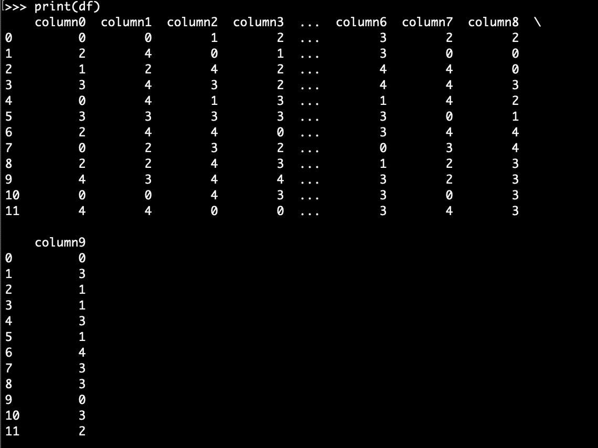
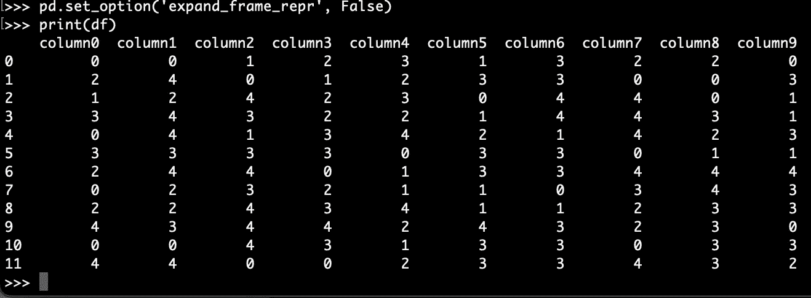

# 如何漂亮地打印熊猫数据帧和系列

> 原文：<https://towardsdatascience.com/how-to-pretty-print-pandas-dataframes-and-series-b301fa78bb6c?source=collection_archive---------11----------------------->

## 如何在同一行显示熊猫数据框的所有列


[斯通王](https://unsplash.com/@stonewyq?utm_source=unsplash&utm_medium=referral&utm_content=creditCopyText)在 [Unsplash](https://unsplash.com/s/photos/pandas?utm_source=unsplash&utm_medium=referral&utm_content=creditCopyText) 上拍照

当我们必须处理可能有多列和多行的大熊猫数据帧时，能够以可读的格式显示数据帧是很重要的。这在调试代码时可能也很有用。

默认情况下，当数据帧被打印出来并且具有相当多的列时，只有一部分列被显示到标准输出中。显示的列甚至可以打印成多行。

在今天的文章中，我们将探讨如何配置所需的 pandas 选项，这将允许我们“漂亮地打印”pandas 数据帧。

# 问题是

假设我们有以下数据帧:

现在，如果列数超过显示选项`display.max_rows`的值，则输出数据帧可能不完整，如下所示。仅显示列的子集(`column4`和`column5`缺失)，而剩余的列以多行方式打印。



来源:作者

虽然输出仍然具有一定的可读性，但是忽略列或多行打印肯定是不理想的。

# 如何漂亮地打印熊猫数据帧

如果您的显示器足够宽，能够容纳更多的列，您可能需要调整一些显示选项。我将在下面使用的值可能不适合您的设置，因此请确保对它们进行相应的调整。就我个人而言，我使用超宽显示器，必要时可以打印出相当多的栏目。

## 如何在同一行打印所有列和

现在，为了显示所有的列(如果你的显示器能够容纳它们的话)，并且在一行中，你所要做的就是将显示选项`expand_frame_repr`设置为`False`:

```
pd.set_option('expand_frame_repr', False)
```



来源:作者

> `[display.expand_frame_repr](https://pandas.pydata.org/pandas-docs/stable/user_guide/options.html)`
> 
> 默认:`True`
> 
> 是否打印多行宽数据帧的完整数据帧报告，`max_columns`仍受关注，但如果其宽度超过`display.width`，输出将跨越多个“页面”

或者，您可以更改`display.max_rows`的值，而不是将`expand_frame_repr`设置为`False`:

```
pd.set_option(‘display.max_rows’, False)
```

**注意，如果各栏仍打印在多页中，那么您可能也需要调整** `**display.width**` **。**

## 如何打印所有行

现在，如果您的数据帧包含超过一定数量的行，将只显示少数记录(来自 df 的头部和尾部):

如果您想要显示更大范围(甚至所有)的行，您需要将`display.max_rows`设置为您想要输出的行数。如果要显示所有行，将其设置为`None`:

```
pd.set_option('display.max_rows', None)
```

## 使用上下文管理器

更好的方法是使用`[option_context()](https://pandas.pydata.org/pandas-docs/stable/reference/api/pandas.option_context.html)`,它是一个上下文管理器，可以用来临时设置`with`语句上下文中的特定选项。

## 其他有用的显示选项

有更多的显示选项，你可以调整和改变熊猫数据帧的显示方式。

*   `display.max_colwidth` : 这是为列名显示的最大字符数。如果某个列名溢出，将添加一个占位符(`…`)来代替。

```
pd.set_option('display.max_colwidth', None)
```

*   `display.precision`:这是将用于浮点的精度。它指定了小数点后*的位数。*
*   `display.width`:这是显示器的总字符数。如果您想显示更多的列，有时您可能还需要调整`display.width`。

您可以使用`describe_option()`找到显示的完整列表:

```
pd.describe_option(‘display’) . 
```

## Jupyter 用户注意事项

如果您正在使用 Jupyter 笔记本，只需使用`[display(df)](https://ipython.readthedocs.io/en/stable/api/generated/IPython.display.html#IPython.display.display)`而不是`print(df)`，宽度将会相应调整。

# 结论

在今天的文章中，我们讨论了熊猫的几个显示选项，让你可以根据你想要显示的内容以及你使用的显示器来漂亮地打印数据帧。

熊猫配备了一个`options`系统，让用户调整和定制显示功能。我们只讨论了可用显示选项的一小部分。确保阅读官方文件的[选项和设置](https://pandas.pydata.org/pandas-docs/stable/user_guide/options.html)部分。