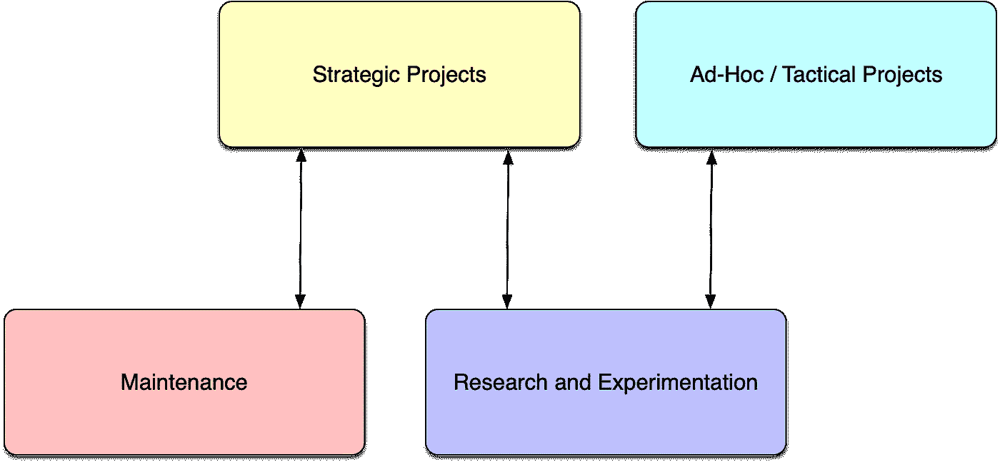
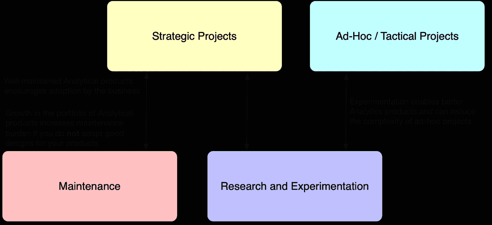

# 如何确定分析工作的优先级—第 1 部分

> 原文：<https://towardsdatascience.com/how-to-prioritize-analytical-work-part-1-ae91a6e71303?source=collection_archive---------8----------------------->

## [行业笔记](https://towardsdatascience.com/tagged/notes-from-industry)

## 一般来说，分析工作分为四个阶段

作者图片

我将写一系列关于数据科学(或可互换分析)最佳实践的短文。我坚信，在大大小小的组织中拥有一个好的数据科学部门的主要挑战是拥有正确的流程；这在很多方面比数据或算法更重要。你可以拥有世界上最聪明的数据科学家，拥有最复杂的算法，但[如果你用错了方法，那就没关系了](https://medium.com/codex/automation-or-ways-not-to-waste-the-talents-of-your-pricey-data-scientists-f8f2b93693b)。

学习如何很好地确定分析工作的优先级是创建一个运转良好的数据科学部门所需的第一件基本事情。太多时候，优先排序是基于“谁问得最多？”或者“谁最后问？”当你以这种方式进行优先排序时，你就结束了“随机漫步”,经常变成“绕圈行走”,在解决基本问题或获得真正有价值的洞察力方面没有取得真正的进展。当你陷入随机漫步时，你会注意到一些症状:

*   根本性的挑战没有解决；您在一次又一次地解决相同的问题(例如，数据难以访问，报告不能按时运行，指标经常失败，数据质量低且没有随着时间的推移而提高)
*   即使是最琐碎的请求，您也必须与数据科学家或数据工程师互动，因为自动化程度很低，而且没有自助服务解决方案
*   你有很多 1/2 完成的项目，但没有一个真正运作良好
*   每个人都永远不快乐(讽刺的是，一旦你学会了分清主次，你就会有快乐的人和不快乐的人……稍后会有更多)
*   永远不清楚数据科学家或数据工程师在做什么；优先级每隔一周甚至每周都会改变，这是一个主要的危险信号，因为在一个管理良好的组织中，大多数分析项目需要 2-4 周的时间，该组织具有创建文档并对分析工作应用适当的 QA 的文化

为了很好地对你的项目进行优先排序，你首先*需要把它们放到一个小的桶里:*

1.  战略项目
2.  临时/战术项目
3.  维护
4.  研究和实验

在本文中，我们将讨论每一个桶，并向您展示一个推荐的分配，我发现通过反复试验，这个分配很有效。在随后的文章中，我们将深入探讨如何在第一(即，战略项目)和第二(即，特别/战术项目)桶中对行项目进行优先级排序和执行。我们还将讨论使您能够避免线性扩展维护所需带宽的策略，以及如何有选择地选择“高价值”的研究和实验项目。后续文章将讨论进一步的支持机制，使您能够成功地对分析项目进行优先级排序，从而为您的业务释放价值。

## **战略项目**

这些项目支持新功能、自动化流程和/或构建自助服务解决方案。*这些是组织真正的“商业增值”项目。*“新功能”的一个例子是为新产品构建报告基础设施(例如，在您的网站上推出新功能，新的零售产品)。“自动化”的一个例子是将所有正式的手动报告转移到 [Tableau](https://www.tableau.com/) 中，这样从数据到报告都是完全自动化的。“自助式”解决方案的一个例子是使用 Tableau 创建应用程序，使业务用户能够灵活地探索自己的数据，而无需编写 SQL 查询或与分析师合作来获取新数据。这需要创建具有非常特殊的后端数据结构和经过仔细考虑的 UI/UX 的 Tableau 应用程序；还需要非常了解业务，以及可能会被问到哪些业务问题。“自助式”解决方案的另一个例子是创建一个工具，使业务用户能够自己将数据直接加载到您的数据库中(通过适当的控制),以消除让数据工程师为他们手动加载的需要。

## **临时/战术项目**

这些都是小要求，你通常可以在 1-3 天内完成。例如，向数据库模式中添加一个新的数据表。或者向现有数据表添加新列。关键是它们是小请求，通常在整个组织中没有太多价值；它们不支持新功能或自动化任何东西，也不支持自助服务解决方案。通常，这些会分散团队的注意力，因为它们是单个人的宠物项目。您必须积极主动，不允许临时请求伪装成战略项目，但您确实需要为您的客户提供一条途径，让他们在小问题上获得帮助，从而阻止他们继续前进。

## **维护**

你建造的东西，你必须维护。这是不言自明的。这是您必须投入的工作，以保持您构建的东西正常工作。这是一段不容讨价还价的时间，也是最高优先级；你首先要为此留出适当的时间，剩下的时间你可以分配给其他三(3)个桶。

## **研究和实验**

这些是内部项目，目的是让你构建的东西比现在做得更好。它不涉及对你已经建立的东西的大规模改变或修改；相反，它通常是改变小部分，看看整个事情是否得到改善。这方面的一个例子是使用[红移频谱](https://aws.amazon.com/blogs/big-data/amazon-redshift-spectrum-extends-data-warehousing-out-to-exabytes-no-loading-required/)，它使红移能够查询存储在 S3 的平面文件，就像它们是红移中的一个表一样，以将不太常用但较大的数据表移动到 S3，而不是将它们作为本地副本存储在红移中。以这种方式使用红移光谱可以在不影响性能的情况下显著降低总成本，但这取决于数据的模式和查询方式。因为性能很难提前预测，所以在完全投入使用之前，您应该先尝试一下这个解决方案。

## **推荐分配**

没有客观的正确的时间来投资每一个桶，但我几乎总是使用下面的分布，这是我通过多年的试错经验得出的:

1.  战略项目— 50%
2.  临时/战术项目— 20%
3.  维护— 20%
4.  研究和实验——10%

根据您在分析过程中所处的阶段以及您的业务需求，适合您组织的分配可能会有所不同。然而，我的经验表明，有两条经验法则你应该遵循:1)超过战略项目的指数，因为那些应该是真正为你的组织增加价值的项目(即，给这个桶最大的分配)；2)维护很可能至少占您团队带宽的 20%,因为少于 20%的维护通常会造成这样一种情况，即您团队创建的分析产品或解决方案会崩溃和/或不被业务部门完全采用。如果你对自己创造的分析产品没有足够的重视来支持它们，为什么企业中的其他人会采用它们呢？

作者图片

顺便说一下，这四个桶并不是相互独立的。在一个成熟的、运行良好的数据科学(或分析)团队中，他们将以分层的方式相互支持，作为任何分析职能部门的领导者，您的目标是确定如何利用分层结构来提供更大的商业价值。具体而言，维护对于鼓励组织采用分析产品至关重要。但是随着您生产越来越多的分析产品，您的维护负担将会增加，除非您采用良好的开发过程(我们将在单独的文章中讨论这一点)。确保您遵循的方法不会造成维护费用的线性增长是至关重要的，因为这将很快变得不可持续。但是你也不能“归零”或减少你在维护上的投资，因为没有什么比一个几乎不起作用的分析产品更快地扼杀采用。此外，研究和实验应该始终面向两个目标:1)改进您的战略项目(即，您的分析产品)，以及 2)最小化执行特定/战术项目所需的复杂性、工作量和带宽，因为特定项目很少为组织带来“业务增值”。因此，你越能降低战术项目的成本，你就越能为战略项目分配更多的带宽。

因为时间是有限而有价值的商品，你必须明智地投资它。做到这一点的关键是要有纪律，不要偏离你想要的四个投资区间的投资分布(平均来说，你可以每周都有变化，但在很长一段时间内，要确保你平均分配)。你必须时刻保持警惕，而且说实话，有点难对付。原因是每个人都认为他们的项目是世界上最重要的事情。但是我很喜欢一句谚语:*每件事对某人来说都很重要，但这并不意味着每件事都同样重要。*

一旦您将您的工作映射到每个时段，并决定对您的业务有意义的分配，您可以使用多种支持机制来确定每个时段内的优先顺序，并确保您能够成功地坚持您的分配投资策略和优先顺序，而不会被随机化。我将在单独的文章中更深入地讨论这些机制，但作为预览，它们包括以下内容:

1.  [业务需求文档](/how-to-prioritize-analytical-work-part-2-8a073546cede)
2.  2x2 矩阵
3.  路线图
4.  待命流程
5.  通信(横向和纵向)
6.  文件是不可协商的
7.  需求——设计——实现——文档循环(以及分阶段或迭代敏捷方法的使用)

与此同时，您可以了解商业中三个最重要的统计测试、 [A/B 测试实际测量什么](/what-does-an-a-b-test-measure-adebf56ae68a)、[良好分析数据仓库的基础知识](/the-basics-of-a-good-analytics-data-warehouse-4407b4b5ce50)、成功数据科学团队的支柱或关于自动化的四个重要工具的想法以最大限度地发挥您的数据科学的价值。