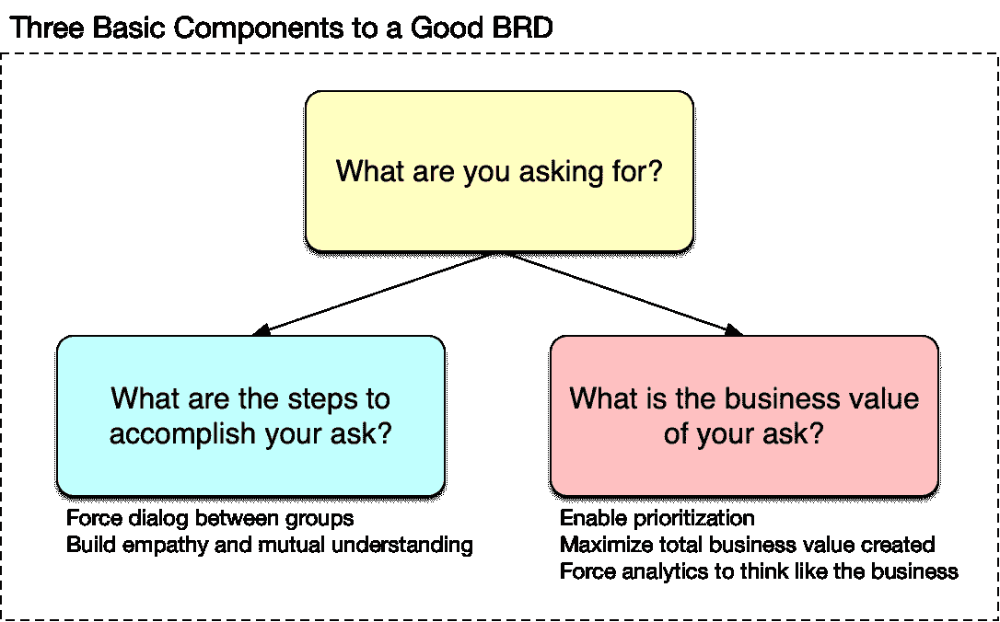

# 如何确定分析工作的优先级—第 2 部分

> 原文：<https://towardsdatascience.com/how-to-prioritize-analytical-work-part-2-8a073546cede?source=collection_archive---------24----------------------->

## 撰写良好的业务需求文档

作者图片

在之前的一篇文章中，我讨论了将你团队的分析(或可互换的数据科学)工作分成四(4)个部分的重要性，以帮助你[有效地确定](/how-to-prioritize-analytical-work-part-1-ae91a6e71303)的优先级。在那篇文章的最后，我提到了成功坚持你的分配投资策略和优先顺序而不被随机化的七(7)个关键机制。其中一个机制是坚持*所有的*战略项目都从一份写得很好的业务需求文档开始(BRD)。在这篇文章中，我将提供一个简短的例子来说明怎样才能写好 BRD。我坚持认为战略项目的 brd 只有三个基本问题:

1.  你想要什么？
2.  你问的商业价值是什么？
3.  完成您的提问需要哪些高级步骤？

典型的 BRD 只有 3-4 页长；它们必须用散文来写，以使作者能够清楚地表达需求，并且它们应该在必要或可能的地方包括视觉效果来清楚地表达需求。

## 你想要什么？

一封写得好的 BRD 会以简单的英语开始解释你的要求。这个请求应该既经济又全面，清楚地展示出你所需要的大愿景。任何人都应该容易理解，并尽可能避免行话。我们来看一个(虚构的)例子，看看你在提出问题时应该写些什么。

> 【2019 年 4 月，我们将启动“胡迪尼计划”,让我们的客户能够在附近便利的实体零售店订购定制服装，这将补充我们的在线订购渠道。胡迪尼计划将会看到分布在华盛顿 DC 地区的 10 家商店的揭幕；该项目的目标是衡量顾客在实体零售环境中订购定制服装的需求，而不是传统的在线渠道。在接下来的六(6)个月里，胡迪尼项目需要回答以下业务问题:
> 
> *1。有多少顾客光顾我们的零售店？有多少是全新客户？有多少人在去零售店之前曾在网上订购过？有多少人在逛完零售店后会在网上订购？有多少订单仅通过单一渠道(即网上、零售店)订购？*
> 
> *2。按渠道(即在线、零售店)下的订单数量和金额分布情况如何？对于只通过单一渠道订购的客户，分销渠道会发生变化吗？那些通过这两种渠道订购的人呢？*
> 
> *3。购买频率如何随渠道变化？*
> 
> *4。客户群(例如，小企业、婚礼、姐妹会等)的分布如何随着渠道而变化？*
> 
> *5。顾客要走多远才能在零售店购物？*
> 
> *6。根据渠道的不同，对定制设计的帮助需求会有怎样的变化？与在线订购的客户相比，光顾零售店的客户与我们的平面设计师接触的频率更高还是更低？*
> 
> *7。客户选择的毛坯(即预先定制的服装)类型如何随渠道变化？在零售店订购的顾客会转向质量更好的坯料吗？我们是否可以推断出“触摸和感受”坯料可以更好地向顾客传达好的、更好的和最好的坯料之间的区别？*
> 
> *8。开零售店是否会蚕食店铺周边的网上订单？或者开一家零售店会增加该地区的总需求吗？*
> 
> *这些业务问题应该可以使用一个专门为支持胡迪尼项目而构建的 Tableau 应用程序来回答。应用程序应提供数据的高级视图，以支持每周和每月的业务回顾；同样的应用程序还应该支持对业务问题的“深入”分析。业务用户应该能够选择每日、每周、每月和每年级别的数据聚合。Tableau 应用程序应该从单个零售店扩展到聚合在一起的多个零售店，并允许比较在线和零售订单以及客户行为。只要有可能，数据应该在地图上可见，以使业务用户能够从地理上理解客户行为。*

这是一个写得很好的“你想要什么？”使数据工程师和商业智能工程师能够用简单的英语理解您需要回答的关键业务问题。当我们了解这些业务问题时，我们可以帮助您设计和计算正确的业务指标，并选择正确的可视化方式，使数据易于消化。请注意，对于这个问题，一个写得很好的答案缺少了什么:

1.  它不是一个指标列表(例如，在零售店订购的客户百分比)
2.  它不是一组图表(例如，基于 Excel 的示例说“在 Tableau 中精确构建此图表”)
3.  这不是 10 页的需求

## 你问的商业价值是什么？

在解释了你的要求之后，一篇写得很好的 BRD 解释了投资建设你所要求的东西的商业价值是什么。商业价值应该是清楚的，精确的，诚实的，相对于假设的。它也应该集中在无聊的“螺母和螺栓”，为什么你的要求应该优先考虑和投资。

> 胡迪尼项目是在零售店将补充而不是蚕食网上订单的假设下获得批准和启动的；该项目假设零售店将吸引新客户，这些客户永远不会(或几乎永远不会)在网上订购定制服装，因为他们更喜欢在下单前与我们的产品“接触、感受和互动”。我们进一步假设，更喜欢在零售店(而不是网上)订购的顾客更喜欢亲临商店并与我们的商店员工互动的个人接触；我们相信，这些顾客在订购定制服装时，需要与人面对面交流，从而获得安全感。我们的估计是，项目 Houdini 将在零售店 15 英里范围内产生 10%的订单增长(具有相似的平均订单价值)(即，在零售店 15 英里范围内，每 100 个在线订单将产生 10 个零售订单)。如果我们的假设是正确的，零售商店网络将产生 3500 万美元的年增量收入(每家商店 350 万美元)，并且假设投入 100 万美元的资本支出来开办一家普通的零售商店，则回收期为 3.5 个月。
> 
> *我们所要求的 Tableau 应用程序将使我们能够很容易地理解胡迪尼项目的表现，并验证该项目的假设是正确的。如果我们不投资构建应用程序，将需要两(2)个人每周工作 40 小时来使用 Excel 手动构建报告。手动创建这些报告会降低数据的质量，并延迟我们对胡迪尼项目绩效的报告。使用 Tableau 应用程序，我们希望每周一下午与高级业务领导会面，回顾前一周的业绩；如果没有申请，我们至少要等到周四才能回顾前一周的表现。此外，Tableau 应用程序将使我们能够在周一下午的每周回顾中快速“深入”数据，回答回顾中提出的任何问题，而用 Excel 手动报告将迫使我们在每周业务回顾后再花一周时间提取数据，并返回前一周提出的问题的答案。*
> 
> *总之，使用 Excel 进行手动报告将导致理解 Houdini 项目绩效延迟 1-2 周，降低数据质量，并且需要两(2)人每周投入 40 小时的人工工作来准备数据和基于 Excel 的报告。对于一家年收入为 3.5 亿美元的公司来说，在 Houdini 项目上投资 1000 万美元并不是一笔小数目，因此最大限度地提高数据质量并最大限度地减少衡量和理解绩效的延迟非常重要，这样我们就可以迅速采取行动，使 Houdini 项目取得成功。*

注意，这个例子用简单的英语清楚地表达了为什么这个项目应该被优先考虑和投资的所有假设和原因。它没有简单地说“这个项目将产生 3500 万美元的年收入”，而是解释了未能满足要求的“螺母和螺栓”的负面后果:1)测量性能的重大延迟；2)数据质量下降；以及 3)每周安排两(2)个人来构建基于 Excel 的可疑质量报告。它还描述了胡迪尼是一个多大的投资项目的业务，以及如何使其成功将影响整个业务。

## 完成您的提问需要哪些高级步骤？

这往往是 BRD 的作家最难回答的问题；在这一部分，数据工程师和/或分析师经常需要帮助作者。但是我非常谨慎地使用“帮助”这个词，因为写 BRD 自我是请求者的责任。数据工程师和/或分析师可以向作者解释需要做什么，但作者有责任接受足够的教育，以便他们可以在高层次上写下需要做什么。有时候有人问我“为什么不自己写，而不是强迫商业用户向你学习，然后写下来？”这有一个很好的理由:它迫使数据工程师和/或分析师与寻求帮助的业务用户之间进行对话。这种对话对双方都有价值:

1.  对于数据工程师和/或分析师来说，这有助于他们理解 ask 的业务需求和业务价值；他们有机会提出澄清性的问题，这些问题可能是撰写 BRD 的人没有考虑到的
2.  对于编写 BRD 的业务用户来说，这有助于他们了解他们所提问题的技术细节；数据工程师和/或分析师有机会解释需要做些什么来向业务用户提供他们所要求的东西

双向对话有助于双方更好地了解对方试图做什么，最重要的是，为什么。

> *要构建 Houdini 项目所需的 Tableau 应用程序，需要完成以下高级步骤:*
> 
> *1。将在线订购系统的交易数据库纳入我们的商业智能(BI)数据仓库*
> 
> *2。将零售订购系统的交易数据库导入我们的 BI 数据仓库*
> 
> *3。设计并构建一个数据模型，将两个事务数据库合并成一组标准化的、干净的数据对象(即星型架构)，使我们能够回答业务问题*
> 
> *4。为数据模型和数据模型上的性能质量保证(QA)编写文档，以验证数据的正确性*
> 
> *5。定义回答胡迪尼项目业务问题的指标*
> 
> *6。设计并构建 Tableau 应用程序的后端数据结构*
> 
> *7。设计和构建 Tableau 应用程序 UI/UX*
> 
> *8。与业务用户利益相关方一起审查 Tableau 应用程序草案*
> 
> *9。整合来自业务用户利益相关方的反馈*
> 
> *10。编写 Tableau 应用程序的文档*
> 
> *11。启动 Tableau 应用程序*

根据我的经验，几乎每个 BRD 都会有 8-12 个要点，列出满足要求需要执行的高级步骤。请注意，这个列表中有两个项目被明确提到，但几乎总是被遗忘:1)文档，和 2) QA。这些必须明确提及，在文档准备就绪之前，任何项目都不能被视为完成；事实上，在完成文档之前，我们从不“启动”任何战略项目，以避免直接进入下一个项目和偷工减料的诱惑。

所以，上面你有一个 BRD 的好例子。你会注意到它简洁，清晰，易于理解。对于一个分析项目来说，一个好的 BRD 并不需要大量的文字；我很少看到任何分析项目需要写超过 3-4 页的内容。

## 激烈辩论的话题

上面的示例 BRD 1)避免了提供度量列表，但是 2)它假设了问题的正确解决方案(例如，Tableau 应用程序)。这有道理吗？根据我的经验，这是一个激烈辩论的话题。我将解释为什么我坚持 BRD 避免列出所有的指标，以及为什么我同意 BRD 的作者假设一个解决方案。首先让我们讨论“度量”，然后讨论“解决方案的假设”。

根据定义，分析师和/或数据科学家是分析(和数据科学)方面的专家，不一定是编写 BRD 的业务用户。通过要求业务用户描述他们试图回答的业务问题，它使分析团队能够*更好地了解业务以及业务领导者如何看待业务*，并且它鼓励分析团队深入思考业务以及什么类型的分析可以回答业务问题。当 BRD 是一个指标列表时，这个过程就被缩短了，因为分析师或数据科学家倾向于简单地计算所要求的任何指标，即使这些指标不是回答业务问题的“最佳”指标。BRD 是一种迫使分析团队和业务团队之间进行对话的机制。这种对话使业务团队更有可能获得最佳的分析解决方案，也使分析团队的解决方案更有可能真正增加业务价值(即，较少以学术为导向)。

如果您的业务“抱怨您的分析或数据科学组织与业务脱节”，这种脱节的主要原因(以我的经验来看)是没有机制来强制分析和业务团队之间的对话(例如，像 BRD 那样*避免*列出要计算的指标)。您总是希望制定一些流程，*鼓励*业务用户*向分析和/或数据科学团队*解释业务(例如，关键业务问题)*。这确保了分析团队紧密地整合到业务中，并以具体的方式思考业务。另一方面，您希望确保您的分析和/或数据科学团队充分利用他们的专业知识和技能来使业务受益。最大的商业价值将**而不是**来自于让昂贵的分析师或数据科学家计算由商业用户选择的指标；最大的商业价值将来自于让这些分析师部署他们花了 10 多年时间学习的全套数学思维和技术。这只有在他们持续接触业务的具体条款时才会发生。避免在 BRD 中列出度量标准是确保这一点的一种方法(我们将在未来讨论其他机制)。*

在我的职业生涯中，有些人不同意 brd 对业务问题的“解决方案”做出任何假设。从哲学上来说，他们不同意 BRD 的说法，即“*这些商业问题应该使用专门为支持胡迪尼项目而构建的 Tableau 应用程序来回答。”*相反，他们更喜欢只讨论业务问题(以及他们希望在任何可能的解决方案中包含的功能),而将所有关于任何可能的解决方案的讨论都放在 BRD 之外。我有时同意那个观点，有时不同意。我犹豫不决，因为严格排除对解决方案的任何讨论(即使是概念上的)有时会让作者和读者难以理解，因为这会导致非常抽象的 brd。另一方面，对解决方案非常规范的 BRD 可能会产生我们讨论过的相同问题，当时我坚持认为 BRD 不(仅仅)包括要计算的指标列表:分析和/或数据科学团队“关闭他们的大脑”,简单地构建所要求的东西。如果所要求的解决方案不是“正确”或“最佳”的，这就会成为一个问题。

到目前为止，我的经验促使我采取一种比较中庸的方法来解决在 BRD 中假设解决方案的问题。我相信，允许业务用户在编写 BRD 时假设一个概念性的解决方案，对于让他们能够清楚地描述他们的业务问题和他们在寻找什么非常重要。另一方面，业务用户必须清楚，假设的解决方案是*概念性的*，实现的解决方案将来自 BRD 的评审(以及评审期间的来回对话)。分析团队将设计满足 BRD 中描述的要求的解决方案；并且该解决方案最终可能与假设的不同。

## 想了解更多？

为了提醒自己成功安排分析工作优先级的七(7)个关键机制，请看[我的第一部分文章](/how-to-prioritize-analytical-work-part-1-ae91a6e71303)。如果你今天对统计学更感兴趣，试试[这篇关于 A/B 测试的文章](/what-does-an-a-b-test-measure-adebf56ae68a)或者[这篇关于三(3)个最重要的统计测试的文章](/the-three-most-important-statistical-tests-in-business-analytics-fd958a8e2a90)。最后，如果你想在 1-2 分钟内快速阅读，请尝试[这篇文章](/better-communications-between-data-scientists-and-business-users-46f493ce24ba)中的八(8)个技巧来改善数据科学和业务用户之间的交流。