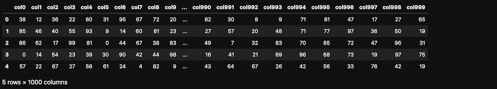
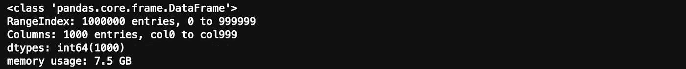
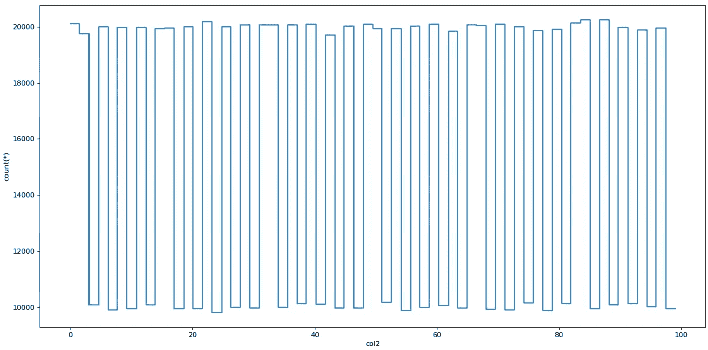
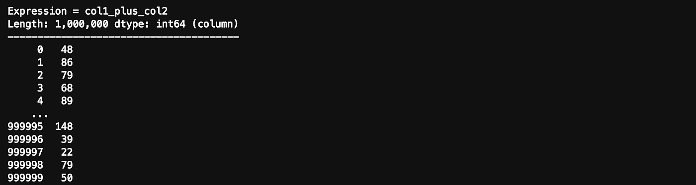

# 如何在几秒钟内处理数百万行的数据帧

> 原文：<https://towardsdatascience.com/how-to-process-a-dataframe-with-millions-of-rows-in-seconds-41c592ac8c4d?source=collection_archive---------2----------------------->

## 您应该知道的另一个用于数据分析的 Python 库——不，我不是在说 Spark 或 Dask


克里斯蒂安·恩格梅尔在 [Unsplash](https://unsplash.com?utm_source=medium&utm_medium=referral) 上拍摄的照片

Python 中的 ig 数据分析正在复兴。这一切都始于 NumPy，它也是我在本文中介绍的工具背后的构建块之一。

2006 年，大数据是一个慢慢受到关注的话题，尤其是随着 Hadoop 的发布。熊猫随后推出了它的数据框架。2014 年是大数据成为主流的一年，Apache Spark 也是在这一年发布的。2018 年，Dask 和其他用于 Python 数据分析的库问世。

每个月我都会发现一个新的数据分析工具，我渴望学习它。花一两个小时在教程上是值得的投资，因为从长远来看可以节省你很多时间。了解最新的技术也很重要。

虽然你可能认为这篇文章是关于 Dask 的，但你错了。我发现了另一个用于数据分析的 Python 库，您应该知道。

和 Python 一样，精通 SQL 也同样重要。如果你不熟悉它，并且你有一些闲钱，可以参加这个课程:[掌握 SQL，大数据分析的核心语言](https://imp.i115008.net/c/2402645/828410/11298)。

> Python 中的大数据分析正在复兴

## **这里有几个你可能会感兴趣的链接:**

```
- [Complete your Python analyses 10x faster with Mito](https://trymito.io/) [Product]- [Free skill tests for Data Scientists & ML Engineers](https://aigents.co/skills) [Test]- [All New Self-Driving Car Engineer Nanodegree](https://imp.i115008.net/c/2402645/1116216/11298)[Course]
```

*你愿意多看一些这样的文章吗？如果是这样，你可以点击上面的任何链接来支持我。其中一些是附属链接，但你不需要购买任何东西。*

[](/are-you-still-using-pandas-to-process-big-data-in-2021-850ab26ad919) [## 2021 年你还在用熊猫处理大数据吗？

### 熊猫处理不好大数据。这两个库有！哪个更好？更快？

towardsdatascience.com](/are-you-still-using-pandas-to-process-big-data-in-2021-850ab26ad919) 

# 认识 Vaex


照片由[马修·施瓦茨](https://unsplash.com/@cadop?utm_source=medium&utm_medium=referral)在 [Unsplash](https://unsplash.com?utm_source=medium&utm_medium=referral) 拍摄

Vaex 是一个高性能的 Python 库，用于懒惰的核外数据帧(类似于 Pandas)，以可视化和探索大型表格数据集。

它每秒可以计算超过 10 亿行的基本统计数据。它支持多种可视化，允许对大数据进行交互式探索。

## Vaex 和 Dask 有什么区别？


照片由 [Unsplash](https://unsplash.com?utm_source=medium&utm_medium=referral) 上的[静止不动](https://unsplash.com/@stillnes_in_motion?utm_source=medium&utm_medium=referral)

Vaex 与 Dask 不相似，但与 Dask 数据框架相似，后者建立在顶级熊猫数据框架之上。这意味着 Dask [继承了熊猫的问题](https://wesmckinney.com/blog/apache-arrow-pandas-internals/)，比如高内存使用率。这不是 Vaex 的情况。

Vaex 不复制数据帧，因此它可以在主存较少的机器上处理更大的数据帧。

Vaex 和 Dask 都使用延迟处理。唯一的区别是 Vaex 在需要时计算字段，而 Dask 需要显式地使用 compute 函数。

数据需要采用 HDF5 或 Apache Arrow 格式，以便充分利用 Vaex。

## 如何安装 Vaex？

安装 Vaex 就像安装任何其他 Python 包一样简单:

```
pip install vaex
```

# 我们带 Vaex 去试驾吧


尤金·希斯蒂科夫在 [Unsplash](https://unsplash.com?utm_source=medium&utm_medium=referral) 上的照片

让我们创建一个具有 100 万行和 1000 列的 pandas 数据帧，以创建一个大数据文件。

```
import vaex
import pandas as pd
import numpy as npn_rows = 1000000
n_cols = 1000
df = pd.DataFrame(np.random.randint(0, 100, size=(n_rows, n_cols)), columns=['col%d' % i for i in range(n_cols)])df.head()
```



熊猫数据帧的前几行(图片由作者制作)

这个数据帧使用多少主存？

```
df.info(memory_usage='deep')
```



我们把它保存到磁盘上，这样以后就可以用 Vaex 读取了。

```
file_path = 'big_file.csv'
df.to_csv(file_path, index=False)
```

用 Vaex 直接读取整个 CSV 不会有太大的收获，因为速度和熊猫差不多。在我的笔记本电脑上，两者都需要大约 85 秒。

我们需要将 CSV 转换为 HDF5(分层数据格式版本 5 ),以了解 Vaex 的优势。Vaex 有一个用于转换的功能，它甚至通过转换较小的块来支持比主存大的文件。

> 如果由于内存限制，你不能用 pandas 打开一个大文件，你可以把它转换到 HDF5 并用 Vaex 处理它。

```
dv = vaex.from_csv(file_path, convert=True, chunk_size=5_000_000)
```

该函数创建一个 HDF5 文件，并将其保存到磁盘上。

dv 的数据类型是什么？

```
type(dv)# output
vaex.hdf5.dataset.Hdf5MemoryMapped
```

现在，让我们用 Vaex 读取 7.5 GB 数据集—我们不需要再次读取它，因为我们已经在 dv 变量中有它了。这只是为了测试速度。

```
dv = vaex.open('big_file.csv.hdf5')
```

Vaex 执行上面的命令不到 1 秒钟。但是 Vaex 实际上并没有读取文件，因为懒加载，对吧？

让我们通过计算 col1 的和来强制读取它。

```
suma = dv.col1.sum()
suma# Output
# array(49486599)
```

这个真的让我很惊讶。Vaex 计算总和的时间不到 1 秒。这怎么可能呢？

无论磁盘上的文件大小如何，打开这样的数据都是即时的。Vaex 将只是对数据进行内存映射，而不是在内存中读取数据。这是处理大于可用 RAM 的大型数据集的最佳方式。

## 测绘

Vaex 在绘制数据时也很快。它有特殊的绘图功能 plot1d，plot2d 和 plot2d_contour。

```
dv.plot1d(dv.col2, figsize=(14, 7))
```



用 Vaex 绘图(图片由作者制作)

## 虚拟列

Vaex 在添加新列时会创建一个虚拟列，这是一个不占用主内存的列，因为它是动态计算的。

```
dv['col1_plus_col2'] = dv.col1 + dv.col2
dv['col1_plus_col2']
```



Vaex 中的虚拟列(图片由作者制作)

## 高效过滤

Vaex 在过滤数据时不会创建数据帧副本，这样内存效率更高。

```
dvv = dv[dv.col1 > 90]
```

# 聚集

聚合的工作方式与熊猫略有不同，但更重要的是，它们非常快。

让我们添加一个二进制虚拟列，其中 col1 ≥ 50。

```
dv['col1_50'] = dv.col1 >= 50
```

Vaex 在一个命令中结合了 group by 和 aggregation。下面的命令按“col1_50”列对数据进行分组，并计算 col3 列的总和。

```
dv_group = dv.groupby(dv['col1_50'], agg=vaex.agg.sum(dv['col3']))
dv_group
```


Vaex 中的聚合(图片由作者制作)

## 连接

Vaex 无需进行内存复制即可连接数据，从而节省了主内存。熊猫用户将熟悉加入功能:

```
dv_join = dv.join(dv_group, on=’col1_50')
```

# 结论

最后，你可能会问:我们应该简单地从熊猫转向 Vaex 吗？答案是一个大大的否定。

Pandas 仍然是 Python 中数据分析的最佳工具。它为最常见的数据分析任务提供了支持良好的功能。

谈到更大的文件，熊猫可能不是最快的工具。这是 Vaex 的绝佳切入点。

> Vaex 是您应该添加到数据分析工具箱中的工具。

当处理 pandas 速度太慢或崩溃的分析任务时，从工具箱中取出 Vaex，过滤掉最重要的条目，然后继续对 pandas 进行分析。

# 在你走之前

在 [Twitter](https://twitter.com/romanorac) 上关注我，在那里我定期[发布关于数据科学和机器学习的](https://twitter.com/romanorac/status/1328952374447267843)。

