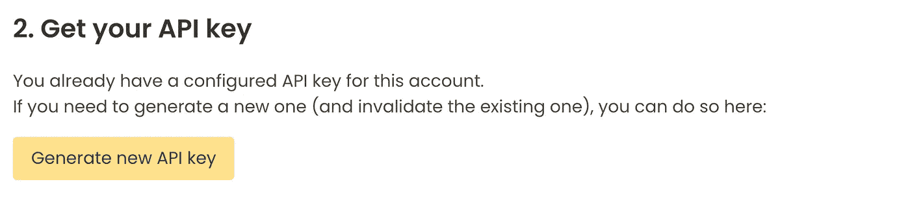

# 如何在几秒钟内处理一个数百万行的数据帧？

> 原文：<https://towardsdatascience.com/how-to-process-a-dataframe-with-millions-of-rows-in-seconds-fe7065b8f986?source=collection_archive---------1----------------------->

## TLDR；在云中使用新的 Python 数据处理引擎处理它。


杰森·黑眼在 [Unsplash](https://unsplash.com?utm_source=medium&utm_medium=referral) 上的照片

数据科学正在迎来它的复兴时刻。很难跟踪所有新的数据科学工具，这些工具有可能改变数据科学的工作方式。

我最近才在与一位同事的交谈中了解到这个新的数据处理引擎，他也是一名数据科学家。我们讨论了大数据处理，这是该领域创新的前沿，这个新工具突然出现了。

虽然 [pandas](/11-pandas-built-in-functions-you-should-know-1cf1783c2b9) 是 Python 中事实上的数据处理工具，但它不能很好地处理大数据。对于更大的数据集，您迟早会遇到内存不足的异常。

研究人员很久以前就面临这个问题，这促使了像 [Dask 和 Spark](/are-you-still-using-pandas-for-big-data-12788018ba1a) 这样的工具的开发，这些工具试图通过将处理分配给多台机器来克服“单台机器”的限制。

这一活跃的创新领域也为我们带来了像 [Vaex](/are-you-still-using-pandas-to-process-big-data-in-2021-850ab26ad919) 这样的工具，它们试图通过提高单台机器的内存效率来解决这个问题。

这还没有结束。您应该了解另一种大数据处理工具…

# 遇见真理


弗兰克·麦肯纳在 [Unsplash](https://unsplash.com?utm_source=medium&utm_medium=referral) 上拍摄的照片

[Terality](https://www.terality.com/) 是一个无服务器的数据处理引擎，在云端处理数据。无需管理基础架构，因为 Terality 会负责扩展计算资源。它的目标受众是工程师和数据科学家。

我与 Terality 的团队交换了几封电子邮件，因为我对他们开发的工具感兴趣。他们迅速回答。这些是我向团队提出的问题:


我给 the Terality 团队的第 n 封邮件(作者截图)

## 用 Terality 处理数据的主要步骤是什么？

1.  Terality 附带了一个 Python 客户端，您可以将其导入到 Jupyter 笔记本中。
2.  然后，您在**“熊猫之路”**中编写代码，Terality 安全地上传您的数据，并负责分布式处理(和扩展)以计算您的分析。
3.  处理完成后，您可以将数据转换回常规的 pandas 数据框架，并继续进行本地分析。

## 幕后发生了什么？

Terality 团队开发了一个专有的数据处理引擎——它不是 Spark 或 Dask 的分支。

目标是避免 Dask 的不完美，它没有和 pandas 一样的语法，它是异步的，没有 pandas 的所有功能，也不支持自动缩放。

Terality 的数据处理引擎解决了这些问题。

## Terality 可以免费使用吗？

[Terality](https://www.terality.com/pricing) 有一个免费计划，你可以每月处理高达 500 GB 的数据。它还为有更高要求的公司和个人提供付费计划。

在本文中，我们将关注免费计划，因为它适用于许多数据科学家。

> Terality 如何计算数据使用量？([来自 Terality 的文档](https://www.terality.com/pricing))
> 
> 考虑一个内存总大小为 15GB 的数据集，它将由操作 *df.memory_usage(deep=True)返回。sum()* 。
> 对该数据集运行一(1)个操作，如*。总和*或一个*。sort_values* 总共会消耗 15GB 的已处理数据。
> 
> 仅当任务运行进入成功状态时，才会记录可计费使用量。

## 数据隐私呢？

当用户执行读取操作时，Terality 客户端会将数据集复制到亚马逊 S3 上 Terality 的安全云存储中。

Terality 对数据隐私和保护有严格的政策。他们保证不会安全地使用和处理这些数据。

Terality 不是存储解决方案。他们最多会在 Terality 的客户端会话关闭后 3 天内删除您的数据。

Terality 处理目前在法兰克福地区的 AWS 上进行。

[有关更多信息，请参见安全章节。](https://docs.terality.com/faq/security)

## 数据需要公开吗？

不要！

用户需要在他的本地机器上访问数据集，Terality 将在后台处理上传过程。

上传操作也是并行的，因此速度更快。

## Terality 能处理大数据吗？

此刻，**2021 年 11 月，** Terality 还在测试中。它针对高达 100–200 GB 的数据集进行了优化。

我问团队他们是否计划增加这一数量，他们计划很快开始针对 TB 进行优化。

# 让我们试驾一下吧


尤金·希斯蒂科夫在 [Unsplash](https://unsplash.com?utm_source=medium&utm_medium=referral) 上拍摄的照片

我很惊讶你可以简单地用 Terality 的包替换 pandas import 语句并重新运行你的分析。

注意，一旦导入了 Terality 的 python 客户端，数据处理就不再在本地机器上执行，而是通过 Terality 的数据处理引擎在云中执行。

现在，让我们安装 Terality 并在实践中试用它…

## 设置

您只需运行以下命令即可安装 Terality:

```
pip install --upgrade terality
```

然后你在 [Terality](https://app.terality.com/) 上创建一个免费账户，并生成一个 API 密匙:



在 [Terality](https://app.terality.com/) 上生成新的 API 密钥(作者截图)

最后一步是输入您的 API 密钥(也用您的电子邮件替换电子邮件):

```
terality account configure --email your@email.com
```

## 让我们从小处着手…

现在，我们已经安装了 Terality，我们可以运行一个小例子来熟悉它。

> 实践表明，在使用 Terality 和 pandas 时，您可以两全其美——一个用来聚集数据，另一个用来本地分析聚集数据

下面的命令创建了一个 terality。通过导入熊猫的数据帧。数据帧:

```
**import** **pandas** **as** **pd**
**import** **terality** **as** **te**df_pd = pd.DataFrame({"col1": [1, 2, 2], "col2": [4, 5, 6]})
df_te = te.DataFrame.from_pandas(df_pd)
```

现在，数据在 Terality 的云中，我们可以继续进行分析:

```
df_te.col1.value_counts()
```

运行过滤操作和其他熟悉的 pandas 操作:

```
df_te[(df_te["col1"] >= 2)]
```

一旦我们完成了分析，我们可以用以下方法将其转换回熊猫数据框架:

```
df_pd_roundtrip = df_te.to_pandas()
```

我们可以验证数据帧是否相等:

```
pd.testing.assert_frame_equal(df_pd, df_pd_roundtrip)
```

## 让我们去大…

我建议你查看一下 [Terality 的快速入门 Jupyter 笔记本，](https://docs.terality.com/getting-terality/quick-start/tutorial)它会带你分析 40 GB 的 Reddit 评论数据集。他们也有一个较小的 5 GB 数据集的教程。

我点击了 Terality 的 Jupyter 笔记本，处理了 40 GB 的数据集。它在 45 秒内读取数据，需要 35 秒进行排序。与另一个表的合并花费了 1 分 17 秒。感觉就像我在笔记本电脑上处理一个小得多的数据集。

然后，我尝试在我的笔记本电脑上加载同样的 40GB 数据集，其中有熊猫，内存为 16gb——它返回了一个内存不足的异常。

[官方 Terality 教程带你分析一个带有 Reddit 注释的 5GB 文件。](https://docs.terality.com/getting-terality/quick-start/tutorial)

# 结论


斯文·舍尔梅尔在 [Unsplash](https://unsplash.com?utm_source=medium&utm_medium=referral) 上的照片

我玩了相当多的 Terality，我的经验是没有大问题。这让我很惊讶，因为他们正式仍在测试中。一个很好的迹象是，他们的支持团队非常积极。

当您有一个无法在本地机器上处理的大数据集时，我看到了一个很好的 Terality 用例——可能是因为内存限制或处理速度。

使用 Dask(或 Spark)将需要启动一个集群，这比使用 Terality 来完成分析的成本要高得多。

此外，配置这样一个集群是一个繁琐的过程，而使用 Terality，您只需要更改 import 语句。

我喜欢的另一件事是，我可以在我的本地 JupyterLab 中使用它，因为我有许多扩展、配置、黑暗模式等。

我期待着团队在未来几个月里在 Terality 方面取得的进展。


照片由[皮特·佩德罗萨](https://unsplash.com/@peet818?utm_source=medium&utm_medium=referral)在 [Unsplash](https://unsplash.com?utm_source=medium&utm_medium=referral) 上拍摄