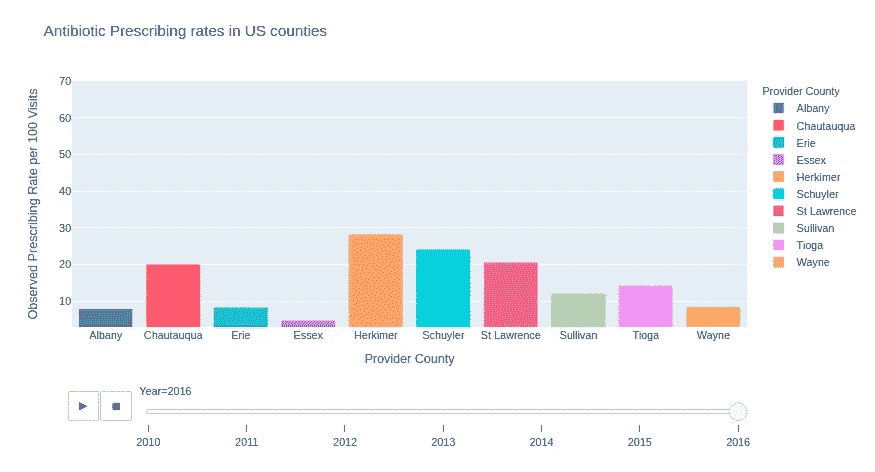
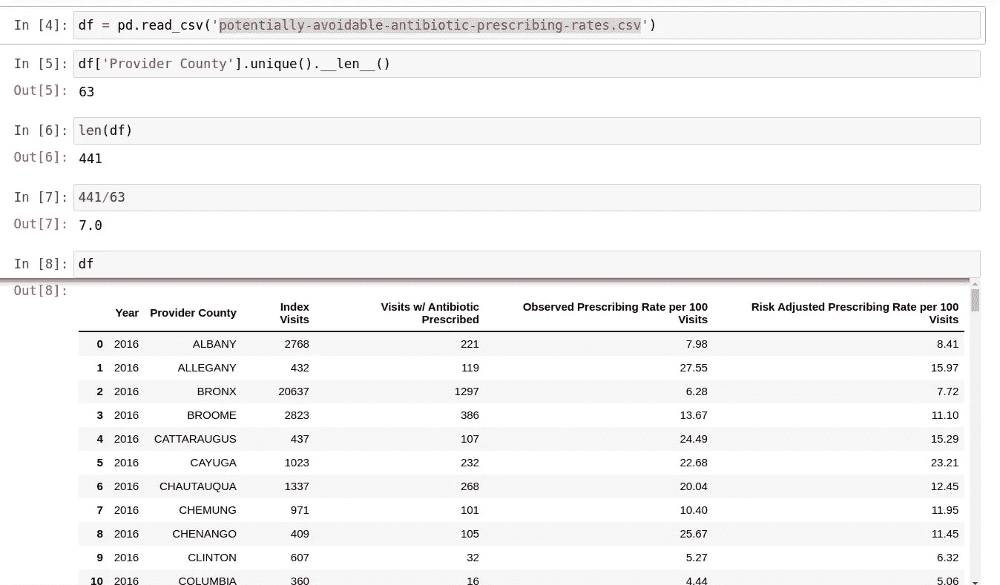
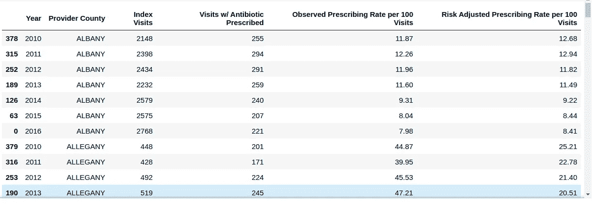
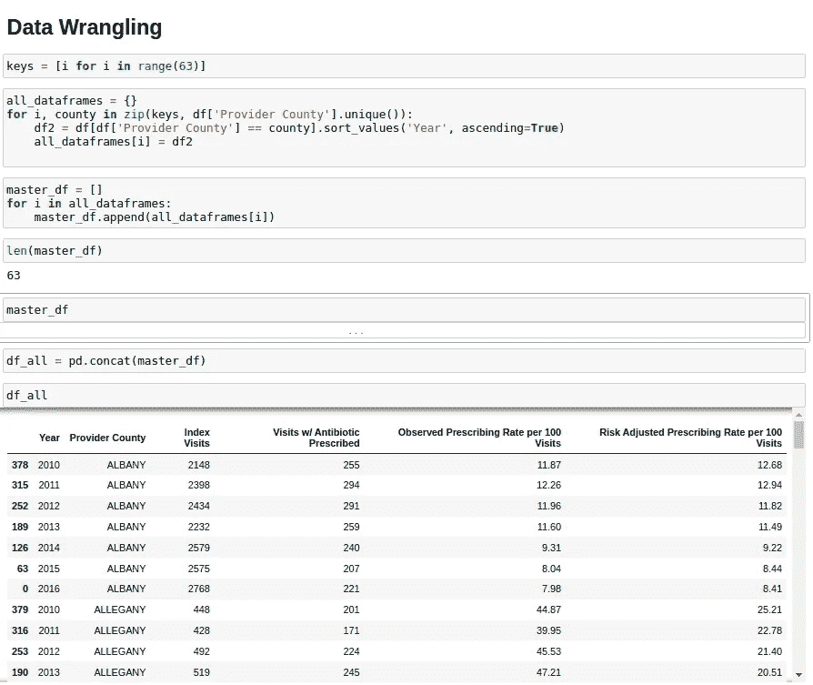
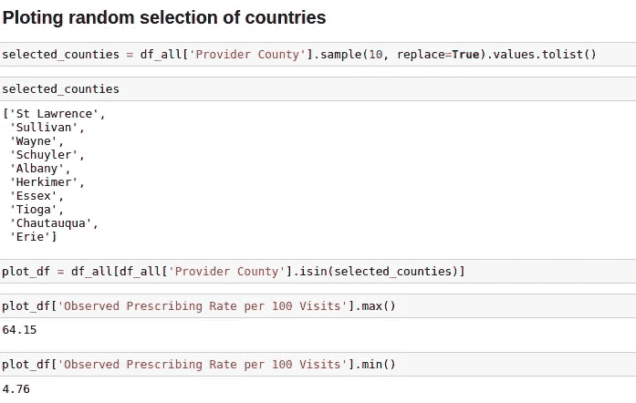

# 如何使用 Python 在 Plotly 中制作动画柱状图

> 原文：<https://towardsdatascience.com/how-to-produce-an-animated-bar-plot-in-plotly-using-python-2b5b360492f8?source=collection_archive---------16----------------------->

## 让您的原始数据集产生一个动画条形图

图片由作者斯蒂芬·福特汉姆提供

## 绘制美国各县的抗生素处方率

本教程详细介绍了如何使用 Python 中的 Plotly 库将原始数据转换成动画条形图。本教程中使用的数据集标题为:

*从 2010 年开始，提供者所在县的儿童医疗补助参保者的潜在可避免抗生素处方观察率和风险调整率*。

数据集可以通过[数据世界](https://data.world/healthdatany/r2m7-fr63/workspace/file?filename=potentially-avoidable-antibiotic-prescribing-rates-for-acute-respiratory-infection-by-provider-count-1.csv)找到。具体来说，我们的目标是绘制 2010 年至 2016 年美国各县抗生素处方率/100 次就诊的动画柱状图。

## 准备数据

首先，我们首先导入 pandas 库和 plotly express。此外，在处理数据集时，查看所有行和列有时会很有用。为此，我们可以将“显示最大行数”和“显示最大列数”都设置为 None，如下所示。但是，重要的是要考虑到应用此设置时，较大的数据集将需要加载器来加载。最后，我们可以在我标记为“*潜在可避免抗生素处方率. csv* ”的数据集中阅读。

图 1:GitHub Gist；初始设置

## 每年的条目

我们可以首先确定数据集中县的数量。这将使我们能够破译每个县存在了多少年的信息。这里有 63 个不同的县，dataframe 总共有 441 行，这意味着每个县有 7 年的可用数据。

图 2:无序的数据格式

## 将数据放入动画条形图的正确形状中

为了绘制动画条形图，我们需要将数据配置为不同于当前的格式。我们需要在单个数据框架中按照年份顺序排列每个县。为了说明这一点，下面的 dataframe 图像片段显示了所需的格式。

简单明了的数据争论可以将格式从上面的图 2 变成下面的图 3。

图 3:正确格式化的数据。在单个数据框架中按年份顺序排列的县

## 数据争论

为了重新组织数据，我们首先使用 list comprehension 创建一个从 0 到 63 的键列表。然后，我们可以实例化一个空字典，遍历键列表和唯一的县列表。通过每次循环，我们为每个县创建一个新的数据框架，首先按最早年份排序。最后，我们可以将新的数据帧添加到 all_dataframes 字典中，该字典在每个循环中都被分配了一个唯一的键值。

然后，我们可以使用唯一键遍历所有数据帧，并添加到所有数据帧的列表中，称为 master_df。

使用 pandas 的 pd.concat 函数，所有这些数据帧最终可以连接成一个数据帧。这个函数调用的输出数据帧被命名为 df_all。

实现这些步骤的简明代码如下所示

## 绘制县的子选择

我们可以绘制所有 63 个县的数据，或者选择一个子选项进行绘制。在这里，我们将选取 10 个独特的县进行演示。

为此，我们选择包含县的列，并调用 sample 方法，将参数 replace 设置为布尔值 True。然后我们调用 values 属性，该属性在使用 tolist()方法转换为列表之前返回一个数组。我们现在可以看到 10 个独特的选定县的列表。

我们使用这 10 个县，通过熊猫 isin 方法过滤数据框架。这将返回 plot_df 数据帧。最后的步骤包括知道我们打算在 y 轴上绘制的列的最小值和最大值，在我们的例子中，是“每 100 次就诊的观察处方率”，我们将在我们的 figure 对象上使用它作为 range_y 参数。

## 动画条形图

格式正确的数据，加上我们的 10 个县，现在可以绘制出来了。我们首先将 dataframe 和 x、y 轴的列以及提供者县传递给 color 参数。我们将 animation_frame 设置为 year 列，将 animation_group 设置为 Provider County 列。然后，我们使用上面为 y 轴确定的范围来设置 y 轴的合理界限，并给该图一个信息性的标题。

现在我们有了 10 个县的动画情节！