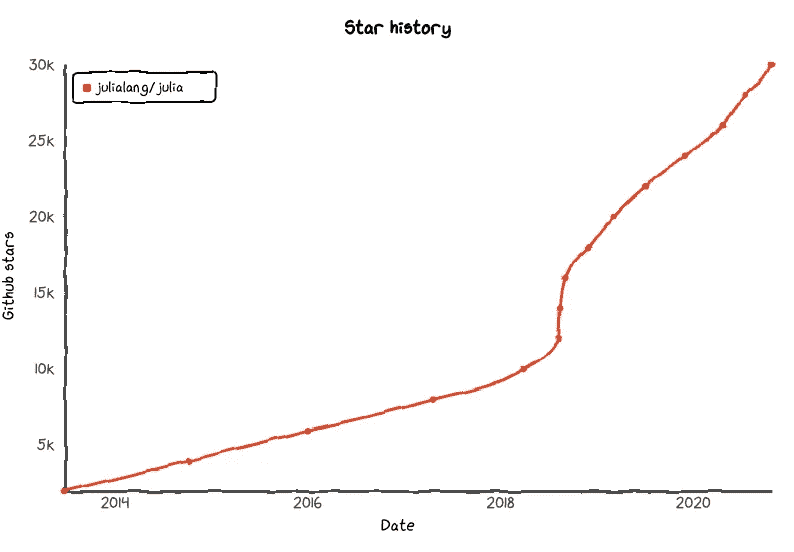

# 如何正确编写 Julia 代码

> 原文：<https://towardsdatascience.com/how-to-properly-program-julia-code-e95efe9f0085?source=collection_archive---------13----------------------->

## 如何在 Julia 编程语言中使用函数式编程范式


(图片由作者提供)

ulia 是一种相当新的、开创性的编程语言，早在 2012 年就发布了。在从那时到 2020 年的短暂时间内，生态系统的规模和语言的构建绝对是爆炸性的。只要看看编程语言 Github stars 的受欢迎程度，就很容易看出这种语言在过去几年里取得了多大的成就。如果你想进一步了解我为什么如此热爱这门语言，我在这里写了一整篇关于我有多爱这门语言的文章:

[](/how-i-came-to-love-the-julia-language-948c32e2f9b0) [## 我是如何爱上朱莉娅语言的

### 为什么 Julia 迅速成为我最喜欢的数据科学编程语言

towardsdatascience.com](/how-i-came-to-love-the-julia-language-948c32e2f9b0) 

(src =传说中的自己，病毒性沙阿(【https://twitter.com/Viral_B_Shah/status/1319764967760056320】T2))

朱莉娅的成功最终与科学生态系统普遍经历的快速机器学习增长相关联。有趣的是，这也是我开始写关于朱莉娅的文章的时候。作为时光倒流，这里有一篇我当时写的关于语言及其在机器学习中的未来的文章。

[](/things-to-know-before-using-julia-for-machine-learning-487744c0b9b2) [## 使用 Julia 进行机器学习之前需要知道的事情

### Julia 是一种高级动态编程语言，它本身有一些有趣的特点和特性，这使得…

towardsdatascience.com](/things-to-know-before-using-julia-for-machine-learning-487744c0b9b2) 

回顾过去是很棒的，因为这让我很高兴以这种方式通过分享信息、教学和演讲做出了贡献。所以作为开场白，我要感谢你给了我发言权。此外，他们已经放弃了我在文章中抱怨的口号，我觉得很好笑！

也就是说，我已经和朱莉娅一起工作了很长时间。在这门语言中有很多不同的做事方式，这就是魅力的一部分！Julia 编程语言的编译器有一些非常酷的属性，可以在构建任何语法范例的基础上进行大量优化。

> 还有一件事，

需要明确的是，本文是关于优化和编写有效的 Julia 代码，而不是关于如何学习 Julia 的教程。如果你对学习这门语言感兴趣，我现在正在做一套全面的 Julia 教程，它肯定会帮助你学习这门语言。除了这篇文章，还有一些视频可以播放，真正针对更多听觉、视觉和更常见的动觉学习者。我个人来说，我从文字学的很好，所以我是程序员是一件好事！以下是 Youtube 上完整播放列表的链接，以及我最近关于 TDS 的文章:

[](/intro-to-software-engineering-in-the-julia-programming-language-3c32411c5683) [## Julia 编程语言中的软件工程介绍

### Julia 语言中定义的目录和环境概述。

towardsdatascience.com](/intro-to-software-engineering-in-the-julia-programming-language-3c32411c5683) 

# 结构

到目前为止，我假设你对类型很熟悉。你可以在 Julia 中使用关键字" **struct** 创建一个类型。类型只是数据类型的容器，使数据可以被函数访问。当然，数据类型也是在。要记住的一件事是，有了计算机，很多东西都要分等级。Julia 喜欢像计算机一样思考，因为它是一种编程语言，所以对于 Julia 中的类型，我们也有这些类型的层次系统。这允许我们创建子类型并创建跨类型的继承——就像我们在具有子类的面向对象编程语言中为了有效而做的那样。下面是我们如何做类似的事情:

```
abstract type Model endmutable struct LinearRegression <: Model
    a
    b
end
```

我还有一整篇文章详细介绍了如何做到这一点，你可以在这里查看:

[](/overview-abstract-super-type-heirarchies-in-julia-26b7e64c9d10) [## 概述 Julia 中的抽象超类型层次结构

### Julia 的酷类型抽象介绍！

towardsdatascience.com](/overview-abstract-super-type-heirarchies-in-julia-26b7e64c9d10) 

如果我们希望编译器知道这些类型，这将提高代码的效率，我们也可以在下面的代码中声明这些类型:

```
mutable struct LinearRegression <: Model
    a::Float64
    b::Float64
end
```

# 构造器

我们刚刚创建的代码，

```
mutable struct LinearRegression <: Model
    a::Float64
    b::Float64
end
```

Julia 编程中所谓的“外部构造函数”假设外部构造函数被称为“外部构造函数”，我们可以假设内部一定有另一个构造函数。这个假设是正确的。Julia 在这方面的不同之处在于，我们可以使用内部构造函数作为 dispatch 中不同数据类型的初始过程。请允许我演示:

```
mutable struct LinearRegression <: Model
    a::Float64
    b::Float64 function LinearRegression(Xtrain::Array{Any}, ytrain::Array{Any}) end
end
```

现在，这已经从一个需要从函数返回的类型，变成了一个需要运行初始方法的构造函数，可能是为了计算。此外，如果我们希望 Xtrain 包含多个特性，我们可以在 DataFrame 类型下创建另一个调度函数:

```
mutable struct LinearRegression <: Model
    a::Float64
    b::Float64 function LinearRegression(Xtrain::Array{Any}, ytrain::Array{Any})end function LinearRegression(Xtrain::DataFrame, ytrain::Array{Any}) end
end
```

此外，我们可以使用简单线性回归的公式计算内部构造函数中的 a 和 b。首先，让我们看看计算 a 的公式，a 是简单线性回归所需的值之一:

```
# a = ((∑y)(∑x^2)-(∑x)(∑xy)) / (n(∑x^2) - (∑x)^2)
```

非常简单，只是一些总结，这里有一些代码来计算:

```
# Get our Summations:
        Σx = sum(x)
        Σy = sum(y)
        # dot x and y
        xy = x .* y
        # ∑dot x and y
        Σxy = sum(xy)
        # dotsquare x
        x2 = x .^ 2
        # ∑ dotsquare x
        Σx2 = sum(x2)
        # n = sample size
        n = length(x)
        # Calculate a
        a = (((Σy) * (Σx2)) - ((Σx * (Σxy)))) / ((n * (Σx2))-(Σx^2))
```

然后我们会计算 B:

```
b = ((n*(Σxy)) - (Σx * Σy)) / ((n * (Σx2)) - (Σx ^ 2))
```

现在我们将这两个插入一个“**新的**表达式中以示回报:

```
return new(a, b)
```

现在让我们来看看实现的。我们不会对数据帧做同样的事情，因为这将涉及到编写一个多元线性回归算法，但看看我们现在如何将这种类型用于函数会很酷。

```
mutable struct LinearRegression <: Model
    a::Float64
    b::Float64function LinearRegression(Xtrain::Array{Any}, ytrain::Array{Any})           Σx = sum(x)
        Σy = sum(y)
        # dot x and y
        xy = x .* y
        # ∑dot x and y
        Σxy = sum(xy)
        # dotsquare x
        x2 = x .^ 2
        # ∑ dotsquare x
        Σx2 = sum(x2)
        # n = sample size
        n = length(x)
        # Calculate a
        a = (((Σy) * (Σx2)) - ((Σx * (Σxy)))) / ((n * (Σx2))-(Σx^2))
        return new(a, b)endfunction LinearRegression(Xtrain::DataFrame, ytrain::Array{Any})end
end
```

现在，如果我们用两个 float64s，a 和 b 调用 LinearRegression，我们将得到一个新的“LinearRegression”类型，它继承了任何模型类型所继承的调度。然而，如果我们用两个数组来调用它，内部构造函数将被调用并返回一个新的“LinearRegression”类型，该类型仍然从模型类型继承任何分派，但是使用从我们的 LinearRegression 函数的返回中计算出的 A 和 B 值。

现在，我们可以建立一种新的预测方法，它将采用 Xtrain 数组和线性回归模型:

```
predict(xt::Array{Any}, m::LinearRegression) = (xt = [i = a + (b * i) for i in xt])
```

当然，我们总是可以把我们的抽象类型做得更进一步，把分类发挥到极致！这绝对是让我着迷的事情！我们可以说，简单线性回归是一个线性模型，是一个回归变量，是一个连续模型，是一个机器学习模型…等等。

```
abstract type Model end
abstract type ContinuousModel <: Model endabstract type LinearModel <: ContinuousModel endmutable struct LinearRegression <: LinearModel
    a::Float64
    b::Float64function LinearRegression(Xtrain::Array{Any}, ytrain::Array{Any})           Σx = sum(x)
        Σy = sum(y)
        # dot x and y
        xy = x .* y
        # ∑dot x and y
        Σxy = sum(xy)
        # dotsquare x
        x2 = x .^ 2
        # ∑ dotsquare x
        Σx2 = sum(x2)
        # n = sample size
        n = length(x)
        # Calculate a
        a = (((Σy) * (Σx2)) - ((Σx * (Σxy)))) / ((n * (Σx2))-(Σx^2))
        return new(a, b)endfunction LinearRegression(Xtrain::DataFrame, ytrain::Array{Any})end
end
```

我们可以通过创建另一个也是线性模型的类型，然后使用这种继承将它们传递给同一个函数，从而使这变得更加有趣。对于这个例子，让我们使用线性最小二乘法:

```
struct LinearLeastSquare <: LinearModel
     a
     b function LinearLeastSquare(x,y)
        if length(x) != length(y)
            throw(ArgumentError("The array shape does not match!"))
        end
        xy = x .* y
        sxy = sum(xy)
        n = length(x)
        x2 = x .^ 2
        sx2 = sum(x2)
        sx = sum(x)
        sy = sum(y)
        # Calculate the slope:
        b = ((n*sxy) - (sx * sy)) / ((n * sx2) - (sx)^2)
     # Calculate the y intercept
        a = (sy - (a*sx)) / n return new(a, b)
end
end
```

由于所有线性模型都只是一个斜率值和一个 y 截距，因此可以安全地假设公式可能是 m * x + b，因此让我们创建一个预测方法来促进这些类型之间的共同属性:

```
predict(xt::Array{Any}, m::LinearModel) = (xt = [i = a + (b * i) for i in xt])
```

现在，我们可以通过相同的方法传递我们的两个模型，并获得我们需要的返回，而只需编写一个函数和四个构造函数—

> 什么？！

# 更进一步(面向对象编程)

正如我前面提到的，让编译器提前知道你想用什么类型，这当然是个好主意，我喜欢说尽快。但是，在编程中，有些情况下，在创建我们的新类型之前，您可能不一定知道正在使用的类型。幸运的是，我们可以对外部构造函数进行一些修改，以方便类型的改变。我们可以使用{}语法做到这一点。大量的 Julian 语法实际上被修改了，以使它们更专用于处理类型，请看:

```
struct LinearLeastSquare{P} <: LinearModel
     a::Float64
     b::Float64
     p::P
```

首先，它需要在内部构造函数中。我在括号中添加了一个表示类型的变量。要明确的是，这是 type of，不是 type。最后，我将把一个新的数据类型转换为 P 的类型。正如我所说的，P 是一个变量，可以被改变，我们可以通过获取任何东西的类型，然后将该类型添加到内部构造函数的语句中来使用它。我将使用 typeof()方法来实现这一点:

```
function LinearLeastSquare(x,y)
        if length(x) != length(y)
            throw(ArgumentError("The array shape does not match!"))
        end
        xy = x .* y
        sxy = sum(xy)
        n = length(x)
        x2 = x .^ 2
        sx2 = sum(x2)
        sx = sum(x)
        sy = sum(y)
        # Calculate the slope:
        b = ((n*sxy) - (sx * sy)) / ((n * sx2) - (sx)^2)
     # Calculate the y intercept
        a = (sy - (a*sx)) / n
        p = 5
        P = typeof(p)return new{P}(a, b, p)
```

> 很酷吧？

但是如果 P 不是一个随机的整数，而是一个函数，我们想用这个模型来预测呢？没错，我们也可以这么做。这也将防止我们需要为我们的新类型发出函数调用。看看我们的最终代码，其中 P 作为方法的类型传递:

```
abstract type Model end
abstract type ContinuousModel <: Model endabstract type LinearModel <: ContinuousModel endmutable struct LinearRegression{P} <: LinearModel
    a::Float64
    b::Float64
    p::Pfunction LinearRegression(Xtrain::Array{Any}, ytrain::Array{Any})           Σx = sum(x)
        Σy = sum(y)
        # dot x and y
        xy = x .* y
        # ∑dot x and y
        Σxy = sum(xy)
        # dotsquare x
        x2 = x .^ 2
        # ∑ dotsquare x
        Σx2 = sum(x2)
        # n = sample size
        n = length(x)
        # Calculate a
        a = (((Σy) * (Σx2)) - ((Σx * (Σxy)))) / ((n * (Σx2))-(Σx^2))
        predict(xt::Array) = (xt = [i = a + (b * i) for i in xt])
        P = typeof(predict)
        return new{P}(a, b, predict)endfunction LinearRegression(Xtrain::DataFrame, ytrain::Array{Any})end
end
```

如果你想了解更多关于 Julia 语言中面向对象编程的知识，我最近写了一篇关于它的很棒的文章，你可以在这里查看:

[](/how-to-turn-julia-into-python-6ab13dafb84) [## 如何把茱莉亚变成 Python！

### 如何在 Julia 编程语言中使用面向对象编程范式？

towardsdatascience.com](/how-to-turn-julia-into-python-6ab13dafb84) 

# 结论

太棒了。我真的希望这展示了 Julia 编程语言的一些酷的和令人兴奋的属性，一些人可能会对此感兴趣。我真的很喜欢这门语言，因为它有这些很棒的属性，以及令人难以置信的灵活性。我非常感谢有像你这样的人阅读我的文章，这对我意味着整个世界。我不仅对 Julia code 感到兴奋，我也很高兴能与你分享它。祝你今天休息愉快，希望我们都有美好的一年！