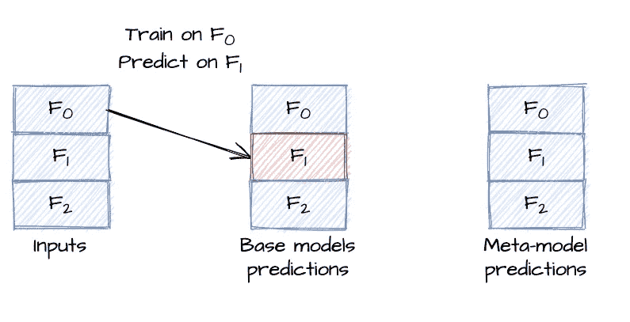
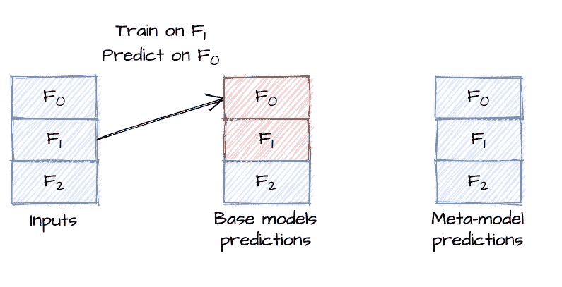
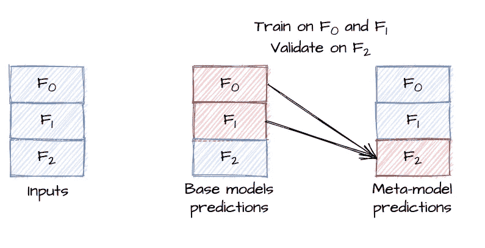
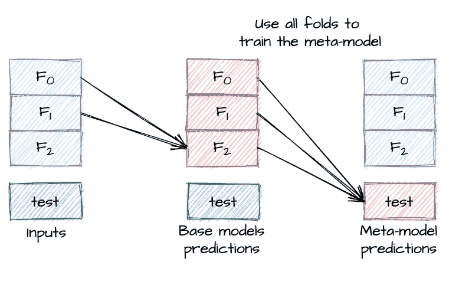

# 堆叠时如何正确验证模型

> 原文：<https://towardsdatascience.com/how-to-properly-validate-a-model-when-stacking-ad2ee1b2b9c?source=collection_archive---------16----------------------->

## 嵌套交叉验证教程

堆叠是一种结合机器学习模型的方法。有了基础模型，人们就可以用它们的预测作为另一个模型的输入，这个模型叫做元模型。当准确性是给定任务的最重要因素之一时，它会被频繁使用，这就是为什么它在机器学习竞赛中非常受欢迎。然而，进行适当的验证并不容易，对数据泄漏非常谨慎也很重要。

嵌套交叉验证的想法是**在褶皱子集上交叉验证基础模型，同时在所有褶皱上进行元模型的经典交叉验证**。没有图像和方案理解方法论有点复杂，我会尽可能清晰地解释整个方法论。

# 折叠创建和基础模型预测

像通常的交叉验证一样，我们创建折叠，这意味着我们将数据集分成大小相等的部分。堆叠时，我们至少需要 3 次折叠，分别表示为 F0、F1 和 F2。我们首先在 F0 上训练基础模型，并在折叠 F1 上计算预测:

来源:作者

然后，我们在 F1 上训练基本模型，并在 F0 上预测:

来源:作者

# 元模型的验证

既然基础模型产生了对折叠 F0 和折叠 F1 的预测，我们可以在 F0 和 F1 上训练元模型，并使用 F2 进行验证:

来源:作者

这种方法的关键思想是**我们在训练**时从不使用两次折叠。沿着从输入到基础模型预测再到元模型预测的箭头，我们使用了两条路径:

*   F0 → F1 → F2
*   F1 → F0 → F2

这样，我们避免了数据泄漏，并且可以使用 F2 文件夹来验证元模型。

# 嵌套交叉验证

我们可以使用以下路径在 F0 和 F1 上重复整个验证过程:

*   F1 → F2 → F0
*   F2 → F1 → F0
*   F0 → F2 → F1
*   F2 → F0 → F1

该方法被称为嵌套交叉验证，因为人们可以在折叠的子集上验证基础模型:当使用路径 F0 → F1 → F2 和 F1 → F0 → F2 时，人们可以在 F0 和 F1 上交叉验证基础模型(或者，在一个折叠上训练，而在第二个折叠上验证)。然后，当我们在两个折叠上训练和在第三个折叠上验证时，元模型发生“外部”交叉验证，3 次。

# 推广到 k 倍

将数据集分成 k 层。对于 k-1 个褶皱的每个子集，交叉验证 k-1 个褶皱上的基础模型:对于 k-1 个褶皱中的每个 k-2 个褶皱，在最后一个褶皱上进行训练和预测。在对基础模型进行交叉验证后，预测最后一次折叠(尚未使用)。对 k-1 个折叠组合的 k 个选择重复该过程。

有 k(k-1)(k-2)/6 条可能的路径，并且需要 k(k-1)/2 个基本模型的训练和 k 个元模型的训练。这就是为什么通常使用 k=3 更容易。

# 最终推论

对于最终的推论，在每一步中，我们都要比训练时多使用一倍。为了产生基础模型预测，选择任意两个折叠输入，并产生最后一个折叠的基础模型预测。然后，使用基础模型预测的所有折叠来获得测试集的元模型预测。

来源:作者