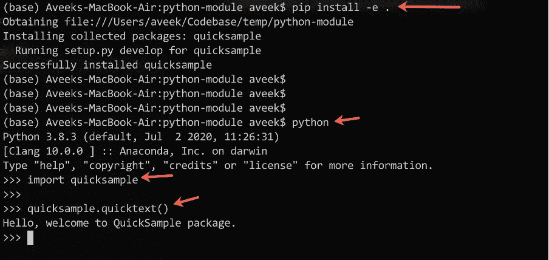

# 如何将 Python 包发布到 PyPi

> 原文：<https://towardsdatascience.com/how-to-publish-a-python-package-to-pypi-7be9dd5d6dcd?source=collection_archive---------4----------------------->

## 了解如何发布自己的 python 包

图片来自 Pexels

在本文中，让我们了解如何开发一个 python 包，然后将其发布到 PyPi 进行分发。这是一篇带有一些高级概念的技术文章，但我将花一些时间详细介绍每个概念，并提供一个执行所有步骤的演练。python 中的程序员经常会用到各种包，比如 Pandas，NumPy 等等。以使其更加健壮，并利用 SDK 的丰富功能。为了在您的代码中使用任何这样的包，您首先需要在您的机器上安装这些包，然后将其导入到您的代码中。

当我们谈到 python 中著名的包管理工具 **PIP** 时，这个想法可能看起来很熟悉。为了在 python 中安装任何包，我们使用 pip install<package _ name>并且包被安装在我们的机器上。然而，这些包保存在一个名为 [PyPi](https://pypi.org/) 或 Python 包索引的中央存储库中。PyPi 是 python 包的官方第三方软件仓库。无论何时运行 pip install 命令，pip 工具都会在该存储库中搜索软件包，然后将其下载并安装到您的机器或虚拟环境中。

# 什么是 Python 包

当谈到用 python 开发包时，第一件事就是你应该知道什么是 python 中的包和模块。你用*写的任何代码。py* 文件在 python 中被称为模块。模块可以导入到另一个模块中。以任何特定动作为目标的多个模块的集合可以组合在一起形成一个包。包还可以包含组织到目录和子目录中的代码。你可以从[官方文档](https://docs.python.org/3.8/distutils/introduction.html#general-python-terminology)中读到更多关于 python 模块和包的内容。

图 1 —用 python 导入模块的示例代码

发布 python 包的步骤非常简单，如下所示。

1.编写您的 python 模块，并将其保存在一个目录下。

2.使用必要的信息创建 setup.py 文件。

3.为您的项目选择一个许可证并提供一个自述文件。

4.在本地机器上生成分发档案。

5.尝试在本地机器上安装软件包。

6.将包发布到 [TestPyPi](https://test.pypi.org/) 存储库中，检查是否一切正常。

7.最后，将包发布到 [PyPi](https://pypi.org/) 存储库中。

现在让我们逐一执行上述步骤，将我们的包发布到 PyPi 存储库中。

# 创建 python 包和目录结构以及其他文件。

您应该首先决定包的名称，然后用包的名称创建目录名。假设我们要发布一个名为“ *quicksample* 的包，那么这个目录应该是同名的。在其下创建另一个名为“ *src* 的子目录，并在 *src* 子目录下放置一个 quicksample.py 文件。

此外，您还应该在项目的根目录下包含一个 setup.py 文件、一个 readme.md 文件和一个许可证文件。你可以从 [GitHub 链接](https://docs.github.com/en/free-pro-team@latest/github/creating-cloning-and-archiving-repositories/licensing-a-repository)了解更多关于许可的信息。此时，您的项目结构应该如下所示。

图 2 —打包 python 应用程序的项目目录结构

为了简单起见，我们将在 quicksample.py 文件中编写一个简单的方法，在导入后调用。

现在，让我们开始编辑 setup.py 文件。您可以使用下面的代码片段来更新您的安装文件。

安装文件准备好之后，最后一步是添加 readme.md 文件。它只是一个 markdown 文件，你可以用它来记录你的包，当它被部署的时候，或者在你的项目的 GitHub 上。

# 在本地机器上生成分发档案。

现在 python 包的代码几乎已经完成，您可以开始构建发行版归档文件了。归档文件是压缩文件，有助于您的包跨多个平台部署，并使其独立于平台。为了生成分发归档文件，请从您的终端运行以下命令。

> python -m pip 安装–-用户–-升级 setuptools 车轮

这将升级您机器上的 setuptools 库以使用最新版本。之后，您需要从您的包的根目录运行以下命令来生成分发文件。

> python setup.py sdist bdist_wheel

一旦您运行了上面的命令，您可以看到发布包将会在目录下交付，这些目录是新创建的，如下所示。除此之外，您还可以看到 egg 文件信息也在项目源代码中得到了更新。

图 3 —项目中包含的构建文件

# 在本地机器上安装软件包。

现在我们已经准备好了发行版文件，我们可以继续安装并导入这个包来测试它是否工作正常。为了在本地计算机上安装软件包，请从根目录运行以下命令。

> pip 安装-e。

图 4 —在本地安装 python 包

如上图所示，在第一步中，我们使用命令在本地安装软件包，一旦安装完毕，我们就启动 python shell 并导入它。然后我们调用 package 方法，它将消息打印到终端。

# 将包发布到 [TestPyPi](https://test.pypi.org/)

一旦这个包被安装到本地并且运行良好，它现在就可以被发送到 TestPyPi 存储库了。这是一个测试存储库，用于测试所有 python 包，并查看所有代码是否工作正常，以及包代码中是否有问题。这使它与官方的 PyPi 存储库隔离开来，并确保只有经过全面测试的包才被部署到生产环境中。

导航到 https://test.pypi.org/的[并注册成为用户。注册后，打开您的终端并运行以下命令。这将在您的机器上安装一个名为“ *twine* 的包，它将帮助您将 python 包发送到存储库。](https://test.pypi.org/)

> python -m pip 安装—用户—升级 twine

你可以在这里阅读关于打包 python 应用程序的官方文档。在安装了 twine 包之后，首先运行下面的命令将代码发送到 TestPyPi。运行该命令时，将要求您提供在上一步中注册帐户时使用的相同凭据。

> python -m twine 上传—存储库 testpypi dist/*

图 5 —将包发送到 TestPyPi

正如您在上图中看到的，python 包现在已经被发送到 TestPyPi 存储库，您可以从上面终端中的 URL 链接查看它。

为了从测试存储库中安装这个包，首先我们将卸载已经存在的包，然后运行下面的命令来安装它。

> pip 卸载快速示例
> 
> pip install-I[https://test.pypi.org/quicksample/](https://test.pypi.org/quicksample/)快速采样==0.0.1

这将从 TestPyPi 存储库在本地系统上安装这个包。

# 将包发布到 [PyPi](https://pypi.org/) 存储库

既然我们的包运行良好，是时候将它发布到官方的 PyPi 存储库中了。按照相同的步骤注册一个帐户，然后运行下面的命令将包发送到官方存储库。

> python -m twine 上传分布/*

现在，您可以使用标准命令安装该软件包。

# 结论

恭喜您，您已经成功发布了您的 python 包。代码示例可以在[这里](https://github.com/aveek22/quicksample)找到。

在这篇高级文章中，我们学习了什么是 python 包，以及如何用 python 开发一个简单的包。我们还了解了 python 的第三方官方库 PyPi，开发者可以在那里发布自己的包并重用代码。你可以将你的 python 代码编译成*目录*或*轮子*文件，然后这些文件将被发布在 PyPi 上。本文中尚未涉及的一些其他主题是在 PyPi 上升级您的项目并维护多个活动版本。