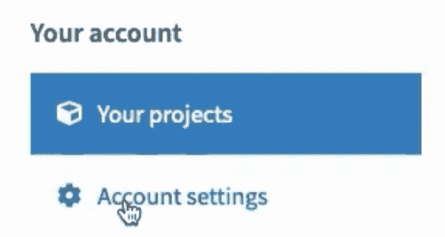
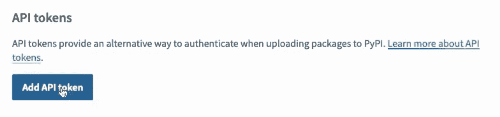
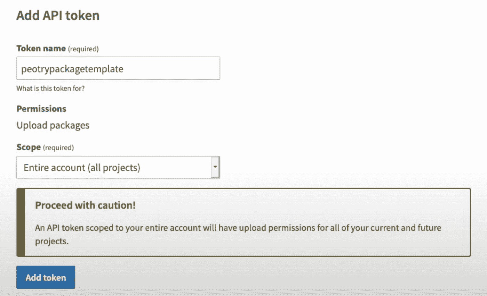
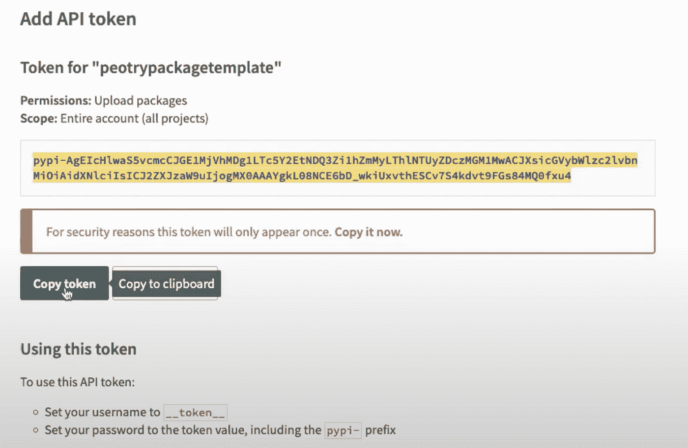
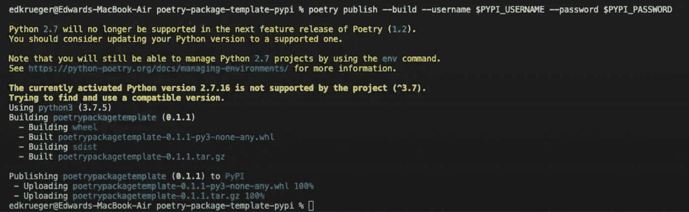
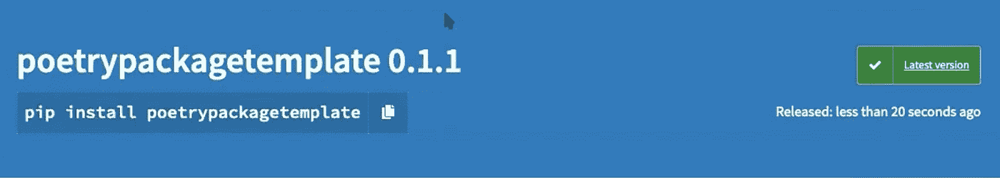

# 如何使用诗歌将 Python 包发布到 PyPI

> 原文：<https://towardsdatascience.com/how-to-publish-a-python-package-to-pypi-using-poetry-aa804533fc6f?source=collection_archive---------12----------------------->

## 公开部署 Python 包的简单方法

作者:[爱德华·克鲁格](https://www.linkedin.com/in/edkrueger/)和[迪伦·罗西](https://www.linkedin.com/in/dylan-rossi/)


[摄](https://unsplash.com/@wickedmonday?utm_source=unsplash&utm_medium=referral&utm_content=creditCopyText)邪恶星期一 [Unsplash](https://unsplash.com/s/photos/package?utm_source=unsplash&utm_medium=referral&utm_content=creditCopyText)

你是否曾想创建一个 python 包供全世界使用，但又觉得太难发布？诗歌可以减轻你的忧虑，因为它让这个过程变得如此简单。

一旦你创建了你的包，诗歌将会为你做出版工作。

**注意:本文假设您已经构建了一个包含诗歌的 python 包，可以发布了。如果您还没有已经创建的包，请** [**下载我们的示例**](https://github.com/edkrueger/poetry-package-template-pypi) **并跟着做。**

# 创建一个 PyPI 帐户

要将 python 包发布到 PyPI，您必须首先拥有一个 PyPI 帐户。

如果您还没有创建，请访问 PyPI 并点击注册链接。


他们会询问您的一般信息(电子邮件、用户名、密码)并注册您的帐户。

您应该还会收到他们的电子邮件，要求您确认您的帐户注册。

一旦您完全注册，登录并前往您的帐户页面。

# 创建 API 令牌

现在您需要创建一个 API 令牌来连接诗歌。这个令牌将允许 poems 知道在哪里发布您的包，并允许它发布到您的帐户。

在您的帐户页面中，单击左侧的“帐户设置”链接。



向下滚动，直到看到“API 令牌”部分，然后单击“添加 API 令牌”按钮。



然后，您将为您的令牌指定一个名称和范围。

对于本例，我们将标记命名为“poetrypackagetemplate”

您还将设置范围为“整个帐户(所有项目)”，但是在实践中，最好为每个项目选择一个令牌(这就是为什么它会用警告消息通知您)。



填写完毕后，单击“Add Token”按钮创建 API 令牌。

PyPI 将生成您的 API 令牌并显示在您的屏幕上，但只是现在，所以请务必复制它或让这个页面打开，直到我们将其连接到诗歌。



# 为您的 PyPI 凭证创建环境变量

现在您已经有了一个连接到 PyPI 帐户的 API 令牌，我们可以将这个令牌交给 poems，这样它就知道在哪里发布您的包了。我们可以通过创建保存您的凭证的环境变量来做到这一点，然后我们可以将凭证传递给 poems 的 publish 命令。

继续打开终端(Windows 上的 git-bash ),确保您在 python 包或我们的示例包的目录中。

然后在 macOS 或 Linux 上运行这些命令:

```
export PYPI_USERNAME=__token__export PYPI_PASSWORD=<Your API Token>
```

运行这些命令(在 Windows 上):

```
set PYPI_USERNAME=__token__set PYPI_PASSWORD=<Your API Token>
```

就是这样！poem 现在准备将您的 python 包发布到 PyPI。

# 用诗歌出版包裹

要完成出版物，您需要再运行一个命令。

```
poetry publish --build --username $PYPI_USERNAME --password $PYPI_PASSWORD
```

然后，poems 将开始构建您的 python 包并将其发布到 PyPI。



一旦完成，您的软件包将会在您的 PyPI 帐户上，并且可以通过 pip 安装！



# 结论

从这篇简短的文章中可以看出，将 python 包发布到 PyPI 是轻而易举的事情。

如果您愿意，您可以通过简单地运行

```
pip install <Your Package Name>
```

祝贺您发布 python 包！

如果你想了解更多关于诗歌的信息，请查阅克里斯托弗·西德博特姆的这篇文章:

</solving-dependency-management-in-python-with-poetry-165b92069e9d> 