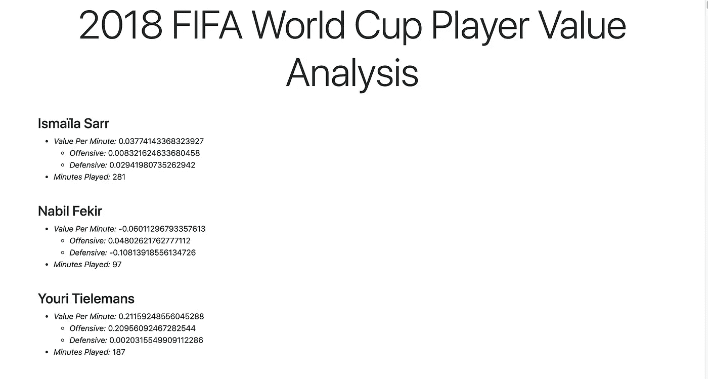

# 如何使用 Julia 和 Genie 将您的数据科学项目发布为 Web 应用程序

> 原文：<https://towardsdatascience.com/how-to-publish-your-data-science-or-machine-learning-project-as-a-web-app-using-julia-and-genie-e83d2733806d?source=collection_archive---------27----------------------->

沟通通常是数据科学项目不可或缺的一部分，整个业务都是围绕公开数据科学过程的结果而构建的。例如，像 wyscout 和 StatsBomb 这样的平台收集足球数据，并以网络应用的形式展示他们对数据的分析。

在本指南中，我简要介绍了如何开始使用编程语言 Julia 和 Julia web framework Genie 为您的数据科学项目构建 web 应用程序。来自一个研究项目的公开可用的玩家价值分析被用作一个示例用例。

> 声明:我写这篇文章是我自己学习茱莉亚和精灵过程的一部分。这两方面我都不是专家。

# 安装朱莉娅

要安装 Julia，请遵循[https://julialang.org/downloads/platform/](https://julialang.org/downloads/platform/)的说明。确保 Julia 可执行文件被添加到`PATH`中，这样您就可以从命令行使用`julia`命令。

# 设置您的项目

是时候建立项目了。首先，为项目创建一个目录，并在命令行中导航到该文件夹:

```
mkdir projectname
cd projectname
```

如果您愿意，现在也是为项目设置版本控制的好时机。例如，要将文件夹设置为一个 [Git](https://en.wikipedia.org/wiki/Git) repostir，在命令行上执行`git init`。

接下来，我们将为项目设置一个虚拟环境。您可能熟悉 Python 等其他编程语言的虚拟环境。虚拟环境是一种有用的工具，有助于保持不同项目所需的依赖关系是独立的，因为每个虚拟环境中的依赖关系都与同一台机器上任何其他虚拟环境中的依赖关系相隔离。Julia 中的虚拟环境是通过内置的包管理器`Pkg`创建的。

为了创建虚拟环境，

1.  从命令行执行`julia`打开茱莉亚 [REPL](https://en.wikipedia.org/wiki/Read%E2%80%93eval%E2%80%93print_loop) ，
2.  在朱丽亚·REPL 中执行`]`进入`Pkg` REPL，并且
3.  在`Pkg` REPL 内执行`activate .`。

这将为您的项目创建并激活虚拟环境。此外，文件`Project.toml`和`Manifest.toml`将被创建在`projectname`文件夹中。正如它们的扩展名所示，这些文件以 [TOML](https://toml.io/) 格式编写，用于管理您的项目依赖关系。有关`Pkg`的更多信息，请参见[http://pkgdocs.julialang.org/v1/api/](http://pkgdocs.julialang.org/v1/api/)。

# 创建精灵 Web 应用程序

本节主要是官方精灵教程的缩略版。如果你觉得 Genie 有趣，我推荐你看完整的教程，在这里可以找到。

## 安装精灵

现在是时候安装精灵了。简而言之，

> Genie 是一个全栈 MVC web 框架，它促进了在 Julia 中开发现代 web 应用程序的简化和高效的工作流。——[精灵](https://genieframework.com/)

要安装 Genie，在激活项目虚拟环境的情况下，从`Pkg` REPL 中执行`add Genie`。如果你关闭了它，只需运行`projectname`目录中的`julia --project <filepath>`来打开茱莉亚 REPL，激活你的虚拟环境，并输入`]`进入`Pkg` REPL。

执行`add Genie`后，您可以通过使用退格键或`CTRL+C`退出`Pkg` REPL 并返回到朱莉娅·REPL 来验证安装。然后，尝试用`using Genie`导入精灵。如果没有返回错误，则说明 Genie 安装正确。

## 实例化一个精灵 Web 应用程序模板

现在我们已经安装了 Genie，是时候为项目设置 web 应用程序了。打开朱莉娅·REPL，导入精灵，执行

```
Genie.newapp_webservice("webapp")
```

这将在`projectname`目录中创建一个`webapp`文件夹，其中包含您的数据科学项目的简单框架 web 应用程序。

## 启动你的应用

你现在可以从朱莉娅·REPL 的网站上使用

```
using Genie
Genie.loadapp()
up()
```

并通过在浏览器中导航到 [http://localhost:8000/](http://localhost:8000/) 找到它。您应该会在 web 应用程序的登录页面上看到一条股票欢迎消息。


# 发布您的数据科学项目

现在是时候发布你的数据科学项目了。作为一个示例项目，我将使用论文*“行动比目标更响亮:重视足球运动员的行动”中的数据由 Tom Decroos、Lotte Bransen、Jan Van Haaren 和 Jesse Davis 通过 GitHub 知识库提供*。

评估球员在足球比赛中的影响的传统指标集中在进球等罕见的动作上。因此，研究论文提出了一种技术，用于为所有单独的足球动作赋值，包括那些没有进球的动作。出于本指南的目的，我们将仅利用 2018 年 FIFA 世界杯的数据。

这个小项目的目标是将 2018 年 FIFA 世界杯球员分析作为一个网络应用程序展示给所有人。

## 下载数据

在`webapp`目录下创建一个`data`目录，并将文件`player_stats.csv`下载到该文件夹中。你可以在这里找到文件。文件的完整路径应该是`projectname/webapp/data/player_stats.csv`。我建议您浏览一下文件的内容，看看不同的列。

## 定义播放器数据结构

现在是时候将数据加载到程序中了。打开`webapp`目录下的`routes.jl`文件。当用户访问 web 应用程序的页面时，该文件负责执行正确的代码。它已经包含了一些代码，即，

```
using Genie.Routerroute("/") do
 serve_static_file("welcome.html")
end
```

这是在创建了框架 web 应用程序后负责向您显示欢迎使用 Genie 页面的代码。

现在是时候添加适当的数据结构来包含从`player_stats.csv`文件发布的信息了。添加以下`struct`:

```
struct Value
  total::Float64
  offensive::Float64
  defensive::Float64
endstruct Player
    name::String
    minutes_played::Int
    value_per_minute::Value
end
```

## 加载玩家数据

定义了`Player`数据结构后，是时候从`player_stats.csv`文件构建`Player`了。由于它是以 CSV 格式存储的，我们将使用`CSV`包来加载文件。要安装它，打开一个`Pkg` REPL 和`add CSV`。

接下来，通过将`using CSV`添加到`routes.jl`的顶部来导入包。最后，通过添加列表理解从`player_stats.csv`加载数据

```
players = [
  Player(player.player_name, player.minutes_played, 
         Value(
           player.vaep_rating,
           player.offensive_rating,
           player.defensive_rating))
  for player in CSV.File("data/player_stats.csv")
]
```

下面是`Player`的定义。

## 展示数据

通过在文件顶部添加`using Genie.Renderer.Html`来导入`Genie.Renderer.Html`。然后，向`/players`子页面添加一条新路线

```
route("/players") do
  html(:players, :index, players=players)
end
```

在`routes.jl`的底部。对`html`的调用将玩家列表作为输入，同时输入两个符号来指示呈现玩家的 HTML 模板的位置。作为输出，通过调用 Genie 的模板引擎填充模板，返回 HTML 格式的字符串。然而，要做到这一点，模板文件

*   `webapp/app/layouts/app.jl.html`，以及
*   `webapp/app/resources/players/views/index.jl.html`

必须被创造。

文件`webapp/app/layouts/app.jl.html`应该包含

并且`webapp/app/resources/players/views/index.jl.html`应该包含

两个模板文件都类似于 HTML，但是在`<%`和`%>`标签之间嵌入了代码。这些是 Genie 模板引擎的命令。`app.jl.html`文件包含场地的总体布局。目前，我们最感兴趣的是负责渲染玩家名单的`index.jl.html`。在该文件中，嵌入代码在第 2–14 行的`Player`的输入列表上循环，循环体访问每个`Player`结构的字段，将数据插入到适当的 HTML 结构中，以便在浏览器中呈现。

# 一切就绪！

有了模板，网络应用程序可以再次从朱莉娅 REPL 与

```
using Genie
Genie.loadapp()
up()
```

如果你导航到 http://localhost:8000/players，你应该会看到页面上显示的玩家统计数据。



在[http://localhost:8000/players](http://localhost:8000/players)的页面应该是这样的。

## 下一步是什么？

如果您遵循了指南，那么您已经构建了一个简单的 web 应用程序来呈现分析结果。本指南并不是将数据科学项目发布为 web 应用的结束，而仅仅是开始。仍有很大的改进空间。

样式方面的改进可以是降低值的精度，减少空白空间的数量，以便更有效地利用屏幕空间。功能方面的改进可能包括排序或搜索，这将使数据导航更容易。最后，您可能希望从自己的数据科学项目中展示的数据可能要复杂得多，例如，包括层次结构。例如，分析每个球员的个人比赛。

你可以在 GitHub 上找到完整的项目[。](https://github.com/TobiasSkovgaardJepsen/genie-webapp)