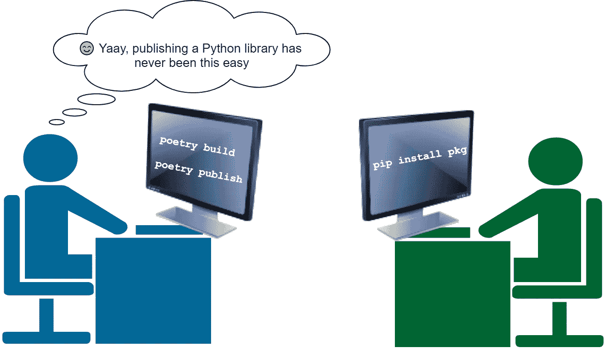
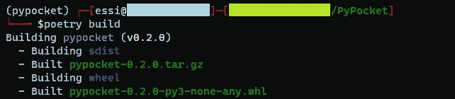
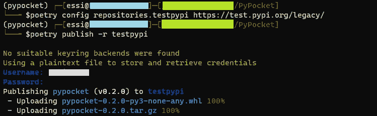
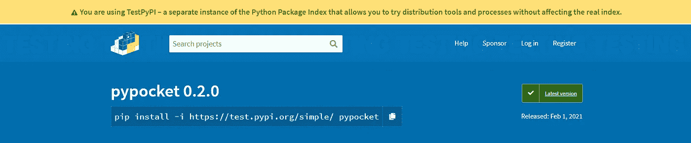

# 如何只用两个命令发布 Python 包

> 原文：<https://towardsdatascience.com/how-to-publish-your-python-package-with-just-2-commands-39ea6a400285?source=collection_archive---------57----------------------->

## 大蟒

## 了解如何使用诗歌发布 Python 库。此外，学习如何在 TestPyPI 框架上测试您的打包。



**除非另有说明，所有使用的图片均为作者所有。*

使用[诗歌](https://python-poetry.org/)打包你的 Python 库从未如此简单。你可能有一个有益于他人的 Python 副业。你可以用诗歌来发表。这篇文章将向您展示如何构建自己的 Python 库，并将其发布在最流行的 Python 包存储库 [PyPI](https://pypi.org/) 上。

我将使用我最近的一个 Python 项目， [PyPocket](https://github.com/e-alizadeh/PyPocket/) :一个用于 [Pocket](https://getpocket.com/) 的 Python 库(包装器)(以前称为 Read It Later)。

# 先决条件

## 1.项目环境

您需要在 poem 中管理您的项目环境，因为我们将使用`pyproject.toml`文件来构建我们的包并发布它。

*你可以查看我在* [*上的帖子如何使用 Conda 和 poem*](/a-guide-to-python-environment-dependency-and-package-management-conda-poetry-f5a6c48d795)*设置你的 Python 环境。*如果你没有使用 Conda，你可以按照我在帖子中提供的步骤，而是使用其他环境管理系统，如 [Pipenv](https://github.com/pypa/pipenv) 或 [Virtualenv](https://virtualenv.pypa.io/en/latest/) 。

## 2.包存储库

我们需要一个包存储库来存放 Python 包；最受欢迎的是 [PyPI](https://pypi.org/) 。因此，如果您想在 PyPI 上发布您的库，您需要首先在 PyPI 上创建一个帐户。

# 包装说明

# 步骤 1:构建您的包

准备好要发布的 Python 包后，首先需要在包含`pyproject.toml`文件的目录中使用以下命令构建包:

```
poetry build
```



诗歌创作的输出

上面的命令将在`dist`(发行版)目录下创建两个文件。如果没有`dist`文件夹，则会创建一个文件夹。

首先，创建一个源代码发行版(通常称为 **sdist** )，它是基于当前平台的包的归档文件(对于 Unix 系统为`.tar.gz`，对于 Windows 系统为`.zip`)[1]。

除了 sdist，`poetry build`还创建了一个 Python wheel ( `.whl`)文件。简而言之，与源代码发行版不同，Python wheel 是一种现成的安装格式，允许您跳过构建阶段。车轮文件名通常采用以下格式[2]:

```
{pkg-name}-{pkg-version}(-{build}?)-{python-implementation}-{application binary interface}-{platform}.whl
```

从上图来看，我构建的包名为 **pypocket** ，版本为 **0.2.0** 在 **Python 3** 中，即**非 OS 专用**(非 ABI)，适合*在* ***任何*** *处理器*架构上运行。

# 步骤 2:发布您的包

一旦构建了包，就可以在 PyPI(或其他包存储库)上发布它。

**一个注意点:**一旦你把你的包发布到 PyPI，你将无法发布一个相同的版本(你可以删除这个包，但是当你试图用相同的版本重新发布时，你会得到一个错误！我去过)。因此，建议在将包推送到 PyPI 之前对其进行测试。

## 在 TestPyPI 上测试您的包

首先使用 [TestPyPI](https://test.pypi.org/) 框架发布您的包是一个好主意。这样，如果发布的包有问题，您可以修复它，然后在 PyPI 上发布它。TestPyPI 拥有与 PyPI 相同的设置和用户界面，但它是一个独立的框架*。因此，您也需要在 TestPyPI 上创建一个帐户。*

*现在，让我们在 TestPyPI 上发布我们的包。首先，使用下面的命令添加 TestPyPI 作为替代的包存储库。*

```
*poetry config repositories.testpypi [https://test.pypi.org/legacy/](https://test.pypi.org/legacy/)*
```

*您可以将您的包发布到 TestPyPI，如下所示:*

```
*poetry publish -r testpypi*
```

**

*诗歌出版产量*

*`poetry publish`将询问您的用户名和密码(您也可以使用令牌代替，稍后将详细介绍)。请注意，源代码发行版(`.tar.gz`)和 Python wheel 都被上传了。一旦发布了这个包，您应该会在 TestPyPI 上看到如下内容。*

**

*你可以在这里查看[https://test.pypi.org/project/pypocket/](https://test.pypi.org/project/pypocket/)*

*从上面的截图可以看出，可以安装包`pip install -i https://test.pypi.org/simple/ pypocket`并进行测试。*

## *在 PyPI 上发布包*

*一旦您对 Python 库满意了，就可以使用下面的命令将其发布到 PyPI 上:*

```
*poetry publish*
```

*注意，默认情况下，poems 会将一个包发布到 PyPI。因此，您不需要执行`poetry config`或者向`poetry publish`传递任何参数。*

## *关于使用 API 令牌代替用户名和密码的一点*

*您可能会注意到，我在尝试发布包时使用了我的用户名和密码。我建议使用代币代替。您的 PyPI 帐户中可能有多个项目，您可以为每个项目(包)生成一个 API 令牌。如果您希望自动化 python 打包，以便在自动化部署期间不使用您的用户名和密码，这一点尤其重要。使用 API 令牌的另一个优点是，您可以轻松地删除一个令牌，甚至为一个项目生成多个令牌。*

*您可以通过进入您的 PyPI(或 TestPyPI)帐户的**帐户设置**来生成一个 API 令牌，然后在 API 令牌部分下添加一个 API 令牌。然后会提示您为您的令牌选择一个范围(将令牌用于一个特定的项目或您的所有 PyPI 项目)。在这个阶段还将提供使用令牌的指令。*

# *结论*

*在这篇文章中，我们看到了如何通过两个简单的命令使用诗歌构建和发布 Python 包:`poetry build`和`poetry publish`。为了在 PyPI 上发布 Python 包之前测试它，我们还浏览了 TestPyPI 框架。*

*感谢阅读。*

*[***加入我的邮件列表接收类似帖子***](https://www.ealizadeh.com/subscribe/) 。也可以关注我的 [***中***](https://medium.com/@ealizadeh) ，[***LinkedIn***](https://www.linkedin.com/in/alizadehesmaeil/)， [***推特***](https://twitter.com/intent/follow?screen_name=es_alizadeh&tw_p=followbutton) 。*

# *参考*

*[1] Python 文档，[创建源代码分发](https://docs.python.org/3/distutils/sourcedist.html)*

*[2]布拉德·所罗门(2020)，[什么是 Python 轮子，为什么要关心？](https://realpython.com/python-wheels/)，真正的蟒蛇*

# *有用的链接*

*</a-guide-to-python-environment-dependency-and-package-management-conda-poetry-f5a6c48d795>   * 

**最初发表于*[*【https://www.ealizadeh.com】*](https://www.ealizadeh.com/blog/how-to-publish-your-python-package-with-just-2-commands/)*。**