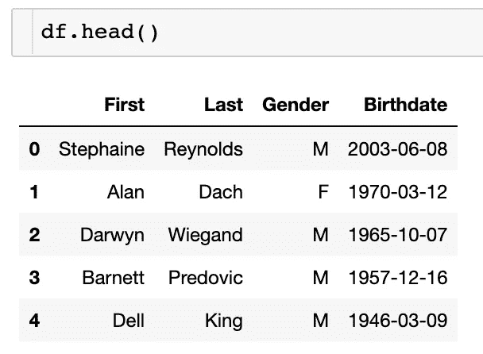
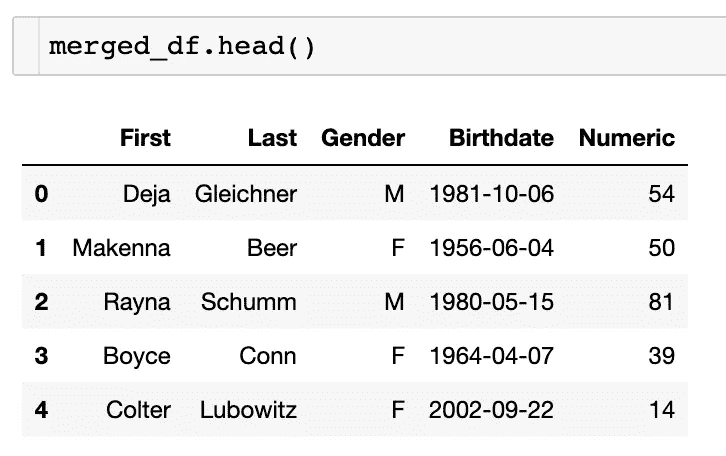
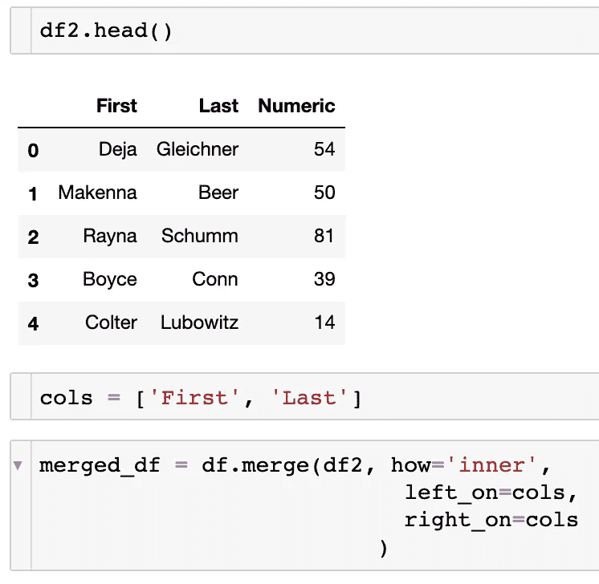

# 如何查询你的熊猫数据框架

> 原文：<https://towardsdatascience.com/how-to-query-your-pandas-dataframe-c6f7d64164bc?source=collection_archive---------19----------------------->

## 数据科学家对类似 SQL 的 Python 函数的看法


[布鲁斯洪](https://unsplash.com/@hongqi?utm_source=unsplash&utm_medium=referral&utm_content=creditCopyText)在[Unsplash](https://unsplash.com/s/photos/pandas?utm_source=unsplash&utm_medium=referral&utm_content=creditCopyText)【1】上拍照。

# 目录

1.  介绍
2.  多重条件
3.  在多个特定列上合并
4.  摘要
5.  参考

# 介绍

无论您是从数据工程师/数据分析师转型，还是想成为更高效的数据科学家，查询数据框架都是返回所需特定行的非常有用的方法。需要注意的是，熊猫有一个特定的查询函数，名为`query`。然而，我将讨论模拟查询、过滤和合并数据的其他方法。我们将介绍一些常见的场景或问题，您可能会对您的数据提出这些问题，而不是 SQL，我们将用 Python 来完成。在下面的段落中，我将概述一些使用 Python 编程语言为 pandas 数据帧查询行的简单方法。

# 多重条件



样本数据。截图来自作者[2]。

作为数据科学家或数据分析师，我们希望返回特定的数据行。其中一个场景是您希望在同一行代码中应用多个条件。为了展示我的例子，我创建了一些名和姓的假样本数据，以及它们各自的性别和出生日期。这个数据显示在上面的截图中。

多个条件的例子本质上回答了一个特定的问题，就像使用 SQL 一样。问题是，在我们的数据中，出生于 2010 年至 2021 年间的人有百分之多少是男性。

> 下面是解决这个问题的代码(*回答这个问题有几种方法，但这里是我的具体做法*):

```
print(“Percent of data who are Males OR were born between 2010 and 2021:”,
 100*round(df[(df[‘Gender’] == ‘M’) | (df[‘Birthdate’] >= ‘2010–01–01’) & 
 (df[‘Birthdate’] <= ‘2021–01–01’)][‘Gender’].count()/df.shape
 [0],4), “%”)
```

为了更好地形象化这段代码，我还附上了上面这段代码的截图，以及输出/结果。您还可以应用这些条件来返回实际的行，而不是从全部行中获取行的分数或百分比。


条件代码。作者截图[3]。

> 以下是我们执行命令的顺序:

*   返回带有男性`Gender`的行
*   包括**或**功能`|`
*   返回`Birthdate` > 2010 和 2021 的行
*   将所有这些组合起来，然后除以总行数

如您所见，这段代码类似于您在 SQL 中看到的内容。我个人认为这在 pandas 中更容易，因为它可以减少代码，同时还可以在一个容易的地方直观地看到所有代码，而不必上下滚动(*但这种格式只是我的偏好*)。

# 在多个特定列上合并



合并数据帧结果。作者截图[4]。

我们可能已经在其他教程中看到了如何将数据帧合并在一起，所以我想添加一种我还没有真正看到过的独特方法，即对多个特定列进行合并。在这个场景中，我们希望连接两个数据帧，其中两个字段在它们之间共享。可以看出，如果有更多的列，这种方法可能会更有用。

> 我们有了第一个数据帧 df，然后我们在第二个数据帧 df2 上合并我们的列。下面是实现我们预期结果代码:

```
merged_df = df.merge(df2, how=’inner’, 
 left_on=cols, 
 right_on=cols
 )
```

为了更好地可视化这种合并和编码，我展示了下面的截图。您可以看到下面第二个数据帧的样子，带有名称`First`和`Last`，就像它们在第一个数据帧中一样，但是有一个新的列`Numeric`。然后，我们列出了想要合并的特定列，同时返回列`Gender`、`Birthdate`，以及新的`Numeric`列。列是列的列表，命名为`cols`。



正在合并数据帧。作者截图[5]。

如您所见，这种合并数据帧的方式是一种简单的方法，可以获得与 SQL 查询相同的结果。

# 摘要

在本教程中，我们看到了两个您将在 SQL 中执行的常见问题或查询，但它们是用 Python 中的 pandas 数据帧来执行的。

> *总结一下，下面是我们处理过的两个场景:*

```
* Returning the percent of rows out of the total dataset from multiple conditions* Merging on multiple, specific columns to return a final datafarme with a new column
```

我希望你觉得我的文章既有趣又有用。如果你同意或不同意这些方法，请在下面随意评论。为什么或为什么不？这些当然可以进一步澄清，但我希望我能够阐明一些使用 pandas 和 Python 代替 SQL 的方法。感谢您的阅读！

*请随时查看我的个人资料、* [Matt Przybyla](https://medium.com/u/abe5272eafd9?source=post_page-----c6f7d64164bc--------------------------------) *和其他文章，也可以在 LinkedIn 上联系我。*

我与这些公司没有关系。

# 参考

[1]图片由 [Bruce Hong](https://unsplash.com/@hongqi?utm_source=unsplash&utm_medium=referral&utm_content=creditCopyText) 在[Unsplash](https://unsplash.com/s/photos/pandas?utm_source=unsplash&utm_medium=referral&utm_content=creditCopyText)(2018)上拍摄

[2] M. Przybyla，样本数据截图，(2021 年)

[3] M. Przybyla，条件代码截图，(2021 年)

[4] M. Przybyla，合并数据框架结果截图，(2021 年)

[5] M. Przybyla，合并数据框架截图，(2021 年)