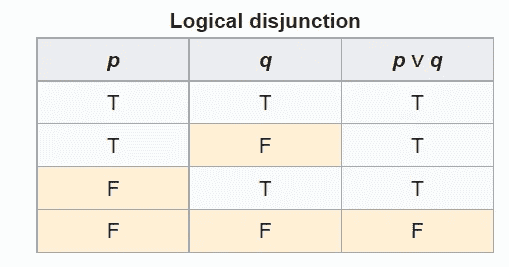
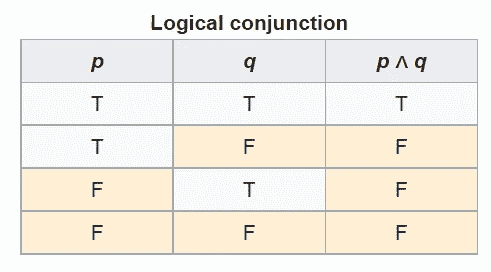

# 如何快速成为数据科学家

> 原文：<https://towardsdatascience.com/how-to-quickly-become-a-data-scientist-40ec00408eba?source=collection_archive---------1----------------------->

## 意见

## 将 X 年的工作压缩到 X 个月

照片由 [Trace Hudson](https://www.pexels.com/@tracehudson?utm_content=attributionCopyText&utm_medium=referral&utm_source=pexels) 从 [Pexels](https://www.pexels.com/photo/man-standing-beside-train-2365701/?utm_content=attributionCopyText&utm_medium=referral&utm_source=pexels) 经作者修改

正如古老的阿拉伯语[所说](https://emilysquotes.com/time-is-like-a-sword-if-you-dont-cut-it-it-cuts-you/)，时光飞逝:

> "时间就像一把剑:你不砍它，它就砍你。"—阿拉伯谚语

我父亲仍然对不欣赏技术的人感到生气。他解释说，当他在 20 世纪 60 年代学习时，他会花一整天在图书馆查找一条信息。今天，我们将需要整整一分钟来达到这一点。

学分当然是去网上了。

但是数据科学是一匹不同颜色的马。

数据科学是无限的。就我而言，从来没有人设法完成数据科学。然而，许多人已经成功成为数据科学家。

坦率地说，成为一名数据科学家很容易。

这很简单，因为数据科学家只不过是一个数据杂耍者。这不需要火箭科学家——尤其是有 Python 这样的助手。

事实上，看到像“成为数据科学家很棘手”、“机器学习很难”这样的东西困扰着互联网，令人沮丧。

相信我；无论您的数据科学之旅带您到哪里，您最终都会越过“数据科学家”的终点线。唯一的变数是**时间**。

成为一名数据科学家需要多久？

其实快速成为数据科学家只有两种方法。第一种方法是使用时间机器。第二个是用这篇文章。如果你知道第三个，告诉我。

不管怎样，如果你能使用第一种方法，你就没有必要继续阅读了。如果你对第二种方式感兴趣，请继续关注我。

既然你还在这里，我想你一定很好奇。那么，事不宜迟，我们开始吧。

# 从数学开始

我知道，我知道。学习数学需要时间，因为它被吹捧为很难，尽管我不认为它很难。

不要误解我。我不是要你成为数学家或者创造下一个数学公式。你需要做的就是和数字交朋友，并且更加有条理。

数学将帮助你做到这一点。这是因为计算机只能理解数字。而编码需要关键性。

例如，条件语句完全基于逻辑数学。不幸的是，我反复看到这些声明被自称数据科学家的人滥用，这让我畏缩不前。

我畏缩是因为逻辑可以归结为这两个简单的真值表:

(p 或 q)表格—来源([维基百科](https://en.wikipedia.org/wiki/Truth_table))

(p 和 q)表—来源([维基百科](https://en.wikipedia.org/wiki/Truth_table))

大多数人一旦看到∧和∨这样的符号，就会感到害怕，这两个符号分别是和、或的简单写法。

如果你问我机器学习，我会说你不需要这种水平的数学。Python 的库已经为您处理了这部分。您只需要导入这些库，就可以部署您的第一个模型了。

没有附带条件。

请记住，如果你喜欢数学，它也会喜欢你。反之亦然。

# 尽快开始编码

拖延编码是一个巨大的错误。

我将重新表述这一点，让它变得非常清楚:

> 你需要尽快用代码弄脏你的手。

新人拖延编码是因为他们不知道编码什么或者如何编码。让我们来分析一下。

一方面,“什么”的问题不在于稀缺，而在于质量。换句话说，你需要编写一些能让你更快达到最终目标的代码。

要做到这一点，你需要坐下来，想想作为一名数据科学家，你想从事的行业。

例如，如果你对金融感兴趣，你可以从事欺诈检测、贷款审批或市场预测项目。这将增加你在银行、投资银行公司、保险公司等机构成为数据科学家的机会。

另一方面，如果你不知道如何编码，你需要复习基础知识，不要偏离主题:

基本要素是:

*   变量和数据结构
*   条件分支
*   环
*   模块导入
*   面向对象编程
*   功能

非基础的有:

*   装修工
*   多态性
*   递归

有了数学知识，你应该能够在编写干净代码的基础上打下基础。

你可能会说，数学和干净的代码有什么关系？

答案还是逻辑和结构化思维。数学在整理思路方面还是挺不错的。

除此之外，您应该习惯于在 web 上搜索代码解决方案。无论你面临什么样的挑战，把它贴在谷歌上，很可能没有人面临过和你一样的挑战。

这样做会节省你奋斗的时间。

不用说，我们在这里讨论的是 Python。

# 停止收集数据科学证书

在科技时代，当一个新手选择数据科学作为职业道路时，他们会做什么？

他们不停地堆数据科学证书，在 LinkedIn 上分享。

考不上那些证书的概率有多大？

接近于零。

就我个人而言，我一直想知道为什么人们一直吹嘘他们的数据科学成就。我从来没有做过那件事，而且我也没有打算在近期内做。

数据科学证书就像毒品一样。有些人会跳过视频课程，在不知道代码解决方案是关于什么的情况下运行代码解决方案，以获得最终好看的、可共享的证书。那是浪费时间。

然而，数据科学课程的重点是帮助你试水，知道从这个领域可以期待什么，以及除了金钱上的吸引力之外，这是否是你正确的职业道路。

如果你想为了钱成为一名数据科学家，你最好把门槛提高一点，努力成为一名医生。他们的收入是数据科学家的两倍。

现在，为了充分利用数据科学证书，您应该明智地选择课程。

例如，几年前，我参加了 IBM 在 Coursera 上开设的一门名为“人工智能(AI)入门”的课程。老实说，这完全是浪费时间。课程长达 8 小时。内容基本上围绕着回答一个问题:人工智能的优势是什么。一些你可以花 10 分钟或者更少时间去做的事情。

但是，最终，我从这次经历中学到了重要的一课。那就是当我看到一门课程没有问题要解决或者没有代码的时候，我能跑多远就跑多远。这是至关重要的。

# 成为一名卡格勒

Kaggle 是数据科学家的大本营。

首先，Kaggle 拥有大量最新的数据集，让你免去了搜索原始数据或收集原始数据的麻烦。

收集数据并不像听起来那么简单。一些网站，如脸书和 LinkedIn，对数据抓取和数据抓取有严格的政策。如果他们破产了，你应该准备好和他们的账户说再见。

其次，你应该知道，数据训练是数据科学管道中必不可少的一部分，需要巨大的计算能力。

Kaggle 正是通过他们的服务器提供对最先进机器的访问来提供这种服务的。这意味着您不需要一台高端计算机来运行您的模型，为您节省了大量的时间和资源。

第三，Kaggle 有一个面向数据科学的充满活力和支持的社区。每当你有一个数据科学的问题，前往讨论区，看看已经存在的线程，或者你可以开始自己的。

最重要的是，Kaggle 通过向最优秀的数据科学家提供金钱奖励，向其成员灌输竞争精神。

那么为什么要等呢？

加入 Kaggle，开始播种和收获知识。

# 写代码日记

互联网的一个显著特征是，你经常开始寻找一些东西，结果却在这个过程中发现了一些隐藏的宝石。

当我开始编码的时候，这是一个巨大的浪费。

你看，当我过去陷入实现一个代码特性时，我经常查找解决方案的一部分，很少查找整个解决方案。我会犯的愚蠢的错误是在路上遇到一个引人注目的特征，欣赏它，然后继续前进，好像什么都没发生过。

后来，我面临一个需要实现几乎相同特性的问题。我的记忆会让我记不住密码和信息来源。在那里，我迷失在斯达克弗洛、卡格尔和诸如此类的作品中很久了。

为了避免再次陷入同样的陷阱，我用 OneNote 创建了一个“有趣的代码”日记。日记的每一页都被分成三栏:

*   特征
*   密码
*   代码注释

在我的数据科学之旅中，这种实践是一个重要的时间助推器。

# 不要忘记 SQL

尽管 SQL 在数据科学中至关重要，但它并没有得到应有的重视。不幸的是，Python 抢尽了风头。

然而，有趣的是，每个人都在谈论按摩数据、训练数据、可视化数据等等。然而，他们忘记了数据最重要的一点:检索数据——SQL**的功能。**

一个不知道如何获取数据的数据科学家就像一个不知道如何发动引擎的司机。[SQL 知识的缺乏扼杀了数据科学家](/python-alone-wont-get-you-a-data-science-job-a780085ac640)。

除非公司将其数据存储在区块链，否则数据库是数据的唯一归属。而 SQL 是检索或更专业地说是查询这些数据的唯一媒介。

幸运的是，SQL 是最容易也是最快速学习的语言之一。如果你真的在一个周末认真对待它，你可以积累成为一名数据科学家所需的一切。

我所说的“您需要的”是指选择、更新、插入和删除查询。

# 外卖食品

到目前为止，我们已经讨论了一些有效而快速的实践，这些实践可能会帮助您成功获得“数据科学家”的称号。

如果我有一台时光机回到我爱上数据科学的那一天，我会接受这篇文章中概述的实践。

值得注意的是，我故意没有触及与数据科学相关的技能，比如统计、可视化、深度学习等等。这是因为所有这些技能都源于前面已经提到的。

例如，如果你擅长数学，害怕不是统计。或者，如果您发现寻找代码解决方案很容易，那么定位想要的可视化也应该不难。

最后，你不需要马上发明什么东西。作为一名数据科学家，你可以稍后再做。

现在，在我离开之前，我想向你保证，也许与你通常听到的相反，成为一名数据科学家是很容易实现的。

事实上，它可以比你预期的更快实现。你只需要聪明地投资每一分钟，而不是勤奋地投资。

这是不公平的，但这就是世界的运作方式。