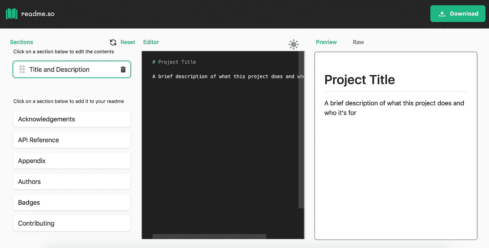
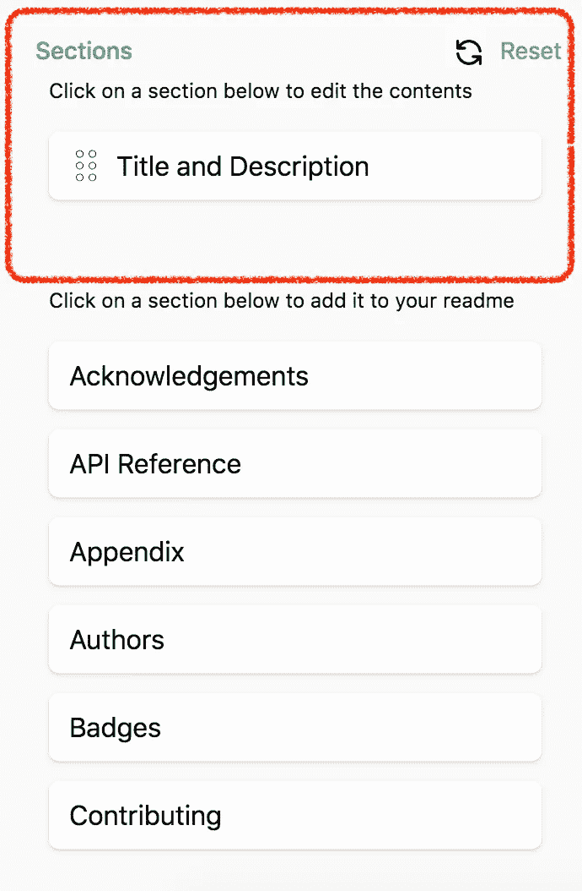
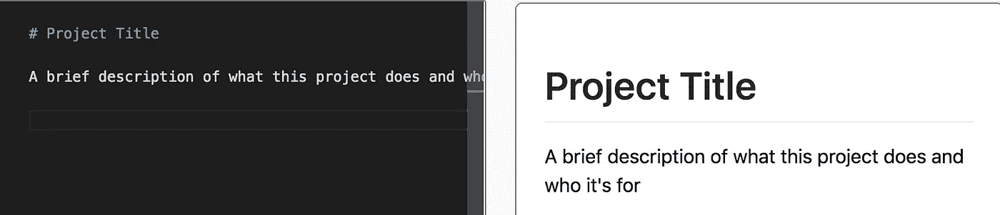
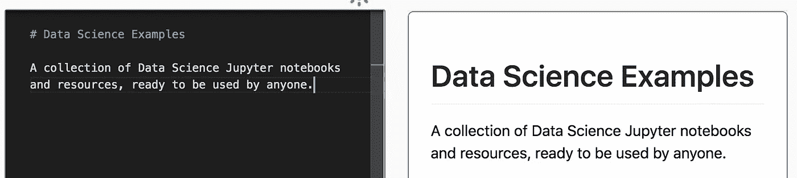

# 如何在 Github 中快速构建自述文件

> 原文：<https://towardsdatascience.com/how-to-quickly-build-a-readme-file-in-github-8886b98ef95a?source=collection_archive---------20----------------------->

## 环境设置

## 快速浏览 readme.so 在线工具，快速构建 Github 自述文件。

图片来自 [Pixabay](https://pixabay.com/?utm_source=link-attribution&utm_medium=referral&utm_campaign=image&utm_content=5430104) 的 [Prettysleepy](https://pixabay.com/users/prettysleepy-2973588/?utm_source=link-attribution&utm_medium=referral&utm_campaign=image&utm_content=5430104)

当你开始一个新项目时，你开始编写和测试你的代码。但是，相关的**文档可能仍然过时**，因为*没有时间更新*。

在这里，我提出一个简单的在线工具，叫做 **readme.so** ，它被特别认为可以非常快速地构建一个 readme 文件。

# readme.so 概述

Readme.so 可从以下链接获得:

<https://readme.so/it>  

它是完全免费的，只需要几分钟就可以理解它是如何工作的。Readme.so 支持多种语言，包括意大利语、法语、西班牙语和许多其他语言。

这个工具是由 Katherine Peterson 实现的，在它发布后，Github 联系了她并雇佣了她。她接受了，现在在 Github 工作。

# 开始新的自述文件

当您打开 readme.so 在线工具时，会出现以下屏幕:

作者图片

在左边部分有一个菜单，允许添加元素到你的自述文件，在中间部分有一个在线编辑器，在屏幕的右边部分有预览。

在左侧菜单的顶部，有一个已添加部分的列表(如下图中的红框所示)。

要添加一个元素，您可以点击左侧菜单底部的相应按钮。选定的元素会自动添加到截面列表中。你甚至可以上下移动部分。

例如，您可以按以下顺序添加元素:

*   标志；徽标
*   标题和描述
*   作者
*   装置
*   用法/示例
*   许可证
*   常见问题解答
*   致谢。

# 编辑元素

一旦定义了自述文件的框架，就可以开始编写每个元素的内容。如果你点击左侧菜单的一个元素，一个**可编辑文本**会出现在屏幕的中央，同时在屏幕的右侧会出现一个预览。

可编辑文本是用标记语言编写的，并且是用默认值预编译的。例如，默认标题如下所示:

作者图片

您可以编辑左侧部分，并根据您的项目进行定制，如下例所示:

作者图片

您在编辑器中编写的代码会实时更新，因此您可以清楚地看到自述文件的外观。

# 导出最终自述文件

完成自述文件后，只需点击右上角的按钮*下载*即可下载。

现在您已经准备好将下载的 Readme 上传到您的 Github 项目中了。:)

# 摘要

在这篇简短的教程中，我展示了如何通过 readme.so 在线工具快速构建 Github Readme 文件。

该工具直观且非常简单，但也允许构建复杂的自述文件。

如果您仍然需要有关 readme.so 工具用法的帮助，您可以在以下链接中找到教程:

如果你想了解我的研究和其他活动的最新情况，你可以在 [Twitter](https://twitter.com/alod83) 、 [Youtube](https://www.youtube.com/channel/UC4O8-FtQqGIsgDW_ytXIWOg?view_as=subscriber) 和 [Github](https://github.com/alod83) 上关注我。

# 相关文章

<https://medium.com/geekculture/the-top-25-python-libraries-for-data-science-71c0eb58723d>  </how-to-install-python-and-jupyter-notebook-onto-an-android-device-900009df743f> [## 如何在 Android 设备上安装 Python 和 Jupyter Notebook

towardsdatascience.com](/how-to-install-python-and-jupyter-notebook-onto-an-android-device-900009df743f) </dataset-manipulation-with-open-refine-a5043b7294a7> 