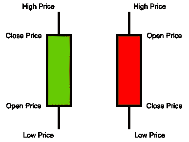

# 如何阅读蜡烛图

> 原文：<https://towardsdatascience.com/how-to-read-a-candlestick-chart-5b6f60d6c3ea?source=collection_archive---------22----------------------->

## 学习如何阅读比特币图表

unsplash.com上 [Austin Distel](https://unsplash.com/@austindistel) 的照片

蜡烛图可能是交易时最常用的图表之一，用于分析决策洞察力。通常交易者更喜欢蜡烛图，而不是其他形式，如条形图，因为前者提供了一个更好更清晰的时间窗口内的价格变化的视觉感知。

由于加密货币和股票交易越来越受欢迎，蜡烛图几乎随处可见。在这篇文章中，我们将探讨蜡烛图的关键组成部分，以及它们的含义。此外，我们还将讨论如何阅读这些图表，以及如何利用这些信息为自己谋利。

## 什么是蜡烛图？

蜡烛图通常用于表示货币、证券和衍生品的价格变动。对这些图表的分析可以帮助交易者揭示交易模式，通过分析这些模式可以做出决策。

蜡烛图有四个数据点。**最高价和最低价**描绘指定时间范围内的最高价和最低价。**开盘价和收盘价**分别表示第一个和最后一个价格。

烛台的元素

现在上图的宽框叫做**主体**，它代表开盘价和收盘价之间的**价格** **区间**。如果后者高于前者开盘价，则主体为空(左边烛台)。如果开盘价高于收盘价，正文被填充。细线代表价格的高低，称为上下**阴影。**你会在网上看到一个影子，通常也被称为**灯芯**。

在大多数交易工具中，使用着色更为常见。因此，我们用绿色(或蓝色)来表示收盘价高于开盘价，而不是用实心或空心的物体来表示价格的运动和方向。另一方面，我们通常用红色来表示资产价格在指定的时间窗口内下跌。

彩色烛台

## 如何阅读蜡烛图？

尽管前面的图展示了具有均匀长度的主体和阴影的烛台，但通常情况下并非如此。这些组成部分的长度表示特定的信息，可以帮助读者识别模式，并将其作为进入或退出市场的指标。

**短身体对长身体**

正如我们已经指出的，烛台的主体说明了收盘价和开盘价之间的价格范围。

绿色(或空的)烛台越长，收盘价和开盘价之间的差异就越大。从本质上说，这表明存在强大的购买压力，价格大幅上涨。同样，一个长的红色(或填充的)烛台主体表明有抛售压力。车身越长，价格下降幅度越大。

长烛台和短烛台

**短阴影对长阴影**

像烛台主体一样，阴影的长度也可以根据资产在指定时间框架内的完整价格范围而变化。回想一下，上下阴影分别表示货币的最高价和最低价。

影子的长度表明最高价或最低价与开盘价或收盘价之间的差异有多大。准确地说，**头**(上影)的长度被定义为交易时段的最高价与开盘价和收盘价的最大值之差(取决于主体的颜色)。同样，**尾**(下影线)是最低价和最低收盘价与开盘价之差。

## 结论

在这篇文章中，我们探讨了蜡烛图的组成部分，以及如何阅读和分析它，以推断价格运动和模式的见解，可以利用。

如果你将资金投资于股票和加密货币，了解如何阅读烛台非常重要，因为这将有助于你在交易时做出更好的决定。烛台可能是最能提供信息的图表之一，你可以用它来做决策。

一根蜡烛线有四个不同的数据点:最高价和最低价以及收盘价和开盘价。此外，还有一些组件可以帮助我们获取有用的信息。这些是图表的主体和阴影。通过观察单个烛台，人们可以推断出感兴趣的资产的方向和价格范围。

***来自《走向数据科学》编辑的提示:*** *虽然我们允许独立作者根据我们的* [*规则和指南*](/questions-96667b06af5) *发表文章，但我们并不认可每个作者的贡献。你不应该在没有寻求专业建议的情况下依赖一个作者的作品。详见我们的* [*读者术语*](/readers-terms-b5d780a700a4) *。*