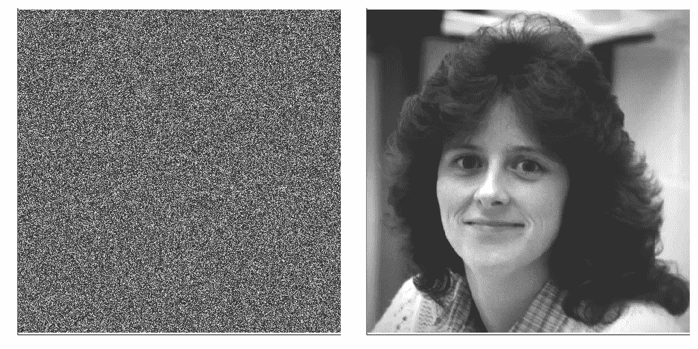

# 如果只看到几个像素，如何重建图像

> 原文：<https://towardsdatascience.com/how-to-reconstruct-an-image-if-you-see-only-a-few-pixels-e3899d038bf9?source=collection_archive---------31----------------------->

## [实践教程](https://towardsdatascience.com/tagged/hands-on-tutorials)

## 压缩传感快速介绍

所有可能的 2 乘 2 图像的集合，使用单个位对颜色进行编码。图片由作者提供。

图像空间是巨大的，难以置信的巨大，却又如此之小。想一想。通过考虑一个 8 乘 8 黑白像素的网格，您可以创建 18 446 744 073 709 551 616 个不同的图像。然而，在这 18 万亿张图片中，很少对人类有意义。大多数图像基本上都像二维码。那些对人类有意义的属于我们可以称之为*自然图像*的集合。它们代表 8x8 像素图像空间的一小部分。如果我们现在考虑百万像素的图像，自然图像覆盖的部分会变得更小，几乎无穷小，但它包含了你能想到的每一张图像。那么是什么让这些自然图像如此特别呢？你如何利用这种根本的不同来获得优势呢？

## 光谱空间来了

考虑下面的两张图片。两者都是 512 乘 512 像素。如果要计算像素值的直方图，他们会意识到这些分布是相同的。他们确实是。左图和右图一样，像素随机打乱。然而，它们之间有一个根本的区别。一张看起来像旧电视显示器上的静态噪音，而另一张是人脸。

左图:随机图像。右图:深色头发女性的经典测试图像。两个图像都属于 512 乘 512 图像的空间。图片由作者提供。

为了理解这些图像之间的根本区别，我们需要放弃像素空间，进入*频域的领域。*在数学上，傅立叶变换是从图像的像素表示到其表示为二维振荡的正弦和余弦之和的线性映射。我们现在不是用每个像素的值来描述图像，而是用每个二维正弦和余弦的振幅来描述图像。

这两幅图像在傅立叶空间中的表示如下所示。对数标度用于显示傅立叶系数的大小。这两幅图像之间的差异现在很明显。一个比另一个有更多的非零傅立叶系数。在数学术语中，我们说自然图像在傅立叶基中是稀疏的。这种稀疏性正是自然图像与随机图像的区别。因此，让我们利用这一差异为我们带来优势！

两幅图像的傅立叶变换的幅度。使用对数标度。图片由作者提供。

## 从少量像素中重建图像，这是一个非常不确定的问题

实际上只记录了 10%的像素。图片由作者提供。

考虑以下情况。由于某种未知的原因，你相机的大部分感光元件都有缺陷。将你刚刚拍摄的妻子(或母亲或朋友)的照片传输到你的电脑上后，照片看起来就像左图所示。你有可能恢复图像吗？

我们将假设您准确地知道哪些光电传感器在工作。用 **x** ∊ ℝⁿ表示未知图像(其中 n 是像素的总数，我们假设它被表示为一个向量),用 **y** ∊ ℝᵐ表示传感器记录的非零像素强度，我们可以写出

这里， **C** 是 m× n 稀疏测量矩阵。对应于有缺陷的光电传感器的所有条目都是零，并且只有 m 个非零条目与工作的条目相关联。因此，我们的目标是推断原始图像 **x** 给出了什么，我们只观察了它的几个像素。

从数学上讲，这是一个严重欠定的问题。我们的未知数比方程式多得多。这个问题有无数种解决方法。那么问题就归结为，在这个无限集合中，哪一个解是我们要寻找的？解决这种问题的自然方法是考虑具有最小ℓ₂范数的解。这可以形式化为以下优化问题

其解决方案简单地由下式给出

矩阵 **C** 对应单像素测量，其行从 n × n 单位矩阵中提取。在这种情况下，解决优化问题不会有很大帮助，因为它只会返回损坏的图像(右边的矩阵乘积减少到 **C** ᵀ).显然，那不行。那么，我们能做得比这更好吗？

## 利用光谱空间的稀疏性

当讨论自然图像的区别特征时，我们已经看到它们在傅立叶空间中是稀疏的，所以让我们利用这一点。由**ψ**表示从傅立叶空间到像素空间的 n × n 矩阵映射，我们的测量方程变成

其中 **s** 是 **x** 的傅里叶变换(即**x**=**ψs**)。这仍然是一个很大程度上未确定的问题，但我们现在有了更多关于我们正在寻找的解决方案的信息。我们知道它需要稀疏。引入 **s** 的ℓ₀伪范数(即其非零元素的数量)，我们可以将下面的优化问题公式化

不幸的是，这是一个很难解决的组合问题。为了找到解决方案，需要测试所有可能的组合。幸运的是，[坎蒂斯*等人*。已经在他们 2006 年的开创性工作中表明，在合理的假设下，上面问题的解决方案可以通过解决下面更简单的问题来获得(具有高概率)](https://arxiv.org/abs/math/0503066)

这里，ℓ₁范数是向量 **s** 的绝对值之和。现在众所周知，除了使这个优化问题凸，ℓ₁范数的使用往往有利于稀疏解。虽然这个问题是凸的，但在标准计算机上解决它仍然很有挑战性。在其余部分，我们将使用一个稍微宽松的版本，由

其中，λ是用户定义的参数，用于控制满足约束条件和所需的解稀疏度之间的权衡。这个优化问题被称为*基追踪去噪*。使用近似算子，可以非常快速地解决这个问题。下面是在 Julia 中使用[structured optimization . JL](https://github.com/kul-forbes/StructuredOptimization.jl)的实现。

此外，我们可以利用这样一个事实，即对于频谱变换，矩阵矢量积**ψs**可以在 O(n log n)运算中计算，而不是使用快速傅立叶变换算法的 O(n)运算。

尽管到目前为止我们假设**ψ**是傅立叶变换，但在这段代码中，我们考虑了*余弦变换*，这是一种更有效的图像变换。我们现在已经配备了我们需要的一切，所以让我们回到我们最初的问题。下图比较了地面真实图像与其ℓ₁重建图像。

左:地面真实图像。右图:使用压缩感知仅使用 10%的像素重建的图像。图片由作者提供。

即使你的相机只有 10%的光电传感器正常工作，在*压缩感知*的框架内制定这个图像恢复问题，使我们能够恢复你实际拍摄的原始图像的相当准确的估计！显然，它仍然有点粗糙，但是，考虑到图像空间的浩瀚和我们问题的无数解决方案，你不得不承认它仍然是相当了不起的！

# 结论

压缩检测彻底改变了信号处理领域。如果你事先知道你正在处理的信号在给定的基础上是稀疏的，压缩感知使得从比奈奎斯特-香农采样定理所建议的少得多的样本中恢复它成为可能。此外，它允许您在采集阶段直接大规模压缩数据，从而减少所需的存储量。它还催生了令人惊讶的新技术，如莱斯大学开发的[单像素相机](https://www.ams.org/publicoutreach/math-history/hap7-pixel.pdf)或医学领域磁共振成像的新处理技术。我不怀疑，你也不应该怀疑，在接下来的几年里我们会看到大量的新应用。

压缩感知是一个比这篇介绍性文章所能让你想到的更深入的数学领域。有很多内容我们没有涉及，例如

*   你实际需要的最小测量数是多少？
*   有些测量值比其他测量值更能提供信息吗？
*   给定基础**ψ**，我该如何选择这些测量值？
*   有没有更适合图片的其他规范？

回答这些问题可能需要更多的数学知识，而这些知识在《走向数据科学》杂志上是无法合理呈现的。如果你想知道更多，我强烈建议你阅读我在这篇文章末尾链接的原始论文。你还可以查看由 [Gabriel Peyré](https://twitter.com/gabrielpeyre) 撰写的精彩的[数字之旅](http://www.numerical-tours.com/)网站或者由 Brunton & Kutz ( [*数据驱动的科学与工程*](http://www.databookuw.com/) )以及相关的 YouTube 频道([此处](https://www.youtube.com/c/Eigensteve/videos)和[此处](https://www.youtube.com/channel/UCoUOaSVYkTV6W4uLvxvgiFA/videos))。

> *想要阅读更多此类内容？*查看我关于[低秩结构和数据驱动建模](https://loiseau-jc.medium.com/list/lowrank-structure-and-datadriven-modeling-8f39635a90ea)的其他文章，或者只是我的[机器学习基础](https://loiseau-jc.medium.com/list/machine-learning-basics-0baf10d8f8b5)！

 [## 像素并非生而平等

### 利用低秩结构找到图像中最重要的像素。

towardsdatascience.com](/pixels-are-not-created-equal-b3ae4b36ffbc)