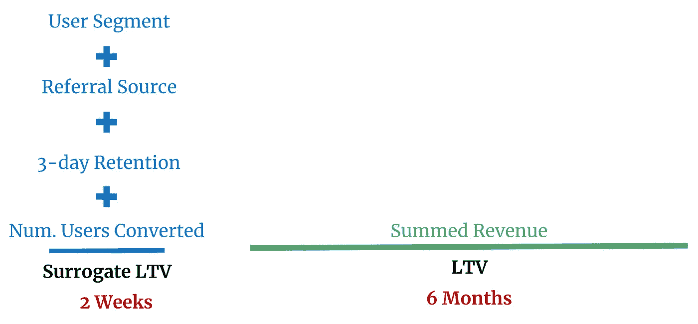
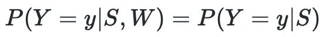
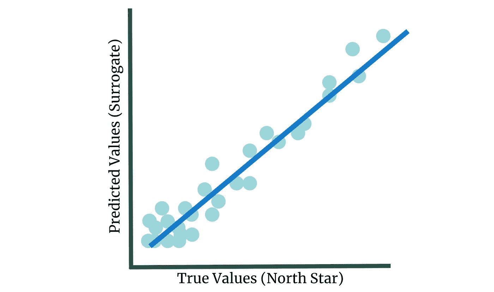
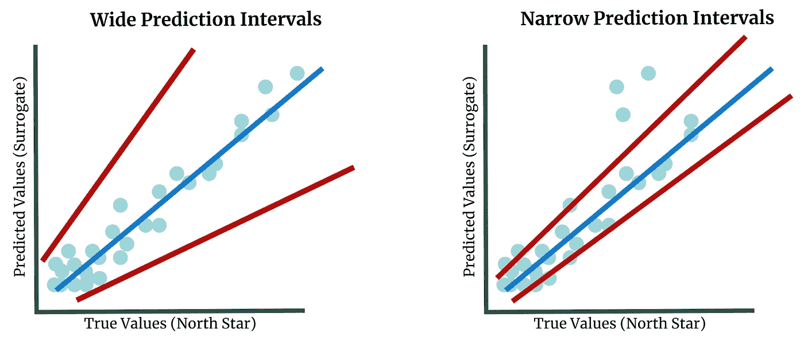
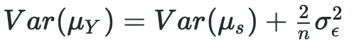
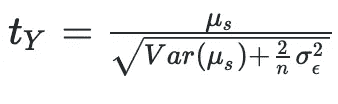

# 如何使用代理度量来减少测试持续时间

> 原文：<https://towardsdatascience.com/how-to-reduce-a-b-testing-duration-using-surrogate-metrics-3631c6295039?source=collection_archive---------13----------------------->

## LinkedIn 开发的一种近似长期指标的方法

当运行 A/B 测试时，我们经常试图改进长期指标。然而，要正确测量长期指标的影响，需要长时间的实验。

为了解决这个问题，LinkedIn 的研究人员发表了一篇 [2019 论文](https://arxiv.org/pdf/2106.01421v1.pdf)，概述了一种使用短期协变量的预测来取代长期指标的方法。

预测方法留给用户，但是本文概述了确保统计有效性的要求。相对于本系列中涉及的其他方法，替代指标是相当劳动密集型的，因为您必须开发一个健壮的预测模型。也就是说，努力工作是有回报的——代理度量是使用长期度量运行 A/B 测试的最健壮的选项之一。

它是这样工作的…

## 技术 TLDR

1.  **定义你的北极星度量标准。**北极星指标定义了实验的成功/失败。
2.  **通过预测我们的北极星来开发一个替代指标。**我们预测的北极星的特征必须在我们的实验时间范围内可以观察到。
3.  在我们的实验中使用我们的替代指标。请注意，在计算统计显著性时，我们必须调整方差，以说明模型中的预测误差。

# 但是，到底是怎么回事呢？

让我们稍微慢下来，试着理解代理指标实际上是如何工作的。

## 我们什么时候应该使用替代指标？

当我们的北极星度量是需要很长时间来测量的东西时，替代度量是非常有用的。例如，让我们看看终身价值(LTV)，这是我们期望从用户一生中获得的总收入。

现在，一些企业的用户生命周期非常短，但在大多数情况下，用户的生命周期是一个非常长的实验持续时间。因此，我们转向替代指标。

## 如何计算替代指标？

如上所述，替代度量是使用在我们的实验中观察到的预测器对北极星度量的预测。

图 1:预测的替代指标和 LTV 总和之间时间需求差异的图示。图片作者。

如图 1 所示，通过简单地使用左边的特征(蓝色)，我们可以预测 LTV 的近似值。预测方法取决于创建者，但是与大多数基本预测不同，小的预测间隔非常有用。

嗯，在进行实验时，我们希望使用我们的度量方差来确定“可接受”的值范围。如果我们观察到的治疗超出了这个范围，我们拒绝零假设，并得出结论，我们的治疗有统计学意义的影响。

我们的预测误差越大，我们的“可接受”范围就越大，从而导致低功效测试。简而言之，预测区间中的较小变化增加了我们检测统计显著变化的能力。

**因此，在实现替代指标时，尽量使用预测方差置信区间低的特性集和算法。**

# 您应该如何创建代理指标？

简而言之，有代理指标，但是要讨论模型的需求以及一些最佳实践。

为了有一个静态“正确”的替代度量，该度量必须是确定北极星度量所需的唯一信息。换句话说，在我们的模型中不能有可以提高拟合度的缺失信息。

这一要求被称为普伦蒂斯标准，其数学定义如下:

图 2: Prentice 标准公式。图片作者。

这里， *Y* 是我们的预测值， *y* 是真实值。左边的概率代表我们对 y 的预测值是正确的可能性，取决于我们的替代指标 S*S*和处理 W 。右边的概率代表同样的情况，但排除了我们对治疗的条件。

所以如果这个等式成立， *y* 与用户是在治疗还是在控制无关。如果是这种情况，代理度量是预测 *y* 唯一需要的东西。

在实践中，几乎不可能达到这个标准，然而，我们越接近平等，统计结果就越有效。

## 挑选指标的 3 个技巧

除了 Prentice 标准之外，还有其他三个关键概念可以产生有效的替代指标:

首先，很好地预测代理指标很重要。LinkedIn 的研究人员引用 0.69 的 R 值为有效，但好的预测的定义取决于你的用例。

图 3:有效预测的图示。图片作者。

第二，如上所述，精确的替代指标比不精确的更有效。因此，我们不仅关心高精度，还关心我们的估计有多精确。精确度可以通过我们预测区间的宽度来证明——越小越好。

图 4:宽预测区间与窄预测区间的对比图。图片作者。

第三，我们的估计最好是可以解释的。实验是用来为商业决策提供信息的，所以如果我们不能理解某些东西为什么会起作用，就很难做出那个决定，也很难形成相关的想法。

如果你能够大致满足 Prentice 标准，并遵循以上三个提示，你应该能够开发一个有效的替代指标。

## 改善结果的调整

现在我们知道了代理度量模型的需求，让我们理解如何使用这个度量。LinkedIn 的研究人员建议进行两项调整。

**第一次调整增加了我们统计显著性计算中使用的方差，以说明预测误差引起的方差:**

图 5:使用替代度量标准的北极星调整方差公式。图片作者。

在计算统计显著性时，这种调整后的方差会发挥作用。下面，我们使用 t 统计公式中的校正方差:

图 6:使用代理度量的北极星度量的 t 统计公式。图片作者。

在图 6 中，分子是我们的替代指标的平均提升，即我们的治疗和对照中的替代指标之间的差异。分母是调整后方差的平方根。*Var(μs)*是平均值的方差，*σe*是我们预测中误差的方差。注意下划线(_)表示下标。

请注意，如果我们使用的是完美的替代指标预测，即没有错误，则该等式简化为 t 统计公式。

第二个调整是可选的，但是强烈推荐。在上面的调整中，我们通过增加度量的方差极大地增加了我们的“接受”范围。**因此，为了获得统计优势并消除这种差异，建议您采用一种差异缩减技术。**

方差减少有多种形式，但本文引用的方法被称为 [CUPED](/how-to-double-a-b-testing-speed-with-cuped-f80460825a90) 。在一条线上，CUPED 使用实验前数据来解释数据中的自然变化并消除它，从而减少我们的方差。

## LinkedIn 案例研究

LinkedIn 在预测一项功能是否有助于人们找到工作时也面临着类似的问题——工作渠道可能会持续数月。他们实现了一个替代指标，利用应用程序数据来预测用户是否会获得工作。预测值和真实值的相关系数为 0.69。

在校正方差之前，他们发现 203 次实验中有 30 次具有统计学意义。校正方差后，只有 2 个是 stat。签名。然而，使用 CUPED 方差减少技术，他们能够找到 10 个统计值。签名。实验。

# 实施说明

*   作者没有研究实验的长度如何提高预测的准确性/精确度。你会期望更多的数据带来更好的预测，但这些改进高度依赖于手头的主题。
*   CUPED 对于该方法之外的方差减少是有效的，并且被 Google、网飞和 Air BnB 引用。
*   这种方法的有效性取决于你能否预测北极星度量。如果你能开发出一个准确而精确的模型，这种方法会很有效。如果没有，那就无效了。
*   作者指出，为不同的用户群和平台开发替代指标预测通常很有帮助。因为我们预测中的方差是特别有害的，所以有时最简单的方法是将我们的数据分组，然后分别查看

*感谢阅读！我将再写 42 篇文章，将“学术”研究引入 DS 行业。查看我对开发替代指标的链接/想法的评论。*