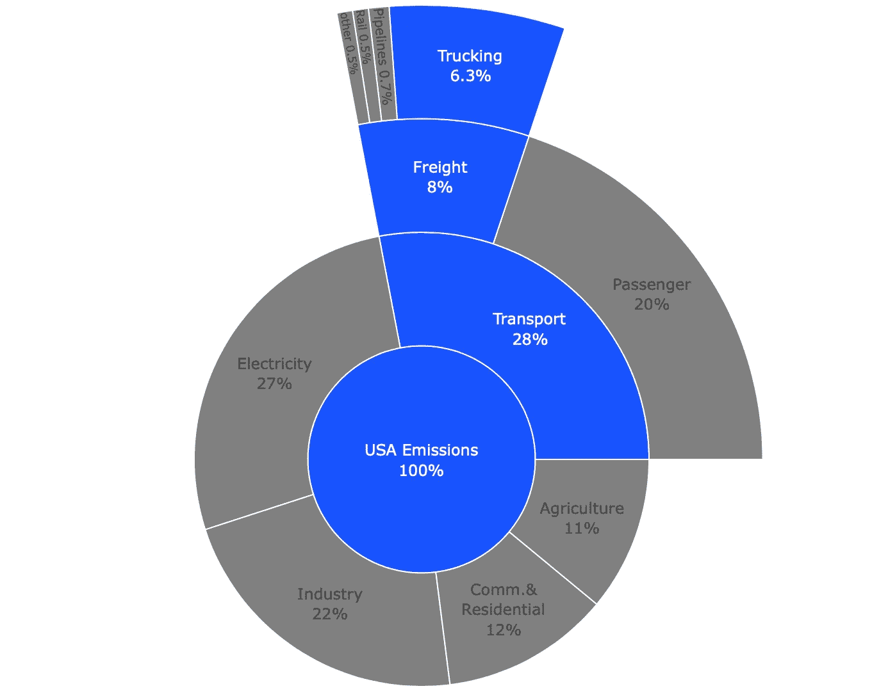
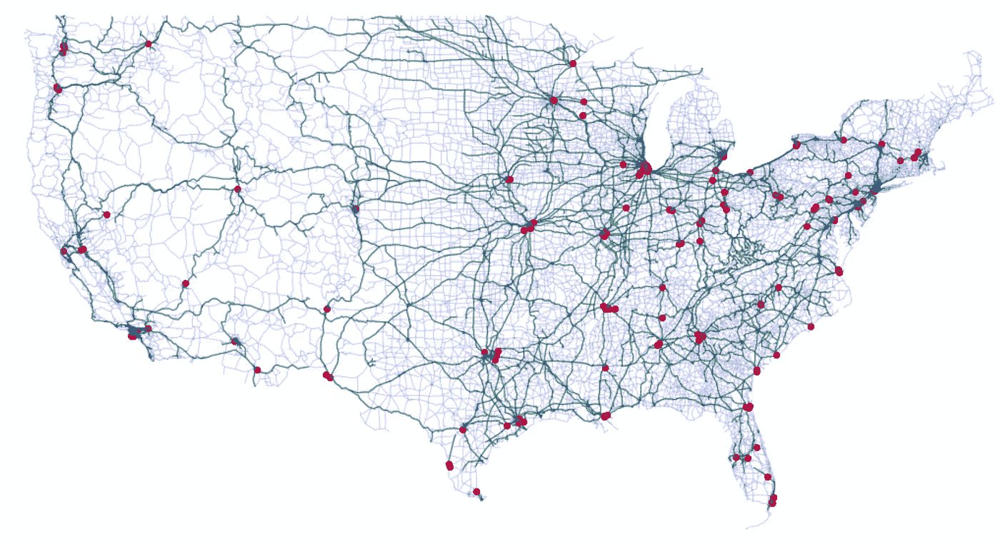
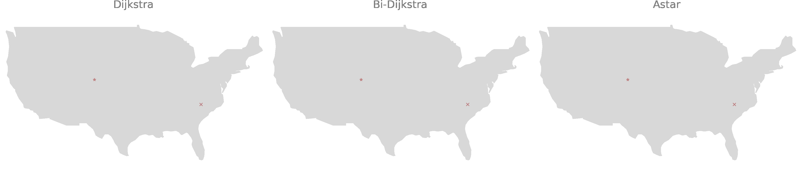
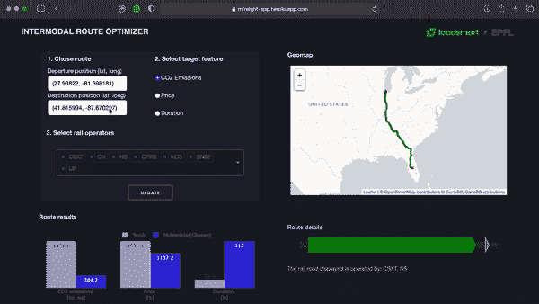

# 如何减少货运对环境的影响

> 原文：<https://towardsdatascience.com/how-to-reduce-the-environmental-impact-of-freight-692f505a681b?source=collection_archive---------24----------------------->

## 构建一个应用程序，通过多式联运网络提供二氧化碳优化路线

维克多·哈纳切克在 [picjumbo](https://picjumbo.com) 上拍摄的照片

# 背景

如今，高效地运输货物和原材料对任何公司来说都是必须的。这种依赖伴随着一个重大挑战:货运约占美国温室气体排放总量的 8%。

美国排放的温室气体。来自 EPA 和 BTS 的数据[1，2]。作者图。

那么，托运人如何减少货物的碳足迹呢？权衡会是什么？

第一个问题的答案相对简单:*通过使用碳密集度较低的运输方式*来优化运输。第二个问题的答案更加微妙，但总的来说，*使用更环保的物流解决方案将花费更少的时间到达目的地*。

为了演示这些答案，我构建了一个简化的模型，该模型根据出发地点、目的地位置和一些要优化的参数提供了一个优化的多式联运(铁路和公路)路线。在这篇文章中，我将带你了解这个项目，因为我希望能激励你去做一些重要的事情。

# 用 Dash 构建一个简化的多模态网络模拟器

我喜欢首先构建一个简化版本来开始我的项目。这有助于:

*   快速行动，不要停留在细节上。
*   记录在构建最终模型时需要特别注意的细节。
*   获得瞬间的满足。
*   与社区共享项目的非机密版本。

对于这个项目的简化版本，我用 Python 建立了一个仪表板应用程序，用户可以在其中交互式地探索一些多式联运优化路线，并了解货车运输的权衡。

## 数据

生成的多式联运网络。绿线是铁路段，蓝线是高速公路，红点是联运终点站。作者图。

任何使用过道路网络的人都知道这些文件在整个大陆范围内会变得有多大。因为目标是使仪表板尽可能简单，所以道路网络已经近似为公路网络。高速公路网和铁路网都可以在 BTS 数据库中找到[3]。这两个数据集已经使用 OSMnx 软件包[4]进行了清理和简化。这种简化是至关重要的，因为图相对较重，并且它包含许多带有两条可以收缩的边的节点。

## 优化参数

为了理解绿色运输的权衡，用户可以选择要优化的特性:CO2 排放、成本或持续时间。

二氧化碳数据基于 USLCI 数据库[5]，持续时间根据轨道速度限制计算，成本通过汇总历史数据计算。

## 路由算法

为了找到给定参数的最佳路径，已经测试了三种简单的路由算法:Dijkstra、双向 Dijkstra 和 Astar (A*)。如果你想使用 Python，使用更高级的路径搜索算法，比如收缩层次，不是很有用，因为这种语言相对较慢。下面的 gif 展示了这些算法如何迭代寻找最优路径。由于是目标导向的，它将通过最少的迭代运行。

网络探索，寻找从夏洛特到丹佛的污染最小的路径。作者 GIF。

然而，对于每个新节点，Astar 都必须计算启发式规则，这需要时间。此外，由于大多数查询的路线将是中长途的，所以在图搜索期间经常到达图的边界，从而限制了无目标定向方法的运行时间。由于这些原因，对于这个特定的图，平均来说，最快的解决方案是双向 Dijkstra 搜索。

## 简单化

由于缺乏开源可用数据，必须进行简化和抽象:

*   **成本**在这个项目的简化版本中具有有限的准确性，因为它们不依赖于时间，并且粒度较低。
*   **铁路路线组合**可能不相关，因为假设所有组合都是可行的。事实上，铁路公司并不与所有同行合作:它们有特定的合作关系。因此，该模型提供的一些路线将不适用于现实情况，但它给出了最终模型将如何工作的良好感觉。

## Dash 应用

为了让应用程序具有交互性，我使用了 Dash。Plotly 社区开发的一个方便易用的仪表板[6]。构建应用程序时最大的挑战是让它尽可能快地做出响应，以提供流畅的用户体验。因为这个应用程序是基于一个重图的，所以运行时的瓶颈在于加载图。下面是我用来减少这个瓶颈的两个简单方法:

1.  **避免为每个新请求加载整个图**:不是为每个请求重新加载或重建图，而是根据选择的 rail 操作符删除边。然后在查询结束时将它们添加回去。
2.  **减少图形的内存使用:**将图形简化为一个无向图，并改变变量 dtypes(即浮点到整数)

应用的部署是用 Heroku [7]完成的。你可以在这个[链接](https://mfreight-app.herokuapp.com/)上试试。请耐心等待，即使进行了上述优化，运行时间也不是一流的😅

Dash 应用。作者 GIF。

## 结果

在大多数情况下，多式联运排放的二氧化碳少得多，成本也低，但耗时比卡车运输长。因此，运输时间不太紧张的公司可以使用多式联运解决方案，以支付更少的费用，而且更加环保。

# 最终模型

在 Loadsmart，我们希望成为货运市场的第一名。我们希望为托运人提供优化和定制的解决方案，以满足他们的物流需求。为此，这个项目的*最终模型*将提出具有**实时**定价和调度的优化多式联运，通过使供应链更加绿色来帮助托运人减少运营中的碳排放。

最终模型将基于 CSA 算法[8]的修改版本，使用多标准 Pareto 集优化和模糊逻辑排序。如果社区对此感兴趣，我可以写一篇关于这个模型的文章。

# 感谢

除了成本数据，这个项目的简化版本完全是从开源数据、模型、服务和参考资料中构建的。

> 感谢整个社区分享了这么多。让我们用这些知识来为更大的目标制造工具。

你可以看看这个 [Github repo](https://github.com/Labulitiolle/Multimodal_freight_USA) 上的代码。我非常乐意收到任何反馈/问题。

## 笔记

[1]美国环境保护署。“*美国温室气体排放和吸收汇清单*”(2018)。[链接](https://www.epa.gov/ghgemissions/global-greenhouse-gas-emissions-data)

[2]运输统计局。特定货运模式的能源消耗(2018 年)。[链接](https://www.bts.gov/energy-consumption-select-freight-transportation-modes)

[3]运输统计局|国家运输地图集数据库。[链接](https://geo.dot.gov/server/rest/services/NTAD)

[4] Boeing，g .(2017)*OS mnx:获取、构建、分析和可视化复杂街道网络的新方法*。[链接](https://github.com/gboeing/osmnx)

[5]美国生命周期清单数据库(USLCI)。[链接](https://www.nrel.gov/lci/)

[6]阴谋破折号。[链接](https://dash.plotly.com)

[7]赫罗库。[链接](https://www.heroku.com)

[8] Julian Dibbelt 等人(2013) " *有趣的简单快速的公交路线。*[链接](https://i11www.iti.kit.edu/extra/publications/dpsw-isftr-13.pdf)