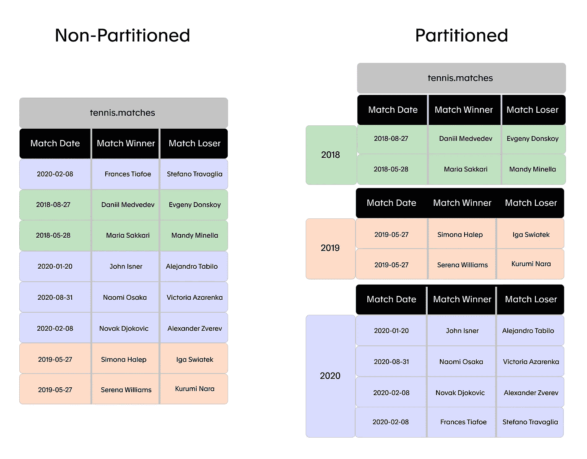
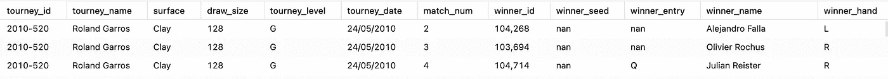
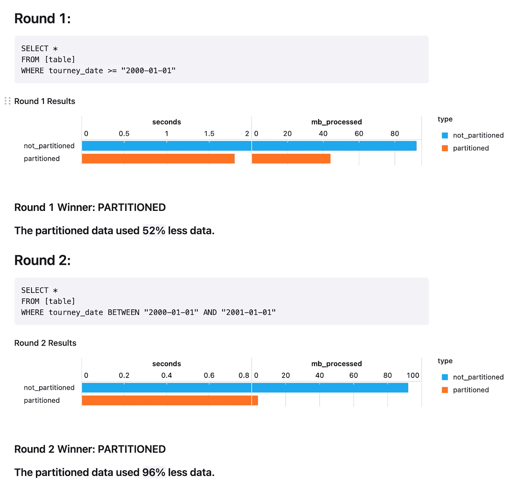
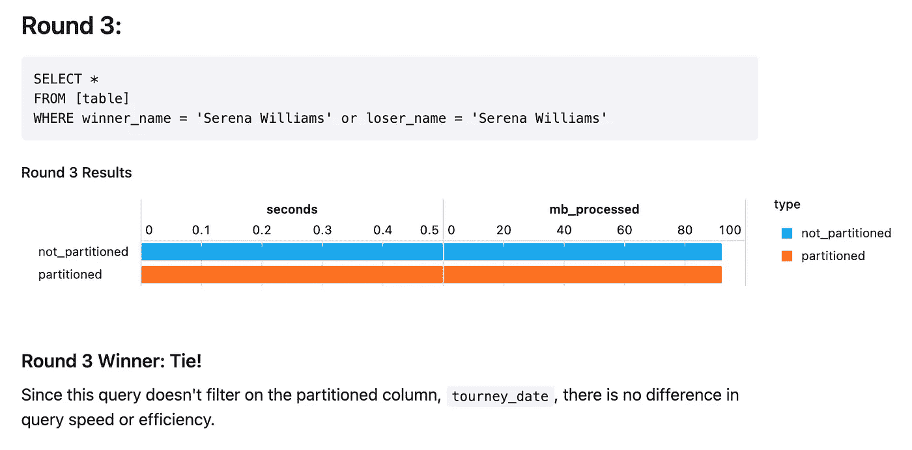
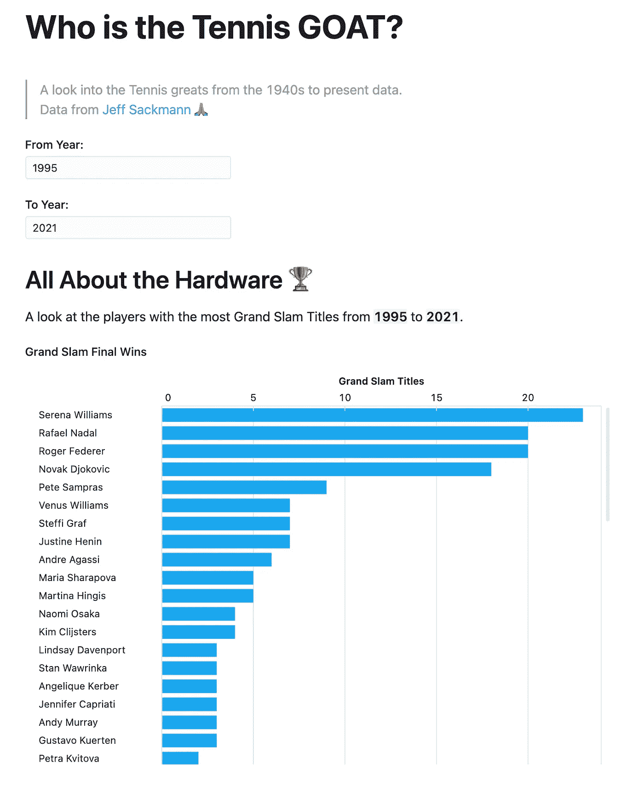

# 如何使用 BigQuery 分区表降低分析成本

> 原文：<https://towardsdatascience.com/how-to-reduce-your-analytics-costs-with-bigquery-partitioned-tables-9298c274bf7d?source=collection_archive---------31----------------------->

## 一个有“大”结果的简单解决方案。

## 大查询困境

BigQuery 是当今市场上最受欢迎的数据仓库之一，但是如果你不小心的话，你可以很容易地积累一个令人虚弱的账单。如果 BigQuery 支持您的分析堆栈，那么分区表可能是降低成本的一个显而易见的解决方案。

# 什么是分区表？

分区表是通常按日期划分成更小的表的表。

按比赛年份划分的网球数据示例。(图片由作者提供)

分区表并不是 BigQuery 所独有的。它们最常见的是那些带有长后缀的恶名昭彰的表(如 sessions_2017_01_01，sessions_2017_01_02)。对于负责维护这些独立表的数据工程师和试图查询它们的分析师来说，这种划分总是令人痛苦的。

但是因为 BigQuery 在幕后进行分区，所以它实际上变得更加整洁，并且是工程师和分析师都想要的解决方案。

# 分区方式:

在 BigQuery 中，有 3 种方法可以对表进行分区:

## 1.按摄入时间

当新数据到达时，表将被自动分区。如果您每天都将前一天的数据转储到数据库中，那么您可能会使用这种方法。

## 2.按日期/时间列

表将根据指定的日期/时间列进行分区。如果摄入日期不像另一个日期/时间列(如首次购买日期)那样相关，您可以使用此选项。

## 3.按整数列

这可能是最不常用的方法，它允许您基于一个整数列(例如客户号)创建一个分区。

*注意:对于分类列上的分区(例如客户细分)，请查看聚集表。*

# 为什么使用它们？

使用分区表有两个主要好处:

## 1.他们会解决你的“阻塞表”问题。

数据工程师必须解决的首要挑战之一是如何在不阻止其他用户同时提取数据的情况下更新表。分区表是实现这一点的一种方式。如果每天都向表中插入数据，这些数据将作为自己的分区添加，而不会阻止人们访问其他分区。得分。

## 2.他们效率更高(翻译:更便宜)。

BigQuery 对查询返回的数据收费。也就是说，你的查询效率越高，你支付的费用就越少。

如果你问我的话，这足以成为尝试分区表的理由。

为了证明分区表的效率到底有多高，我用[杰夫·萨克曼的网球数据](https://github.com/JeffSackmann/tennis_atp)进行了一些测试(谢谢杰夫🙏)，它拥有从 20 世纪 40 年代至今几乎所有 ATP 和 WTA 网球比赛的比赛统计数据。

数据预览

数据是 92.15 MB，有 373，436 行和 51 列。

我对一个非分区表(诗意地命名为 matches_not_partitioned)和一个按比赛日期年份分区的表(matches_partitioned)运行了一些查询。让我们看看他们做得如何…

你可以在这里看到完整的结果[。](https://count.co/n/fhSuLOsNUx9/?utm_source=medium)

这个测试是针对相对较小的数据进行的，但是您可以看到，随着数据集越来越大，节省越来越显著。就像我说的，没脑子。

# 如何充分利用它们:超越数据思考

有大量的文章深入探讨了如何在 BigQuery 中对表进行分区，所以我在这里不重复这些信息。

然而，这些教程中缺少了一点:您如何确保实现所有这些节省？

> **如果人们不编写利用分区表的查询，那么您绝对不会从分区表中获得任何好处。**

例如，如果我想获取 Serena William 的所有匹配，我会得到以下结果:

这意味着，为了真正实现分区表带来的节省，您需要(气喘吁吁地)与编写查询的人一起工作。实际上，这意味着两件事:

## 1.了解您的业务需求

在分区表的情况下，了解*人们如何使用数据是很重要的。如果数据工程团队决定基于客户获取日期进行分区，但是没有人使用它作为过滤器，那么这一切都是徒劳的，您每次都将查询整个表。*

花时间了解哪些分区会为业务增加最大价值。这可能不是你仅仅通过查看数据所期望的。

## 2.有办法“鼓励”高效的查询

一旦您有了有意义的分区表，您就只能祈祷人们编写的查询能够真正利用它们。在这里限制访问，将被允许查询数据的人限制在选定的、可信任的少数人，可能很有诱惑力。忍住这种冲动！

有了合适的工具，您仍然可以让用户访问数据，同时鼓励更高效的查询(无需对他们进行 SQL 培训)。

对于交互式 BI 工具，如 Count，这意味着利用用户控件和查询参数化。

在我根据划分的网球数据创建的这个交互式报告中，我在笔记本顶部添加了数据控件，鼓励最终用户查看更小的时间块。这些参数直接链接到生成的 SQL 查询，然后在数据库上运行，从而产生比我让它们自由处理数据更有效的查询。

具有链接到分区数据的内置筛选器的交互式报表。

这种防护栏方法仍然允许最终用户有足够的灵活性来获得他们需要的答案，而不会面临过高的查询成本。

您可以在此查看整个笔记本:

## 谁是网球山羊？

点击了解更多关于伯爵[的信息。](https://count.co/?utm_source=medium)

# 后续步骤

要开始对表进行分区(并节省一些钱)，我建议从最常用的表和查询开始。在这里，您可以找出用户在分析过程中对数据进行分区的常见方式，并相应地调整您的表分区。这可能是:

*   根据社交媒体或网站流量分析的摄取日期进行划分
*   按客户收购日期进行分组，用于群组分析
*   按邮政编码分区进行区域销售分析

至关重要的是，一旦这些新的分区表就位，就要抵制限制查询访问的冲动！对您现有的 BI 基础设施进行合理的控制，鼓励人们使用这些新的分区列进行查询，确保您的工作转化为实实在在的节约。

但这仅仅是开始。BigQuery 还有其他几个特性，可以帮助您减少账单和洞察时间。当数据工程与企业紧密合作，了解如何最好地存储和操作这些表以获得企业需要的答案时，这些机会就能得到最好的实现。

# 有用的链接

*   [big query——你需要知道的一切](https://medium.com/swlh/bigquery-almost-all-you-need-to-know-f239e6b52279) : Amulya Rattan Bhatia
*   [BigQuery 解释:存储概述](https://medium.com/google-cloud/bigquery-explained-storage-overview-70cac32251fa):Rajesh thal am
*   从我们的巨额账单中节省一些开支:马克·麦克拉肯
*   [分区表简介](https://cloud.google.com/bigquery/docs/partitioned-tables)