# 如何将您的 Power BI 型号尺寸缩小 90%！

> 原文：<https://towardsdatascience.com/how-to-reduce-your-power-bi-model-size-by-90-76d7c4377f2d?source=collection_archive---------0----------------------->

## 您有没有想过是什么让 Power BI 在性能方面如此快速和强大？学习关于数据模型优化和简化数据模型的一般规则的真实例子


[https://www . pexels . com/photo/aperture-blur-downtown-focus-339379/](https://www.pexels.com/photo/aperture-blur-downtown-focus-339379/)

*你有没有想过是什么让 Power BI 在性能方面如此快速和强大？如此强大，以至于它可以在一瞬间对数百万行进行复杂的计算。*

*在本文中，我们将深入挖掘 Power BI 的“内幕”,了解您的数据是如何被存储、压缩、查询以及最终返回到您的报告中的。一旦您完成阅读，我希望您能更好地理解后台发生的艰苦工作，并理解创建最佳数据模型以从 Power BI 引擎获得最大性能的重要性。*

## 首先看看引擎盖下——公式引擎和存储引擎

首先，我想让你们认识一下 VertiPaq 引擎，它不仅是 Power BI，还有 SSAS 表格和 Excel Power Pivot 背后的系统“大脑和肌肉”。说实话，VertiPaq 只是表格模型中存储引擎的一部分，除了 DirectQuery，我们将在下一篇文章中讨论。

当您发送查询以获取 Power BI 报告的数据时，会发生以下情况:

*   *公式引擎(FE)* 接受请求，处理它，生成查询计划，最后执行它
*   *存储引擎(SE)* 从表格模型中提取数据，以满足公式引擎生成的查询中发出的请求

为了检索请求的数据，存储引擎以两种不同的方式工作: *VertiPaq* 将数据的快照保存在内存中。该快照可以从原始数据源中不时刷新。

相反， *DirectQuery* 不存储任何数据。对于每个请求，它只是将查询直接转发给数据源。


[https://unsplash.com/photos/2EHRBs1gefY](https://unsplash.com/photos/2EHRBs1gefY)

表格模型中的数据通常存储为内存快照(VertiPaq)或 DirectQuery 模式。然而，也有可能实现一个混合的复合模型，它同时依赖于这两种体系结构。

## 公式引擎 Power BI 的“大脑”

正如我已经强调过的，Formula Engine 接受查询，并且由于它能够“理解”DAX(和 MDX，但这超出了本系列的范围)，它将 DAX“翻译”成一个特定的查询计划，该计划由需要执行以返回结果的物理操作组成。

这些物理操作可以是多个表之间的连接、筛选或聚合。知道公式引擎以单线程方式工作很重要，这意味着对存储引擎的请求总是按顺序发送。

## 存储引擎 Power BI 的“肌肉”

一旦公式引擎生成并执行了查询，*存储引擎*就会出现。它物理地遍历存储在表格模型(VertiPaq)中的数据，或者直接转到不同的数据源(例如 SQL Server，如果 DirectQuery 存储模式已经就绪)。

在为表指定存储引擎时，有三个选项可供选择:

*   ***导入模式*** —基于 VertiPaq。表数据作为快照存储在内存中。数据可以定期刷新
*   ***直接查询模式*** —在查询时从数据源中检索数据。在查询执行之前、期间和之后，数据都驻留在其原始源中
*   ***双模*** —前两个选项的组合。表中的数据被加载到内存中，但是在查询时也可以直接从源中检索

与不支持并行性的公式引擎相反，存储引擎可以异步工作。

## 认识 VertiPaq 存储引擎

由于我们之前已经绘制了一幅大图，让我更详细地解释 VertiPaq 在后台做了什么来提高我们的 Power BI 报告的性能。

当我们为 Power BI 表选择导入模式时，VertiPaq 会执行以下操作:

*   读取数据源，将数据转换为列结构，在每个列中编码和压缩数据
*   为每一列建立字典和索引
*   准备并建立关系
*   计算所有计算列和计算表并压缩它们

VertiPaq 的两个主要特征是:

1.  *VertiPaq 是一个柱状数据库*
2.  *VertiPaq 是一个内存数据库*

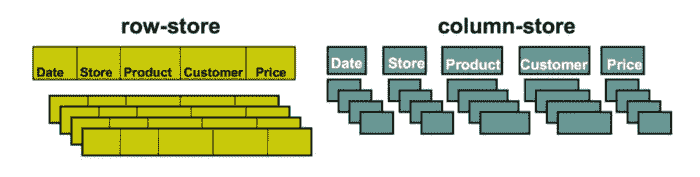

作者图片

如上图所示，列数据库存储和压缩数据的方式不同于传统的行存储数据库。列数据库针对垂直数据扫描进行了优化，这意味着每一列都以自己的方式构造，并且在物理上与其他列分离！

不深入分析行存储与列存储数据库之间的优缺点，因为这需要一个单独的系列文章，让我只指出几个关键的性能差异。

对于列数据库，单列访问既快速又有效。一旦计算开始涉及多个列，事情就会变得更加复杂，因为中间步骤的结果需要以某种方式临时存储。

简单地说，列数据库更消耗 CPU，而行存储数据库增加了 I/O，因为扫描了许多无用数据。

到目前为止，我们描绘了一幅架构的大图，它使 Power BI 作为一个终极 BI 工具充分发挥作用。现在，我们准备更深入地研究具体的架构解决方案，并利用这些知识充分利用我们的 Power BI 报告，方法是调整我们的数据模型，从底层引擎中提取最大价值。

## Power BI 中的 Inside VertiPaq 为成功而压缩！


[www . pexels . com/photo/crop-man-crushing-plastic-bottle-4498091/](http://www.pexels.com/photo/crop-man-crushing-plastic-bottle-4498091/)

您可能还记得，在本文的前一部分中，我们只简单介绍了 VertiPaq，这是一个强大的存储引擎，它“负责”您的大多数 Power BI 报告的超快的性能(无论您何时使用导入模式或复合模型)。

## 三，二，一…系好安全带！

VertiPaq 的一个关键特征是它是一个列数据库。我们了解到，列数据库存储针对垂直扫描优化的数据，这意味着每一列都有自己的结构，并且在物理上与其他列分离。

这一事实使得 VertiPaq 能够独立地对每一列应用不同类型的压缩，根据特定列中的值选择最佳的压缩算法。

压缩是通过对列中的值进行编码来实现的。但是，在我们深入研究编码技术的详细概述之前，请记住，这种架构并不仅仅与 Power BI 相关——在背景中是一个表格模型，它也在 SSAS 表格和 Excel Power Pivot 的“引擎盖”之下。

## 值编码

这是最理想的值编码类型，因为它专门处理整数，因此比处理文本值需要更少的内存。

这在现实中看起来如何？假设我们有一个包含每天电话数量的列，该列中的值从 4.000 到 5.000 不等。VertiPaq 要做的是找到这个范围内的最小值(4.000)作为起点，然后计算这个值与该列中所有其他值之间的差值，将这个差值存储为一个新值。

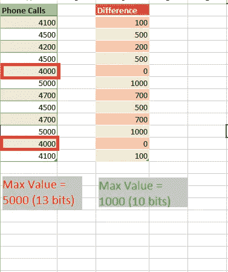

作者图片

乍一看，每个值 3 位可能看起来不像是显著的节省，但是将它乘以数百万甚至数十亿行，您将会发现节省了大量内存。

正如我已经强调的，值编码专门应用于整数数据类型列(货币数据类型也存储为整数)。

## 哈希编码(字典编码)

这可能是 VertiPaq 使用最多的压缩类型。使用散列编码，VertiPaq 在一列中创建一个不同值的字典，然后用字典中的索引值替换“真实”值。

下面是一个让事情更清楚的例子:

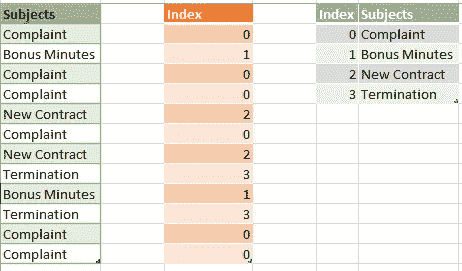

作者图片

正如您可能注意到的，VertiPaq 在 Subjects 列中标识了不同的值，通过为这些值分配索引构建了一个字典，最后将索引值存储为指向“真实”值的指针。我假设你知道整数值比文本需要更少的内存空间，所以这就是这种数据压缩背后的逻辑。

此外，由于能够为任何数据类型构建字典，VertiPaq 实际上是独立于数据类型的！

**这将我们带到另一个关键的接管:无论你的列是 text、bigint 还是 float 数据类型——从 VertiPaq 的角度来看都是一样的——它需要为这些列中的每一个创建一个字典，这意味着所有这些列都将提供相同的性能，在速度和分配的内存空间方面！**当然，假设这些列之间的字典大小没有大的差异。

因此，认为列的数据类型会影响它在数据模型中的大小是无稽之谈。相反，列中不同值的数量，即所谓的 ***、基数*** ，主要影响列内存消耗。

## RLE(游程编码)

第三种算法(RLE)创建一种映射表，包含重复值的范围，避免单独存储每个单个(重复)值。

同样，看一个例子将有助于更好地理解这个概念:

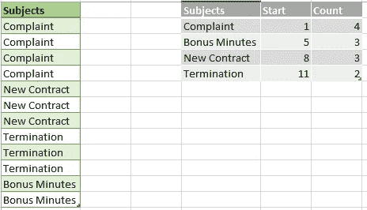

作者图片

在现实生活中，VertiPaq 不存储起始值，因为它可以通过对以前的计数值求和来快速计算下一个节点的起始位置。

乍看之下，RLE 算法非常强大，它高度依赖于列内的排序。如果数据是按照你在上面的例子中看到的方式存储的，RLE 将会执行得很好。但是，如果您的数据存储桶更小且轮换更频繁，那么 RLE 就不是最佳解决方案。

关于 RLE，还有一点需要记住:实际上，VertiPaq 并不像上图所示那样存储数据。首先，它执行哈希编码并创建主题字典，然后应用 RLE 算法，因此最终的逻辑，以最简单的方式，应该是这样的:

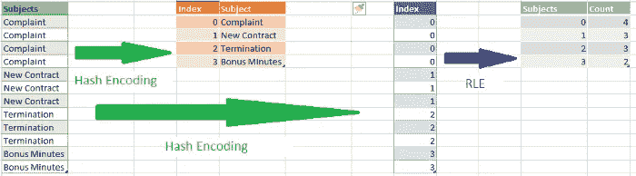

作者图片

因此，当 VertiPaq“认为”额外压缩数据有意义时(当数据以这种方式排序时，RLE 将实现更好的压缩)，RLE 发生在值或哈希编码之后。

## 重新编码注意事项

不管 VertiPaq 有多“聪明”,它也会基于不正确的假设做出一些糟糕的决定。在解释重新编码的工作原理之前，让我简单地重复一下特定列的数据压缩过程:

*   VertiPaq 从列中扫描行的样本
*   如果列数据类型不是整数，它将不再查找并使用哈希编码
*   如果该列是整数数据类型，则评估一些附加参数:如果样本中的数字线性增加，VertiPaq 假定它可能是主键，并选择值编码
*   如果列中的数字彼此相当接近(数字范围不是很宽，就像上面每天 4.000-5.000 个电话呼叫的例子)，VertiPaq 将使用值编码。相反，当值在该范围内大幅波动时(例如在 1.000 和 1.000.000 之间)，值编码没有意义，VertiPaq 将应用哈希算法

但是，有时 VertiPaq 会根据样本数据决定使用哪种算法，但随后会出现一些异常值，需要从头开始对列重新编码。

让我们使用前面的电话数量示例:VertiPaq 扫描样本并选择应用值编码。然后，在处理了 1000 万行之后，它突然发现了一个 500.000 的值(这可能是一个错误，或者其他什么)。现在，VertiPaq 重新评估这个选择，它可以决定使用散列算法对列重新编码。当然，就后处理所需的时间而言，这将影响整个过程。

最后，这里是 VertiPaq 在选择使用哪种算法时考虑的参数列表(按重要性排序):

*   列中不同值的数量(基数)
*   列中的数据分布-与包含频繁变化的值的列相比，包含许多重复值的列可以得到更好的压缩(可以应用 RLE)
*   表格中的行数
*   列数据类型-仅影响字典大小

## 将数据模型大小减少 90% —真实的故事！

在我们为理解 VertiPaq 存储引擎背后的架构以及它使用哪种类型的压缩来优化您的 Power BI 数据模型奠定了理论基础之后，现在正是动手实践并在实际案例中应用我们的知识的时候！

## 起点= 777 MB

我们的数据模型非常简单，但是内存耗尽。我们有一个事实表(factChat ),其中包含有关实时支持聊天的数据，还有一个维度表(dimProduct ),它与一个事实表相关。我们的事实表大约有 900 万行，这对 Power BI 来说不算什么，但是该表是按原样导入的，没有任何额外的优化或转换。

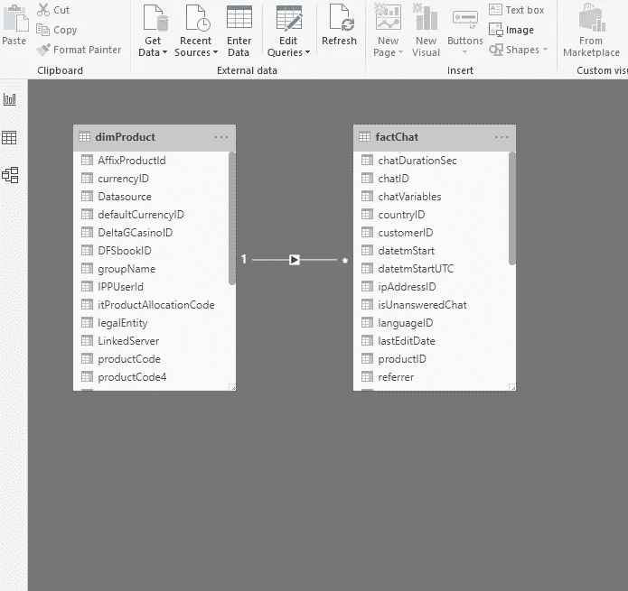

作者图片

现在，这个 pbix 文件消耗了 777 MB！！！你不能相信吗？看一看:

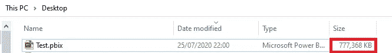

作者图片

只要记住这张图！当然，我不需要告诉你这个报告需要多少时间来加载或刷新，以及我们的计算如何由于文件大小而变慢。

## …更糟糕的是！

此外，不仅仅是 777 MBs 占用我们的内存，因为计算内存消耗时会考虑以下因素:

*   PBIX 文件
*   字典(你已经在[这篇文章](https://data-mozart.com/powerbi/inside-vertipaq-compress-for-success/)中了解了字典)
*   列层次结构
*   用户定义的层次结构
*   关系

现在，如果我打开任务管理器，转到“详细信息”选项卡并找到 msmdsrv.exe 进程，我会看到它消耗了超过 1 GB 的内存！

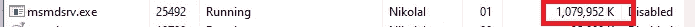

作者图片

哦，伙计，那真的很痛！而且我们连报道都没互动过！那么，让我们看看我们可以做些什么来优化我们的模型…

## 规则#1 —只导入那些您真正需要的列

第一条也是最重要的一条规则是: ***在您的数据模型中只保留那些您真正需要用于报告的列！***

也就是说，我真的需要 chatID 列(一个代理键)和 sourceID 列(一个来自源系统的主键)吗？这两个值都是唯一的，所以即使我需要计算聊天的总数，我也可以只使用其中一个。

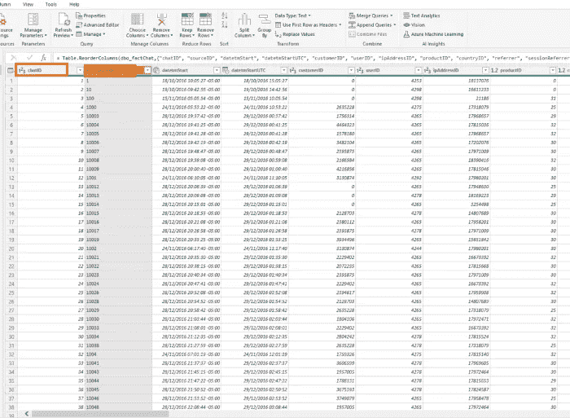

作者图片

让我检查一下文件现在的样子:


作者图片

通过删除一个不必要的列，我们节省了 100 多 MB！！！让我们在不深入研究的情况下进一步检查哪些内容可以删除(我保证，我们将在后面讨论这一点)。

我们真的需要聊天的原始开始时间和 UTC 时间吗，一个存储为日期/时间/时区类型，另一个存储为日期/时间，并且都要达到第二精度？？！！

让我去掉原来的开始时间列，只保留 UTC 值。


作者图片

又浪费了 100 MB 的空间！通过删除我们不需要的两列，我们将文件大小减少了 30%！

现在，这还没有考虑内存消耗的更多细节。现在让我们打开 [DAX Studio](https://daxstudio.org/) ，这是我最喜欢的一款解决电力 BI 报告问题的工具。正如我已经强调过几次的，如果你打算认真使用 Power BI，这个工具是必须的——而且它是完全免费的！

DAX Studio 中的一个功能是一个 [VertiPaq 分析器](https://www.sqlbi.com/tools/vertipaq-analyzer/)，这是一个非常有用的工具，由来自 sqlbi.com 的 Marco Russo 和 Alberto Ferrari 制作。当我用 DAX Studio 连接到我的 pbix 文件时，下面是与我的数据模型大小相关的数字:

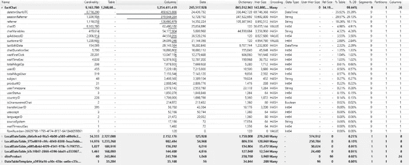

作者图片

我可以在这里看到我的数据模型中最昂贵的列，并决定我是否可以丢弃它们中的一些，或者我是否需要保留它们。

乍一看，我没有几个要删除的候选列— *sessionReferrer* 和 *referrer* 列具有很高的基数，因此不能进行优化压缩。此外，因为这些是文本列，需要使用哈希算法进行编码，所以可以看到它们的字典非常大！如果您仔细观察，您会注意到这两列几乎占了我的表大小的 40%!

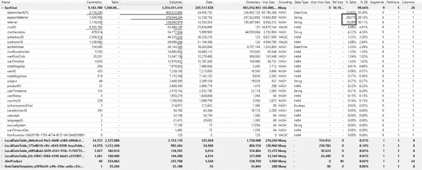

作者图片

在向我的报告用户询问他们是否需要这些列中的任何一列，或者可能只需要其中的一列后，我得到了一个确认，他们没有对这些列执行任何分析。那么，我们究竟为什么要用它们来膨胀我们的数据模型呢？？！！

另一个很可能被删除的列是 LastEditDate 列。该列仅显示记录在数据仓库中最后一次编辑的日期和时间。再次询问报告用户，他们甚至不知道这个栏目的存在！

我删除了这三列，结果是:


作者图片

哦，天哪，我们通过删除一些不必要的列，将数据模型的大小减半了。

说实话，还有一些列可以从数据模型中删除，但是现在让我们把重点放在数据模型优化的其他技术上。

## 规则 2 —减少列基数！

您可能还记得我以前的文章，经验法则是:列的基数越高，VertiPaq 就越难优化数据压缩。特别是，如果我们不处理整数值。

让我们更深入地了解一下 VertiPaq 分析器的结果:

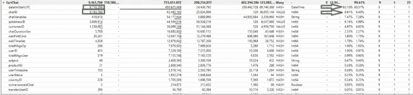

作者图片

如您所见，即使 chatID 列的基数比 datetmStartUTC 列高，它占用的内存也要少 8 倍！由于它是一个代理键整数值，VertiPaq 应用值编码，并且字典的大小无关紧要。另一方面，散列编码被应用于具有高基数的日期/时间数据类型的列，因此字典的大小要大得多。

有多种技术可以减少列基数，比如拆分列。这里有几个使用这种技术的例子。

对于整数列，可以使用除法和模运算将它们分成两个偶数列。在我们的例子中，应该是:

*选择 chatID/1000 作为 chatID_div
，chatID % 1000 作为 chatID_mod……*

这种优化技术必须在源端执行(在本例中是通过编写 T-SQL 语句)。如果我们使用计算列，没有任何好处，因为原始列必须首先存储在数据模型中。

当列中有小数值时，类似的技术可以带来显著的节省。你可以简单地拆分小数点前后的值，如本文中的[所述。](https://www.fourmoo.com/2019/11/27/how-i-saved-40-on-my-power-bi-dataset-size/)

因为我们没有任何十进制值，所以让我们专注于我们的问题—优化 datetmStartUTC 列。有多个有效选项可以优化该列。首先是检查您的用户是否需要比日级别更高的粒度(换句话说，您能否从数据中删除小时、分钟和秒)。

让我们看看该解决方案会带来哪些节约:


作者图片

我们注意到的第一件事是，我们的文件现在是 255 MB，是我们开始时的 1/3。VertiPaq Analyzer 的结果显示，这个列现在几乎得到了完美的优化，从占我们的数据模型的 62%到略高于 2.5%！那是 huuuuge！

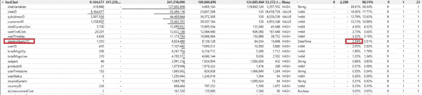

作者图片

然而，似乎日级别的颗粒不够精细，我的用户需要分析小时级别的数字。好的，我们至少可以去掉分和秒，这样也会降低列的基数。

所以，我导入了每小时四舍五入的值:

```
SELECT chatID
                ,dateadd(hour, datediff(hour, 0, datetmStartUTC), 0) AS datetmStartUTC
                ,customerID
                ,userID
                ,ipAddressID
                ,productID
                ,countryID
                ,userStatus
                ,isUnansweredChat
                ,totalMsgsOp
                ,totalMsgsUser
                ,userTimezone
                ,waitTimeSec
                ,waitTimeoutSec
                ,chatDurationSec
                ,sourceSystem
                ,subject
                ,usaccept
                ,transferUserID
                ,languageID
                ,waitFirstClick
            FROM factChat
```

我的用户似乎也不需要 chatVariables 列来进行分析，所以我也从数据模型中删除了它。

最后，在[禁用数据加载选项中的自动日期/时间](https://data-mozart.com/powerbi/tiq-part-1-how-to-destroy-your-power-bi-model-with-auto-date-time/)之后，我的数据模型大小大约为 220 MB！然而，有一件事仍然困扰着我:chatID 列仍然占据了我的表的将近 1/3。这只是一个代理键，在我的数据模型中的任何关系中都没有用到它。

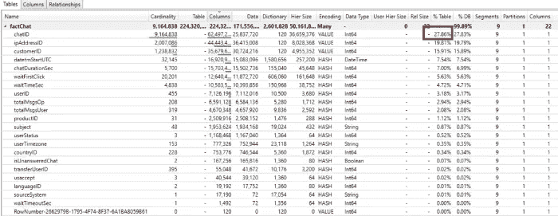

作者图片

因此，我在这里研究了两种不同的解决方案:第一种是简单地删除这个列，并合计聊天次数，使用 GROUP BY 子句对它们进行计数:

```
SELECT count(chatID) chatID
                ,dateadd(hour, datediff(hour, 0, datetmStartUTC), 0) datetmStartUTC
                ,customerID
                ,userID
                ,ipAddressID
                ,productID
                ,countryID
                ,userStatus
                ,isUnansweredChat
                ,totalMsgsOp
                ,totalMsgsUser
                ,userTimezone
                ,waitTimeSec
                ,waitTimeoutSec
                ,chatDurationSec
                ,sourceSystem
                ,subject
                ,usaccept
                ,transferUserID
                ,languageID
                ,waitFirstClick
            FROM factChat
            GROUP BY dateadd(hour, datediff(hour, 0, datetmStartUTC), 0) 
                ,customerID
                ,userID
                ,ipAddressID
                ,productID
                ,countryID
                ,userStatus
                ,isUnansweredChat
                ,totalMsgsOp
                ,totalMsgsUser
                ,userTimezone
                ,waitTimeSec
                ,waitTimeoutSec
                ,chatDurationSec
                ,sourceSystem
                ,subject
                ,usaccept
                ,transferUserID
                ,languageID
                ,waitFirstClick
```

该解决方案还将减少行数，因为它将聚合按定义的属性分组的聊天，但主要优势是它将大大减少 chatID 列的基数，如下图所示:

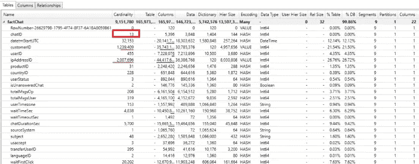

作者图片

因此，我们从“900 万或更多”基数下降到只有 13！！！而这个专栏的内存消耗现在已经不值一提了。显然，这也反映在我们的 pbix 文件大小上:


作者图片

此外，保留 chatID 列也没有任何好处，因为在我们的数据模型中没有使用它。一旦我将它从模型中移除，我们就节省了额外的 3 MB，但是保留了表的原始粒度！

最后一次，让我们检查 pbix 文件的大小:


作者图片

请回忆一下我们开始时的数字:777 MB！ ***因此，我设法将我的数据模型大小减少了近 90%*** ，应用了一些简单的技术，使 VertiPaq 存储引擎能够执行更优化的数据压缩。

这是一个真实的用例，是我去年面对的！

## 减少数据模型大小的一般规则

最后，下面是在尝试减小数据模型大小时应该记住的一般规则列表:

*   在报告中只保留用户需要的那些列！我向你保证，只要坚持这一条规则，你就会节省出难以置信的空间
*   尽可能优化列基数。这里的黄金法则是:测试，测试，测试…如果有显著的好处，例如，将一列分成两列，或者用两个整数列代替小数列，那么就去做吧！但是，也请记住，为了显示预期的结果，您的度量需要被重写以处理那些结构性的变化。因此，如果您的表不大，或者如果您必须重写数百个度量值，则可能不值得拆分列。正如我所说的，这取决于您的具体场景，您应该仔细评估哪个解决方案更有意义
*   与列一样，只保留那些需要的行:例如，也许您不需要导入过去 10 年的数据，但只需要导入 5 年！这也将减少您的数据模型大小。在盲目地将所有东西放入你的数据模型之前，与你的用户交谈，询问他们真正需要什么
*   尽可能聚合您的数据！这意味着——更少的行，更低的基数，所以所有美好的事情都是你的目标！如果您不需要小时、分钟或秒级别的粒度，就不要导入它们！Power BI 中的聚合(以及一般的表格模型)是一个非常重要且广泛的主题，超出了本系列的范围，但是我强烈建议您查看 Phil Seamark 的博客和他关于创造性聚合用法的系列文章
*   尽可能避免使用计算列，因为它们没有得到最佳压缩。相反，尝试将所有计算推送到一个数据源(例如 SQL 数据库),或者使用超级查询编辑器来执行它们
*   使用适当的数据类型(例如，如果您的数据粒度是天级别的，就没有必要使用日期/时间数据类型。日期数据类型就足够了)
*   禁用数据加载的自动日期/时间选项(这将删除后台自动创建的大量日期表格)

## 结论

在您学习了 VertiPaq 存储引擎的基础知识以及它用于数据压缩的不同技术之后，我想在本文的结尾向您展示一个真实的例子，展示我们如何“帮助”VertiPaq(以及随之而来的 Power BI)获得最佳的报表性能和最佳的资源消耗。

感谢阅读，希望你喜欢这篇文章！

[成为会员，阅读媒体上的每一个故事！](https://datamozart.medium.com/membership)

订阅[这里](http://eepurl.com/gOH8iP)获取更多有见地的数据文章！