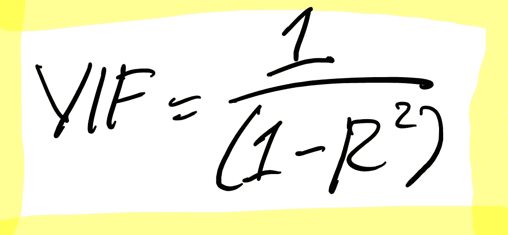

# 如何使用 Python 移除多重共线性

> 原文：<https://towardsdatascience.com/how-to-remove-multicollinearity-using-python-4da8d9d8abb2?source=collection_archive---------6----------------------->

## 它可能不会提高性能，但对于可解释性来说是必不可少的。

Jr Korpa 在 [Unsplash](https://unsplash.com/s/photos/data?utm_source=unsplash&utm_medium=referral&utm_content=creditCopyText) 上拍摄的照片

# 介绍

机器学习是一种解决无法显式编码的问题的方法，例如分类问题。机器学习模型会从数据中学习一个模式，所以我们可以用它来确定数据属于哪个类。因此，我们可以以最佳性能完成分类任务。

但是有一个问题。模型是如何工作的？有几个人无法接受一个性能很好的模型，因为它无法被解读。这些人关心可解释性，因为他们想确保模型以合理的方式预测数据。

在我们能够解释 ML 模型之前，去除多重共线性是一个必要的步骤。多重共线性是一种预测变量与另一个预测变量相关的情况。虽然多重共线性不会影响模型的性能，但它会影响可解释性。如果我们不消除多重共线性，我们将永远不会知道一个变量对结果的贡献有多大。因此，我们必须消除多重共线性。

本文将向您展示如何使用 Python 消除多重共线性。没有进一步，让我们开始吧！

# 履行

## 数据源

为了进行演示，我们将使用一个名为澳大利亚雨水的数据集。它描述了不同日期和地点的天气特征。这个数据集也是一个监督学习问题，我们可以使用这些数据来预测明天是否下雨。这个数据集可以在 Kaggle 上找到，你可以在这里 访问它[。](https://www.kaggle.com/jsphyg/weather-dataset-rattle-package)

作者捕捉到的。

以下是加载数据集的代码和预览:

## 预处理数据

加载数据后，下一步是预处理数据。在这种情况下，我们将不使用分类列，并删除至少有一个缺失值的行。下面是实现这一点的代码:

## 计算 VIF 值

有了清晰的数据后，让我们来计算方差通胀因子(VIF)值。什么是 VIF？

VIF 是一个确定变量是否具有多重共线性的数字。这个数字也代表了一个变量由于与其他变量的线性相关性而被夸大了多少。

VIF 值从 1 开始，没有上限。如果数字变大，这意味着变量有很大的多重共线性。

为了计算 VIF，我们将对每个变量进行线性回归，该变量将成为目标变量。完成这个过程后，我们计算 R 平方。最后，我们用这个公式计算 VIF 值:

由作者创作。

在 Python 中，我们可以使用 statsmodels 库中名为 variance_inflation_factor 的函数来计算 VIF。下面是这样做的代码及其结果:

从上面可以看出，几乎所有变量的 VIF 值都在 5 以上。甚至压力变量也有超过 40 万的 VIF 值。这是一个巨大的因素！

因此，我们需要清除数据中的多重共线性。

## 移除多重共线性

要消除多重共线性，我们可以做两件事。我们可以创建新要素或从数据中删除它们。

最初不建议删除功能。原因是因为我们移除了该功能，所以有可能丢失信息。因此，我们将首先生成新特征。

从数据中，我们可以看到有一些特征是成对的。比如' Temp9am '带' Temp3pm '，' Pressure9am '带' Pressure3pm '，' Cloud9am '带' Cloud3pm '，等等。

根据这些特征，我们可以生成新的。新要素将包含这些对之间的差值。创建这些要素后，我们可以安全地将它们从数据中移除。

下面是这样做的代码及其结果:

现在，让我们看看我们的数据的 VIF 值是什么样的:

正如你从上面看到的，我们仍然有一个巨大的 VIF 值的变量。但是，我们仍然从生成新的特性中得到了很好的结果。

现在让我们移除 VIF 值大于 5 的要素。下面是这样做的代码及其结果:

不错！现在我们有了所有 VIF 值小于 5 的变量。有了这些变量，现在我们可以解释结果了。但首先，让我们建立我们的机器学习模型。

## 建立模型

在这种情况下，我们将使用支持向量机(SVM)算法来建模我们的数据。简而言之，SVM 是一个模型，它将创建一个超平面，可以最大限度地分离不同标签的数据。

因为我们的数据属于分类任务，所以我们将使用 scikit-learn 中的 SVC 对象来创建模型。下面是实现这一点的代码:

## 使用排列特征重要性的解释

理论上，SVM 模型是不可解释的。这是因为我们不能仅仅通过参数来解释结果。但幸运的是，我们可以用几种方法来解释这个模型。我们可以使用的方法之一是置换特征重要性。

置换特征重要性通过查看改变特征值后误差增加多少来测量特征的重要性。如果其值的改变增加了模型的误差，则该特征是重要的。

为了实现这个方法，我们可以使用 scikit-learn 库中的一个名为 permutation_importance 的函数来计算特性的重要性。根据结果，我们将创建一个箱线图来可视化特性的重要性。

下面是这样做的代码及其结果:

从上面可以看出，HumanityDiff 特性是对最终结果有巨大贡献的最重要的特性。然后，降雨特征成为第二重要的特征。之后，分别以风速、蒸发量、风速差、气压差和云差为最重要的特征。

# 结束语

干得好！现在，您已经了解了如何使用 Python 移除数据集中的多重共线性。我希望这篇文章能帮助你如何消除多重共线性，以及如何解释机器学习模型。

如果你对我的文章感兴趣，你可以关注我的媒体以获得更多类似的文章。还有，如果你有什么问题或者想打个招呼，你可以在 [**LinkedIn**](https://www.linkedin.com/in/alghaniirfan/) 上关注我。

谢谢你看我的文章！

## 参考

[1]【https://etav.github.io/python/vif_factor_python.html
【2】[https://statisticalhorizons.com/multicollinearity](https://statisticalhorizons.com/multicollinearity)
【3】[https://www . analyticsvidhya . com/blog/2020/03/what-is-multicollism/](https://www.analyticsvidhya.com/blog/2020/03/what-is-multicollinearity/)