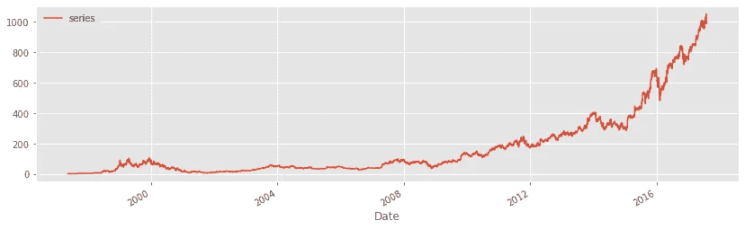
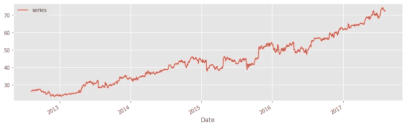
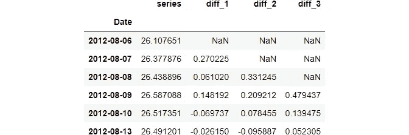
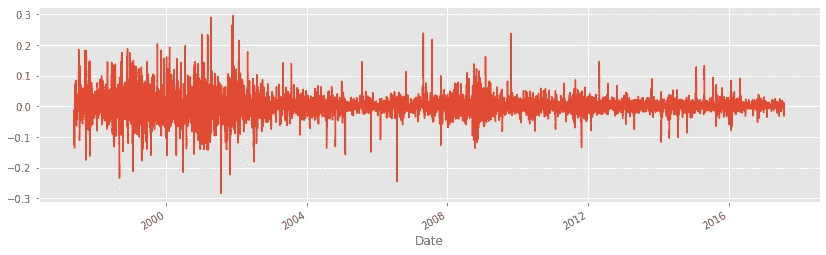
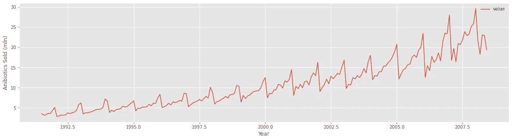
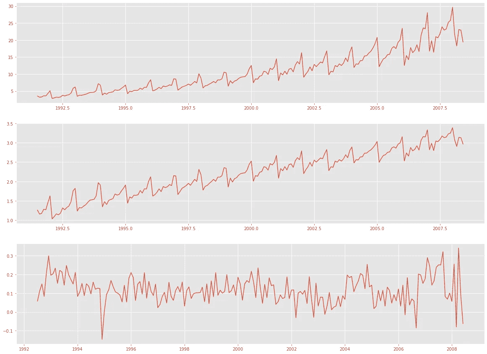

# 如何消除时间序列预测中的非平稳性

> 原文：<https://towardsdatascience.com/how-to-remove-non-stationarity-in-time-series-forecasting-563c05c4bfc7?source=collection_archive---------2----------------------->

## 算法不能处理非平稳。他们需要静态关系。

**照片由**[**Jonathan piel Mayer**](https://unsplash.com/@jonathanpielmayer?utm_source=unsplash&utm_medium=referral&utm_content=creditCopyText)**上的** [**Unsplash。**](https://unsplash.com/s/photos/still?utm_source=unsplash&utm_medium=referral&utm_content=creditCopyText) **除特别注明外，所有图片均为作者所有。**

# 介绍

与普通的机器学习问题不同，时间序列预测需要*额外的*预处理步骤。

在正态假设之上，大多数 ML 算法期望输入特征和输出之间有一个*静态关系*。

静态关系要求输入和输出具有常数参数，如平均值、中值和方差。换句话说，当输入和输出**静止**时，算法表现最佳。

在时间序列预测中，情况并非如此。随时间变化的分布可能具有独特的属性，如季节性和趋势性。反过来，这些又会导致序列的均值和方差波动，从而很难对它们的行为进行建模。

因此，在时间序列预测中，使分布平稳是一个严格的要求。在本文中，我们将探讨几种检测非平稳分布并将其转换为平稳数据的技术。

> 你可以从[这里](https://ibexorigin.medium.com/list/time-series-forecast-from-scratch-c72ccf7a9229)访问这个时间序列预测系列的所有文章。

<https://ibexorigin.medium.com/membership>  

获得由强大的 AI-Alpha 信号选择和总结的最佳和最新的 ML 和 AI 论文:

<https://alphasignal.ai/?referrer=Bex>  

# 为什么平稳性很重要？

如果分布不是稳定的，那么建模就变得很困难。算法通过估计基本分布的核心参数来建立输入和输出之间的关系。

当这些参数都依赖于时间时，算法将在每个时间点面对不同的值。如果时间序列足够精细(例如分钟或秒钟频率)，模型甚至可能最终拥有比实际数据更多的参数。

输入和输出之间的这种可变关系将严重损害任何模型的决策功能。如果这种关系随着时间不断变化，模型最终会使用过时的关系或对预测能力没有贡献的关系。

因此，您必须在工作流程中花费一定的时间来检测非平稳性并消除其影响。

我们将在接下来的章节中看到这样的例子。

# 非平稳序列的例子

看看这些图，试着猜猜哪条线代表一个平稳序列:

**形象由**<https://otexts.com/fpp2/>****【1】组成。免费在线书籍。****

**既然平稳序列有恒定方差，我们可以排除 **a，c，e，f，**和 **i** 。这些图显示了明显的上升或下降趋势或变化水平，如 **f** 所示。**

**同样，由于 **d** 和 **h** 显示了季节模式，我们也可以排除它们。**

**但是怎么样?看起来像是季节性的。**

****g** 是[猞猁](https://en.wikipedia.org/wiki/Lynx)种群增长的曲线图。当食物变得稀缺时，它们停止繁殖，导致种群数量骤降。当食物来源补充时，它们又开始繁殖，使种群增长。**

**这种周期性行为与季节性不同。当季节性存在时，你确切地知道一段时间后会发生什么。相比之下，猞猁种群增长的周期性行为是不可预测的。你不能猜测食物循环的时间，这使得这个系列是固定的。**

**所以，唯一的固定系列是 **b** 和 **g** 。**

**像 **d，f，**和 **h** 这样复杂的分布会让你质疑视觉识别非平稳数据是否是最佳选择。正如你所观察到的，很容易将季节性与随机周期混淆，或者将趋势与白噪声混淆。**

**因此，下一节将讨论检测非平稳时间序列的统计方法。**

# **统计检测非平稳性**

**在统计世界里，有几个测试打着 [*的标签，单元根测试*](https://en.wikipedia.org/wiki/Unit_root_test#:~:text=In%20statistics%2C%20a%20unit%20root,depending%20on%20the%20test%20used.) 。增强的 Dickey-Fuller 测试可能是最流行的一种，我们已经在我的上一篇文章中看到了如何使用它来检测随机游走。**

**在这里，我们将看到如何使用它来检查一个序列是否平稳。**

**简单地说，下面是这个测试的无效假设和可选假设:**

*   ****零假设**:分布是非平稳的，依赖于时间的(它有一个单位根)。**
*   ****替代假设**:分布是平稳的，不依赖于时间(不能用单位根来表示)。**

**p 值决定了测试的结果。如果它小于 0.05 或 0.01 的临界阈值，我们**拒绝**零假设，并得出序列是平稳的结论。否则，我们**无法拒绝**零，并得出序列是非平稳的结论。**

**完整测试可方便地作为`statsmodels`下的`adfuller`功能实现。首先，让我们在一个我们知道是平稳的分布上使用它，并熟悉它的输出:**

**我们看 p 值，差不多是 0。这意味着我们可以很容易地拒绝零，并认为分布是平稳的。**

**现在，让我们从 Kaggle 加载 TPS 七月操场数据集，并检查目标一氧化碳是否是稳定的:**

**令人惊讶的是，发现一氧化碳是稳定的。这可能是因为数据是在短时间内记录的，这减少了时间成分的影响。事实上，数据中的所有其他变量都是完全静止的。**

**现在，让我们加载一些更有可能是非平稳的财务数据:**

****

> **由于发布政策，一些数据集已被匿名化。但是你可以在这里查看原始版本的 [Kaggle 笔记本。注意，这种匿名不会妨碍你对内容的理解。](https://www.kaggle.com/bextuychiev/checking-the-targets-for-stationarity-tutorial/comments)**

**如你所见，该系列呈现出明显的上升趋势。让我们进行迪基-富勒测试:**

**我们得到完美的 p 值 1，这是 100%的非平稳时间序列数据。让我们对另一个分布进行最后的测试，我们将继续讨论处理这类数据的不同技术:**

****

**p 值接近 1。不需要解释。**

# **变换非平稳序列使其平稳**

**转换最简单的非平稳数据的一种方法是差分。这个过程包括连续观察的差异。熊猫有一个`diff`功能来做到这一点:**

****

**上面的输出显示了一阶、二阶和三阶差分的结果。**

**对于简单分布，取一阶差分就足以使其平稳。让我们通过使用`diff_1`上的`adfuller`功能来检查这一点(一阶差分`ts2`):**

**当我们对原始分布`ts2`运行`adfuller`时，p 值接近 1。差分后，p 值为 0，表明我们拒绝了空值，并得出序列现在是平稳的结论。**

**然而，有些发行版可能不那么容易处理。考虑一下我们之前看到的这个:**

****

**在计算差值之前，我们必须考虑这种明显的非线性趋势。否则，序列仍然是非平稳的。**

**为了消除非线性，我们将使用对数函数`np.log`，然后取一阶差分:**

****

**如您所见，变换前返回完美 p 值的分布现在完全稳定。**

**以下是澳大利亚每月抗生素销售额的图表:**

****

**正如你所看到的，该系列显示了上升趋势和很强的季节性。我们将再次应用对数变换，这一次，采用年度差异(365 天或 12 个月)来消除季节性。**

**下面是每个步骤的样子:**

****

**我们可以用`adfuller`确认平稳性:**

**p 值极小，证明改造步骤已经显现效果。**

**一般来说，每个发行版都是不同的，为了实现稳定性，您可能最终会改变多个操作。其中大部分涉及取对数、一阶/二阶或季节差异。**

# **摘要**

**这个时间序列预测系列的另一个主题已经完成！**

**我们已经谈了很多，尽管我们还没有谈到实际的预测部分。现在，您应该能够:**

*   **像专业人士一样使用熊猫([链接](/every-pandas-function-you-can-should-use-to-manipulate-time-series-711cb0c5c749?source=your_stories_page-------------------------------------))操作时间序列数据。**
*   **将任何时间序列分解成核心部分，如季节性和趋势([链接](/advanced-time-series-analysis-in-python-decomposition-autocorrelation-115aa64f475e?source=your_stories_page-------------------------------------))。**
*   **利用自相关([链接](/advanced-time-series-analysis-in-python-decomposition-autocorrelation-115aa64f475e?source=your_stories_page-------------------------------------))分析时间序列信号。**
*   **确定您想要预测的目标是白噪声还是随机游走([链接](/how-to-detect-random-walk-and-white-noise-in-time-series-forecasting-bdb5bbd4ef81?source=your_stories_page-------------------------------------))。**

**最后，你学会了如何从任何时间序列中去除非平稳的影响。所有这些都是必须知道的话题，也是预测的重要组成部分。下一个帖子是关于**时序特征工程**。[不要错过](https://ibexorigin.medium.com/)！**

## **您可能也会感兴趣…**

*   **[Matplotlib vs. Plotly:让我们决定一劳永逸](/matplotlib-vs-plotly-lets-decide-once-and-for-all-ad25a5e43322?source=your_stories_page-------------------------------------)**
*   **[训练机器学习模型时要做的 5 件超级高效的事情](/5-short-but-super-productive-things-to-do-during-model-training-b02e2d7f0d06?source=your_stories_page-------------------------------------)**
*   **[我持续改进机器学习模型的 6 件事](/6-things-i-do-to-consistently-improve-my-machine-learning-models-36cd87aaf9fd?source=your_stories_page-------------------------------------)**

## **参考**

**[1]: [Hyndman，R.J .，& Athanasopoulos，G. (2018) *预测:原理与实践*，第二版，OTexts:澳大利亚墨尔本。OTexts.com/fpp2\. 2021 年 7 月 15 日接入](https://otexts.com/fpp2/index.html)**