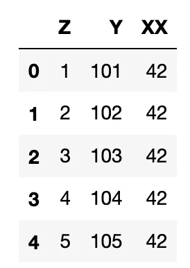

# 如何重命名 Pandas 中的列—快速指南

> 原文：<https://towardsdatascience.com/how-to-rename-columns-in-pandas-a-quick-guide-a934aa977bd5?source=collection_archive---------8----------------------->

## 关于在 pandas 数据框架中重命名列的多种选项的简短指南


照片由[朱利奥·加布里埃里](https://unsplash.com/@giuliogabrieli?utm_source=medium&utm_medium=referral)在 [Unsplash](https://unsplash.com?utm_source=medium&utm_medium=referral) 拍摄

确保 dataframe 列的名称正确对于理解其中包含的数据是至关重要的，尤其是当我们将数据传递给其他人时。在这篇短文中，我们将介绍在一个 [pandas](https://pandas.pydata.org/) dataframe 中重命名列的多种方法。

但是首先，熊猫是什么？Pandas 是一个强大、快速、常用的 python 库，用于执行数据分析。熊猫的名字本身代表“Python 数据分析库”。[根据维基百科](https://en.wikipedia.org/wiki/Pandas_(software))，该名称来源于“面板数据”一词。它允许从多种文件格式(CSV、XLS、XLSX、Pickle 等)加载数据。)并存储在类似表格的结构中。这些表格(数据框)可以使用 pandas 中的各种功能进行操作、分析和可视化

# 库导入和数据创建

第一步包括导入 [pandas 库](https://pandas.pydata.org/)并创建一些虚拟数据，我们可以用它们来说明列重命名的过程。

```
import pandas as pd
```

我们将创建一些虚拟数据来说明各种技术。我们可以通过调用`.DataFrame()`来做到这一点，这里我们将创建三列，分别命名为 A、B 和 c。

```
df = pd.DataFrame({'A':[1,2,3,4,5], 
                   'B':[101,102,103,104,105],
                  'C':[42,42,42,42,42]})
```


开始使用 pd 创建数据帧。数据帧()

# 加载数据时重命名列

创建数据帧的另一种方法是从现有文件(如 csv 或 xlsx 文件)中加载数据。当我们加载数据时，我们可以使用 names 参数来更改列的名称。当我们这样做时，我们需要确保使用`header=0`删除现有的标题行。

```
df = pd.read_csv('data.csv', 
                     names=['ColA', 'ColB', 'ColC'],
                     header=0)
```


在加载 csv 文件的过程中，重命名列后的 Pandas dataframe。

# 使用`.rename()`重命名所有列

我们要看的第一个方法是`[.rename()](https://pandas.pydata.org/docs/reference/api/pandas.DataFrame.rename.html?highlight=rename#pandas.DataFrame.rename)`函数。在这里，我们可以向关键字参数`columns`传递一个字典。字典允许我们提供旧列名和我们想要的新列名之间的映射。

我们还将把`inplace`参数设置为 True，这样我们就可以直接对数据帧 df 进行修改，而不是复制它。

```
df.rename(columns= {'A':'Z', 'B':'Y', 'C':'X' }, inplace=True)
```

另一种方法是指定轴，但是，与使用 columns 参数相比，这种方法可读性较差，并且可能不清楚该参数的作用。

```
df.rename({'A':'Z', 'B':'Y', 'C':'X' }, inplace=True, axis=1)
```

当我们调用 df 时，我们现在看到我们的列已经分别从 A、B 和 C 重命名为 Z、Y 和 X。


使用 df.rename()重命名列后，显示 dataframe。

# 使用`.rename()`重命名特定列

如果我们想要重命名特定的列，我们可以再次使用[重命名功能](https://pandas.pydata.org/docs/reference/api/pandas.DataFrame.rename.html?highlight=rename#pandas.DataFrame.rename)。我们可以使用`df.columns`并通过在方括号中提供列索引位置来选择列，而不是为字符串映射提供一个字符串。然后，我们将它映射到一个新的列名字符串。

```
df.rename(columns={df.columns[0]:'New Name'}, inplace=True)
```


使用 df.rename()后，Pandas dataframe 带有重命名的列。

我们还可以指定现有列名和新列名之间的映射。

```
df.rename(columns= {'X':'XX' }, inplace=True)
```



使用 df.rename()后，Pandas dataframe 带有一个重命名的列。

# 使用`Set_axis()`重命名列

下一个方法是`[set_axis()](https://pandas.pydata.org/pandas-docs/stable/reference/api/pandas.DataFrame.set_axis.html)`，用于设置数据帧的轴(列:轴=1 或行:轴=0)。

我们可以使用这个方法来重命名列，首先定义我们想要替换列的名称列表，并设置`axis=1`或`axis='columns'`。请注意，这里名称的数量需要等于列的总数。

```
df.set_axis(['Column A', 'Column B', 'Column C'], 
            axis='columns', 
            inplace=True)
```


在使用。set_axis()

# 使用。columns()来分配新的名称列表

我们可以通过分配一个新的列表来直接重命名列，该列表包含我们想要重命名的列的名称。这是使用数据帧的`[df.columns](https://pandas.pydata.org/docs/reference/api/pandas.DataFrame.columns.html?highlight=columns#pandas.DataFrame.columns)`属性实现的。

该方法要求新的名称列表的长度与数据帧中的列数相同。因此，如果我们只想重命名一两列，这可能不是最佳方法。

```
df.columns = ['1', '2', '3']
```


使用列表替换 df.columns 后的 Dataframe

# 使用 columns.str.replace()

我们要看的最后一种方法是使用`str.replace()`，它可以用来替换特定的字符或整个列名。

在本例中，我们将用字母 z 替换第 1 列。

```
df.columns = df.columns.str.replace('1', 'Z')
```


使用 df.columns 和 str.replace 重命名列后的 Dataframe。

# 摘要

熊猫数据帧中的列有多种重命名方法，包括 [pd.read_csv](https://pandas.pydata.org/docs/reference/api/pandas.read_csv.html?highlight=read_csv) 、[。set_axis](https://pandas.pydata.org/docs/reference/api/pandas.DataFrame.set_axis.html?highlight=set_axis) 、 [df.rename](https://pandas.pydata.org/docs/reference/api/pandas.DataFrame.rename.html?highlight=rename#pandas.DataFrame.rename) 和 [df.columns](https://pandas.pydata.org/docs/reference/api/pandas.DataFrame.columns.html?highlight=columns#pandas.DataFrame.columns) 。这说明了在 [pandas](https://pandas.pydata.org/) python 库中可用的巨大灵活性，并且使得确保数据帧中的列被适当地标记变得容易。

*感谢阅读！*

*如果您觉得这篇文章很有用，请随意查看我的其他文章，这些文章探讨了 Python 和测井数据的各个方面。你也可以在*[*GitHub*](https://github.com/andymcdgeo/Andys_YouTube_Notebooks)*找到我在这篇文章和其他文章中使用的代码。*

如果你想联系我，你可以在 LinkedIn 或我的网站上找到我。

有兴趣了解更多关于 python、岩石物理学或测井数据岩石物理学的知识吗？在[媒体](https://andymcdonaldgeo.medium.com/)或 [YouTube](https://www.youtube.com/channel/UCn1O_4_ApzbYwrsUdRoMmOg) 上关注我。