# 如何使用 PyTorch3D 渲染 3D 网格并将其转换为 2D 图像

> 原文：<https://towardsdatascience.com/how-to-render-3d-files-using-pytorch3d-ef9de72483f8?source=collection_archive---------5----------------------->

## [实践教程](https://towardsdatascience.com/tagged/hands-on-tutorials)

## 使用 [Python 代码](https://github.com/adelekuzmiakova/pytorch3d-renderer)渲染 3D 的实践指南。使用 PyTorch3D API 的 obj 文件(多边形网格)

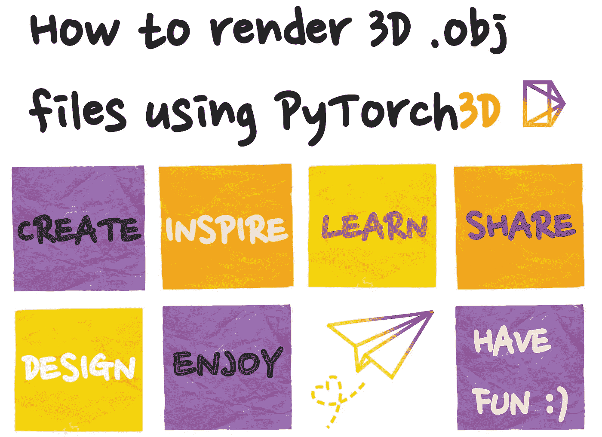

图 1:如何渲染 3D 文件。自己塑造的形象；来源: [Behance](https://www.behance.net/adelek1) 。

3D 理解在从自动驾驶汽车和自主机器人到虚拟现实和增强现实的众多应用中发挥着关键作用。在过去的一年里， **PyTorch3D** 已经成为一个越来越受欢迎的开源框架，用于使用 Python 进行 **3D 深度学习。令人感激的是，PyTorch3D 库背后的人们已经完成了实现几个常见的 **3D 操作符、损失函数、**和**可区分渲染 API** 的跑腿工作，使得 PyTorch3D 更容易访问，并且更容易开始使用[【1】](https://pytorch3d.org/)。PyTorch3D 的一些关键组件包括:**

*   **数据结构**用于存储和操作**三角形网格**
*   **三角形网格上的高效操作**
*   **可区分网格渲染 API**

**渲染是计算机图形管道中的重要组成部分，它将 3D 表示转换为 2D 图像，无论是网格(** `**.obj**` **)还是点云(** `**.ply**` **)。**

> **在这篇文章中，我们将建立如何从不同角度渲染 3D** `**.obj**` **文件以创建 2D 图像的背景知识。我们还将使用 Python 中的 PyTorch3D 构建一个基本的 3D 渲染管道，组件如下所示。**

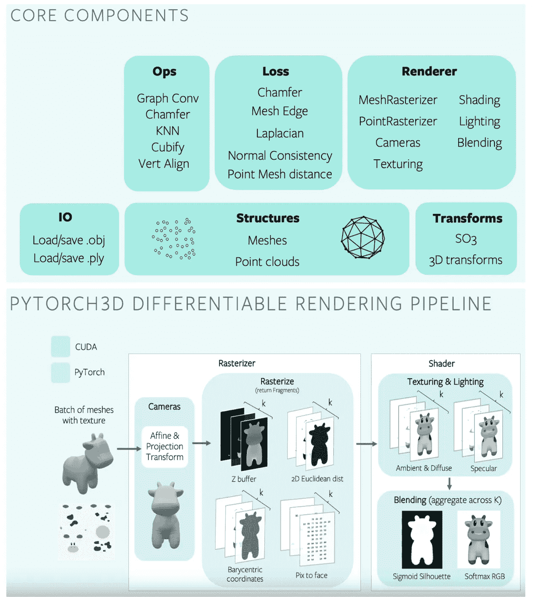

图 2: PyTorch3D 渲染管道。来源:[用 PyTorch3D 进行 3D 深度学习](https://www.youtube.com/watch?v=Pph1r-x9nyY)。

这篇文章假设只有 3D 文件表示的基本知识，所以希望每个人都可以访问:)然而，如果你想阅读更多关于 3D 重建的内容，那么请查看这个精彩的最新资源列表[【2】](https://github.com/timzhang642/3D-Machine-Learning)或斯坦福 cs 231 a[【3】](https://web.stanford.edu/class/cs231a/syllabus.html)和 cs 468[【4】](https://graphics.stanford.edu/courses/cs468-17-spring/schedule.html)课程的课程笔记。

在本文结束时，您将知道如何:

*   **使用** `.obj` **和** `.mtl` **文件**加载一个 3D 网格
*   **创建渲染器**
*   **渲染网格**
*   **可选:使用批处理属性从不同的角度高效渲染网格**

*只想要代码？在这个 GitHub 资源库*[*【5】*](https://github.com/adelekuzmiakova/pytorch3d-renderer)*中可以找到全部代码。*

准备好了吗？开始吧！🎉

# 步骤# 1:导入库并初始化参数

我们从导入先决条件库开始，比如`torch`或`numpy`，以及来自`pytorch3d`库的各种实用函数和结构。

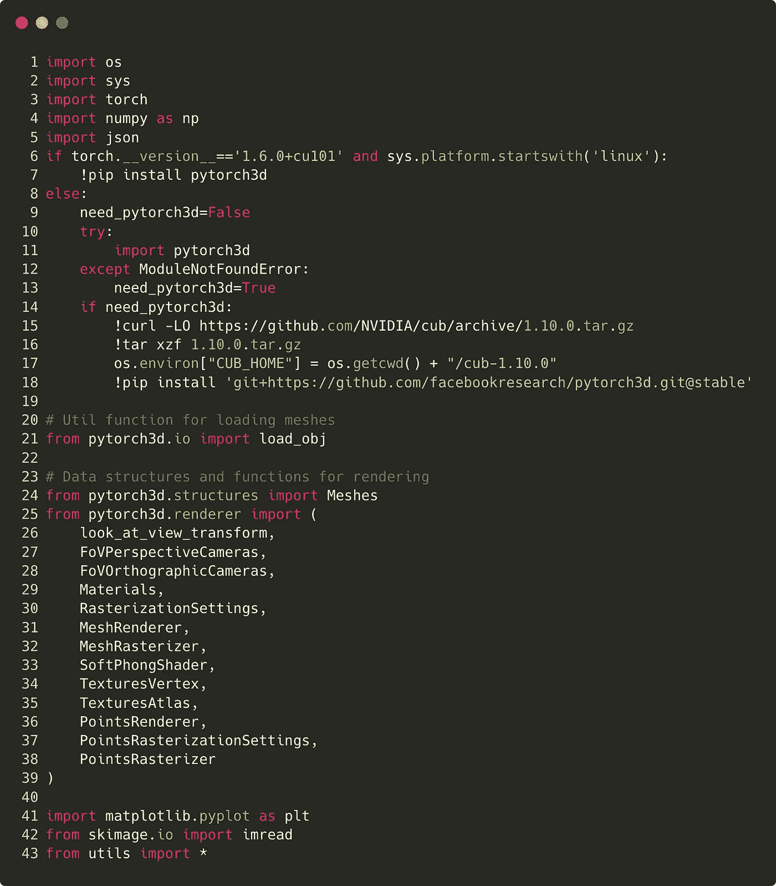

图 3:导入库和实用程序模块。代码片段托管在 [GitHub](https://github.com/adelekuzmiakova/pytorch3d-renderer/blob/main/render_demo.ipynb) 上，使用 [Carbon](https://carbon.now.sh/) 创建。

最后，第 43 行从`utils.py`导入类参数，它从配置文件加载重要的超参数。通常，将所有参数写在一个文件中并从这个特定的文件中加载它们是一个很好的做法。这允许您跟踪正在测试的超参数，并检查哪些超参数导致了最佳性能。在我们的例子中，超参数存储在`params_demo.json`中:

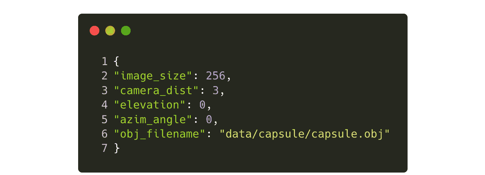

图 4:看着 [params_demo.json](https://github.com/adelekuzmiakova/pytorch3d-renderer/blob/main/params_demo.json) 。

如果有些超参数没有意义，不要担心；我将在本教程的后面解释它们！

通过以下方式加载超参数:

```
params = Params(“params_demo.json”)
# Access batch size parameter
print(params.elevation)
```

一旦你的`params`对象被初始化，你也可以使用`params.update("your_other_params.json")`方法用另一个`.json`文件更新它。

好了，现在我们导入了库并声明了参数，我们可以加载网格了。🎉

# 步骤 2:加载三维网格

有几种方法来表示 3D 数据，如**点云、网格、**或**体素**[【6】](/how-to-represent-3d-data-66a0f6376afb)。**在本教程中，我们将关注 3D 网格**，尽管 PyTorch3D 中的相同过程也适用于点云[【7】](https://github.com/facebookresearch/pytorch3d/blob/master/docs/tutorials/render_colored_points.ipynb)。

关于 **3D 纹理网格**的信息通常存储在以下文件中:

*   `.obj`文件，存储顶点和面
*   `.mtl`文件，存储材料属性
*   `.jpg`或`.png`纹理图像

在本教程中，我们将使用一个 3D 胶囊对象，它存储在`data/capsule`文件夹中。示例文件是从这里托管的公共存储库中获得的[【8】](http://paulbourke.net/dataformats/obj/minobj.html)。为了可视化我们正在处理的网格，我们可以使用 Blender:

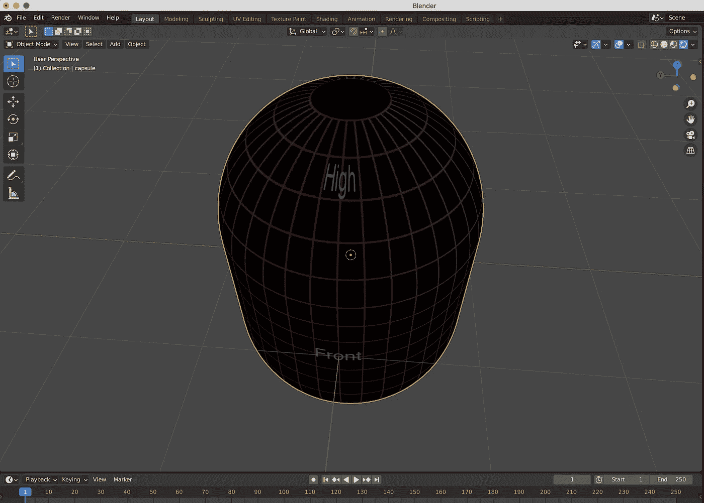

图 5:在搅拌机中观察胶囊网格。自己创作的截图。

PyTorch3D 包含了几个加载`.obj`文件的函数，比如`load_obj`或者`load_objs_as_meshes`。我们将使用第一个，并使用以下语法加载`.obj`文件:

```
verts, faces, aux = load_obj(filename)
```

这里，`verts`是顶点的(V，3)-张量，`faces.verts_idx`是每个面角的索引的(F，3)-张量，`aux`存储关于网格的辅助信息，例如 uv 坐标、材质颜色或纹理。然后，我们将这些`verts`、`faces.verts_idx`和`aux`结构传递给网格构造器，该构造器创建一个名为`capsule_mesh`的对象:

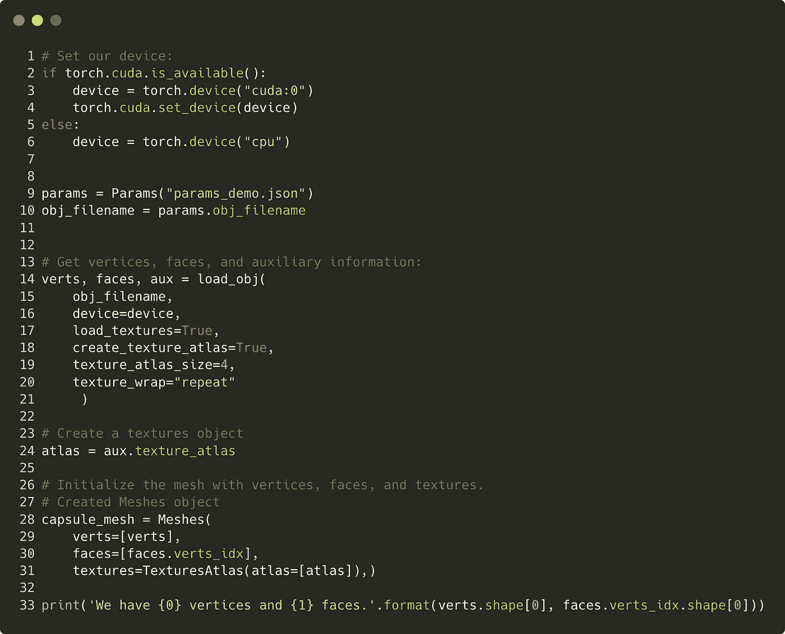

图 6:加载网格。代码片段托管在 [GitHub](https://github.com/adelekuzmiakova/pytorch3d-renderer/blob/main/render_demo.ipynb) 上。

最后，第 33 行检查胶囊网格中的面数和顶点数。这将返回:

```
We have 5252 vertices and 10200 faces.
```

这就是我们通过检查`.obj`文件结构所期望的。

如果你想了解更多，网格对象的官方文档可以在这里找到。

# 步骤 3:创建一个渲染器

**这可能是最重要的一步。**现在我们成功地读取了胶囊网格，我们需要使用`MeshRenderer`类创建一个渲染器。查看`MeshRenderer`文档[【10】](https://github.com/facebookresearch/pytorch3d/blob/master/pytorch3d/renderer/mesh/renderer.py)，我们看到它由两部分组成:

*   **光栅化器**
*   **着色器**

所以，让我们把这个任务分成两个步骤，最后，我们把它们放在一起。

## 步骤 3a:创建一个光栅化器

> **光栅化是指采用多边形或三角形描述的图像表示(。obj 文件)并将其转换为以像素描述的光栅图像(。png 或者。jpg 文件)。**

我们的光栅化器是通过使用一个叫做`MeshRasterizer`的类创建的，这个类也有几个子组件，比如`cameras`和`raster_settings`参数。基本上，`cameras`负责将 3D 坐标从世界空间转换到屏幕空间。为了初始化相机，我们需要 3 个重要的参数。它们是: **1)距离，2)方位角，**和 **3)仰角**。如果这听起来很多，不要担心；我将一步一步地介绍它们。

**距离**是指相机与物体之间的距离。

**仰角**是指物体到相机的矢量与水平面 y=0(平面 xz)的夹角。仰角基本上告诉我们从多高的地方看物体。

**方位角**指从物体到摄像机的矢量投影到水平面 y = 0。方位角是投影向量与参考平面(水平面)上(0，0，1)处的参考向量之间的角度。方位角的取值范围为 0 到 360 度。它基本上告诉我们从哪一侧(例如，左侧尺寸、右侧、前视图、后视图等。)我们在看对象。在这里查看更多信息[【11】](https://pvpmc.sandia.gov/modeling-steps/1-weather-design-inputs/sun-position/)[【12】](https://www.celestis.com/resources/faq/what-are-the-azimuth-and-elevation-of-a-satellite/)。

在我们的`params.json`文件(图 2)中，我们声明距离是 3，仰角是 0，方位角是 90，所以如果我们渲染这个网格，我们应该直接从 3 个单位的距离看它。

关于光栅设置，最重要的参数是生成的 2D 图像的大小。尺寸越小，图像的像素化程度越高。

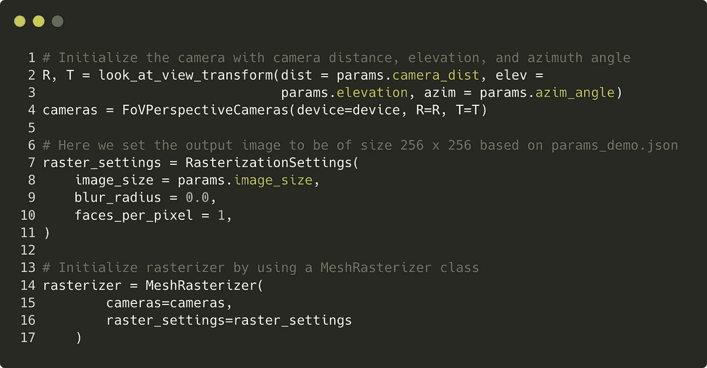

图 7:创建光栅化器。

## 步骤# 3b:创建一个着色器

PyTorch3D 提供了多种类型的着色器，包括`SoftPhongShader`或`HardPhongShader`。这里我们将使用一个预定义的`SoftPhongShader`，并传入相机和设备来初始化默认参数。

最后但同样重要的是，我们将光栅化器和着色器结合在一起:

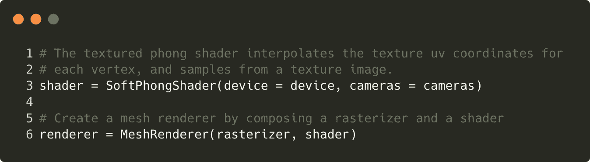

图 8:创建渲染器。

# 步骤 4:渲染网格

这是一个非常简单的步骤，因为我们只需要在网格对象上调用`renderer`方法。让我们渲染胶囊网格并绘制结果:

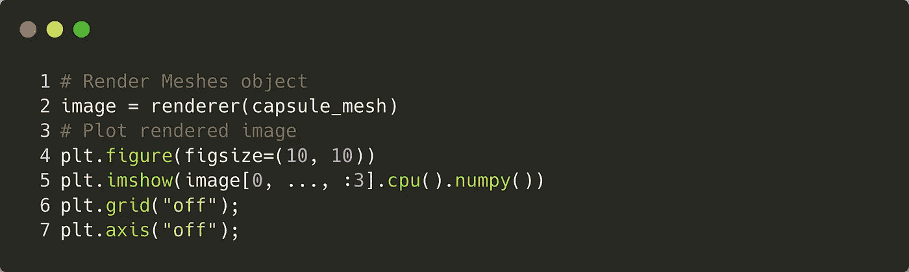

图 9:渲染网格。

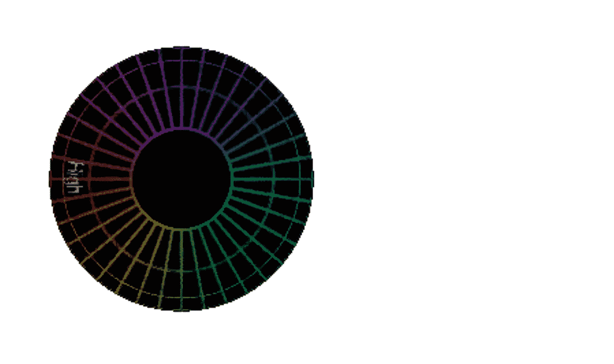

图 10:渲染后的胶囊网格，看起来非常类似于图 5 中的结果。

渲染结果看起来与图 5 中的 Blender 可视化非常相似，这是一个好现象！:)

# 可选:步骤# 5:使用批处理属性

如果你想从多个视点渲染网格，使用批处理属性可能 ***潜在地*** 有用。在我们深入研究代码之前，有必要了解一下当前的批处理实现是如何工作的。当前的实现依赖于单个参数，即**批处理大小**。**该批量然后将仰角和方位角空间分成 n 个相等的增量。**所以，如果你的批量是 4，那么你的仰角和方位角空间是`torch.linspace(0, 360, 4)`也就是`tensor([0, 120, 240, 360])`。**在每一批中，索引沿着仰角和方位角列表移动，并且一旦所有元素用尽就停止。**结果，我们只得到 4 张渲染图:a)两个 elev 都有。和方位角= 0，b)与两个 elev。和方位角= 120 °, c)。方位角= 240 °, d)两个仰角。方位角= 360°。

这类似于 Python `map()`函数，其中传递两个可迭代的参数——您也不会从这两个参数的所有成对组合中获得结果。因此，如果你希望得到仰角和方位角的所有成对组合，那么列表理解是一种方法。

好吧，好吧，好吧，回到批处理属性...我们将批处理大小设置为 4，这表示我们想要渲染网格的视点的数量。我们使用这个批量来扩展我们的网格，仰角矢量和方位角矢量。在图像被渲染后，结果张量具有形状`[4, 256, 256, 4]`。

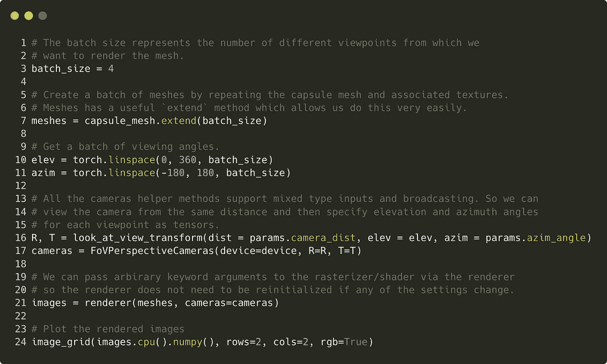

图 11:使用批处理渲染从多个视点渲染网格。


图 12:从多个视点得到的渲染图像。

恭喜你！🎉**你现在已经了解了如何从单个和多个视点渲染 3D 网格的细节。**

以下是我们所经历的:

*   ***我们已经看到 PyTorch3D*** 的安装
*   ***我们已经从*** `***.obj***` ***和*** `***.mtl***` ***文件*** 中加载了网格和纹理
*   ***我们已经创建了一个渲染器来渲染网格***

**我已经帮助您探索了 PyTorch3D 的一些基本属性，但是请不要就此止步。这只是一个开始，这一旅程将带你去哪里取决于你自己！**

# **在你走之前**

**喜欢教程并有什么意见或建议？我错过了什么吗？我很想听听你的想法:)给我发消息或者在 [GitHub](https://github.com/adelekuzmiakova) 上关注我！**

# **参考**

**[1]https://pytorch3d.org/**

**[2]https://github.com/timzhang642/3D-Machine-Learning**

**[3][https://web.stanford.edu/class/cs231a/syllabus.html](https://web.stanford.edu/class/cs231a/syllabus.html)**

**[4][https://graphics . Stanford . edu/courses/cs 468-17-spring/schedule . html](https://graphics.stanford.edu/courses/cs468-17-spring/schedule.html)**

**[https://github.com/adelekuzmiakova/pytorch3d-render](https://github.com/adelekuzmiakova/pytorch3d-renderer)呃**

**[6][https://towards data science . com/how-to-re presentation-3d-data-66 a0f 6376 AFB](/how-to-represent-3d-data-66a0f6376afb)**

**[7][https://github . com/Facebook research/pytorch 3d/blob/master/docs/tutorials/render _ colored _ points . ipynb](https://github.com/facebookresearch/pytorch3d/blob/master/docs/tutorials/render_colored_points.ipynb)**

**[http://paulbourke.net/dataformats/obj/minobj.html](http://paulbourke.net/dataformats/obj/minobj.html)**

**[9][https://github . com/Facebook research/pytorch 3d/blob/master/pytorch 3d/structures/meshes . py](https://github.com/facebookresearch/pytorch3d/blob/master/pytorch3d/structures/meshes.py)**

**[【10】https://medium.com/r?URL = https % 3A % 2F % 2f github . com % 2f Facebook research % 2f pytorch 3d % 2f blob % 2f master % 2f pytorch 3d % 2f renderer % 2f mesh % 2f renderer . py](https://medium.com/r?url=https%3A%2F%2Fgithub.com%2Ffacebookresearch%2Fpytorch3d%2Fblob%2Fmaster%2Fpytorch3d%2Frenderer%2Fmesh%2Frenderer.py)**

**[11][https://PVP MC . Sandia . gov/modeling-steps/1-weather-design-inputs/sun-position/](https://pvpmc.sandia.gov/modeling-steps/1-weather-design-inputs/sun-position/)**

**[12][https://www . celestis . com/resources/FAQ/what-the-azimuth-and-elevation-of-a-satellite/](https://www.celestis.com/resources/faq/what-are-the-azimuth-and-elevation-of-a-satellite/)**