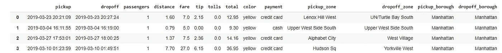
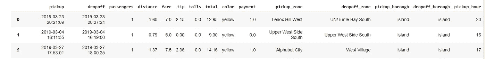
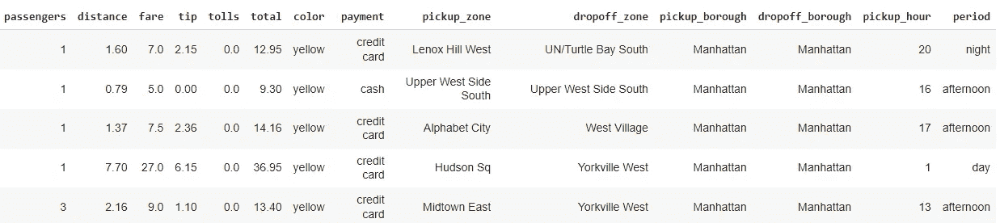

# 如何替换熊猫中的价值观

> 原文：<https://towardsdatascience.com/how-to-replace-values-in-pandas-609ba7a031c9?source=collection_archive---------18----------------------->

## 了解如何在 Pandas 数据框架中使用值替换方法


照片由 [Klára Vernarcová](https://unsplash.com/@klerwonder?utm_source=unsplash&utm_medium=referral&utm_content=creditCopyText) 在 [Unsplash](https://unsplash.com/s/photos/boxes?utm_source=unsplash&utm_medium=referral&utm_content=creditCopyText) 上拍摄

## 介绍

替换值是探索性数据分析(EDA)过程中的一项常见任务。如果您经常浏览数据，那么您可能不止一次遇到过需要替换某些值、创建某种分类或者只是替换需要以其他方式显示的值的情况。

有几种方法可以做到这一点，对于 Python 来说通常就是这样。就编码而言，有些比其他的好。

由于我打算创建一个简短的帖子，我将直接进入代码片段。

我将在示例中使用的数据集是 seaborn 的*taxies*。

```
# Dataframe
import seaborn as sns
df = sns.load_dataset('taxis')# Type to datetime
df.pickup = pd.to_datetime(df.pickup)# Create column pickup hour
df['pickup_hour'] = df.pickup.dt.hour
```



出租车数据集。图片由作者提供。

## 熊猫取代了

熊猫是一个很好的方法，它会让你很快变戏法。你要做的就是用一本带`{current value: replacement value}`的字典。

注意，我可以使用整个数据集中的值，而不是单个列上的值。如果您希望更改是永久性的，不要忘记使用参数`inplace=True`。

```
# Replace "cash" and "credit card" from payment and "Manhattan" from pickup_borough
df.replace({'cash':0, 'credit card': 1, 'Manhattan': 'island'})
```



付款和提货区列中的替换。作者图片

也可以只替换一列。该方法还接受列表或嵌套字典，以防您想要指定必须进行更改的列，或者您可以使用 Pandas 系列的`df.col.replace()`。

```
# Replace with nested dictionaries
df.replace({ 'payment': {'cash':0, 'credit card': 1}, 
             'pickup_borough': {'Manhattan': 'island'} }) # Replace with lists.
# Lists must be same lengthold_values = ['credit card', 'cash']
new_values = [1, 0]df.payment.replace(old_values, new_values)
```

## 熊猫在哪里

熊猫`where()`是另一种帮助你替换值的方法，但是这种方法从 1.3.0 版本开始就被否决了，它有它的局限性。这些更改是基于逻辑条件执行的。所以，我们讨论的是，如果某个条件满足，那么值保持不变，否则就变了。

参见下面的例子，我将小于 18 小时的值(*又名 6pm* )更改为“day”。

```
# Replace with where
df.pickup_hour.where(df.pickup_hour > 18, other='day')**[OUT]:**
0        20 
1       day 
2       day 
3       day 
4       day        
...  
6428    day 
6429    day 
6430     22 
6431    day 
Name: pickup_hour, Length: 6433, dtype: object
```

## 数字选择

`select()`函数与 Pandas `replace()`方法非常相似。额外的好处是这个方法允许你使用条件。

*它得到一个条件列表和一个长度相同的值列表*，并相应地替换它们。我相信这里的主要区别是`np.select`不会让你看到没有实现的变化，就像如果你不使用`inplace=True`的话，用 replace 方法是可能的。

```
# Replace with numpy selectconditions = [df.pickup_hour <= 12,
              df.pickup_hour.between(13, 18, inclusive=True),
              df.pickup_hour > 18]values = ['day', 'afternoon', 'night']# New column added
df['period'] = np.select(conditions, values)
```



np.select()实现了 3 个条件。图片由作者提供。

## 在你走之前

在这篇简短的文章中，您看到了可以使用不同的方法来替换 Pandas DataFrame 对象中的值。我知道还有其他人，但我只是认为这里解释的那些会让你已经处于良好的状态。

在:

*   `df.replace({'old':'new'})`对于整个数据集中的变化
*   `df.col.replace({'old':'new'})`针对特定列上的更改
*   `df.replace({ 'col A': {'old':'new'} })`针对特定列上的更改
*   `df.replace([ list old vals ], [list new vals])`使用列表进行更改
*   `df[‘new col’] = np.select(conditions_list, values_list)`因情况变化而变化。

## 参考

[Numpy 选择文档。](https://numpy.org/doc/stable/reference/generated/numpy.select.html)

[熊猫代替文档。](https://pandas.pydata.org/pandas-docs/stable/reference/api/pandas.DataFrame.replace.html)

[熊猫在哪里文献。](https://pandas.pydata.org/docs/reference/api/pandas.DataFrame.where.html) *【自 1.3.0 版起已弃用】*

如果这些内容对你有用，请关注我的博客。

<https://medium.com/gustavorsantos> 