# 如何重塑熊猫数据框架

> 原文：<https://towardsdatascience.com/how-to-reshape-a-pandas-dataframe-98b42c428a8?source=collection_archive---------4----------------------->

照片由 [☀️Shine_ 拍摄](https://unsplash.com/@lara_corviello?utm_source=unsplash&utm_medium=referral&utm_content=creditCopyText)在 [Unsplash](https://unsplash.com/s/photos/dough?utm_source=unsplash&utm_medium=referral&utm_content=creditCopyText)

## 入门指南

## 了解操作数据的基本方法

*我记得小时候经常玩黏土和砖块模型。*

我最喜欢的不是玩具本身，而是用小零件建造和塑造东西的乐趣。

让我着迷的是，只有把两块砖放在正确的位置上，它们才能组合在一起。

从那里，你可以构建任何你想要的东西。

*作为一名成年的数据科学家，我发现与数据打交道有某种魔力。*

*你可以有很多特征供你分析。但是只有当你把它们放入正确的格式中时，你才会发现你正在寻找的模式。*

andas 是一个开源库，允许数据科学家使用高性能、易于使用的数据结构和 Python 中的数据分析工具。它的核心数据结构是 **DataFrame** ，其中数据以表格形式表示，带有标记的行和列。

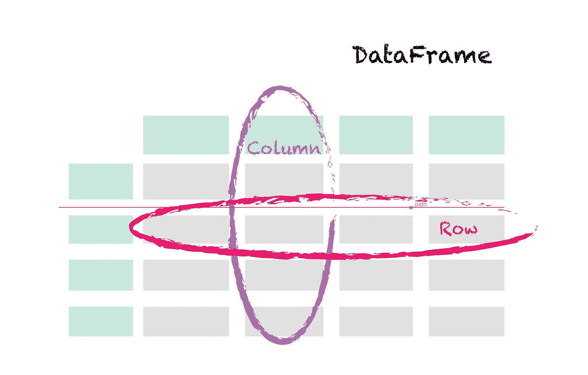

数据帧的结构。作者图片

数据可能以不同的格式组织，我们稍后会提到。并不是所有的都适合我们想要进行的分析。

幸运的是，Pandas 允许我们以多种方式改变数据帧的结构。但首先，在解释这些变化是如何发生的之前，我们需要理解形状的概念。

形状是指数据集如何组织成行和列。

为了澄清这一点，让我们使用一个包含关于 [*Playstation 4 视频游戏销售*](https://www.kaggle.com/sidtwr/videogames-sales-dataset) 的特征的数据集。

当我们检查它的形状时，我们可以看到它包含 825 行和 9 列。为什么知道数据帧的形状很重要？因为数据既可以是*长格式*，也可以是*宽格式*。

让我们仔细看看这个数据框架。

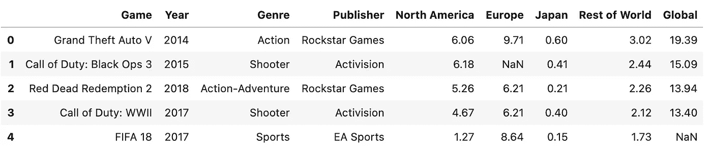

我们可以观察到以下情况:

*   每个功能都在单独的列中
*   每一行包含同一个玩家的许多特征
*   有缺失的值

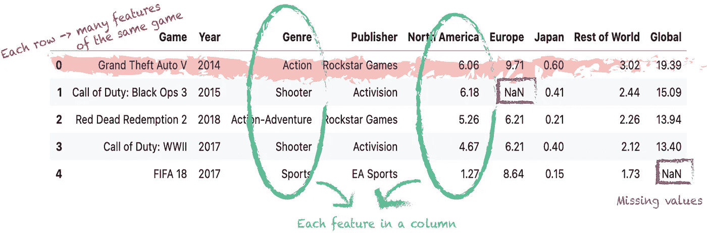

宽格式的特征。作者图片

这些是**宽格式**的显著特征。这种格式适用于简单的统计，如计算平均值、输入缺失值、演示列之间的关系或对变量进行时间序列运算。

现在，我们来看看相同的数据集，但格式不同。

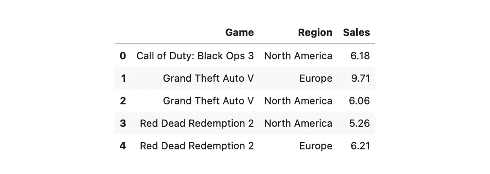

我们可以看到:

*   每行代表一个特征
*   每个游戏多行。每个特性一个。
*   一列，即`Game`列，通过记录识别相同的游戏。
*   没有缺失值。如果某个特定游戏的某个特性没有值，那么就没有对应的行。

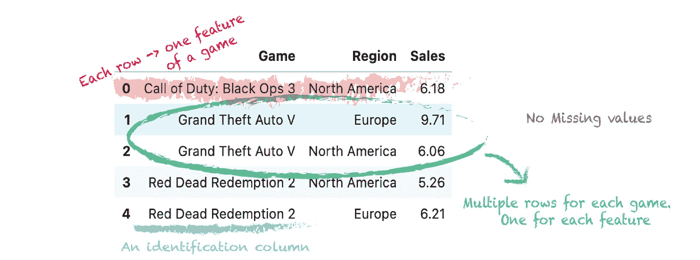

长格式的特征。作者图片

这些是通常被视为整齐数据集标准的**长格式**的典型特征。这通常是首选格式，因为它可以更好地汇总数据。它具有键-值对结构，许多高级图形和分析技术都需要这种格式的数据。

作为一名数据科学家，您的分析的某些部分将需要长格式的数据，但其他部分将只处理宽数据。

要决定使用长格式还是宽格式，要考虑哪一种是分析的单位。对于长格式，你总是对一个游戏的每个特点感兴趣。对于宽格式，你对每个游戏都感兴趣。

> 重塑数据可以定义为将数据从宽格式转换为长格式，反之亦然。

*那么，我们如何从宽格式转换到长格式，或者从长格式转换到宽格式呢？*让我们来看看熊猫中可用的一些工具。

1 获得一个数据帧是很有用的，其中一列或多列是标识符变量，而其他列不与行轴关联，只留下两个非标识符列，缺省情况下名为`variable`和`value`。

让我们想象一下，我们想要在一个箱线图中绘制 PS4 游戏在不同地区的销售情况。此任务要求数据采用长格式。但是我们的数据是以一种广泛的格式存储的。那么我们如何使用*融化*来重塑它呢？

该函数的语法如下所示:

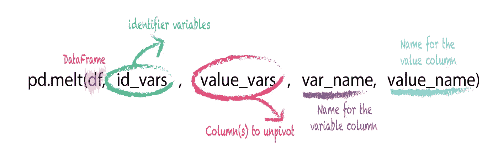

融化功能。作者图片

我们可以观察到，当使用`.melt()`时，我们需要首先传递数据帧。要设置的下一个参数是`id_vars`。该参数将列名用作标识符变量。在我们的例子中，我们希望用作标识符的值是列 *Game* 。

`value_vars` 参数接受我们想要融合的列的名称。这可以只是一列，也可以是许多列的列表。我们希望将不同地区的销售数据列作为融化列(*北美*、*欧洲*、*日本*、*世界其他地区*)。

`var_name`参数接受用于列*变量*的名称。在我们的例子中，我们将它命名为*区域*。最后，参数`value_name`采用了用于列*值*的名称。我们希望它被命名为*销售*。

现在，我们可以将*融化*应用到我们的数据帧上，然后绘制出我们想要的图形。

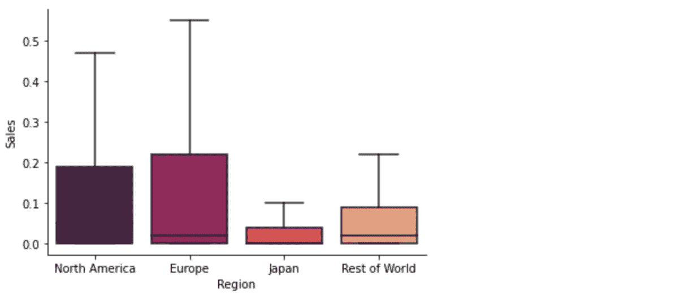

作者图片

2 ***宽转长*** : `[.wide_to_long()](https://pandas.pydata.org/docs/reference/api/pandas.wide_to_long.html)`是另一个可以帮助我们将数据由宽转长的函数。该功能没有*熔化*灵活，但更加用户友好。

这个函数有一个特点:它期望找到一组或多组格式为*A-后缀 1，A-后缀 2，B-后缀 1，B-后缀 2* 等的列。

所以让我们看看它的运行，这样我们可以更深入地分析它的语法。为了充分利用该功能，我们将重命名一些列。

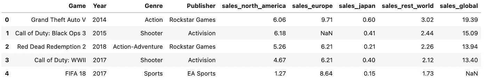

我们可以看到，现在有些栏目的名称以*销售*字样开头。这些是不同地区的销售数据。

所以我们准备应用`wide_to_long()`功能。该函数有几个参数:

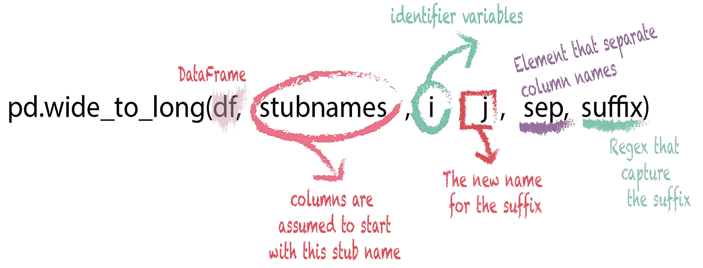

宽到长函数。作者图片

第一个参数是我们要转换的数据帧。`stubnames`参数用于指定 ***前缀*** ，这是宽列名称的开始。

`j`参数告诉 pandas 我们希望如何命名包含后缀或宽列末尾的列。然后，`i`参数接受我们将用作唯一标识符的列或列列表。该列将是长数据帧的索引。

Pandas 假设前缀后面紧跟一个数字后缀。为了克服这个问题，`sep`参数用于指定哪个分隔符元素。

此外，`suffix`参数接受一个正则表达式，向 Pandas 指示列如何结束，以防后缀不是数字。如果后缀以单词结尾，我们需要使用 `\w+`。

现在，我们可以将*宽到长的*函数应用于我们的数据帧，并查看结果。

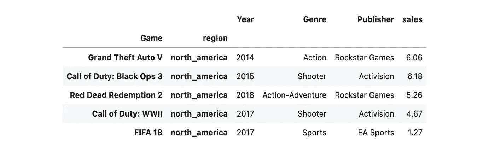

请注意数据帧中所有剩余的列(出版商和流派)是如何保持不变的。

3***Pivot***:`[.pivot()](https://pandas.pydata.org/docs/reference/api/pandas.DataFrame.pivot.html#pandas.DataFrame.pivot)`方法允许我们将数据从长格式重塑为宽格式。它返回由给定的唯一索引或列值组织的整形数据帧。

为了应用这种方法，让我们使用一个长格式版本的 PS4 游戏销售数据集:

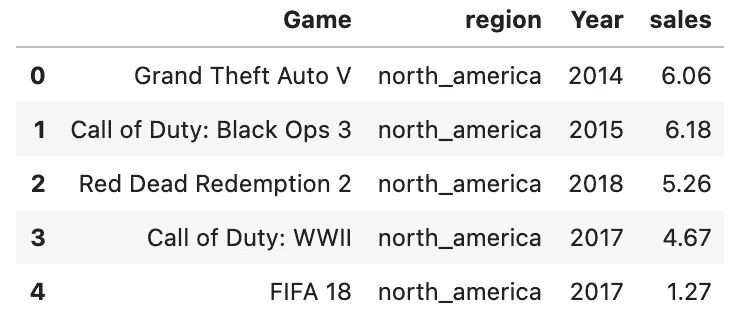

*pivot* 方法有三个参数:

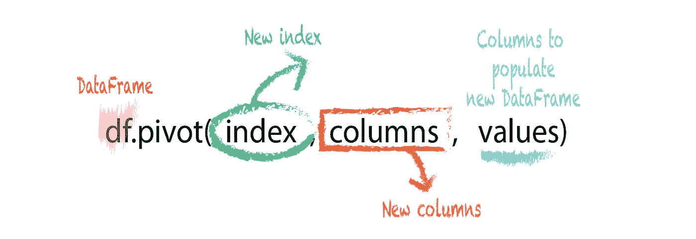

枢纽法。作者图片

注意这是一个 DataFrame 方法，而不是 Pandas 函数。

`index`参数将我们想要的列的名称作为新的透视数据帧中的索引。

`columns`参数将我们想要的列名作为新数据帧中的每一列。

最后，`values`参数采用我们想要填充到新的透视数据帧中的列的名称。这是一个可选参数。如果我们指定它，它将只旋转指定的列。如果没有通过，它将旋转所有列。

因此，pivot 方法会将每个值从原始数据帧传输到新数据帧，其中它的行和列与原始数据帧的索引和列相匹配。

让我们旋转长数据框并查看输出:

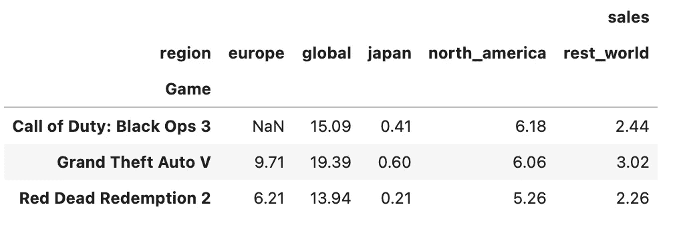

请注意，这些列现在有了一个分层索引。

因为该方法在原始数据帧中找不到与组合 Call of Duty: Black Ops 3/europe 匹配的行和列，所以它将该单元格值设置为缺失值。

pivot 方法不支持数据聚合。当有任何索引/列组合具有多个值时，该方法将引发一个错误，如下例所示:

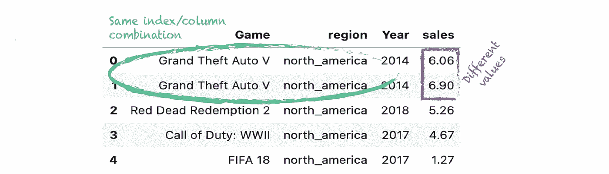

我们在这里讨论的函数和方法只是 Pandas 中可用于重塑数据的一些工具。

学习如何使用它们将在许多情况下为您提供帮助，因为对于任何数据科学项目来说，为您将要执行的每个分析准备适当的格式化和整洁的数据集都是关键的一步。

如果你想了解更多关于如何用熊猫重塑数据的知识，可以看看我的课程。