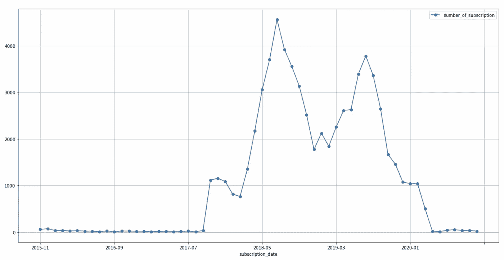
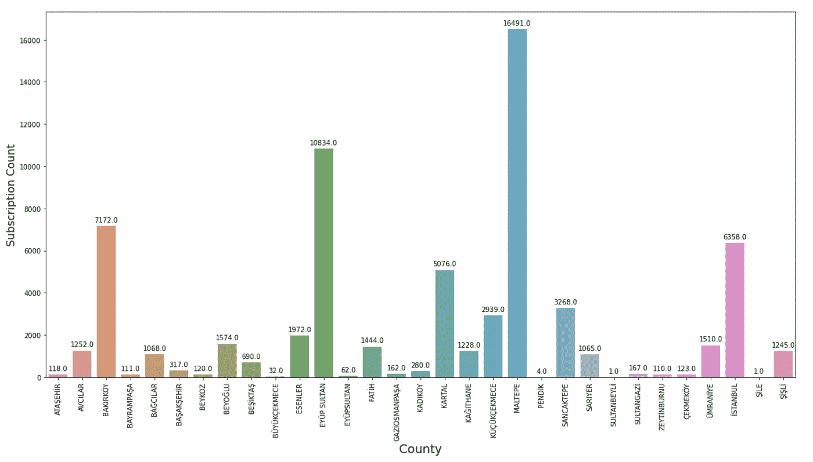
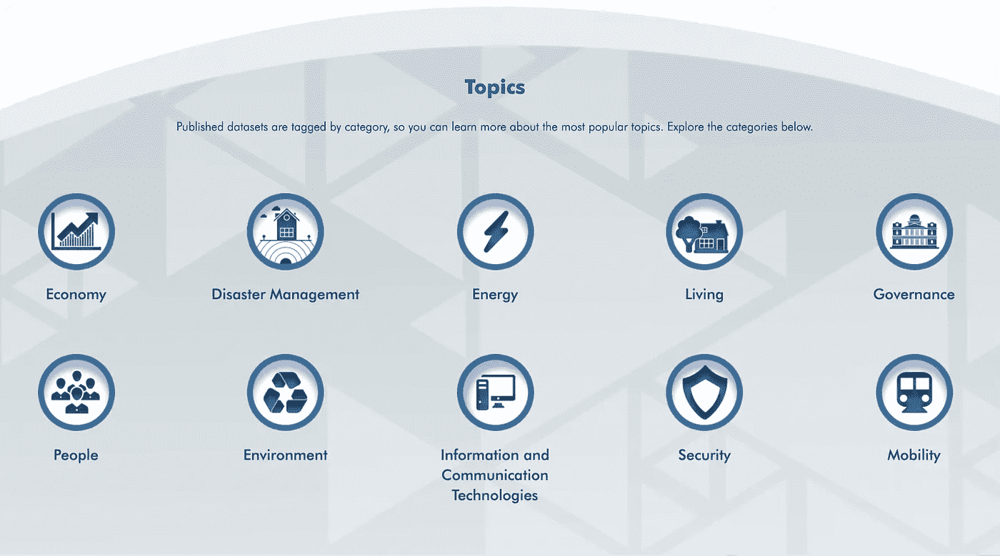
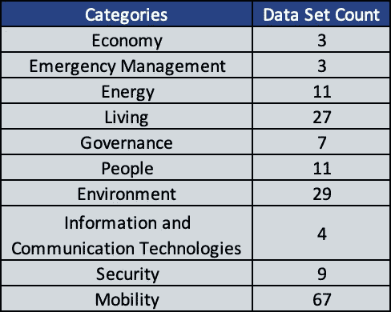
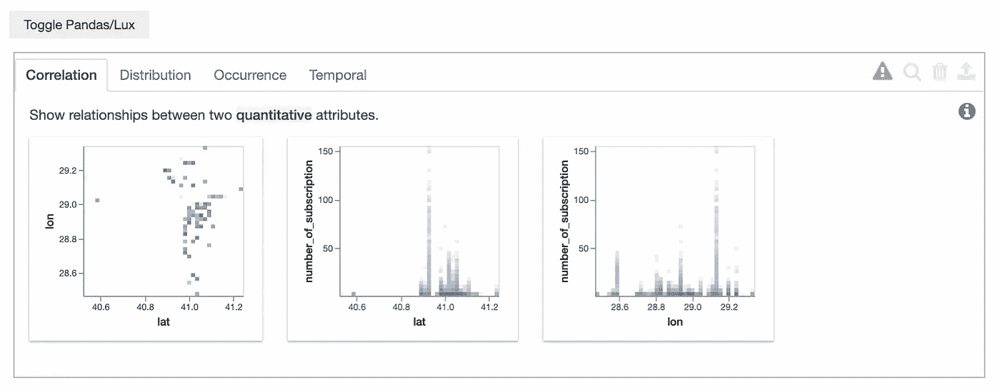
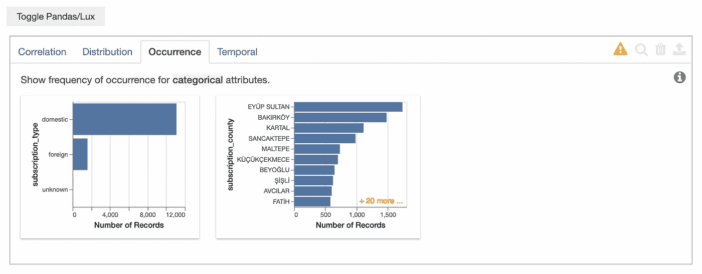

# 如何用 Python 揭示令人印象深刻的数据故事

> 原文：<https://towardsdatascience.com/how-to-reveal-impressive-data-stories-with-python-848a2611bfb3?source=collection_archive---------23----------------------->

## 通过数据驱动的故事讲述为交互式 DataViz 创造数字化思维


伊斯坦布尔的标志之一，作者照片

## 我要告诉你什么？

正如我在[上一篇文章](https://engineering.teknasyon.com/an-end-to-end-unsupervised-anomaly-detection-c402facffee2)中提到的，**可视化**是数据科学领域的一个关键点。任何数据科学项目的首要目标都是创造价值。无论在哪个领域，数据科学团队都在某种程度上触及了业务的核心，并在做出的每个决策中发挥着重要作用。如果你不能将项目的结果形象化，你就不能以正确的方式传达项目的价值。数据科学家负责项目内容中的哪些技术与哪些结构一起安装。作为一名数据科学家，在与利益相关者或其他部门的会议中，您需要引导项目的结果，而不是技术细节。来自数据的见解将有助于引导会议。本文将通过使用现成的数据集来提供关于您的可视化项目应该如何的信息。

这篇文章是为基于分析需求的可视化项目而写的，而不是为将要投入生产的项目的可视化机制而写的。我将解释基本图表类型的可视化，但不会涉及太多细节。制作复杂的数据视觉效果并不意味着创造一个好的故事。用尽可能简单的情节揭示数据中需要解释的模式将有助于项目的流畅性。

## 共同的方法

最基本的方法是保存 Jupyter 笔记本中的代码，这是数据爱好者的主要选择。Jupyter 采用笔记本形式并逐单元运行被认为是有利的。代码都在那里，并且很难在你不规则编写的代码中找到你将呈现的可视化。由于“时间不够”或其他原因，通常不可能清洁正在使用的 Jupyter 笔记本。如果您在会议期间向任何利益相关者或任何其他部门展示可视化的数据，这将是不友好的。使通用方法可持续的唯一解决方案是从 Jupyter 笔记本中获取要呈现的可视化效果，并通过任何呈现工具进行叙述。其实这是一个变通的程序，已经开始了你的懒惰。我只**建议**在紧急情况下这样做。举一个现实生活中的例子，在我之前的公司，我们的地图系统出现了一些问题。这些问题与快速做出的新业务决策有关。在后端，许可的制图服务在一周内被一个名为 OSRM 的开源路由服务所取代，并被要求提供一些关于两种服务比较的统计数据。如果您处于这种情况，并且只有几个小时的时间，在 Jupyter 中完成可视化后，您可以在任何演示工具(或同一笔记本)中演示您的结果。

使第一种方法快速的另一个重要特征是创建的可视化通常是静态的。造成这种情况的主要原因是可视化时首选熊猫、matplotlib、seaborn 等非常易用的包下的函数。

下面我举例说明了一些用我提到的通用方法绘制的图表类型。前两个图是静态的，而最后两个地图可视化是交互式传单地图。您可以从回购中名为[*IMM _ free _ wifi _ locs*](https://github.com/oguzhanyediel/imm_dataviz/blob/main/imm_free_wifi_locs.py)的 python 文件中访问交互的代码。在下面的可视化中，我使用了来自 **IMM 数据门户**的一个数据集，我将在文章中对此进行大量讨论。以下数据集包含伊斯坦布尔某些地区免费 WiFi 服务的新注册用户数量。



折线图上每月订阅数的变化



条形图上基于县的订阅计数的指示

除了以点的形式显示 IMM 的免费 wifi 位置外，它们还以[六边形](https://github.com/uber/h3-py)的形式显示，下面是它们的订阅数量。

顺便说一下，我们来谈谈'**数据面板**'。 [Datapane](https://datapane.com/) 是一个应用程序编程接口，在分析数据后，可以很容易地与他人分享数据结果。这是世界上最受欢迎的分享 Python 数据科学见解的方式。通过使用这个非常易于使用的 [Python 库](/introduction-to-datapane-a-python-library-to-build-interactive-reports-4593fd3cb9c8)，您可以制作出色的报告和仪表板。

## 整体方法

第二种方法是对代码进行项目设计。为此我用了 Jetbrains 的 [**PyCharm**](https://www.jetbrains.com/pycharm/) 产品。在 designed data visualization study 中，除了保持代码有组织之外，您还可以通过在本地使用不同的库(如 Streamlit)呈现项目的输出来提供更好的会议体验。这种系统方法的下一步是通过确定的日期计划将结果实时呈现给相关团队。在这篇文章中，我将通过给出第二种方式的细节来给出关于项目应该如何结束的信息。我还将展示一些我使用' [plotly](https://plotly.com/python/) '库在[伊斯坦堡市](https://data.ibb.gov.tr/en/) (IMM)数据集上制作的基本可视化输出的例子。

区别第二种方式和第一种方式的最重要的特征之一是可视化通常是动态的和交互式的。您可以使用自动出现在代码生成的图中的工具栏来处理图或将图保存为图像。


Plotly 工具栏

## IMM 开放数据门户

伊斯坦布尔政府两年前开始的积极变革提高了向该市人民提供的服务质量。在朝着正确方向采取透明步骤的框架内，人们决定，作为世界上最美丽的城市之一，伊斯坦布尔应该有一个开放的数据平台。2020 年 1 月发布的 IMM 开放数据提供了对 IMM 及其子公司提供的数据的访问。不管你的意图是什么，这些数据都是可以自由访问的。在 **10** 个不同的类别下有 **171** 个数据集。门户中数据集的数量与日俱增。同时，你可以根据你的学习领域、兴趣或任何需要提出数据集请求。对于任何对数据可视化感兴趣的人来说，IMM 开放数据门户是一个很好的资源。我建议你通过从门户中选择一些数据集来进行数据可视化工作。



[拥有数据集的类别](https://data.ibb.gov.tr/en/group)

在本文中，我使用了来自治理、人员、环境和移动性的各种数据集。您可以从下图中看到类别下有多少个[数据集](https://data.ibb.gov.tr/en/dataset)。



[来源](https://www.linkedin.com/posts/erol-%C3%B6zg%C3%BCner-78893a22_ibb-acikveri-opendata-activity-6787679720134742016-I03y)

## 勒克斯

在图形之前，我想谈谈莱克丝。 [**Lux**](https://github.com/lux-org/lux) 是一个应用程序编程接口(API ),您可以在其中用一行代码检查任何数据的一般可视化，以及一个 Python 库，它通过自动化数据探索过程来简化数据科学的初步步骤。在开始工作之前，只需导入库。使用 Lux 创建的可视化效果，您可以创建数据集的整体视图，规划数据的预处理步骤，并通过将可视化效果保存为“html”与其他人共享。关于 Lux-API 的详细信息，可以查看 [Ismael Araujo](https://medium.com/u/6b00d9d9f8df?source=post_page-----848a2611bfb3--------------------------------) 的[文章](/how-to-create-data-visualizations-on-python-with-one-click-f6bafbd8de54)。

下面你可以看到[日 IMM wifi 新用户数据](https://data.ibb.gov.tr/en/dataset/gunluk-ibb-wifi-yeni-kullanici-verisi)的 Lux 输出。



相关图



分类列的出现频率图

## 使用的数据集

*   *每日 IMM WiFi 新用户数据*
*   *伊斯坦堡大坝占用率*
*   *每小时公共交通数据集*
*   *每小时交通密度数据集*
*   *运输管理中心交通公告数据*

## 每日 IMM WiFi 新用户数据

第一个[数据集](https://data.ibb.gov.tr/en/dataset/gunluk-ibb-wifi-yeni-kullanici-verisi)，其[图表](https://github.com/oguzhanyediel/imm_dataviz/blob/main/wifi_new_user_daily.py)我们将对其进行检查，包括受益于伊斯坦布尔市政当局提供的 Wi-Fi 服务的国内外用户的数据。

该折线图显示了注册免费无线互联网服务的用户总数的月度分布。订阅数量在 2020 年 11 月达到最高。注册用户数已超过 1.8 万。

在柱状图中，可以看到各区的订阅数量。图表数据包含哪些地区有多少订阅。根据图表，Fatih 是注册人数最多的地区。原因之一可能是许多旅游建筑位于该地区。从下面的堆积条形图可以看出，外国用户的数量在该地区也占了最高的百分比。

## 伊斯坦布尔大坝占用率

[下一个数据](https://github.com/oguzhanyediel/imm_dataviz/blob/main/dam_occupancy_rates_daily.py)是[数据集](https://data.ibb.gov.tr/en/dataset/istanbul-dam-occupany-rates-data)，包括伊斯坦布尔大坝占用率的每日变化。除了大坝占用率，还有一个包含大坝预留水量的列。如果包括大坝崩溃，这将是一个很好的数据集。7 年后的 2007 年、2008 年、2014 年，2021 年入住率再次跌破 **20%** 。

自然与大坝占用率呈正相关的备用水量月线图如下。

我从秋、冬、夏三季中随机选择几个月，画了一个条形图。值得注意的是，除了上面我们检测到的干旱年份，七月份的平均入住率很高。

过去 15 年每月的平均条形图如下。春季的高失业率是意料之中的现象。

## 每小时公共交通数据集

[我们的第三个数据集](https://github.com/oguzhanyediel/imm_dataviz/blob/main/public_transport_hourly.py)是公交数据，这是我在门户上最喜欢的数据集。这个[数据集](https://data.ibb.gov.tr/en/dataset/saatlik-toplu-ulasim-veri-seti)包含了伊斯坦布尔公共交通每小时的乘客和旅程数据。在项目内部，我一般会比较 2020 年和 2021 年 1 月和 2 月的统计数据。通过这种方式，我们将能够了解并比较疫情疫情爆发前和 2021 年新冠肺炎时期的公共交通统计数据。作为一个脚注，一些交通工具，如铁路系统，晚上不工作。

上图和下图包括每天的平均乘客人数和通票数。

在下面的柱状图中，给出了公路、铁路和水路旅客总数的比例。当然，疫情的爆发是导致 2021 年下降的有效原因。

下面的条形图包含上面的图表在一条线上的细分。2020 年 1 月，超过 1 亿的乘客中约有 **60%** 更喜欢使用公私合营的公交车。如果我们看看铁路细节，伊斯坦布尔最常用的 4 条线路没有变化；Aksaray-Airport、kaba tas-BAC lar、Marmaray 和 tak sim-4 . levent。2 月份早高峰期间选择这四条线路的乘客平均人数如下图所示。在海上，可以看到摩托艇比城市航线更受欢迎。然而，2021 年 1 月使用这两条线路的乘客数量相互接近。

从下面的折线图中可以看出，最明显的是，在疫情期间，绝大多数白领员工都是在家工作的。原因是 Taksim-4 的变化。莱文特线。这条线路通常由 Mecidiyekö、Gayrettepe 和 Levent 区的白领员工使用。总体而言，由于疫情，2021 年特定线路的平均乘客人数已降至 2 万以下。


**i̇tü-阿亚扎阿站，Taksim-4。Levent Line，2014 年 7 月，作者照片**

在这一部分下面的最后一个图表中，伊斯坦布尔最受欢迎的交通工具*(开玩笑)*的每小时平均乘客人数是一月份的。在疫情之前的一个月，大约有 8 万人在晚上高峰时间选择这种交通方式。你可以在下面的照片中看到人群的一部分。


Zincirlikuyu 地铁站，2020 年 1 月，作者拍摄

## 每小时交通密度数据集

下一个 [数据集](https://data.ibb.gov.tr/en/dataset/saatlik-trafik-yogunluk-veri-seti)包含每小时的伊斯坦布尔位置密度和交通信息。下面的热图显示了每天和每小时的平均车辆数量。

您可以在下面的可视化图中详细查看晚间高峰时间的热图。由于疫情的条件，开车外出的人并没有大幅度减少。可以推断，人们更喜欢使用他们的私人车辆，而不是公共交通工具。只是由于夜间和周末宵禁，这些日子和时间有所减少。

在伊斯坦布尔地图上，密度地图可视化如下。

## 运输管理中心交通公告数据

我们的[最新数据集](https://github.com/oguzhanyediel/imm_dataviz/blob/main/traffic_announcements_instant.py)是[数据集](https://data.ibb.gov.tr/en/dataset/ulasim-yonetim-merkezi-trafik-duyuru-verisi)，包含运输管理中心(TMC)自 2018 年以来基于位置发布的即时公告。我为公告制作图表，而不是基于位置的可视化图。在我们的第一张图中，您可以找到显示公告总数分布的交互图。

从下面的柱状图可以查看 2019 年和 2020 年伊斯坦布尔事故公告的月度分布。2020 年事故数量增加，2020 年 10 月达到 5500 起。

下一张图以条形图的形式展示了两年半时间内 3 月、7 月和 10 月的车辆故障平均数。

文章的最后一个图在散点图上显示了在公告的开始和结束时间之间平均经过了多少分钟。

## 关于项目和图表

在本文中，为了确保交互性，只有项目的某些图表被选中并通过 Datapane 呈现。在这个项目中，所有图表的代码都是尽可能参数化地编写的，通过选择所需的变量和时间选项，可以很容易地复制所需的图表。你可以在我的 Github 页面找到[所有代码](https://github.com/oguzhanyediel/imm_dataviz)，包括文章中的图表。

```
imm_dataviz/
|-- config.py
|-- dam_occupancy_rates_daily.py
|-- Dockerfile
|-- environment.yml
|-- LICENSE
|-- public_transport_hourly.py
|-- README.md
|-- requirements.txt
|-- traffic_announcements_instant.py
|-- traffic_density_hourly.py
|-- utils.py
|-- wifi_new_user_daily.py
```

每个 python 文件都基于以下三个基本函数。

```
if __name__ == "__main__":
    # main()
    putting_into_streamlit()
    # putting_into_datapane()
```

*main* 功能允许您在本地逐个查看所有图表。*另一方面，put _ into _ streamlit*函数使用 Streamlit 库来帮助您在一个地方收集所有图像，并使比较可视化更加容易。同时，如果你要做什么可视化工作或者项目，我强烈推荐你使用 [**Streamlit**](https://streamlit.io/) 。*put _ into _ datapane*函数使用了我更喜欢在文章中交互呈现图像的 data pane 库。

## 项目说明&下一步是什么？

*   门户下的数据落后 45 天，每天更新。
*   Streamlit 将自动选择您的操作系统主题(亮或暗)并随操作系统改变颜色。运行代码后，从右上角选择灯光主题。
*   我故意避免编写公共(util)函数，以便可以很容易地将每个 py 文件作为一个单独的单元。
*   因为这个项目是尽可能模块化地编写的，所以可以通过更改配置文件中的参数来绘制不同的图表。
*   该项目在日志记录和例外尝试机制方面比较薄弱。可以通过使用 logger 库来添加日志，异常和错误处理机制可以放在代码中。
*   对于内容端；

—通过将气象数据与大坝占用率或每小时公共交通数据相结合，可以生成新的图表。

—可以通过组合公共交通登机牌的数量和[票价](https://data.ibb.gov.tr/en/dataset/toplu-tasima-bilet-fiyatlari)来产生新的可视化。

—可以在交通公告数据中实现基于位置的可视化。

*   **不要犹豫**贡献自己的力量，因为可视化项目是完全开源的。

## 结论

我展示了一个小规模的样本可视化引擎，在我从 IMM 开放数据门户选择的一些数据集上使用了 Plotly、Streamlit 和 Datapane 等库，该门户于 2020 年 1 月提供服务。多亏了我用 Python 创建的交互式数据可视化，我们对伊斯坦布尔的数据有了更深入的了解。我试图向您展示如何用简单而有效的代码展示数据科学领域的任何可视化项目。我告诉基于分析的可视化项目应该用什么技术呈现给利益相关者或其他部门，并且我通过 [*IMM DataViz*](https://github.com/oguzhanyediel/imm_dataviz) 项目提供了关于使用最新库的详细信息。

## 我以前的文章

*   [*BiTaksi 是如何利用数据的力量成为最好的打车服务的？*](https://medium.com/bitaksi-tech/how-did-bitaksi-become-the-best-taxi-service-by-using-the-power-of-data-2f6cca9fcdc)
*   [*一种端到端无监督的异常检测*](https://engineering.teknasyon.com/an-end-to-end-unsupervised-anomaly-detection-c402facffee2)

## 链接

*   [我的 LinkedIn 个人资料](https://www.linkedin.com/in/oguzhanyediel/)
*   [我的 Github 页面](https://github.com/oguzhanyediel)
*   [我的数据面板配置文件](https://datapane.com/u/oguzhanyediel/)

## 参考资料和有用的资源

*   我强烈推荐你阅读 [Plotly 文档](https://plotly.com/python/)
*   [https://www . shanelynn . ie/bar-plots-in-python-using-pandas-data frames/](https://www.shanelynn.ie/bar-plots-in-python-using-pandas-dataframes/)
*   [https://towards data science . com/step-by-step-step-bar-charts-using-plotly-express-bb13a 1264 a8b](/step-by-step-bar-charts-using-plotly-express-bb13a1264a8b)
*   [https://towards data science . com/stacked-bar-charts-with-plotly-express-85885 e 91874 f](/stacked-bar-charts-with-plotly-express-85885e91874f)
*   [https://towards data science . com/introduction-to-data pane-a-python-library-to-build-interactive-reports-4593 FD 3c B9 c8](/introduction-to-datapane-a-python-library-to-build-interactive-reports-4593fd3cb9c8)
*   [https://towards data science . com/data-visualization-101-7-steps-for-effective-visualizations-491 a17d 974 de](/data-visualization-101-7-steps-for-effective-visualizations-491a17d974de)
*   [https://towards data science . com/nine-emerging-python-libraries-you-should-add-to-your-data-science-toolkit-in-2021-85ce 3d 239846](/nine-emerging-python-libraries-you-should-add-to-your-data-science-toolkit-in-2021-85ce3d239846)