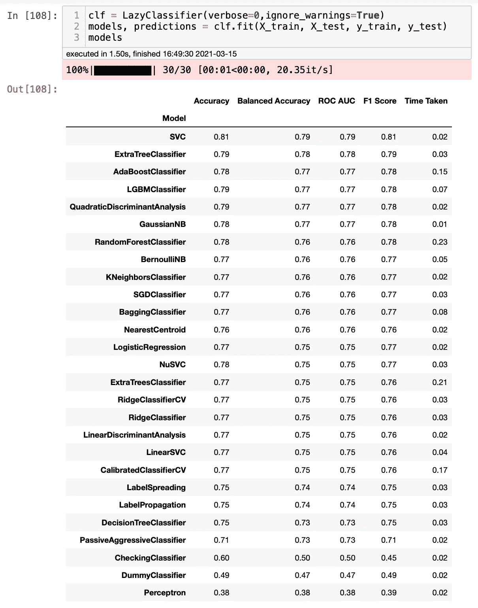
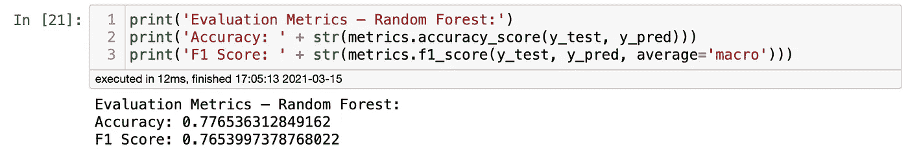
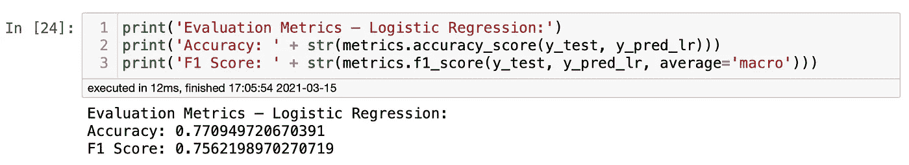

# 如何用几行代码运行 30 个机器学习模型

> 原文：<https://towardsdatascience.com/how-to-run-30-machine-learning-models-with-2-lines-of-code-d0f94a537e52?source=collection_archive---------1----------------------->

## 机器学习

## 了解如何使用 lazy predict 运行多个机器学习模型——代码跟随


图片由凯拉·伯顿拍摄。来源:[像素](https://www.pexels.com/photo/crop-student-using-laptop-on-street-6146980/)

当开始一个新的监督机器学习项目时，第一步是分析数据，了解我们试图完成什么，以及哪些机器学习算法可以帮助我们实现我们的目标。虽然`scikit-learn`库使得用几行代码运行模型变得更加容易，但是当你需要测试多个模型时，它也是非常耗时的。然而，如果我们可以在进入更复杂的方法之前同时运行多个普通模型，并且更好地了解我们应该在哪些模型上投入宝贵的时间，会怎么样呢？

这就是`lazy predict`试图(成功)完成的事情。它在几秒钟内运行 30 个机器学习模型，并让我们了解模型在数据集上的表现。为了更好地理解我们如何使用`lazy predict`，我创建了一个泰坦尼克号幸存者预测项目，这样你就可以跟着编码了。你可以在这里找到[完整的笔记本](https://github.com/ismael-araujo/Testing-Libraries)。你可以和我一起编码。Python、`Pandas`和`scikit-learn`的基本经验将帮助您更好地理解正在发生的事情。

**导入和清理数据**

先来导入`pyforest`。PyForest 用一行代码导入了 40 个最流行的 Python 库。我写了一篇关于它的文章，你可以在这里找到它。我将使用警告库关闭一些难看的警告消息。我还将导入一些度量库。我们以后会需要它。

```
import pyforest
import warnings
warnings.filterwarnings("ignore")
from sklearn import metrics
from sklearn.metrics import accuracy_score
```

现在，让我们从 Kaggle 导入将要使用的数据集。你可以在[这个链接](https://www.kaggle.com/c/titanic/data)上找到数据集。注意我没有导入`Pandas`。那是因为它是`pyforest`自带的。

```
# importing .csv files using Pandas
train = pd.read_csv(‘train.csv’)
test = pd.read_csv(‘test.csv’)
```

我将在本文中跳过一些探索性的数据分析，因为我们的主要焦点是开始使用`lazypredict`。然而，在我最初的 EDA 中，你可以在我的 GitHub 中找到，我注意到我们需要将列*性别*转换成数字。我们可以用一个`lambda function`轻松做到这一点。

```
train['Sex'] = train['Sex'].apply(lambda x: 1 if x == 'male' else 2)
```

我们还可以删除一些我们不会用于这个微型项目的分类列。对于家庭作业，我建议你在完成这篇文章后尝试使用这些特性。

```
train.drop(columns=[‘Name’,’Ticket’,’Cabin’, ‘PassengerId’, ‘Parch’, ‘Embarked’], inplace=True)
```

**列车测试拆分**

现在，让我们将我们的训练集分成变量 X 和 y。我将把所有的特征寻址到 X，除了存活的，这是我们的目标标签。

```
X = train.drop([‘Survived’], axis=1)
y = train.Survived
```

现在，让我们将变量分成训练集和测试集。我将使用默认的 0.25 作为测试大小。您可以使用轻松地添加其他值。

```
X_train, X_test, y_train, y_test = train_test_split(X, y, random_state=42)
```

**用**建模`**LazyPredict**`

现在是娱乐的时候了。如果这是你第一次使用`lazypredict`，你必须安装它。为此，你可以在终端中输入`pip install lazypredict`。如果您已经安装了它，让我们将它导入到您的项目中。既然这是一个分类项目，那我们也导入`LazyClassifier`吧。

```
import lazypredict
from lazypredict.Supervised import LazyClassifier
```

最后，让我们运行模型，看看效果如何。

```
clf = LazyClassifier(verbose=0,ignore_warnings=True)
models, predictions = clf.fit(X_train, X_test, y_train, y_test)
models
```



瞧。你刚刚在不到 2 秒的时间内迭代了 30 个模型。这是令人难以置信的快速和毫不费力。然而，我们如何确保这些结果是准确的呢？现在，我们可以通过运行几个模型并比较它们来检查结果。对于这个项目，我将使用随机森林和逻辑回归模型测试数据集。让我们看看我们是否能接近刚刚看到的结果。先说随机森林。

```
rf = RandomForestClassifier()
rf.fit(X_train, y_train)
y_pred = rf.predict(X_test)
```



正如我们所看到的，准确性和 F1 分数得到了非常相似的结果。现在让我们试试逻辑回归。

```
rf = LogisticRegression()
rf.fit(X_train, y_train)
y_pred_lr = rf.predict(X_test)
```



同样，我们得到了非常相似的结果。看起来结果是可信的。那很容易。

**结论**

`lazypredict`是一个简单快捷的库，它可以很好地预测我们的模型在你的数据集。请记住，用`lazy predict`获得的结果不应被视为最终模型。统计学是数据科学的一个重要组成部分，因为不同的模型有不同的方法，所以在选择最终的模型之前，您应该知道每个模型是如何工作的。更重要的是，数据科学是一个复杂的领域，没有利弊就没有神奇的解决方案。将它作为您的第一次迭代，以确认您计划的方法，并使用`scikit-learn`等工具反复检查结果。玩得开心，让我知道它是否对你有用！