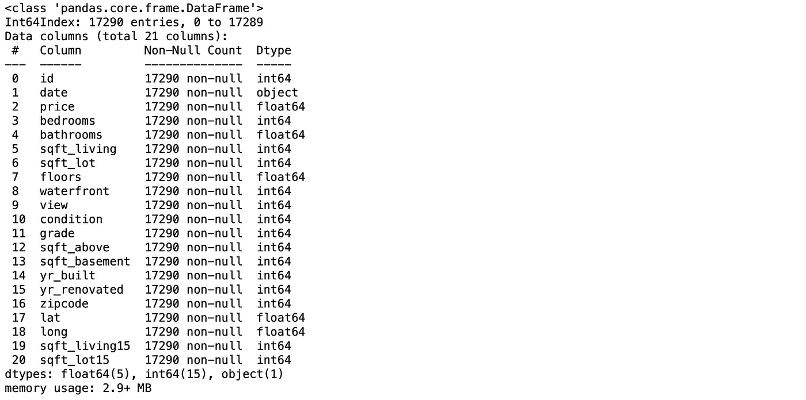
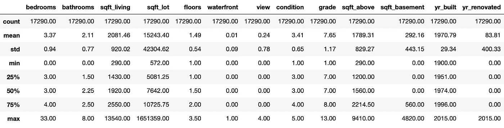
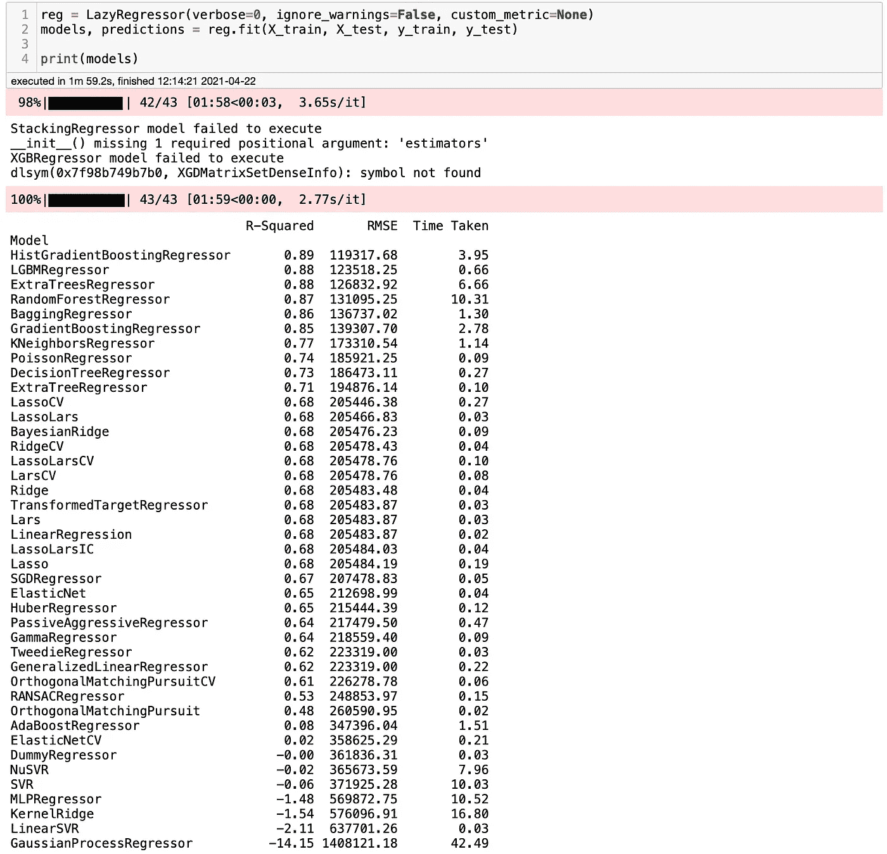
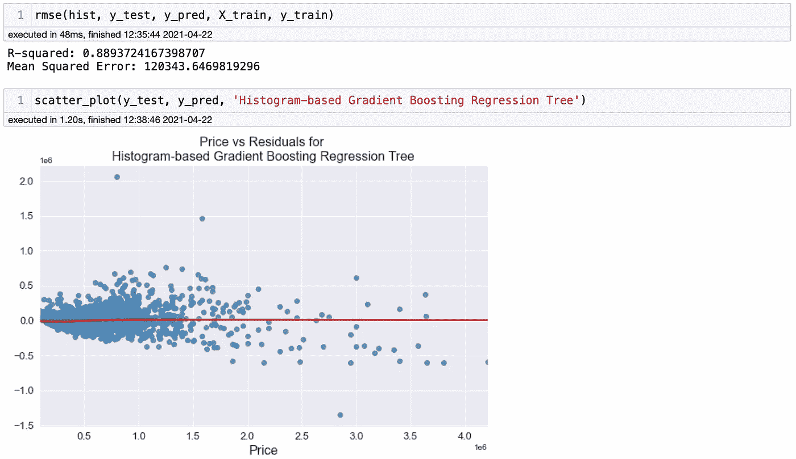

# 如何用几行代码运行 40 个回归模型

> 原文：<https://towardsdatascience.com/how-to-run-40-regression-models-with-a-few-lines-of-code-5a24186de7d?source=collection_archive---------4----------------------->

## 机器学习

## 了解如何使用 Lazy Predict 为回归项目运行 40 多个机器学习模型


图片由[马尔特赫尔姆霍尔德](https://unsplash.com/@maltehelmhold)拍摄。来源: [Unsplash](https://unsplash.com/photos/womNq9OvsKU)

假设你需要做一个回归机器学习项目。你分析你的数据，做一些数据清理，创建几个虚拟变量，现在是时候运行机器学习回归模型了。你想到的十大车型有哪些？你们大多数人可能甚至不知道有十种回归模型。如果你不知道，不要担心，因为到本文结束时，你将不仅能够运行 10 个机器学习回归模型，而且能够运行 40 多个！

几周前，我写了[如何用几行代码运行 30 个机器学习模型](/how-to-run-30-machine-learning-models-with-2-lines-of-code-d0f94a537e52)的博客，反响非常积极。事实上，这是我目前为止最受欢迎的博客。在那篇博客中，我创建了一个分类项目来尝试懒惰预测。今天，我将在一个回归项目上测试懒惰预测。为此，我将使用经典的西雅图房价数据集。你可以在 Kaggle 上找到它。

# 什么是懒预测？

Lazy Predict 有助于在没有太多代码的情况下建立几十个模型，并有助于了解哪些模型在没有任何参数调整的情况下工作得更好。展示其工作原理的最佳方式是一个简短的项目，所以让我们开始吧。

# 带有惰性预测的回归项目

首先，要安装 Lazy Predict，可以把`pip install lazypredict`复制粘贴到你的终端上。就这么简单。现在，让我们导入一些我们将在这个项目中使用的库。你可以在这里找到完整的笔记本。

```
**# Importing important libraries**
import pyforest
from lazypredict.Supervised import LazyRegressor
from pandas.plotting import scatter_matrix**# Scikit-learn packages**
from sklearn.linear_model import LinearRegression
from sklearn.tree import DecisionTreeRegressor
from sklearn.ensemble import ExtraTreesRegressor
from sklearn import metrics
from sklearn.metrics import mean_squared_error**# Hide warnings** import warnings
warnings.filterwarnings(“ignore”)**# Setting up max columns displayed to 100**
pd.options.display.max_columns = 100
```

你可以看到我导入的是`pyforest`而不是熊猫和 Numpy。PyForest 非常快速地将所有重要的库导入到笔记本中。我写了一篇关于它的博客，你可以在这里找到它。现在，让我们导入数据集。

```
**# Import dataset**
df = pd.read_csv('../data/kc_house_data_train.csv', index_col=0)
```

让我们看看数据集是什么样子的。


作者图片

好，现在让我们检查数据类型。

```
**# Checking datatimes and null values**
df.info()
```



作者图片

现在，一些事情引起了我的注意。第一个是`id`列与这个短项目没有任何关联。但是，如果您想更深入地了解项目，您应该检查是否有重复的项目。另外，`date`列是一个对象类型。我们应该将其更改为日期时间类型。列`zipcode`、`lat`和`long`可能与价格的相关性很小或者没有相关性。但是，由于这个项目的目的是展示`lazy predict`，我将保留它们。

现在，让我们检查一些统计数据，看看在运行我们的第一个模型之前，我们是否能找到我们应该改变的任何东西。



作者图片

好吧。我能看到一些有趣的东西。首先，有一个有 33 间卧室的房子。那不可能是对的。于是，我在网上查了一下，原来我是用它的`id`在网上找到的房子，它居然有三个卧室。你可以在这里找到房子。还有，貌似还有 0 卫生间的房子。我将包括至少一个浴室，我们应该完成数据清理。

```
**# Fixing house with 33 bedrooms**
df[df['bedrooms'] == 33] = df[df['bedrooms'] == 3]**# This will add 1 bathroom to houses without any bathroom**
df['bathrooms'] = df.bedrooms.apply(lambda x: 1 if x < 1 else x)
```

# 列车测试分离

现在，我们已经准备好进行列车测试分割，但是在此之前，让我们确保代码中没有`nan`或`infinite`值:

```
**# Removing nan and infinite values**
df.replace([np.inf, -np.inf], np.nan, inplace=True)
df.dropna(inplace=True)
```

让我们将数据集分成`X`和`y`变量。我将把数据集的 75%分配给训练集，25%分配给测试集。

```
**# Creating train test split**
X = df.drop(columns=['price])
y = df.price**# Call train_test_split on the data and capture the results**
X_train, X_test, y_train, y_test = train_test_split(X, y, random_state=3,test_size=0.25)
```

娱乐时间到了！以下代码将运行 40 多个模型，并显示每个模型的 R 平方和 RMSE。准备，设置，开始…

```
reg = LazyRegressor(ignore_warnings=False, custom_metric=None)
models, predictions = reg.fit(X_train, X_test, y_train, y_test)print(models)
```



作者图片

哇！对于在这上面花费的工作量来说，这些结果是很棒的。对于普通模型来说，这些是很好的 R 平方和 RMSE。如我们所见，我们运行了 41 个普通模型，获得了我们需要的指标，您可以看到每个模型花费的时间。一点也不差。现在，你怎么能确定这些结果是正确的呢？我们可以运行一个模型并检查结果，看看它们是否接近我们得到的结果。我们要测试基于直方图的梯度推进回归树吗？如果你从未听说过这个算法，不要担心，因为我也从未听说过。你可以在这里找到一篇关于它的文章[。](https://machinelearningmastery.com/histogram-based-gradient-boosting-ensembles/)

# 复查结果

首先，让我们使用 scikit-learn 导入这个模型。

```
**# Explicitly require this experimental feature**
from sklearn.experimental import enable_hist_gradient_boosting**# Now you can import normally from ensemble**
from sklearn.ensemble import HistGradientBoostingRegressor
```

同样，让我们创建一个函数来检查模型指标。

```
**# Evaluation Functions**
def rmse(model, y_test, y_pred, X_train, y_train):
 r_squared = model.score(X_test, y_test)
 mse = mean_squared_error(y_test, y_pred)
 rmse = np.sqrt(mse)
 print(‘R-squared: ‘ + str(r_squared))
 print(‘Mean Squared Error: ‘+ str(rmse))**# Create model line scatter plot**
def scatter_plot(y_test, y_pred, model_name):
    plt.figure(figsize=(10,6))
    sns.residplot(y_test, y_pred, lowess=True, color='#4682b4',
              line_kws={'lw': 2, 'color': 'r'})
    plt.title(str('Price vs Residuals for '+ model_name))
    plt.xlabel('Price',fontsize=16)
    plt.xticks(fontsize=13)
    plt.yticks(fontsize=13)
    plt.show()
```

最后，让我们运行模型并检查结果。

```
**# Histogram-based Gradient Boosting Regression Tree**
hist = HistGradientBoostingRegressor()
hist.fit(X_train, y_train)
y_pred = hist.predict(X_test)
```



作者图片

瞧啊。结果非常接近我们使用惰性预测得到的结果。好像真的很管用。

# 最后的想法

Lazy Predict 是一个非常棒的库，易于使用，运行速度快，只需要很少几行代码就可以运行普通模型。您可以使用 2 到 3 行代码来手动设置多个普通模型，而不是手动设置。请记住，您不应该认为结果是最终的模型，您应该总是仔细检查结果，以确保库工作正常。正如我在其他博客中提到的，数据科学是一个复杂的领域，懒惰预测不能取代优化模型的专业人员的专业知识。请让我知道它如何为你工作，如果还有任何其他问题。