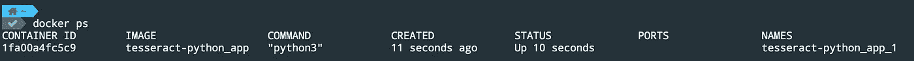

# 如何使用 Docker 容器运行 Python 脚本

> 原文：<https://towardsdatascience.com/how-to-run-a-python-script-using-a-docker-container-ea248e618e32?source=collection_archive---------1----------------------->

## 轻松运行 Python


照片由 [Ales Nesetril](https://unsplash.com/@alesnesetril?utm_source=medium&utm_medium=referral) 在 [Unsplash](https://unsplash.com?utm_source=medium&utm_medium=referral) 拍摄

在这篇文章中，我将解释如何对一个现有的 Python 项目进行 Dockerize。我将使用我的一个 Python [项目](/how-to-extract-text-from-images-using-tesseract-ocr-engine-and-python-22934125fdd5)进行演示。Dockerized 应用程序有很多好处。其中最突出的一点是，其他开发人员可以在没有任何环境管理的情况下顺利运行项目。可以省时省力，开发者可以专注于开发。如果你刚刚开始使用 Docker，那么请阅读下面的帖子，我已经介绍了一些基础知识。

[](/how-to-mount-a-directory-inside-a-docker-container-4cee379c298b) [## 如何在 Docker 容器中挂载目录

### 专注于编写代码，无需担心环境管理

towardsdatascience.com](/how-to-mount-a-directory-inside-a-docker-container-4cee379c298b) 

# 设置

首先，您需要安装 [Docker](https://docs.docker.com/engine/install/) 并从 [GitHub](https://github.com/lifeparticle/tesseract-python) 下载一个 git 库。对于这个设置，我使用的是 macOS。

现在，我将为孟加拉语创建一个包含 Python、Tesseract 和 train 数据的 Docker 映像。让我们来分解一下 **Dockerfile** 文件的各个组成部分。

```
FROM python:3.9.1
RUN apt-get update
RUN apt-get -y install tesseract-ocr
RUN apt-get install tesseract-ocr-ben
ADD . /tesseract-python
WORKDIR /tesseract-python
RUN pip install -r requirements.txt
```

`From`命令用于定义父图像。这里我使用的是 Docker Hub 上预建的官方图片 [Python](https://hub.docker.com/_/python) 。之后，我使用`RUN`命令更新了高级打包工具( [APT](https://en.wikipedia.org/wiki/APT_(software)) ，用于安装 Tesseract OCR 引擎和下载列车数据。使用`ADD`命令，我将把当前文件夹中的所有内容添加到图像中名为 **tesseract-python** 的目录中。之后，我将使用`WORKDIR`命令将工作目录设置为 **tesseract-python** 。最后，使用 pip，我将安装应用程序的依赖项:pytesseract 和 Pillow。

如果你想下载特定的训练数据，那么使用下面的命令。

```
RUN apt-get install tesseract-ocr-[lang]
```

或者如果你想下载所有的训练数据，那么使用下面的命令。

```
RUN apt-get install tesseract-ocr-all
```

现在，我将创建一个 Docker 合成文件，使用我刚刚创建的 Docker 映像运行 Docker 容器。让我们来分解一下 **docker-compose.yml** 文件的各个组成部分。

```
version: "3.8"
services:
  app:
    build: .
    stdin_open: true
    tty: true
    volumes:
      - .:/tesseract-python
```

版本标签用于定义合成文件格式。你可以从[这里](https://docs.docker.com/compose/compose-file/)阅读更多内容。在服务散列下，我们必须定义我们的应用程序想要使用的服务。对于我的应用程序，我只有一个名为 **app** 的服务。现在我正在用我的 Dockerfile 文件建立我的形象。`stdin_open`和`tty`标签用于保持我的容器运行。卷标签用于将文件夹从主机安装到容器。

现在从 **docker-compose.yml** 文件所在的目录运行下面的命令。以下命令将启动并运行整个应用程序。

```
docker compose up
```

现在运行`docker ps`来查看所有正在运行的容器。这里，我有一个。



我可以通过运行下面的命令来访问正在运行的容器`tesseract-python_app_1`。

```
docker exec -it tesseract-python_app_1 bash
```

现在，您可以运行以下命令来查看文件。

```
ls
Dockerfile  LICENSE  README.md ben.txt  docker-compose.yml  eng.txt  main.py  requirements.txt  test_ben.png  test_eng.png
```

让我们使用以下命令运行 Python 脚本。

```
python main.py
```

输出。

```
_ The'quick brown fox' .
-jumps over the lazy:
dog.

পথের দেবতা প্রসন্ন হাসিয়া বলেন-মূর্থ বালক, পথ তো
বীরু রায়ের বটতলায় কি ধলচিতের খেয়াঘাটের সীমানায়.
(তোমাদের সোনাডাঙা মাঠ ছাড়িয়ে ইচ্ছামতী পার হয়ে
পদ্যফুলে ভরা মধুখালি বিলের পাশ কাটিয়া বেব্রবতীর
খেয়ায় পাড়ি দিয়ে, পথ আমার চলে গেল সামনে, সামনে,
শুধুই সামনে...দেশ ছেড়ে দেশান্তরের দিকে, সূর্যোদয় ছেড়ে
সূর্ধান্তের দিকে, জানার গন্ডী এড়িয়ে অপরিচয়ের উদ্দেশে.
```

现在，您可以在主机上更改代码，并在 Docker 容器中运行它，以便进一步开发。

# 包裹

通过使用这种方法，您不必担心安装依赖项和管理环境。此外，其他开发人员可以快速运行项目，而无需任何额外的工作。使用这个过程，您还可以将您的 Ruby、JAVA 或其他项目 Dockerize。编码快乐！

# 相关职位

[](/how-to-run-mysql-using-docker-ed4cebcd90e4) [## 如何使用 Docker 运行 MySQL

### 轻松运行 MySQL

towardsdatascience.com](/how-to-run-mysql-using-docker-ed4cebcd90e4) [](/how-to-run-postgresql-using-docker-15bf87b452d4) [## 如何使用 Docker 运行 PostgreSQL

### 轻松运行 PostgreSQL

towardsdatascience.com](/how-to-run-postgresql-using-docker-15bf87b452d4)