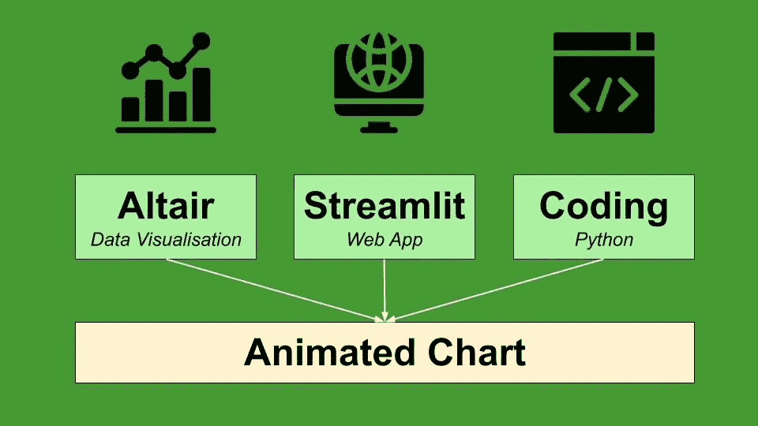
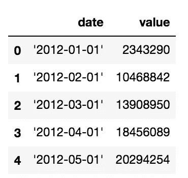

# 如何在 Altair 和 Streamlit 中运行动画

> 原文：<https://towardsdatascience.com/how-to-run-animations-in-altair-and-streamlit-2a0624789ad?source=collection_archive---------17----------------------->

## 数据可视化

## 一个现成的教程，描述了如何使用 Altair 和 Streamlit 构建动画折线图。



作者图片

Altair 是一个非常流行的用于数据可视化的 Python 库。通过 Altair，您可以用几行代码构建非常复杂的图表，因为该库遵循 [Vega-lite](https://vega.github.io/vega-lite/) 语法提供的指导原则。

**不幸的是，Altair 不支持本地动画**，因为通过 Vega-lite 渲染它们很复杂。

在本教程中，我演示了一种将 Streamlit 的功能与 Altair 相结合的机制，以呈现动画折线图。

Streamlit 是一个非常强大的 Python 库，它允许用很少的代码行用 Python 构建 Web 应用程序。

# 设置

首先，我安装所需的库:

```
pip install streamlit
pip install altair
```

为了构建一个 Streamlit 应用程序，我可以编写一个 Python 脚本，它不能是 Jupyter 笔记本的形式，因为目前 **Streamlit 不支持 Jupyter** 。

因此，我创建了一个名为`AltairAnimation.py`的脚本，我将所有需要的库导入到我的脚本中:

```
import pandas as pd
import altair as alt
import streamlit as st
import time
```

然后，我加载数据集。例如，我利用了欧盟统计局数据库发布的 2012 年至 2020 年的意大利游客数量。我利用 Pandas 库来加载数据集:

```
df = pd.read_csv('../sources/tourist_arrivals.csv')
```



作者图片

该数据集包含每月到达的游客人数。我将日期转换成一个`datetime`类型:

```
df['date'] = pd.to_datetime(df['date'])
```

# 构建基本图表

我通过`Chart()`类在 Altair 中构建了一个空图。具体来说，我指定我想通过`mark_line()`函数画一条线。然后，我设置图表的轴(`x`和`y`)以及`width`和`height`。作为`x`轴的默认值，我设置了`1:T`，其中`T`表示一个时间变量。相反，对于 y 轴，我将默认值设置为`0:Q`，其中 Q 表示一个量，即一个数字。

```
lines = alt.Chart(df).mark_line().encode(
     x=alt.X('1:T',axis=alt.Axis(title='date')),
     y=alt.Y('0:Q',axis=alt.Axis(title='value'))
).properties(
    width=600,
    height=300
)
```

我还定义了一个函数，用作为参数传递的数据帧更新图表:

```
def plot_animation(df):
    lines = alt.Chart(df).mark_line().encode(
       x=alt.X('date:T', axis=alt.Axis(title='date')),
       y=alt.Y('value:Q',axis=alt.Axis(title='value')),
     ).properties(
       width=600,
       height=300
     ) 
     return lines
```

# 构建动画

我想建立一个如下的动画:

作者制作的动画

当用户点击开始按钮时，动画开始，并且最初它仅绘制数据帧的前 6 个月。然后，将另外 6 个月添加到图中，以此类推，直到数据框的大小。

这可以通过以下方式实现。首先，我定义了一些辅助变量:

```
N = df.shape[0] # number of elements in the dataframe
burst = 6       # number of elements (months) to add to the plot
size = burst     # size of the current dataset
```

现在我可以构建 Streamlit 接口了。我画了一个图表和一个按钮:

```
line_plot = st.altair_chart(lines)
start_btn = st.button('Start')
```

最后，我可以制作动画:

```
if start_btn:
   for i in range(1,N):
      step_df = df.iloc[0:size]
      lines = plot_animation(step_df)
      line_plot = line_plot.altair_chart(lines)
      size = i + burst
      if size >= N: 
         size = N - 1
      time.sleep(0.1)
```

如果用户点击开始按钮(`if start_btn:`)，则循环开始，直到元素数量`N-1`。构建了部分数据帧，包括第一个`size`元素。然后，在该部分数据帧上构建图表，并更新变量`size`。

# 运行 Web 应用程序

最终，我准备好运行 Web 应用程序了。从命令行，我可以运行以下命令:

```
streamlit run AltairAnimation.py
```

该 Web 应用程序将在以下 URL 提供:

```
**http://localhost:8501**
```

# 摘要

在本教程中，我展示了如何在 Altair 中利用非常强大的 Streamlit 库构建动画。

在[我的 Github 库](https://github.com/alod83/data-science/blob/master/DataVisualization/Altair/AltairAnimation.py)中可以找到实现的 Web 应用的完整代码。

我真的要感谢 [A B](https://medium.com/u/c5b77fc1811c?source=post_page-----2a0624789ad--------------------------------) ，他写了[这篇文章](/add-animated-charts-to-your-dashboards-with-streamlit-python-f41863f1ef7c)，这篇文章激发了我的灵感。

如果你想了解我的研究和其他活动的最新情况，你可以在 [Twitter](https://twitter.com/alod83) 、 [Youtube](https://www.youtube.com/channel/UC4O8-FtQqGIsgDW_ytXIWOg?view_as=subscriber) 和 [Github](https://github.com/alod83) 上关注我。

# 相关文章

</some-interesting-articles-and-resources-on-data-visualisation-that-i-discovered-in-june-c00b58d15946>  </data-visualisation-principles-part-1-white-space-text-and-colour-13f520f90ce9>  </plotly-vs-matplotlib-what-is-the-best-library-for-data-visualization-in-python-89a8b64a9471> 