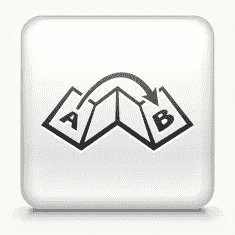
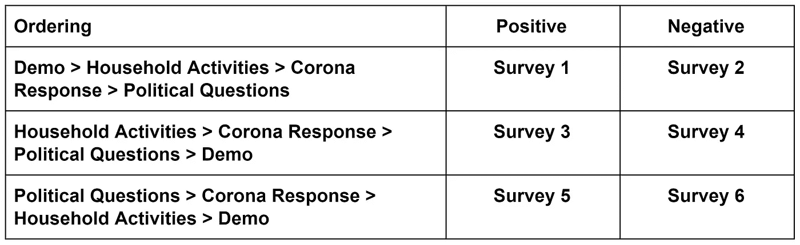
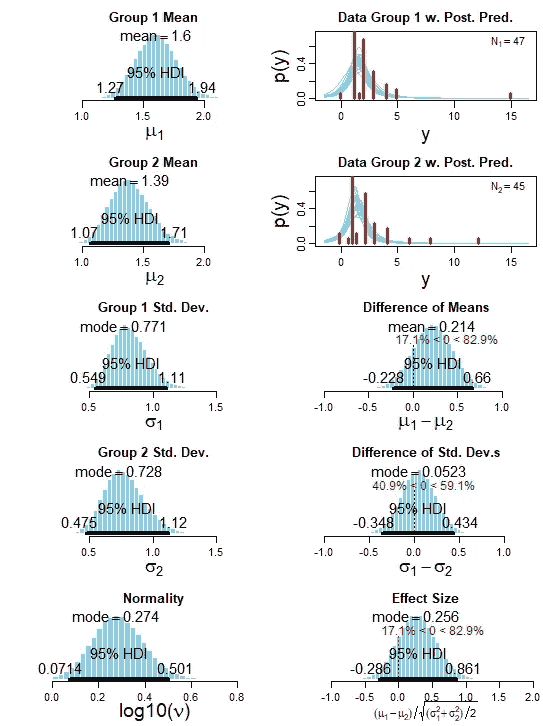

# 如何使用贝叶斯统计运行更好更直观的 A/B 测试

> 原文：<https://towardsdatascience.com/how-to-run-better-and-more-intuitive-a-b-tests-using-bayesian-statistics-480acf4b8679?source=collection_archive---------23----------------------->

## 带有示例和代码的贝叶斯 A/B 测试指南

## 为什么你应该使用贝叶斯 A/B 测试而不是传统的方法

A/B 测试是当今技术、营销和研究中最有用的统计技术之一。它的价值在于 A/B 测试允许你确定因果关系，而大多数分析只揭示相关性(即古训“相关性而非因果关系”)。尽管 A/B 测试的力量和流行，绝大多数遵循一种基于 t-测试的单一方法，这种方法来自 frequentist 统计学派。本笔记将介绍一种使用贝叶斯统计学派的替代方法。这种方法比传统的 frequentist 方法返回更直观的结果，以及一些有用的额外见解。

传统的频率主义方法使用假设作为 A/B 测试的框架。零假设通常是现状，例如，A 的平均值等于 B 的平均值，替代假设测试是否存在差异，例如，A 的平均值大于 B 的平均值。选择一个置信水平，例如 5%,实验可以有两个结论之一:

1.  我们拒绝零假设，接受 95%置信度的替代假设，例如，A 的均值大于 B 的均值，或者
2.  我们不会以 95%的置信度拒绝零假设，也就是说，我们无法对 A 和 b 之间的均值差异做出结论。

这种语言不是我们在商业中倾向于说的，对于不太熟悉 A/B 测试的人来说，可能很难理解。特别是，第二个结论没有提供太多的洞察力；花费时间和金钱进行测试后，你只能得出结论，没有任何结论是可能的。(关于这种方法的更多信息，请查看我之前关于用 Python 实现 A/B 测试的帖子)。

相反，贝叶斯方法关注的是概率。如果测试上面的同一个示例，假设 A 的均值等于 B 的均值，贝叶斯方法将计算均值的估计差异以及一个大于另一个的概率，而不仅仅是均值差异是否为 0。在我看来，贝叶斯方法优于频率主义方法，因为它能以特定的概率有效地接受和拒绝零假设。这种方法提供了更有用的建议。两个示例结论(类似于 frequentist 结论)是:

1.  平均值 A 有 99%的概率大于平均值 B(这个例子拒绝了零假设)
2.  平均值 A 有 65%的概率大于平均值 B(这个例子不会拒绝零假设)

这种语言给出了结论的可能性，以便决策者有权选择自己的风险承受能力，并避免了无法拒绝零假设和无法得出结论的情况。

更有用的是，它可以计算均值之间的估计差值。这意味着贝叶斯检验的一个可能结论是“平均 A 估计比平均 B 大 0.8 个单位，平均 A 比平均 B 大的概率为 83%”。另外，贝叶斯方法还可以比较 A 和 B 的方差，并固有地管理异常值。

贝叶斯方法的缺点是支持它的数学可能更具挑战性。很好地理解贝叶斯统计和马尔可夫链蒙特卡罗抽样是有帮助的，但不是完全关键的。

接下来的部分将通过一个例子来展示如何使用贝叶斯方法进行 A/B 测试，以及用 r。

## A/B 测试数据概述

为了演示贝叶斯方法，我将使用我在 2020 年初进行的一组调查的数据。调查包括围绕 3 个主题的 13 个问题，涉及受访者对抗击冠状病毒措施的看法(4 个问题)、受访者对政府应对冠状病毒措施的认可程度(3 个问题)和一般家庭活动问题(5 个问题)。完整的问题列表包括 [**此处**](https://github.com/RobbieGeoghegan/bayesian_abtesting/blob/main/Survey%20Questions.pdf) 。在这个例子中，我们将关注那些有数字答案的问题，比如“你一天花多少时间和你的家人或室友在一起？”

调查设计包括 6 个相似但不同的调查版本。运行这些略有不同的调查的目的是 A/B 测试它们之间的差异是否会导致统计上不同的结果。每项调查的不同之处在于问题的顺序或者问题以肯定或否定的方式表达。一个积极措辞与消极措辞的例子是:

*   正面:你认为政府**建议的**社会距离会持续多久？
*   否定:你认为政府规定的社交距离会持续多久？

下表显示了不同调查版本的汇总。共记录了 291 份调查回复，每个调查版本包含 45-47 份回复。这意味着调查 1 的结果可以与调查 3 和调查 5 的排序差异进行比较，也可以与调查 2 的措辞差异进行比较。

调查版本概述

## 贝叶斯分析

以下分析主要基于 2012 年 Kruschke 和 R package BEST 的研究论文“[贝叶斯估计取代 t 检验](https://cran.r-project.org/web/packages/BEST/vignettes/BEST.pdf)”。代码在我的 [**Github**](https://github.com/RobbieGeoghegan/bayesian_abtesting) 中。

与任何贝叶斯估计一样，这种贝叶斯技术利用一组先验信念，这些信念用来自数据的证据进行更新，以返回一组后验分布。以下分析根据 Kruschke - 2012 使用 t 分布和马尔可夫链蒙特卡罗算法，以及对后验分布影响有限的不明确先验。不明确的先验对后验分布有最小的影响，这对本研究是有用的，因为本研究没有基线或先验信念集可以容易地进行比较。这种方法对于管理异常值也是有效的，并且只需要对一个出错的数据点进行调整。

如果前一段有点复杂，不用担心。您仍然可以通过下面的步骤得到一个易于解释的输出。要了解更多，请阅读 Kruschke 的论文。

**第一步:加载包和数据**

第一步是安装所需的软件包。我们将使用使用 JAGS 包装的最好的包装。[在运行 BEST 之前先下载 JAGS](https://sourceforge.net/projects/mcmc-jags/files/) 。下一个安装最佳。一旦这一切都完成了，加载包。

还要加载数据并为分析做好准备。我们使用的是 survey_data_v2.csv，可以在[这里](https://github.com/RobbieGeoghegan/bayesian_abtesting/blob/main/survey_data_v2.csv)找到。

加载包和数据

**第二步:创建贝叶斯分析函数**

接下来，我们要创建一个函数，允许我们选择要比较的调查版本以及测试要比较的调查问题。该函数运行马尔可夫链蒙特卡罗抽样方法，构建我们测试的后验分布，即一个均值大于另一个均值的概率以及均值的估计差异。

为贝叶斯分析创建函数

**第三步:运行测试**

最后，选择两组数据进行比较。在本例中，我们将使用调查版本 1 和 2，并比较问题 2。改变函数变量来测试不同的调查和问题。

运行测试

**步骤 4:解释输出**

运行上述代码后，会弹出一个窗口，显示以下输出。它主要显示代表后验分布的 100，000 个可信参数值组合的直方图。

贝叶斯 A/B 测试的输出

A/B 测试最重要的输出是显示均值差异的中右分布。对于我们的示例，它显示平均而言，平均值 A 比平均值 B 大 0.214 个单位，平均值 A 比平均值 B 大 82.9%的概率。该结果是 A/B 测试的主要结论。注意，传统的 t 检验会简单地返回结果，即我们不能在 95%的置信度下拒绝零假设。

另一个输出显示了用于解释数据的其他有用信息。右上角的两个以 y 为轴的图表显示了测试数据的实际分布。其他图显示了后验分布。左侧图中的五个直方图显示了对应于五个先前直方图的个体后验概率。右下角的图表显示了 A 组和 b 组之间的比较。

## 关键要点

与传统的频繁测试方法相比，贝叶斯方法有三个主要优点:

1.  一组更直观的结果，例如，平均值 A 比平均值 b 大 82.9%。
2.  包括 A 和 B 之间的差的大小，例如，平均值 A 估计比平均值 B 大 0.214 个单位
3.  不受无效假设未被拒绝的结果的约束。

这些优势结合起来形成更有用和直观的建议，使决策者能够更好地理解测试结果并选择自己的风险水平。

## 买我的儿童读物来支持我:[mybook.to/atozofweb3](https://t.co/MqawDdMQ2X)

## Github 知识库

https://github.com/bondicrypto/bayesian_abtesting

## 参考

[1]约翰·克鲁施克，“贝叶斯估计取代了 t 检验。”实验心理学杂志。第 142 卷，第 3 期，2012 年，第 142 页。573–603，2021 年 1 月 3 日访问，

[2]加洛，艾米 2017。《哈佛商业评论》A/B 测试回顾，2021 年 1 月 3 日

[3] Hussain，Noor Zainab 和 Sangameswaran，S. 2018，2018 年全球广告支出将增长 4.5%:Zenith，路透社，2021 年 1 月 3 日获取，

[4] Lavorini，Vincenzo，用 Python 进行贝叶斯 A/B 测试:面向数据科学的简易指南，2021 年 1 月 3 日访问，

[5]maza arenu，E. 2019，美国市场研究—统计与事实，Statista，2021 年 1 月 3 日访问，<https:>。</https:>

[6] NSS 2016。贝叶斯统计用简单的英语向初学者解释，分析 Vidhya，2021 年 1 月 3 日访问，