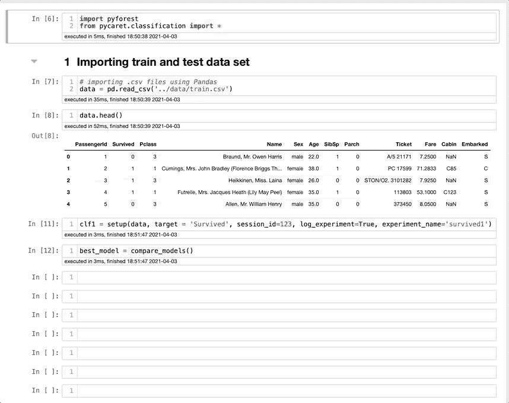
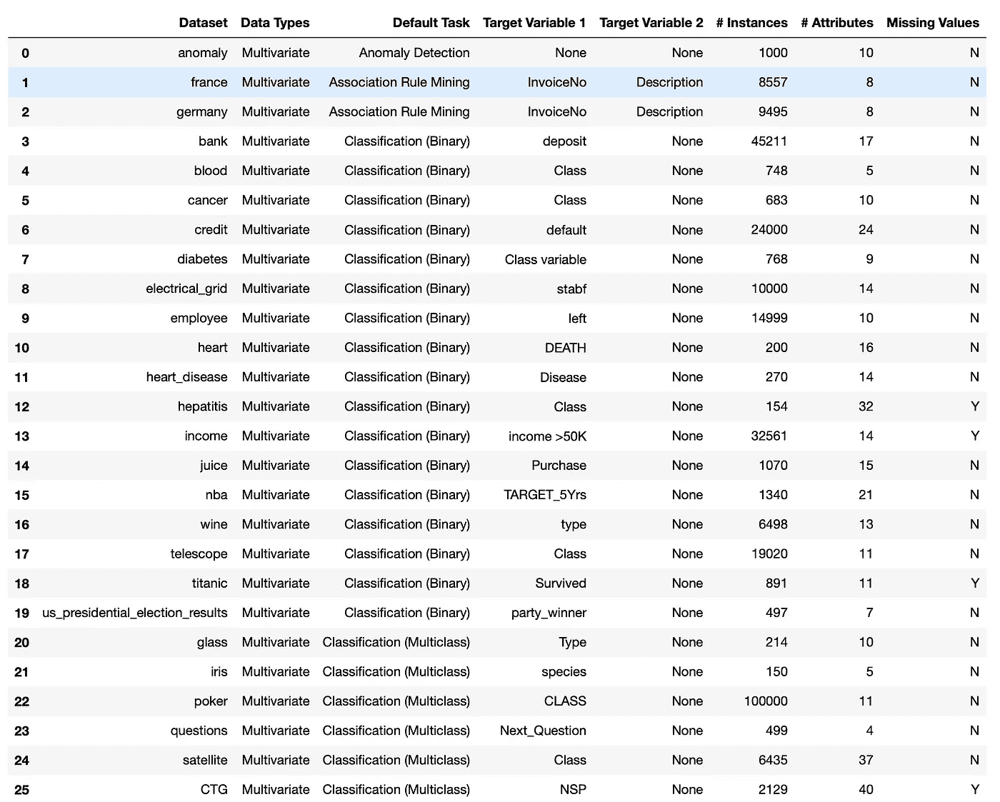
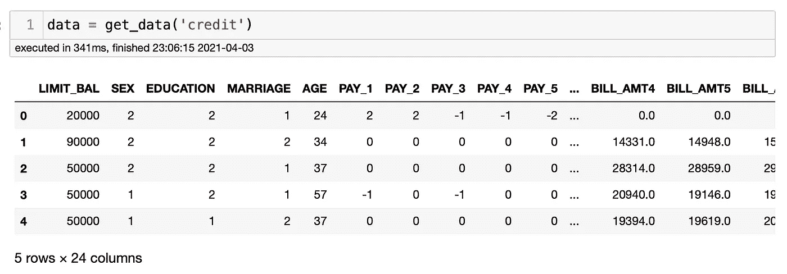
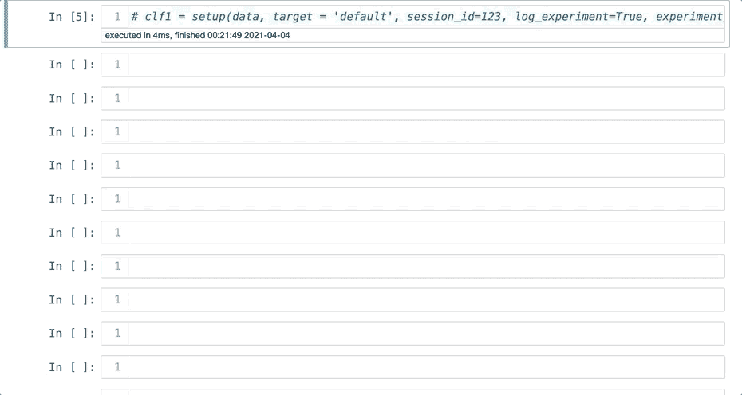
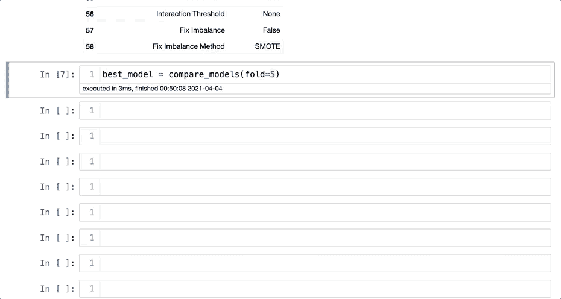
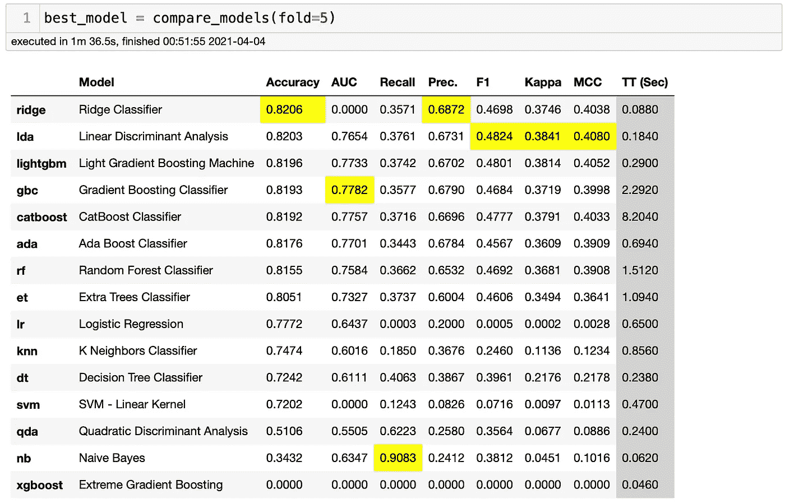
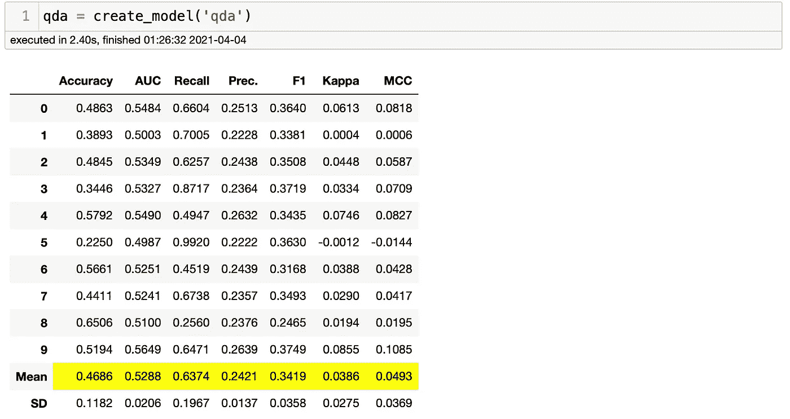
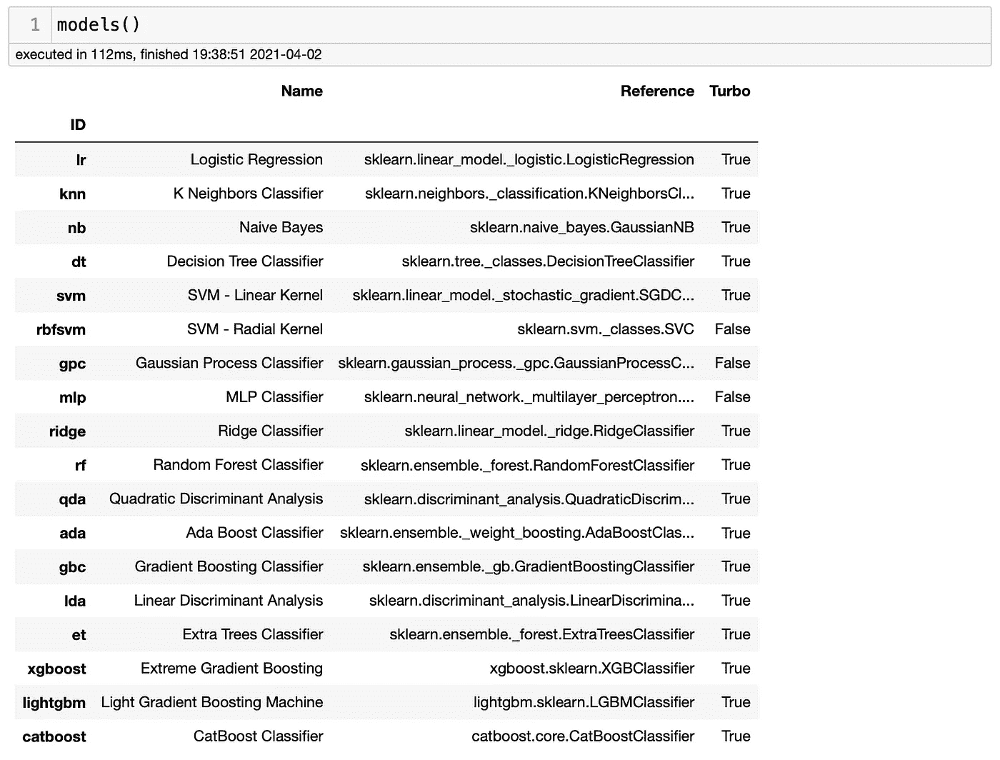
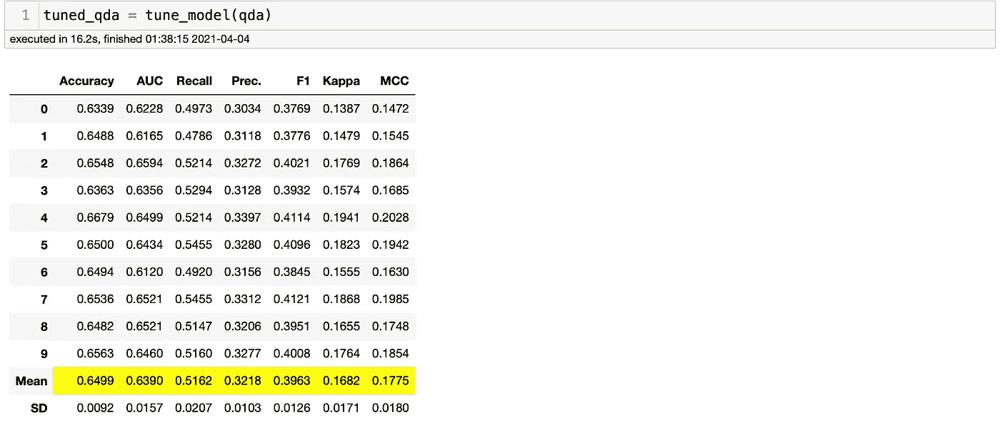
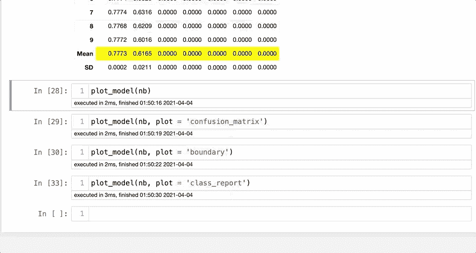

# 如何用两行代码创建复杂的数据科学项目

> 原文：<https://towardsdatascience.com/how-to-run-complex-machine-learning-models-with-2-lines-of-code-e0a541502ee9?source=collection_archive---------25----------------------->

## 机器学习

## 使用 PyCaret 创建一个完整的数据科学项目，从数据清理到复杂的机器学习模型


图片由 Vlada Karpovich 提供。来源:[像素](https://www.pexels.com/photo/close-up-photo-of-laptop-4050467/)

一位读者最近在我的博客中问我是否尝试过`PyCaret`。我答应我会尝试，我很高兴我做到了。`PyCaret`允许你用两行代码运行整个数据科学项目，从数据清理、处理类不平衡，到超调机器学习模型。不相信我？没关系，我第一次尝试的时候也不敢相信，但事实是它确实有效。让我先向您展示一下`PyCaret`的运行情况，然后我们可以更深入地了解这个库。出于演示的目的，我将使用 Titanic Survivor 数据集，它包括分类、数字和`NaN`值。结果如下:



作者图片

下面是刚刚发生的事情:`PyCaret`处理分类数据，将数据集分为训练集和测试集，进行日志实验，检查异常值，修复类不平衡，并在不到 30 秒的时间内运行从逻辑回归到 XGBoost 的模型。它也用两行代码得到了 0.8154 的精度。现在，让我们了解更多关于`PyCaret`的工作原理以及如何使用它。

# PyCaret 是什么？

他们的网站是这样说的:

> PyCaret 是一个用 Python 编写的开源、**低代码**机器学习库，允许您在自己选择的笔记本环境中，在几分钟内从准备数据到部署模型。

看来`PyCaret`言出必行。从准备数据到用 2 或 3 行代码部署监督和非监督模型。我在几个不同的项目中测试了它，包括一些过去工作过的旧项目，结果与我工作一周后得到的结果非常接近。为了向您展示它是如何工作的，让我们一起创建一个分类项目。你可以在这里找到我写这篇博客[用的笔记本。很快我也会发布一个回归项目。敬请期待！](https://github.com/ismael-araujo/Testing-Libraries/blob/main/PyCarat/PyCarat.ipynb)

# 装置

有几种方法可以通过你的终端安装`PyCaret`。强烈建议使用虚拟环境，以避免与其他库冲突。第一个是在您的终端中键入`pip install pycaret`，这是一个精简版的`PyCaret`及其硬依赖。要安装完整版，可以输入`pip install pycaret[full]`，这是我推荐的。

# 开始一个新项目

`PyCaret`对它提供的东西非常有信心，他们的团队给了我们 55 个数据集，你可以自己试试这个库。这些问题包括:异常检测，关联规则挖掘，二元和多元分类，聚类，自然语言处理和回归。

一旦您安装了`PyCaret`，您可以在 Jupyter 笔记本上输入以下内容，以获得他们提供的数据集列表。

```
# Get data
from pycaret.datasets import get_data
from pycaret.classification import *
index = get_data('index')
```

数据集的列表很长，我不会在此添加所有数据集，但您可以从以下分类数据集中进行选择:



作者图片

对于这个项目，我将与信用卡默认项目。这有点挑战性，而且非常接近现实生活中的问题。要选择数据集，您只需键入`data = get_data('name_of_the_dataset')`。由于我们将测试信用卡默认数据集，我们需要键入`data = get_data('credit')`并运行单元格。



现在，我们已经做好了数据准备。这需要一行代码。`PyCaret`将返回一个包含数据集信息的表格，我们将能够决定如何继续。为此，我们将设置数据集、目标标签、实验名称等。下面是代码中最重要的部分:

```
clf1 = setup(data, target = ‘default’, session_id=123, log_experiment=True, experiment_name=’default1')
```

运行以下代码后，我们将得到以下问题:*以下数据类型已被自动推断，如果它们是正确的，请按 enter 键继续，否则键入' quit'。*键入`enter`继续。



作者图片

上面这段代码所做的是通过数据清理、训练测试分割、测试日志转换、多项式、转换类别数据、解决类别不平衡，以及你能想到的任何其他数据准备。你可以看到我写的`log_transformation = True`是个例子，但是有几十个数据准备选项。我强烈建议您键入`shift + tab`并检查您可以做的所有数据准备工作。我可以就此写一整篇文章(我可能会这样做)，但现在，让我们从基础开始。

# 运行模型

现在，是时候运行基线模型了。到目前为止，在加载数据集之后，我已经编写了一行代码。我们现在将使用另一行代码运行 16 个机器学习模型。我将使用 5 倍的交叉验证。



作者图片

运行所有模型花了 1 分 36 秒，包括一些复杂的集合模型。让我们来看看结果:



作者图片

这里需要注意一些事情。首先，XGBoost 失败了。没关系。我们还有 15 个模型要分析。`PyCaret`为我们提供了多个指标，并强调了每个指标的最佳结果。对于这个项目，我们需要考虑召回指标，当假阴性的成本很高并且我们得到了 0.90 的召回分数时，就会用到这个指标。你也可以通过输入来创建单独的模型，例如`qda = create_model('qda')`。



作者图片

`qda`代表二次判别分析模型。默认情况下，`PyCaret`将测试集分成 10 层。你可以通过输入`qda = create_model('Ada', fold = 5)`来编辑。要查看您可以运行的模型的完整列表、它们使用的库以及缩写，请键入`models()`。



作者图片

您可以键入`tune_models(lr)`来调整超参数。在这种情况下，提高了一些指标，但实际上降低了召回分数。



作者图片

使用`PyCaret`还可以做很多其他的事情，比如分析和解释模型，用维持集测试模型，保存和部署模型。



作者图片

我鼓励您访问他们的网站，查看他们的文档、项目和更多教程。我将在另一篇文章中讨论很多内容。

# 最后的想法

`PyCaret`似乎很神奇，言出必行。然而，正如我总是喜欢提醒读者的那样，数据科学是一个复杂的角色，你不能用几行代码来代替专业人员。如果你喜欢使用`PyCaret`作为你下一个项目的额外步骤，并且理解你的数据集的潜力，那就去做吧。我用多个数据集进行了尝试，结果非常接近我在一个项目中工作了整整一周所能得到的结果。但是，我不建议你把它用于你的最终结果或者作为一种捷径。您可以将它作为流程的一部分添加进来，无需键入几十行代码就能快速获得洞察力。祝你尝试愉快，并告诉我进展如何。

不久我也将发布一个使用`PyCaret`的回归项目，所以请在 Medium 上关注我，了解最新动态。如果你喜欢这篇文章，别忘了留下你的掌声👏。它激励我继续写作。