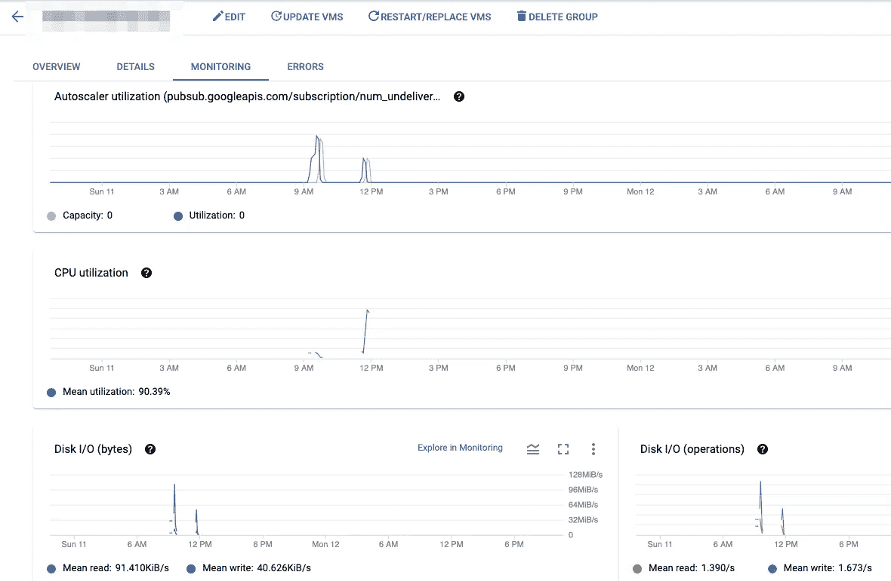

# 如何使用 AWS 和 GCP 上的数千个 Spot 实例运行基于 CPU 的深度学习工作负载，而不会感到头痛

> 原文：<https://towardsdatascience.com/how-to-run-cpu-intensive-workloads-for-deep-learning-with-thousands-of-spot-instances-on-aws-and-85ce9d452f10?source=collection_archive---------40----------------------->

安德烈·沙皮洛在 [Unsplash](https://unsplash.com/?utm_source=unsplash&utm_medium=referral&utm_content=creditCopyText) 上拍摄的照片

深度学习因在训练过程中消耗[大量 GPU](https://medium.com/pytorch/how-3dfy-ai-built-a-multi-cloud-distributed-training-platform-over-spot-instances-with-44be40936361) 资源而臭名昭著。然而，深度学习工作流程中有多个部分需要大量的 *CPU* 资源:

1.  运行大规模**推理作业**
2.  **预处理**输入数据——并将其物化在磁盘上作为
    训练准备

这些工作负载通常具有以下属性:

1.  工作负载(*作业*)会定期触发(相对于持续处理)
2.  *一个*作业由许多*项组成。*每个项目都可以独立于其他项目进行。
3.  项目被读取、处理并写回到某个存储器(通常是对象存储器或集中式文件系统)
4.  在单个 CPU 内核上处理一个项目可能需要几秒到几分钟的时间
5.  用户关心作业的吞吐量，而不是处理单个项目的延迟
6.  单个项目的大小范围从几十 KB 到几 MB 甚至几 GB 的数据
7.  该处理是无状态的—即，如果单个项目的处理失败，可以安全地重试，而不会产生任何副作用。

当您有足够多的项目要处理，并且单个项目的处理足够繁重时，这些作业会消耗大量的 CPU 资源。

很多是多少？

# 工作负载示例—训练数据的 3D 渲染

假设我们想要用在不同环境中拍摄的大量真实世界对象的图像来训练一个模型。制作大量示例的一个好方法是使用合成数据——获取物体的 3D 模型，并从多个角度、照明条件等渲染这些模型的视图。

> 3D 渲染是众所周知的 CPU 密集型工作负载；在单个 CPU 内核上渲染一幅图像可能需要几分钟时间。
> 
> **渲染 250K 的图像会消耗 30K+的 CPU 时间。**

我们如何处理这样的工作量？首先，让我们形式化我们的需求。

# 系统需求

## 一般

1.  **横向扩展至数千个内核**
2.  **通过** **就地运行实例**来最大限度地降低云成本
3.  **最大限度降低基础设施设置和维护成本**

## 用于运行作业的 API

1.  配置每个作业的处理逻辑
2.  配置作业中每个项目所需的 CPU+内存
3.  配置从何处读取/写入数据
4.  提交要处理的作业的所有项目
5.  取消作业(即不处理其项目)
6.  观察每个作业的成功/剩余/失败项目数
7.  观察 CPU/内存消耗(帮助调整资源)
8.  查看每个项目的日志(最好有—搜索日志)

# 逻辑系统设计

这些需求非常适合队列+工人的设计模式。

逻辑批处理系统设计。作者图片

## 逻辑流程

让我们浏览图表，了解每个阶段发生了什么:

1-用户将容器推入容器注册表。
该容器包含所需的处理逻辑和依赖关系。

2-用户将包含要处理的项目的消息排入队列。

每条消息包含:

*   存储中某个项目的 URI
*   可选—控制处理逻辑的配置/元数据

3 —如果需要，计算会自动缩放。
准备就绪后，消息会出队并交给可用的容器。

4 —容器从存储中读取一个项目，对其进行处理，并根据消息中的指令将输出写回

最后，系统会自动收集指标并记录到一个集中的位置。

# 艰难的方式——在 Kubernetes 上自己构建

以下是使用 K8s 实现这一目标所需的几个步骤:

1.  首先—您需要设置 K8s，以便能够管理**数千个节点** —从冗余到调整控制平面等。
2.  创建使用混合策略在现场运行的节点组
3.  部署消息总线——在集群上或集群外部
4.  弄清楚如何向外扩展:
    您是否应该让用户预先指定规模并部署一个副本集+通过更新大小和使用集群自动缩放器杀死空闲节点来找到自动向下扩展的方法？
    或者使用像 [KEDA](https://github.com/kedacore/keda) 那样的动态缩放器？
5.  如果存储是一个共享文件系统，您需要创建持久卷，并自己将它们装入容器；如果是对象存储，我们可能需要将凭证作为秘密传入
6.  通过集中式日志记录和监控添加完整的可观察性堆栈
7.  用 Terraform 将它转化为红外线代码
8.  等等。

> 这对于大多数团队来说是不可行的，因为工作量非常大，尤其是需要旋转和管理集群中成百上千的节点，即使是临时的

# 编辑—其他基于集群的解决方案

**这一部分是在 LinkedIn 上热烈讨论后添加的。**

除了 K8s 之外，还有其他解决方案可以帮助管理横向扩展工作负载，例如 Ray、Dask 甚至 Spark。

所有这些工具的共同点是，它们都有集群的概念，为机器之间需要交换数据的工作负载而构建，并且至少需要一些机器之间的某种形式的通信(例如，主对工人)。

当您扩展到 1000 个节点时，这种管理和通信会引入各种边缘情况，处理起来并不容易。如果您部署了集群，您就拥有了它。即使在像 EKS 这样的“托管”集群中，您仍然需要确保它正常运行。

> 在推理/预处理中—在节点通信的集群上运行没有任何附加价值。这些是不共享的工作负载。集群组件只是一个负担。相反，你想要的是提供你的代码和要处理的项目列表，并让计算机为你处理它。

这让我们有了更简单的选择…

注意:如果您的工作负载是用 Python 之外的语言编写的，或者需要不寻常的操作系统级库，并非所有上面提到的集群管理器都支持它。

# 简单的方法—利用托管解决方案

## 自动警报系统

AWS 为这种类型的工作负载构建了完美的工具，恰当地命名为
[AWS Batch。](https://aws.amazon.com/batch/)

大规模批处理系统的 AWS 批处理解决方案。作者图片

让我们浏览图中的实体，并解释其工作原理:

**计算环境**

计算资源集合；可以包含多种节点类型，包括定点或按需节点。

计算环境指定其混合/最大大小，其中将最小值设置为 0 使其能够在没有工作要执行时扩展到零。
横向扩展时，计算环境基于*实例模板创建实例。*

AWS 批量计算环境。作者图片

**实例模板**

关于如何初始化实例的标准 EC2 构造。
可以包含向实例添加挂载等指令。

**队列**

AWS Batch 为您管理队列。每个队列都连接到一个特定的计算环境。这使我们能够轻松地为单独的作业创建单独的队列，并将作业相互隔离，使它们不会争用资源。

**作业定义(注意:*AWS 批处理术语中的作业*是单个*项目* )** 单个项目处理的模板。
指定:

*   docker 图像。变量和其他详细信息
*   来自主机的装载点
*   此类作业所需的计算资源(CPU/mem 甚至 GPU)
*   如何将参数从消息传递到容器的入口点。

**用户 Docker 图片**

在 AWS Batch 中，用户的 docker 需要包含一个可以处理队列中单个项目的命令。它的返回代码用于确定处理是成功还是失败。

**工单**
单*项*要处理。与*作业定义*有“实例”关系，包含处理特定项目的特定参数值。

作业对象是我们插入到队列中执行的对象。

**将流程整合在一起**

*   用户将*作业*放入*队列。*作业*引用了一个*作业定义**
*   如果需要，c *计算机环境*通过从*实例模板*创建一个新节点来扩展
*   系统根据新实例上的*作业定义*启动一个容器
*   系统从*队列*中弹出一个项目
*   系统调用容器上的*处理命令*，并从*作业的*主体向其传递*参数*
*   命令的返回值用于确定处理是成功还是失败。

**可观察性**

AWS Batch 提供了一个仪表板，其中显示了所有队列、多少作业(项目)正在等待/运行/成功/失败，以及对日志的访问。

日志是在项目级别上提供的，跨项目搜索日志并不容易。要获得基础架构级别的监控，您需要在底层 ECS 集群上**启用容器洞察**。

AWS 批处理作业仪表板。作者图片

> **总之，AWS Batch 获得 9/10 作为大规模 CPU 作业的解决方案**

## GCP

GCP 没有针对此类工作负载的内置解决方案。然而，您可以使用较低级别的构建块和少量的粘合代码实现与 AWS Batch 非常相似的东西，而不会比 AWS 产生更多的持续操作开销。

> 该解决方案的本质依赖于 GCP 独有的一个特性:启动一个计算实例的能力，该实例在启动时自动启动带有参数的 docker 容器。

基于 GCP 计算引擎的批处理系统解决方案。作者图片

**托管 Instace 组**

这是一组可以根据条件放大和缩小的实例。该组的实例是从一个*实例模板创建的。*参见*自动缩放*部分。

**实例模板**

定义系统中单个实例的外观:

1.  实例(即容器)的资源— CPU/Mem/GPU。
2.  挂载点
3.  引导时启动容器的配置:

*   Docker 图像
*   命令+参数

> 这些参数是静态的，即从该模板启动的所有容器将以完全相同的命令和参数启动。

*   为容器本身安装
*   **该模板的实例是否可抢占**

**队列**

在这里，您需要使用自己的队列。一个好的选择是为您的环境利用一个 *PubSub 队列*，以及一个默认订阅。

**工作**

*作业*作为定制的 json 有效载荷写入到 PubSub 订阅中；除此之外，它们应该包含处理单个项目所需的所有信息，包括项目的 URI 和任何处理配置

**用户 Docker 图像**

> 因为 GCP 没有提供基于消息调用容器的内置框架，所以从队列中取出工作项是容器的责任。
> 
> 回想一下，在启动时传递给容器的参数是为所有运行在来自同一个模板的实例上的容器指定的。利用这些参数的一个好方法是配置它们来保存容器需要读取的订阅的**名称。**
> 
> 最后，因为容器启动一次，而且只有在它的实例启动时才启动一次，所以容器的 entry 命令需要在一个循环中提取和处理项目，直到队列为空。

**自动缩放**

> *托管实例组*能够基于 Stackdriver 指标进行伸缩。
> 具体来说，您将希望基于“发布订阅中未传递的消息”进行缩放。详见[本帖](https://cloud.google.com/blog/products/gcp/queue-based-scaling-made-easy-with-new-stackdriver-per-group-metrics)。

**将流程整合在一起**

*   用户将包含要处理的项目的消息排入 PubSub *队列*中。
*   *托管实例组*根据*实例模板*使用“订阅不足”*缩放规则*创建新实例
*   当实例启动时，它使用*实例模板*中提供的命令和静态参数运行用户的*容器*
*   用户的命令循环运行:从队列中弹出一个项目，处理它，等等。
*   当队列为空时，*管理实例组*将缩小所有实例

**可观察性**

GCP 提供了比 AWS 更方便的记录和监控解决方案；您可以搜索现成的日志流，查看实例组级别的指标以及单个机器等。

GCP 管理的实例组监视仪表板。作者图片

# 将功能包装在 SDK 中

为了便于采用这样的系统，明智的做法是为用户提供一个 CLI/SDK 来处理具体细节。

SDK 的主要 API 用于提交新的作业进行处理，通过指定:

1.  作业名
2.  队列名称(或自动创建一个与作业同名的新队列)
3.  代表计算模板的名称(可以是作业定义或具有适当 InstanceTemplate 的 ManagedInstanceGroup 的名称)
4.  URI 待加工物品清单

然后，SDK 将使用底层云提供商的 API 来:

1.  如果需要，创建队列(在 GCP，这意味着以编程方式为作业创建新的实例模板和托管实例组)
2.  构造消息并将其放入队列，做一些事情，如转换路径或 ID，以便远程容器可以访问它们等。

注意:
可以添加更多的 API，例如获取工作进度报告等。

# 摘要

随着团队在深度学习模型的开发过程中继续充分利用他们的数据，他们通常需要运行大型 sclae CPU 密集型工作负载的能力。

这些批处理作业执行一些任务，例如对大型数据集执行推理，或者将大文件预处理成更有用的表示形式。

这些大规模作业可能需要数千个 CPU 内核，并对自我管理的基础架构提出了巨大的扩展挑战。

在这篇文章中，我们介绍了如何构建一个框架，以经济高效的方式在 GCP 和 AWS 中运行这样的工作。