# 如何运行脸书-先知预测 X100 更快

> 原文：<https://towardsdatascience.com/how-to-run-facebook-prophet-predict-x100-faster-cce0282ca77d?source=collection_archive---------6----------------------->

## 向量化先知的不确定性建模

*   01/25/23 编辑:FB 工程师将本文中的解决方案集成到版本 1.1.2 的包中。由于一些实现上的差异，它仍然比本文最后的解决方案稍慢，但不是很慢。
*   如果您对学习矢量化和 Prophet 的内部工作方式不感兴趣，而只想更快地运行 Prophet，您可以跳到**TL；**博士在最后。

# 脸书先知

脸书的用于时间序列预测的 [Prophet](https://facebook.github.io/prophet/#:~:text=Prophet%20is%20a%20procedure%20for,several%20seasons%20of%20historical%20data) 包于 2017 年发布，自此成为最受欢迎的预测算法之一:[据 PyPy](https://pepy.tech/project/fbprophet) 称，Prophet 被下载了约 2000 万次。尽管有人批评[模型的准确性](https://www.microprediction.com/blog/prophet)以及许多机器学习应用程序向神经网络发展的总体趋势，下载流仍在继续。Prophet 的受欢迎程度可能源于其简单的开箱即用、置信区间、清晰的可视化，以及它经常胜过经典统计算法(ARIMA、ETS)的事实。

无论多受欢迎，Prophet 都有一个巨大的缺点:它非常慢，并且不能扩展到数十万个项目。

让我们尝试运行以下代码，创建一个随机时间序列:

```
import pandas as pd
import numpy as np
import datetime
from fbprophet import Prophetn = 100
some_data = pd.DataFrame({‘ds’:pd.date_range(datetime.datetime(2020,1,1,), freq=’W’, periods=n), ‘y’: np.random.rand(n)})
```

现在让我们测试运行时间:

```
%%timeit
prophet = Prophet(interval_width=0.8)
prophet.fit(some_data)
```

输出:

```
# 91.5 ms ± 1.66 ms per loop
```

大约 0.1 秒来拟合数据。但是真正的痛苦出现在“预测”阶段:

```
%%timeit
prophet.predict(some_data)
```

输出:

```
1.15 s ± 55.9 ms per loop
```

得到预测需要整整一秒以上的时间！这是令人惊讶的，因为在大多数 ML 模型中，训练是昂贵的，而预测是廉价的。

在这篇文章中，我们将看到为什么 Prophet 的 predict 函数相对较慢，以及如何让它运行快 100 倍(注意，您仍然必须首先拟合模型，因此 fit+predict 只会看到 5-20 倍的改善)。在这个过程中，我们将学习一些关于时间序列不确定性建模、统计分布和矢量化的知识。

让我们首先解释 Prophet 的不确定性建模及其部分代码，然后展示我们如何轻松地对函数进行矢量化。

# **寻找耗时函数**

如果您[剖析](https://medium.com/@narenandu/profiling-and-visualization-tools-in-python-89a46f578989)这个“预测”代码，您就可以看到错误在哪里。

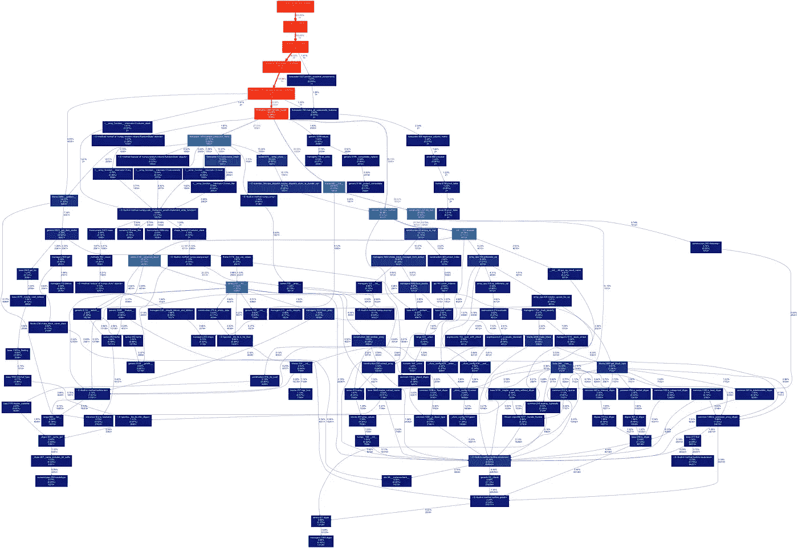

预言家的预测简介。(图片由作者提供)

大概 98%的时间都花在“预测 _ 不确定性”上。此函数在结果数据帧中创建“yhat_upper”和“yhat_lower ”,它们是 80%(或 interval_width 中给定的任何其他值)置信区间的边缘——实际点可能位于此处。

当 Prophet 对不确定性建模时，它会做什么，这需要很长时间？

# **先知的不确定性**

(如果你不熟悉 Prophet 的附加模型，你可能应该从一个[快速概述](/time-series-analysis-with-facebook-prophet-how-it-works-and-how-to-use-it-f15ecf2c0e3a)开始)

Prophet 建模假设数据中有两个不确定性来源:

1.  趋势线周围的高斯残差
2.  更改坡度值

拟合时，Prophet 会在训练数据中找到趋势变化的最佳点，以最佳地拟合数据-假设趋势在任何给定点都是线性的，但趋势的斜率可能会发生变化。自然地，发现的趋势变化越多，相邻斜率之间的差值越大，未来值的不确定性就越大，如这些例子所示。

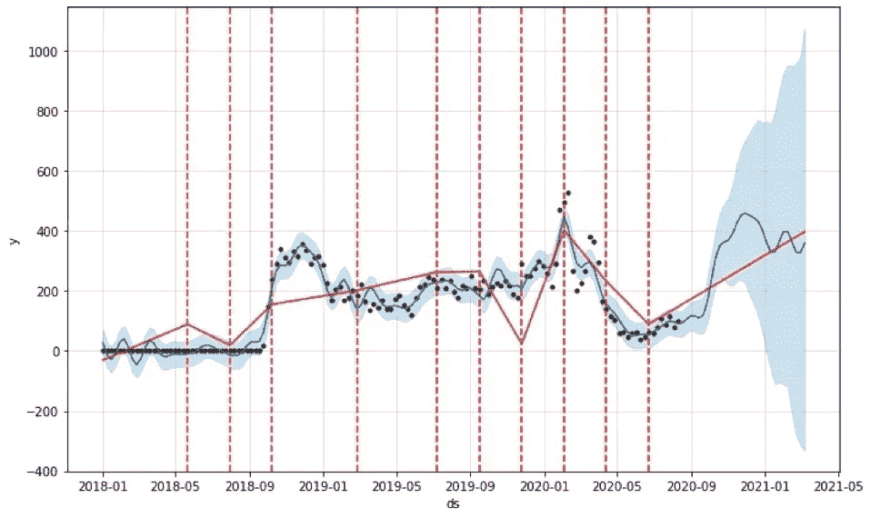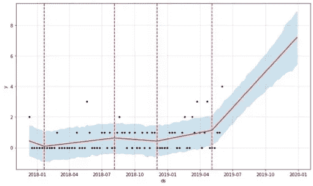

左图:当有许多变化点时，不确定性会快速增长。右图:历史变化点很少(它们之间的差值很小)，不确定性主要取决于历史残差。(图片由作者提供)

如果训练数据中的趋势变化显著且频繁，则未来可能值的范围很大。相比之下，如果趋势在训练数据中相对恒定，我们更确定它将在未来以直线路径继续，在这种情况下，唯一剩余的误差源是我们已经在历史数据中看到的残差(它不随时间增长)。

我们不会讨论 Prophet 如何找到变化点及其增量，这都是在拟合阶段完成的。

# **预测拟合模型中的不确定性**

以下是 Prophet's predict_uncertainty 的“释义代码”(压缩后，为了清晰起见，去掉了一些不重要的部分)(可以直接跳到文字描述):

让我们用文字来概括这个过程:

以下是这些趋势样本的样子:

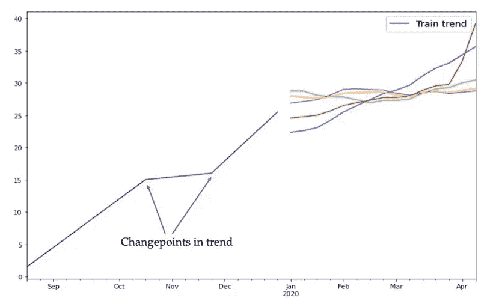

用 fbprophet 随机抽样未来趋势。(图片由作者提供)

训练数据有两个斜率变化。图中显示了五条未来趋势线，注意每条线的变化点数量、发生时间以及斜率之间的差值都是不同的。

Prophet 将高斯噪声添加到这些趋势线中，为我们提供了:

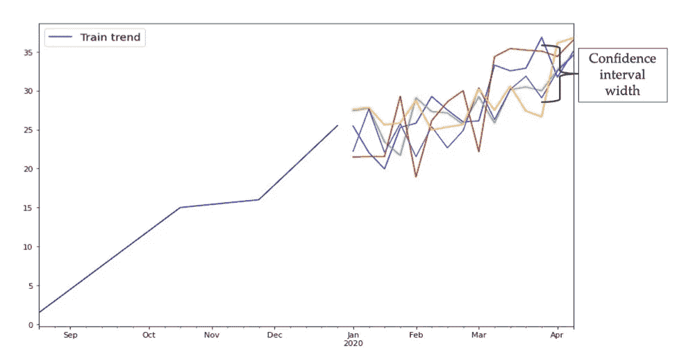

随机抽样期货与 fbprophet，包括随机残差。(图片由作者提供)

最后，它为每个时间步长的值找到 10%和 90%的分位数，给出我们的置信区间。

# **优化运行时间**

我们的目标是通过[向量化它](/vectorization-in-python-46486819d3a)使这个过程更有效。对矢量化的详细解释超出了本文的范围，但可以说，如果我们去除 for 循环并在 NumPy 数组上执行所有操作，该过程将运行得更快。

在我们对代码进行矢量化之前，让我们注意到这个过程的一部分是多余的:均值周围的置信区间的大小仅取决于斜率变化的可能性和大小以及过去的残差；因此，我们不需要连接训练数据的斜率、截距和增量，并评估它们的值。该区间的平均值取决于最终趋势线 yhat，yhat 取决于训练数据截距和斜率，但它是在 predict_uncertainty 开始之前计算的。

我们可以假设斜率=0，截距=0，使用斜率变化的可能性和大小，找到所有时间步长的 10%-90%间隔(例如+/-8)。然后，我们将这个值加到 yhat(例如 17)上，得到置信区间(9-25)。

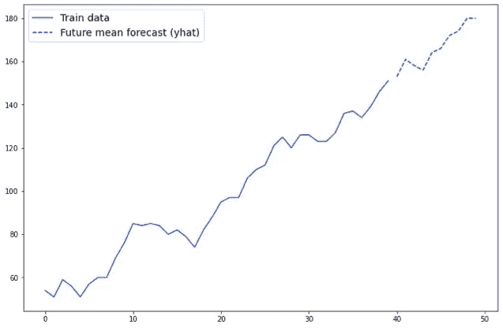

主预测已创建(虚线)

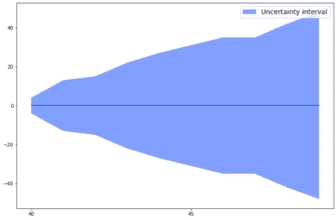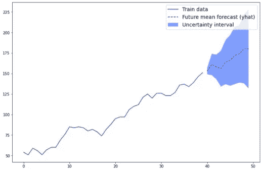

一、不确定性的大小计算在 0 左右。二。该间隔将被添加到主预测中。(图片由作者提供)

请注意，随着时间的增加，置信区间的宽度也会增加(这在直觉上是有意义的)。这是因为我们对未来的预测越多，趋势变化的影响就越大。

# **现在让我们向量化**

请记住，我们的目标是创建一个矩阵，其中每行是一个采样趋势，每列是未来的某个日期。例如

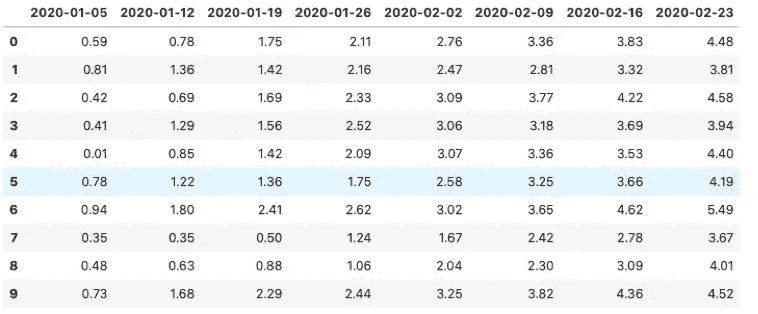

(图片由作者提供)

但是具有 1000+行。

首先，我们需要对斜率变化的数量和位置进行采样。这是 Prophet 从每一行的泊松分布中取样，然后随机分配变点数。没有泊松，我们会得到同样的结果。**在任何时间步长发生变点的可能性由训练数据中观察到的变点数量除以训练数据的长度确定**。假设我们有一个经过训练的 prophet_obj 和一个预测未来日期的 forecast_df，可能性是:

prophet_obj.changepoints_t 是训练数据中发生变化点的时间列表。什么是 single_diff？这是 Prophet 对时间进程建模的结果。

# **先知的时间进程**

在 train 和 predict 函数中，Prophet 将 Pandas 数据帧中的 time(“ds”)列转换为一个名为 t 的数组，表示时间的进展。由于种种原因，训练时 t 在 0-1 范围内比较方便。所以，在训练中，t 是通过将任意两个元素之间的间隔设置为 **1/training_length** 来创建的。例如，如果有 50 个训练数据点，t 等于[0，0.02，0.04，..., 0.98, 1.].对于预测，它将继续以相同的间隔[1.02，1.04...]直到 forecast_df 的长度。

因为 t 数组代表时间的进程，所以它可以用来计算一段时间的进程。例如， **some_coef*t** 创建线性趋势，其中 **some_coef** 代表斜率。因此，**斜率为 4 意味着在每个时间步长中，该系列增加 4*single_diff** (在本例中为 4*0.02)。

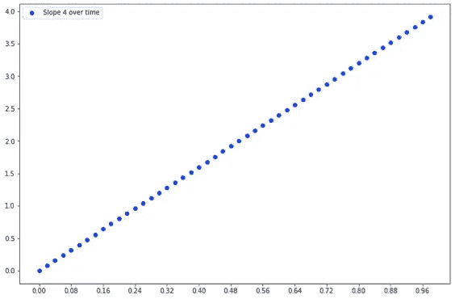

随着时间变化斜率=4 的值(y 轴)( x 轴)。作者图片

# **回到矢量化斜率变化**

我们现在有了在任一给定点斜率变化的可能性。让我们创建一个斜率变化矩阵:

其中 k 是样本数(行数)。结果是一个布尔矩阵:

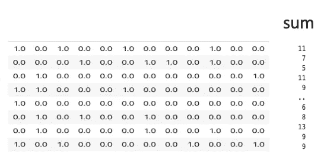

随机布尔变点矩阵。(图片由作者提供)

这就是奇迹发生的地方。取每行的总和，绘制分布图，你会得到:

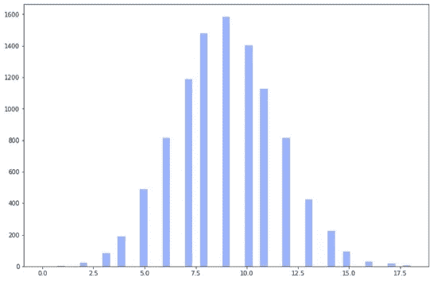

随机布尔矩阵的行和是泊松分布。(图片由作者提供)

**具有似然* len(future_t_time)均值的泊松分布**！准确地从哪个 Prophet 样本中为每一行设置 n_changes！

这直接来源于泊松的定义——如果你有 q 个独立的抽奖，每个抽奖都有 l 为正的可能性，那么你会得到一个平均值为 q*l 的[泊松分布](https://en.wikipedia.org/wiki/Poisson_distribution)。

我们替换了 Prophet 对一行中的变点数量的 for-loop 采样——然后对它们在时间步长中的位置进行采样——并且**用整个矩阵的一行来替换它**！

但是我们不需要一个布尔值来判断是否发生了变化——我们需要变化的增量。这部分很简单:

我们创建一个新的样本矩阵，这个矩阵来自拉普拉斯分布，具有平均绝对训练数据增量的标度。为什么是拉普拉斯？我不知道是否有理论上的正当理由，但这就是 Prophet 所做的，所以我们遵循它(除了 Prophet 为每一行单独执行采样，我们采样一个矩阵)。取两个矩阵的乘积，得到:

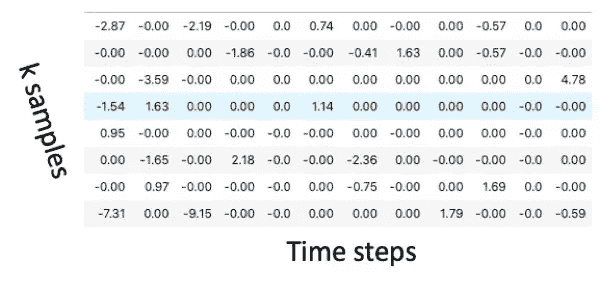

斜率变化值矩阵。(图片由作者提供)

每个时间步长内每个采样趋势的斜率变化(记住行=采样趋势，列=时间步长)。

我们快完成了！现在我们需要从斜率变化过渡到实际预测值。

# **斜率-实际值的变化**

假设我们有下面的**斜率增量**(相邻台阶之间斜率值的变化):【0，1，0，0，-4，0，2】。假设我们从 0 的**实际斜率**开始，每一步的斜率将是[0，1，1，1，-3，-3，-1]，对于每一个时间步，我们取增量之和，或者换句话说:“累计”。

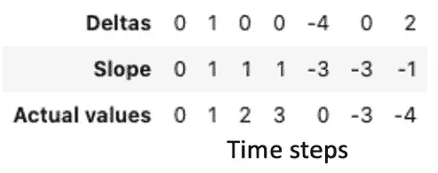

实际值的差值示例。(图片由作者提供)

但是这仅仅给出了每个点的**斜率(而不是斜率增量)。我们想要**实际值**！线性斜率意味着我们在每次迭代中增加斜率值。如果 3 个时间步长的斜率为 2，实际值将为[2，4，6]；很明显，这是另一个坎姆。因此，从斜率增量矩阵过渡到时间序列的实际值:**

记住斜率为 4 意味着 4*single_diff 是实际值，所以我们取这个新矩阵与 single_diff 的乘积。

# **添加高斯残差**

现在我们有了样本趋势矩阵，我们只需要添加高斯噪声:

其中 sigma 是训练数据中趋势的标准偏差。

我们完成了样本矩阵的矢量化创建。如果我们希望置信区间在 10%-90%之间，我们设置

简单地将区间的上下边缘添加到 yhat 预测中。全部完成！除了一些小问题(请随意跳过接下来的 3 个部分)。

# **中期趋势变化**

矢量化代码和 Prophet 之间有一个微小的建模差异。Prophet 允许斜率变化在时间步长之间**发生。例如，如果 t = [1.02，1.04，1.06…]，斜率变化可以设置为 1.028。或者换句话说:如果您的数据代表周一的周值，Prophet 允许周六或其他任何一天的斜率变化。**

我不确定这种建模是否对所有数据集都有意义。还有，从我的经验来看，差别可以忽略不计。

然而，为了完整起见:让我们考虑在第一个实际步骤之前发生的趋势变化(在 1.0–1.02 中)。如果它接近 1.0(前一个星期一)，到时间步长 1.02 时，我们将得到一个完整步长的变化(4*single_diff)。但如果接近 1.02(周日)，斜率变化对那个时间步长影响不大。这种变化可能发生在光谱的任何地方，最好的修正是两个极端的平均值:每一个时间步长都是前一个时间步长(第一个时间步长为 0)。

另一种方法是创建一个具有 k 倍多的列的矩阵，并且改变点的可能性是先前可能性的 1/k。该矩阵将表示比时间序列中的间隔更小的间隔。在 cumsum.cumsum 之后，我们可以提取每第 k 列。但是，这种差异可能是微不足道的。

# **逻辑增长**

默认情况下，Prophet 假设增长是线性的，但您可以将其设置为[逻辑](https://facebook.github.io/prophet/docs/saturating_forecasts.html)，在这种情况下，斜率变化的创建保持不变，但从矩阵到采样趋势的转换完全不同(非线性)。Prophet 为这种转变编写的代码是巨大的，但是将代码转换成矢量化版本是微不足道的。我不会在这篇文章中解释它，但下面给出了矢量化代码供您使用。

# **训练数据**

最后一个问题——以上所有内容都适用于对未来的预测，在这种情况下，趋势值是未知的，因此需要进行采样。但是，有时我们对训练数据调用预测函数。那里的不确定性只取决于趋势周围的高斯噪声，所以我们可以将 sample_trends 设置为零。

# **时间和准确度对比**

矢量化版本的速度有多快？

```
%%timeit
add_prophet_uncertainty(p, forecast_df)
```

输出:

```
2.13 ms ± 139 µs per loop
```

相比之下，原始的、非矢量化的 Prophet 版本为 1s+。这是 500 倍的进步。

它返回的结果和 Prophet 一样吗？相当接近。

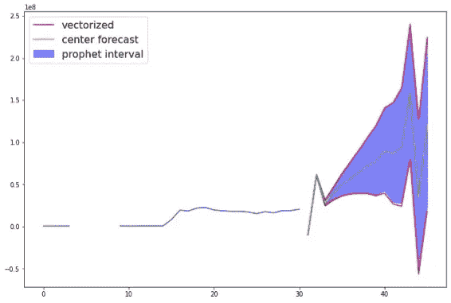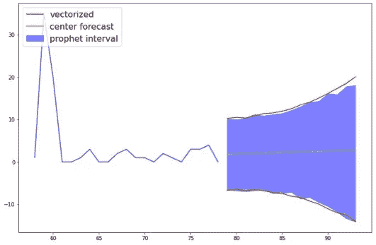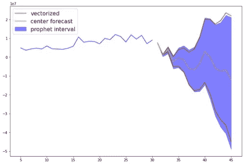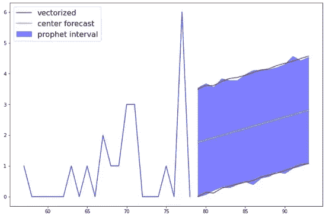

(图片由作者提供)

为什么结果不一样？请记住，这是一个随机过程，由 Prophet 和矢量化代码创建的 1000 个样本不会有完全相同的值。如果标准差很大— 1000 个样本不足以让大数定律生效。再次运行它，你会得到一个稍微不同的结果。事实上，由于矢量化版本快得多，我将 k 样本设置为 10000，这给出了更一致的结果，这就是为什么它比上面例子中 Prophet 的预测更平滑。**即使有 10000 个样本，仍然只需要大约 13 毫秒**。

# **TL；博士**

首先定义这些函数(如果您从不使用逻辑增长—您可以删除 prophet_logistic_uncertainty 及其用法，这占代码的一半以上):

给定一些 training_df，如果您需要训练和预测的不确定性区间，请运行以下代码: