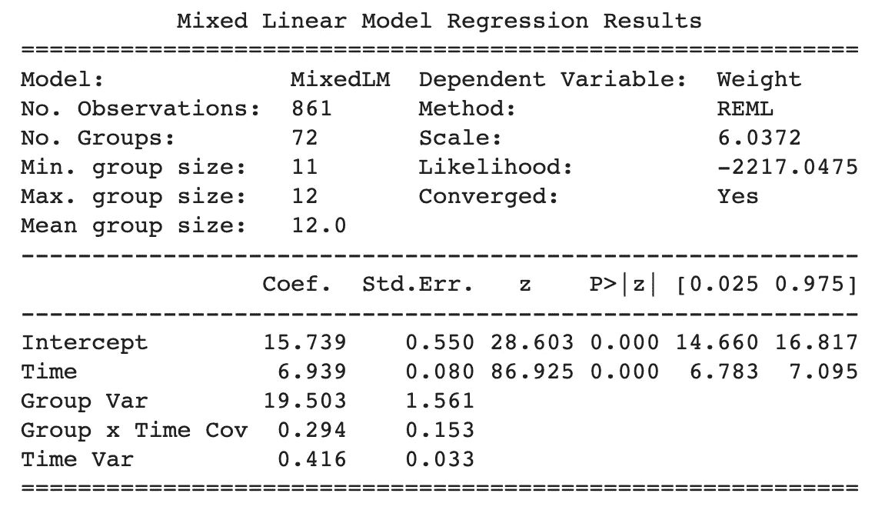

# 在 Python Jupyter 笔记本中运行线性混合效果模型的三种方法

> 原文：<https://towardsdatascience.com/how-to-run-linear-mixed-effects-models-in-python-jupyter-notebooks-4f8079c4b589?source=collection_archive---------4----------------------->

## [实践教程](https://towardsdatascience.com/tagged/hands-on-tutorials)

## 关于如何在 Python 和 Jupyter 笔记本中运行线性混合效应回归(LMER)模型的教程


[森林西蒙](https://unsplash.com/@forest_ms?utm_source=medium&utm_medium=referral)在 [Unsplash](https://unsplash.com?utm_source=medium&utm_medium=referral) 上拍照

我不能完全从 R 切换到 Python 进行数据分析的原因之一是[线性混合效应模型](https://cran.r-project.org/web/packages/lme4/vignettes/lmer.pdf)只在 R 中可用。线性混合效应模型是一种强大的统计方法，在处理纵向、层次或聚类数据时非常有用。简而言之，如果您的数据具有重复的样本、相关数据或自然“分组”，例如来自同一个人的重复响应、按不同地理位置聚类的数据，甚至是来自一组交互的人的数据，您可能希望在分析中使用线性混合效应模型。

您可以从这些资源([林德斯特罗姆&贝茨，1988](https://www.jstor.org/stable/2290128?seq=1) ) ( [贝茨等人，2015](https://www.jstatsoft.org/article/view/v067i01) )中了解更多关于线性混合效应模型或线性混合效应回归(LMER)如何以及为什么有效的信息，但在本教程中，我们将重点关注如何在 Python [Jupyter 笔记本](https://jupyter.org/)环境中运行这些模型。在早期，人们从 Python 中保存数据，在 R 中打开数据并运行 LMER 模型。多年来，R & Python 对彼此有了更好的了解，出现了几种用 Python 运行 LMER 分析的选项。下面是我们将探讨的三个选项，我为每个选项提供了示例代码:

1.  **统计模型中的 LMER**
2.  **使用 rpy2 和%Rmagic 访问 R 中的 LMER**
3.  **Pymer4 无缝接入 LMER R**

这里有一个 Google Colab Jupyter 笔记本来遵循这些方法！

# 统计模型中的 LMER

目前，最简单的开箱即用解决方案是使用 [Statsmodels](https://www.statsmodels.org/stable/index.html) 包中的 LMER 实现(示例[此处为](https://www.statsmodels.org/stable/examples/notebooks/generated/mixed_lm_example.html))。安装最容易，就像`pip install statsmodels`一样简单。安装后，您可以像下面这样运行 LMER。

为了提供更多的背景信息，我们正在分析`dietox`数据集([在此了解更多关于数据集的信息](https://rdrr.io/cran/geepack/man/dietox.html))，以预测猪的`weight`作为`time`的函数，其随机斜率由`re_formula="~Time"`指定，随机截距由`groups=data["Pig"]`自动指定。输出如下图所示，包括系数、标准误差、z 统计、p 值和 95%置信区间。



Statsmodels LMER 输出

虽然这很好，但是用这种语法指定随机效应有些不方便，并且偏离了 LMER 在 R 中使用的传统公式表达式。例如，在 R 中，随机斜率和截距是在模型公式中指定的，在一行中，例如:

```
lmer('Weight ~ Time + (1+Time|Pig)', data=dietox)
```

这导致了我们的第二个选择，即通过 rpy2 在 Python 和 R 之间的直接接口在 R 中使用 LMER。

# 使用 rpy2 和%Rmagic 访问 R 中的 LMER

第二种选择是通过 **rpy2** 接口直接访问 R 中原来的 LMER 包。rpy2 接口允许用户在 Python Jupyter 笔记本环境和 R 环境之间来回传递数据和结果。rpy2 过去在安装上是出了名的挑剔，但是这些年来它变得更加稳定了。要使用这个选项，您需要在您的机器上安装 R 和 rpy2，这可以在 Google Colab 中通过以下代码实现:

第一行使用 Linux 语法安装 R。如果你使用的是 Mac 或 Windows，你可以简单地按照安装说明来完成。下一组命令行安装 rpy2，然后使用 rpy2 安装`lme4`和`lmerTest`包。

接下来，您需要通过运行以下代码，在 Jupyter 笔记本单元中激活 Rmagic。

```
%load_ext rpy2.ipython
```

在这之后，任何以`%%R`开头的 Jupyter 笔记本单元都允许你从笔记本上运行 R 命令。例如，要运行我们在 statsmodels 中运行的模型，您需要执行以下操作:

请注意，该代码以`%%R`开头，表示该单元包含 R 代码。我们还使用了比 statsmodels 更简单的公式表达式，我们能够指定我们的分组是`Pigs`，并且我们正在通过`(1+Time|Pig)`估计随机斜率和截距。这将给出一些结果，如果您在 r 中使用过 LMER，您会更加熟悉这些结果


rpy2 的 LMER 输出

正如我前面提到的，您也可以将您的熊猫数据帧传递给 r。还记得我们之前在 statsmodels 部分加载的`data`数据帧吗？我们可以将它传递给 R，运行相同的 LMER 模型，并像这样检索系数:

`-i data`将我们的 Python 熊猫数据帧`data`发送到 R 中，我们用它来估计我们的模型`m`。接下来，我们从带有`beta <- fixef(m)`的模型中检索贝塔系数，该系数被导出回我们的笔记本，因为我们在第一行`-o betas`中指定了。

这种方法最好的部分是，在运行模型之前，您可以在 R 环境中添加额外的代码。例如，您可能希望确保名为`Evit`的列被识别为带有`data$Evit <- as.factor(data$Evit)`的因子，使用`contrasts(data$Evit) <- contr.poly`为该分类变量指定新的对比，或者甚至在公式本身中重新调整分类数据。当使用 rpy2 从 r 访问 LMER 时，所有这些都可以很容易地实现

总之， **rpy2 接口为您提供了最大的灵活性和访问 LMER 和 R 中附加功能的能力**，如果您正从 R 过渡到 Python，您可能会更熟悉这些功能。最后，我们将使用 **Pymer4** 包来接触一个中间选项。

# LMER 与皮梅尔 4

**Pymer4** ( [Jolly，2018](https://joss.theoj.org/papers/10.21105/joss.00862) )可以作为直接通过 rpy2 使用 LMER 和在 Statsmodels 中使用 LMER 实现之间的一个方便的中间地带。这个包基本上给你带来了使用 R 公式语法的便利，但是以一种更 Pythonic 化的方式，而不必处理 R 魔细胞。


Pymer4 的 LMER 输出


估计值包括随机截距和斜率估计值。

# 结论

我们介绍了在 Python Jupyter 笔记本环境中运行线性混合效果模型的 3 种方法。Statsmodels 可能是最方便的，但是对于已经使用过 R 语法中的 LMER 的用户来说，这种语法可能并不熟悉。使用 rpy2 为您提供了最大的灵活性和能力，但这可能会变得很麻烦，因为您需要使用 Rmagic 在 Python 和 R 单元之间切换。Pymer4 是一个很好的折衷方案，它提供了对 R 中 LMER 的方便访问，同时最小化了语言之间的切换成本。

这里有一个谷歌 Colab Jupyter 笔记本来运行所有的教程。

感谢您的阅读，并随时查看我的其他数据科学教程！

</four-ways-to-quantify-synchrony-between-time-series-data-b99136c4a9c9>  </how-to-correctly-interpret-your-continuous-and-categorical-variable-interactions-in-regressions-51e5eed5de1e>  <https://jinhyuncheong.medium.com/membership> 