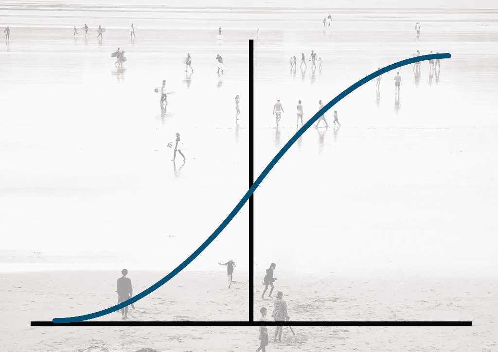

# 如何在 Python 中对聚合数据运行逻辑回归

> 原文：<https://towardsdatascience.com/how-to-run-logistic-regression-on-aggregate-data-in-python-a779ab7970b3?source=collection_archive---------24----------------------->

## 每个数据科学家都应该知道的 3 个简单解决方案



照片由[叶小开·克里斯托弗·古特瓦尔德](https://unsplash.com/@project2204?utm_source=unsplash&utm_medium=referral&utm_content=creditCopyText)在 [Unsplash](/s/photos/group-of-people-beach?utm_source=unsplash&utm_medium=referral&utm_content=creditCopyText) 上拍摄

ι将向您展示 3 种技术，当您想要执行逻辑回归时，它们将帮助您处理 Python 中的聚集数据。

让我们创建一些虚拟数据。

```
import pandas as pd
import numpy as np
import statsmodels.api as sm
import statsmodels.formula.api as smf

df=pd.DataFrame(
{
'Gender':np.random.choice(["m","f"],200,p=[0.6,0.4]),
'Age':np.random.choice(["[<30]","[30-65]", "[65+]"],200,p=[0.3,0.6,0.1]),
"Response":np.random.binomial(1,size=200,p=0.2)
    }
)

df.head()Gender      Age  Response
0      f  [30-65]         0
1      m  [30-65]         0
2      m    [<30]         0
3      f  [30-65]         1
4      f    [65+]         0
```

# 非聚集数据的逻辑回归

首先，我们将对非汇总数据运行逻辑回归模型。我们将使用库[统计模型](https://www.statsmodels.org/stable/index.html)，因为这是我们将用于聚合数据的库，并且更容易比较我们的模型。此外，统计模型可以以更经典的统计方式(如 r)给我们一个模型的摘要。

*提示:如果您不想将分类数据转换成二进制来执行逻辑回归，您可以使用* [*统计模型公式*](https://www.statsmodels.org/devel/example_formulas.html) *来代替 Sklearn。*

```
model=smf.logit('Response~Gender+Age',data=df)
result = model.fit()
print(result.summary())
```

```
Logit Regression Results                           
==============================================================================
Dep. Variable:               Response   No. Observations:                  200
Model:                          Logit   Df Residuals:                      196
Method:                           MLE   Df Model:                            3
Date:                Mon, 22 Feb 2021   Pseudo R-squ.:                 0.02765
Time:                        18:09:11   Log-Likelihood:                -85.502
converged:                       True   LL-Null:                       -87.934
Covariance Type:            nonrobust   LLR p-value:                    0.1821
================================================================================
                   coef    std err          z      P>|z|      [0.025      0.975]
--------------------------------------------------------------------------------
Intercept       -2.1741      0.396     -5.494      0.000      -2.950      -1.399
Gender[T.m]      0.8042      0.439      1.831      0.067      -0.057       1.665
Age[T.[65+]]    -0.7301      0.786     -0.929      0.353      -2.270       0.810
Age[T.[<30]]     0.1541      0.432      0.357      0.721      -0.693       1.001
================================================================================
```

# 聚合数据的逻辑回归

## 1.使用有反应者和无反应者的逻辑回归

在下面的代码中，我们对数据进行了分组，并为响应者( **Yes** )和非响应者( **No** )创建了列。

```
grouped=df.groupby(['Gender','Age']).agg({'Response':[sum,'count']}).droplevel(0, axis=1).rename(columns={'sum':'Yes','count':'Impressions'}).eval('No=Impressions-Yes')
grouped.reset_index(inplace=True)
groupedGender      Age  Yes  Impressions  No
0      f  [30-65]    9           38  29
1      f    [65+]    2            7   5
2      f    [<30]    8           25  17
3      m  [30-65]   17           79  62
4      m    [65+]    2           12  10
5      m    [<30]    9           39  30
```

```
glm_binom = smf.glm('Yes + No ~ Age + Gender',grouped, family=sm.families.Binomial())
result_grouped=glm_binom.fit()
print(result_grouped.summary())
```

```
Generalized Linear Model Regression Results                  
==============================================================================
Dep. Variable:          ['Yes', 'No']   No. Observations:                    6
Model:                            GLM   Df Residuals:                        2
Model Family:                Binomial   Df Model:                            3
Link Function:                  logit   Scale:                          1.0000
Method:                          IRLS   Log-Likelihood:                -8.9211
Date:                Mon, 22 Feb 2021   Deviance:                       1.2641
Time:                        18:15:15   Pearson chi2:                    0.929
No. Iterations:                     5                                         
Covariance Type:            nonrobust                                         
================================================================================
                   coef    std err          z      P>|z|      [0.025      0.975]
--------------------------------------------------------------------------------
Intercept       -2.1741      0.396     -5.494      0.000      -2.950      -1.399
Age[T.[65+]]    -0.7301      0.786     -0.929      0.353      -2.270       0.810
Age[T.[<30]]     0.1541      0.432      0.357      0.721      -0.693       1.001
Gender[T.m]      0.8042      0.439      1.831      0.067      -0.057       1.665
================================================================================
```

## 2.加权逻辑回归

对于这个方法，我们需要创建一个新列，其中包含每个组的**响应率**。

```
grouped['RR']=grouped['Yes']/grouped['Impressions']glm = smf.glm('RR ~ Age + Gender',data=grouped, family=sm.families.Binomial(), freq_weights=np.asarray(grouped['Impressions']))
result_grouped2=glm.fit()
print(result_grouped2.summary())
```

```
Generalized Linear Model Regression Results                  
==============================================================================
Dep. Variable:                     RR   No. Observations:                    6
Model:                            GLM   Df Residuals:                      196
Model Family:                Binomial   Df Model:                            3
Link Function:                  logit   Scale:                          1.0000
Method:                          IRLS   Log-Likelihood:                -59.807
Date:                Mon, 22 Feb 2021   Deviance:                       1.2641
Time:                        18:18:16   Pearson chi2:                    0.929
No. Iterations:                     5                                         
Covariance Type:            nonrobust                                         
================================================================================
                   coef    std err          z      P>|z|      [0.025      0.975]
--------------------------------------------------------------------------------
Intercept       -2.1741      0.396     -5.494      0.000      -2.950      -1.399
Age[T.[65+]]    -0.7301      0.786     -0.929      0.353      -2.270       0.810
Age[T.[<30]]     0.1541      0.432      0.357      0.721      -0.693       1.001
Gender[T.m]      0.8042      0.439      1.831      0.067      -0.057       1.665
================================================================================
```

## 3.展开聚合数据

最后，我们可以“解组”我们的数据，并将我们的因变量转换为二进制，这样我们就可以像往常一样执行逻辑回归。

```
grouped['No']=grouped['No'].apply(lambda x: [0]*x)
grouped['Yes']=grouped['Yes'].apply(lambda x: [1]*x)
grouped['Response']=grouped['Yes']+grouped['No']

expanded=grouped.explode("Response")[['Gender','Age','Response']]
expanded['Response']=expanded['Response'].astype(int)

expanded.head() Gender      Age Response
0      f  [30-65]        1
0      f  [30-65]        1
0      f  [30-65]        1
0      f  [30-65]        1
0      f  [30-65]        1
```

```
model=smf.logit('Response~ Gender + Age',data=expanded)
result = model.fit()
print(result.summary())
```

```
Logit Regression Results                           
==============================================================================
Dep. Variable:               Response   No. Observations:                  200
Model:                          Logit   Df Residuals:                      196
Method:                           MLE   Df Model:                            3
Date:                Mon, 22 Feb 2021   Pseudo R-squ.:                 0.02765
Time:                        18:29:33   Log-Likelihood:                -85.502
converged:                       True   LL-Null:                       -87.934
Covariance Type:            nonrobust   LLR p-value:                    0.1821
================================================================================
                   coef    std err          z      P>|z|      [0.025      0.975]
--------------------------------------------------------------------------------
Intercept       -2.1741      0.396     -5.494      0.000      -2.950      -1.399
Gender[T.m]      0.8042      0.439      1.831      0.067      -0.057       1.665
Age[T.[65+]]    -0.7301      0.786     -0.929      0.353      -2.270       0.810
Age[T.[<30]]     0.1541      0.432      0.357      0.721      -0.693       1.001
================================================================================
```

# 结论

对于所有 4 个模型，我们得出了相同的系数和 p 值。

根据我的经验，我发现获取项目的原始数据并不常见，在大多数情况下，我们处理的是聚合/分组数据。这些技术将帮助你轻松地处理它们，这就是为什么我认为是你的 Python 工具箱的一个很好的附件。

如果你正在使用 R，你可以阅读这个[非常有用的帖子](https://predictivehacks.com/how-to-run-logistic-regression-on-aggregate-data-in-r/)。

以后我会写更多初学者友好的帖子。[在媒体上关注我](https://medium.com/@billybonaros)或[访问我的博客](https://predictivehacks.com/)了解他们。

我欢迎提问、反馈和建设性的批评，你可以通过推特(Twitter)或社交网站(Instagram)联系我。

*原载于*[*https://predictivehacks.com*](https://predictivehacks.com/logistic-regression-on-aggregate-data-python/)