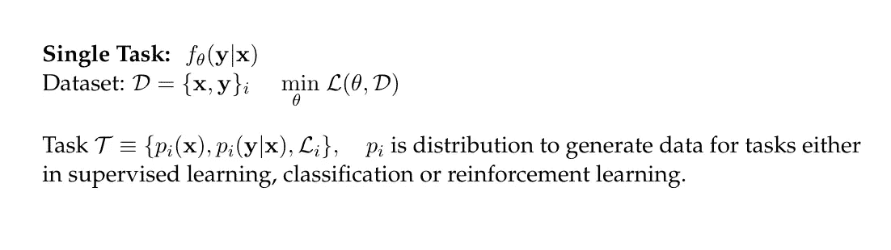
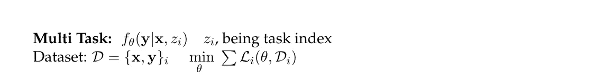
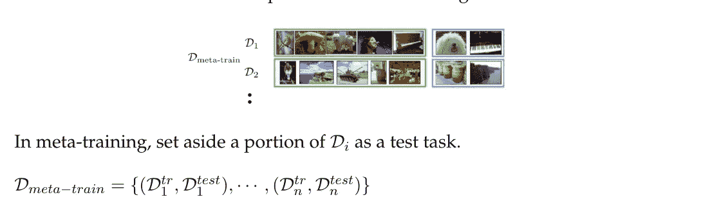
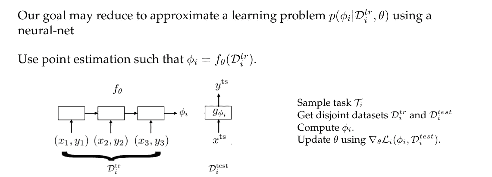
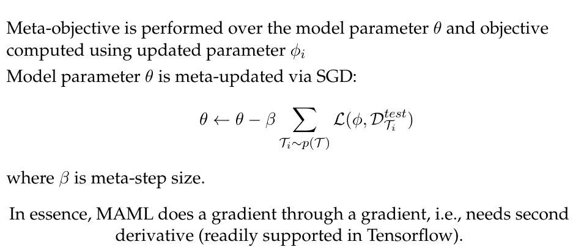
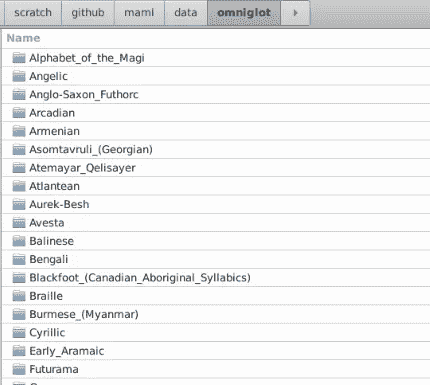

# 如何运行(与模型无关的元学习)MAML 算法

> 原文：<https://towardsdatascience.com/how-to-run-model-agnostic-meta-learning-maml-algorithm-c73040069810?source=collection_archive---------14----------------------->

## MAML 是一类元学习算法


作者图片

MAML 是一类元学习算法，由斯坦福研究中心和加州大学伯克利分校校友切尔西·芬恩博士创建。MAML 受到了这个问题背后的想法的启发，这个问题就是学习一件事情到底需要多少数据。**我们能教算法学会如何学习吗？**

在这样的背景下，传统的机器学习算法面临一些挑战:

1.  需要强化训练
2.  某些问题的标记数据可能是有限的
3.  网络的性能可能对超参数的选择敏感

在这方面，元学习算法可以被设计来处理以下任务:

1.  感应偏置的动态选择
2.  构建多任务学习的元规则
3.  学习如何通过超参数优化来学习

摘自切尔西·芬恩的原始研究:

> MAML 是一种元学习算法，它与用梯度下降算法训练的任何模型兼容，并涵盖分类、强化学习(RL)和回归的问题

# MAML 解决了什么样的问题？

MAML 被设计为在各种任务上训练模型，使得它可以仅用少量训练样本来学习新的学习任务。

MAML 的几个要点是:

1.  MAML 没有增加学习参数的数量。
2.  对模型的架构或网络没有限制。
3.  可以与其他深度学习框架结合，如递归神经网络(RNN)、卷积神经网络(CNN)和多层感知器(MLP)。

# 问题设置

MAML 的问题设置是从原始论文中复制的:



MAML 引入了一个叫做元训练的外部循环。



# 如何运行 MAML 代码？

Chelsea Finn 的 Github repo 提供了重现 MAML 结果的代码。您可以使用以下步骤来重现其结果:

1.  我将创建一个 python 虚拟环境并安装依赖项:
    `sudo apt install virtualenv
    virtualenv — python=python3.6 maml`
    `source maml/bin/activate`
2.  接下来，我们安装依赖项:
3.  `pip install tensorflow==1.11.0
    pip install image` 我没有使用最新版本的 Tensorflow，因为 MAML 代码是几年前写的，当时 TF2 还没有公开发布。
4.  克隆 MAML 回购:
    `git clone [https://github.com/cbfinn/maml](https://github.com/cbfinn/maml)`
5.  下载 omniglot 数据，对于本文，除了正弦示例之外，我将只运行 omniglot 示例:
    `wget [https://github.com/brendenlake/omniglot/raw/master/python/images_background.zip](https://github.com/brendenlake/omniglot/raw/master/python/images_background.zip)
    wget [https://github.com/brendenlake/omniglot/raw/master/python/images_evaluation.zip](https://github.com/brendenlake/omniglot/raw/master/python/images_evaluation.zip)`
6.  将 images_background 和 images_evaluation zip 文件解压到`maml/data/omniglot`文件夹，其中`mamal`文件夹是 Github repo 文件夹。目录结构如下所示:



7.导航到`maml`文件夹的`data`子文件夹，将`omniglot`的内容复制到`omniglot_resized`。运行调整图像大小脚本

```
cd maml/data
cp -r omniglot/* omniglot_resized/
cd omniglot_resized
python resize_images.py
```

8.现在，我们回到 maml repo
的根目录，运行两个示例:

**a .正弦曲线示例:**

```
python main.py --datasource=sinusoid --logdir=logs/sine/ --metatrain_iterations=70000 --norm=None --update_batch_size=10
```

**b. omniglot 示例:**

```
python main.py --datasource=omniglot --metatrain_iterations=60000 --meta_batch_size=32 --update_batch_size=1 --update_lr=0.4 --num_updates=1 --logdir=logs/omniglot5way/
```

每个例子的检查点都会保存在`log/`目录下。

**更新:**我发现代码库中有一个 bug。我认为这个漏洞可能是无意中引入的。在`main.py`中，第 160 行`saver.save(sess, FLAGS.logdir + ‘/’ + exp_string + ‘/model’ + str(itr))`，`itr`变量是`for`循环迭代器，我认为`saver.save`语句应该在循环末尾的 for 循环内执行，而不是在循环外执行。

从这里开始，我相信一个中级水平的机器学习实践者应该能够修改流水线以满足他/她的要求。