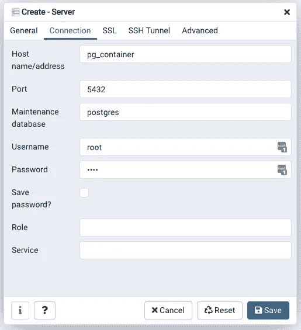

# 如何使用 Docker 运行 PostgreSQL 和 pgAdmin

> 原文：<https://towardsdatascience.com/how-to-run-postgresql-and-pgadmin-using-docker-3a6a8ae918b5?source=collection_archive---------0----------------------->

## Docker 使 PostgreSQL 管理变得更加容易


照片由 [bongkarn thanyakij](https://www.pexels.com/@bongkarn-thanyakij-683719?utm_content=attributionCopyText&utm_medium=referral&utm_source=pexels) 从 [Pexels](https://www.pexels.com/photo/desktop-computer-beside-analog-camera-3759101/?utm_content=attributionCopyText&utm_medium=referral&utm_source=pexels) 和 [Guillaume Bolduc](https://unsplash.com/@guibolduc?utm_source=unsplash&utm_medium=referral&utm_content=creditCopyText) 在 [Unsplash](https://unsplash.com/s/photos/containers?utm_source=unsplash&utm_medium=referral&utm_content=creditCopyText)

如果您不喜欢使用命令行界面管理数据库，您可以使用 [pgAdmin](https://www.pgadmin.org/) 作为替代解决方案。它是基于 web 的 PostgreSQL 数据库服务器的前端。

我们将使用 [Docker](https://www.docker.com/) 进行设置，因为我们不想担心环境管理。通过使用 Docker，我们不必担心 PostgreSQL 或 pgAdmin 的安装。此外，您可以使用 Docker 在 macOS、Windows 和 Linux 发行版上运行这个项目。

通过这篇文章，您将了解如何使用 Docker 将 pgAdmin 连接到 PostgreSQL 数据库服务器。

# 设置

首先，你需要安装 [Docker](https://docs.docker.com/engine/install/) 。我将使用 macOS 进行演示。

**方法一**

我们将使用一个 [Docker compose 文件](https://github.com/lifeparticle/PostgreSql-Snippets/blob/main/pgAdmin/docker-compose.yml)作为我们的第一个方法，我们需要将 **docker-compose.yml** 放在一个文件夹中。在这种情况下，文件夹的名称是 **pgAdmin** 。我们来分解一下 **docker-compose.yml 文件**的各个成分。

```
version: '3.8'
services:
  db:
    container_name: pg_container
    image: postgres
    restart: always
    environment:
      POSTGRES_USER: root
      POSTGRES_PASSWORD: root
      POSTGRES_DB: test_db
    ports:
      - "5432:5432"
  pgadmin:
    container_name: pgadmin4_container
    image: dpage/pgadmin4
    restart: always
    environment:
      PGADMIN_DEFAULT_EMAIL: admin@admin.com
      PGADMIN_DEFAULT_PASSWORD: root
    ports:
      - "5050:80"
```

首先，我们使用版本标记来定义合成文件格式，即 3.8。还有其他文件格式——1、2、2.x 和 3.x。你可以从 Docker 的[文档](https://docs.docker.com/compose/compose-file/)中了解更多信息。

然后我们有一个散列叫做**服务**。在这里面，我们必须定义我们的应用程序想要使用的服务。对于我们的应用程序，我们有两个服务， **db、**和 **pgadmin** 。

为了方便起见，我们对两个服务都使用了标签 **container_name** ，将默认容器名改为 **pg_container** 和 **pgadmin4_container** 。

第二个标签**图像**用于定义 **db** 和 **pgadmin** 服务的 Docker 图像。为了使我们的设置过程快速简单，我们将使用预先构建的官方映像 [PostgreSQL](https://hub.docker.com/_/postgres) 和 [pgAdmin](https://hub.docker.com/r/dpage/pgadmin4/) 。

在我以前的 Docker 帖子中，我已经谈到了**重启、环境**和**端口**标签的使用。看看下面的帖子，你可以学习这些标签。

[](/how-to-run-postgresql-using-docker-15bf87b452d4) [## 如何使用 Docker 运行 PostgreSQL

### 轻松运行 PostgreSQL

towardsdatascience.com](/how-to-run-postgresql-using-docker-15bf87b452d4) 

现在从 **docker-compose.yml** 文件所在的目录运行下面的命令。

```
cd pgAdmin
docker compose up
```

命令`docker compose up`启动并运行整个应用程序。恭喜你！您正在使用 Docker 在您的机器上成功运行 PostgreSQL 数据库和 pgadmin4。现在让我们将 pgadmin4 连接到我们的 PostgreSQL 数据库服务器。

首先，通过访问 URL[http://localhost:5050/](http://localhost:5050/)，经由您喜爱的网络浏览器访问 **pgadmin4** 。使用[**【admin@admin.com】**](mailto:admin@admin.com)作为**邮箱地址**，使用 **root** 作为**密码**登录。


创建一个服务器。

点击**服务器>创建>服务器**创建新的服务器。


填写名称、主机名/地址、用户名和密码的数据。

选择**通用**标签。对于**名称**字段，使用任何名称。在这种情况下，我将使用 **my_db** 。现在移动到**连接**标签。要获得**主机**的值，运行以下命令。

```
docker ps
```

命令 [ps](https://docs.docker.com/engine/reference/commandline/ps/) 将显示所有正在运行的容器的简要信息。


`docker ps`

**请先阅读更新章节**。现在我们可以获取 PostgreSQL 容器的容器 id。

```
docker inspect fcc97e066cc8 | grep IPAddress
```

命令 [inspect](https://docs.docker.com/engine/reference/commandline/inspect/) 显示正在运行的集装箱的详细信息。此外，我们使用[管道](https://www.gnu.org/software/bash/manual/html_node/Pipelines.html)和 [grep](https://www.gnu.org/software/grep/manual/grep.html) 命令提取 **IPAddress** 信息。


码头工人检查 fcc97e066cc8

最后，我们得到了**主机的值，**，在本例中是`192.168.80.2`。使用值 **root** 作为**用户名**，使用 **root** 作为**密码**，还要勾选**保存密码？**如果您不想在每次登录 pgadmin4 时都键入密码，请选择此框。

**更新【2021 年 4 月 16 日】**

今天早上我收到了一封来自 Dosenwerfer 的邮件，说这个人在再次运行服务时遇到了一些问题。因为它更改了 PostgreSQL 容器的 IP 地址，您必须再次设置配置。推荐的解决方案是使用容器名。因为容器名与主机名相同，所以您可以从这里的阅读更多内容。因此，我们当前的配置如下。



填写名称、主机名/地址、用户名和密码的数据。

您可以使用`docker ps`命令找到 PostgreSQL 数据库服务器的容器名称，并从 **NAMES** 列中获取该名称。在这篇文章中，我们在 **docker-compose.yml 文件**中明确地命名了容器，所以你也可以参考它。非常感谢多森威尔。

## 方法 2

对于第二种方法，您可以将一个 **pgAdmin** docker 容器连接到一个正在运行的 **PostgreSQL** 容器。当您的 **docker-compose.yml** 文件中没有 **pgAdmin** 服务时，这很有帮助。看看下面的帖子，在那里你可以学到这个方法。

[](/how-to-run-mysql-and-phpmyadmin-using-docker-17dfe107eab7) [## 如何使用 Docker 运行 MySQL 和 phpMyAdmin

### Docker 简化了 MySQL 管理

towardsdatascience.com](/how-to-run-mysql-and-phpmyadmin-using-docker-17dfe107eab7) 

## 额外的

如果您想导入一些数据进行测试，可以使用我已经准备好的 SQL 查询。点击**服务器> my_db >数据库> test_db >模式>表**。右键点击**表格**，选择**查询工具**。将 SQL 查询从我的 [GitHub](https://raw.githubusercontent.com/lifeparticle/PostgreSql-Snippets/main/infile) 库中复制粘贴到查询编辑器中，然后单击 **play** 按钮。该操作将创建两个名为**的表，学生**和**标记**以及一些测试数据。

# 包裹

通过命令行界面管理数据库可能会很伤脑筋。为了解决这个问题，我们可以使用带有接口的工具。pgAdmin 解决了这个问题。而且，Docker 让整个流程更加流畅。此外，您可以使用我提供的测试数据来试验 PostgreSQL 查询。希望这能帮助你入门 PostgreSQL，pgAdmin，和 Docker。编码快乐！

# 相关职位

[](/how-to-connect-to-a-heroku-postgres-database-with-pgadmin4-using-docker-6ac1e423ae66) [## 如何使用 Docker 通过 pgadmin4 连接到 Heroku Postgres 数据库

### 了解世界上最先进的开源关系数据库。

towardsdatascience.com](/how-to-connect-to-a-heroku-postgres-database-with-pgadmin4-using-docker-6ac1e423ae66) [](/how-to-run-mysql-using-docker-ed4cebcd90e4) [## 如何使用 Docker 运行 MySQL

### 轻松运行 MySQL

towardsdatascience.com](/how-to-run-mysql-using-docker-ed4cebcd90e4)