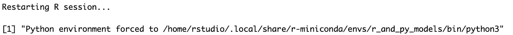
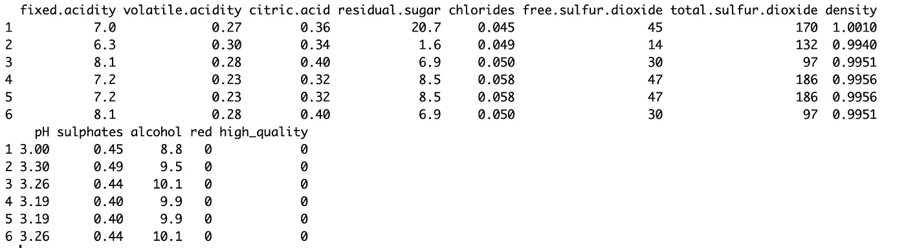
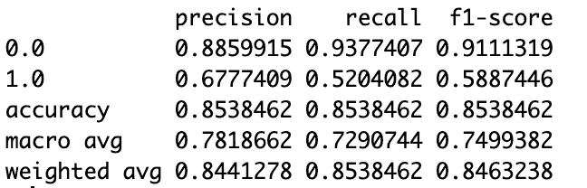

# 如何在 R 中轻松运行 Python ML 算法

> 原文：<https://towardsdatascience.com/how-to-run-python-ml-algorithms-easily-in-r-7e3b0f7c7aee?source=collection_archive---------37----------------------->

## 如何让 Python 的 XGBoost 在 R 中轻松工作的例子


图片由来自 Pixabay 的 Arek Socha 提供

毫无疑问，Python 拥有所有编程语言中最广泛的 ML 算法，如果我打算进行任何形式的预测建模，Python 通常是我的第一选择。也就是说，我更喜欢用 R 来整理和准备数据，并且希望能够将 Python 算法导入 R，这样我就可以两全其美了。所以我最近决定看看是否可以在 r 中轻松运行 Python ML 算法。我选择尝试 k 倍交叉验证的 XGBoost 模型。

我认为在 RStudio 中做这件事很容易，所以我在这里写了“如何做”。我还用这个例子组合了一个 [Github repo](https://github.com/keithmcnulty/r_and_py_models) 。

要让这些方法工作，您需要在 R 项目中工作，并指向 Conda 环境或 Virtualenv 中包含您需要的所有 Python 包的 Python 可执行文件。您可以通过使用 R 项目目录中的一个`.Rprofile`文件来做到这一点。每当您在 R 中启动一个项目时，这个文件都会在启动时执行它的内容。我的`.Rprofile`有两行代码。第一行告诉 R 在 Conda 环境中哪里可以找到正确的 Python 可执行文件，我已经安装了所有需要的包(即`pandas`、`scipy`、`scikit-learn`和`XGBoost`)。这需要进行编辑，以指向您机器上的正确路径。

```
Sys.setenv(RETICULATE_PYTHON = "/home/rstudio/.local/share/r-miniconda/envs/r_and_py_models/bin/python3")
```

第二行是为了我方便。它打印出正在使用的 Conda 环境的确认。这是为了在启动时让我放心，R 知道我希望它在哪里执行 Python 代码。

```
print(paste("Python environment forced to", Sys.getenv("RETICULATE_PYTHON")))
```

当我开始我的项目时，我收到这条消息来确认正在使用预期的 Conda 环境。



# 用 R 编写 Python 函数在数据集上运行

我创建了一个名为`python_functions.py`的 Python 文件，在其中我用 Python 编写了所需的函数，以便在任意 Pandas 数据帧上执行 XGBoost 模型。我这样做是为了让这些函数的所有参数都在一个名为`parameters`的字典中。我需要编写四个 Python 函数——一个将我的数据分成训练和测试数据，一个缩放我的要素，一个运行 XGBoost，最后一个创建分类报告作为数据帧。以下是包含四个必需函数的文件内容:

现在在我的 R 项目中，我可以使用`reticulate`包在 R 中获得这四个函数，使它们成为 R 函数。

```
library(reticulate)
source_python("python_functions.py")
```

# 示例:在 R 中使用 Python XGBoost

我们现在在 R 中使用这些函数来尝试学习预测一款高质量的葡萄酒。首先，我们下载白葡萄酒和红葡萄酒的数据集。

```
white_wines <- read.csv("https://archive.ics.uci.edu/ml/machine-learning-databases/wine-quality/winequality-white.csv",
                        sep = ";")red_wines <- read.csv("https://archive.ics.uci.edu/ml/machine-learning-databases/wine-quality/winequality-red.csv", 
                      sep = ";")
```

我们将创建“白色对红色”作为一个新功能，我们将“高质量”定义为 7 分或以上的质量分数。

```
library(dplyr)white_wines$red <- 0
red_wines$red <- 1wine_data <- white_wines %>% 
  bind_rows(red_wines) %>% 
  mutate(high_quality = ifelse(quality >= 7, 1, 0)) %>% 
  select(-quality)head(wine_data)
```



现在我们的数据已经为建模设置好了，是时候将我们的 Python 函数付诸实践了。

现在我们设置我们的参数列表(R 中的列表相当于 Python 中的 dict):

```
params <- list(
  input_cols = colnames(wine_data)[colnames(wine_data) != 'high_quality'],
  target_col = 'high_quality',
  test_size = 0.3,
  random_state = 123,
  subsample = (3:9)/10, 
  xgb_max_depth = 3:9,
  colsample_bytree = (3:9)/10,
  xgb_min_child_weight = 1:4,
  k = 3,
  k_shuffle = TRUE,
  n_iter = 10,
  scoring = 'f1',
  error_score = 0,
  verbose = 1,
  n_jobs = -1
)
```

现在我们已经准备好运行 XGBoost 模型，比如说，三重交叉验证。首先，我们使用我们的 Python 函数`split_data`分割数据——注意`reticulate`将在幕后把输入翻译成它们的 Python 等价物，因此`wine_data`将成为熊猫数据帧而`params`将成为字典。

```
split <- split_data(df = wine_data,  parameters = params)
```

我们的 Python 函数返回一个 dict，R 中的输出将是一个列表，我们可以将它输入到缩放函数中:

```
scaled <- scale_data(split$X_train, split$X_test)
```

同样，输出将是一个列表。现在，我们可以使用训练集上定义的参数运行 XGBoost 算法:

```
trained <- train_xgb_crossvalidated(
  scaled$X_train_scaled,
  split$y_train,
  parameters = params
)
```

最后，我们可以为我们的测试集生成一个分类报告:

```
generate_classification_report(trained, scaled$X_test_scaled, split$y_test)
```



现在我们有了。你也可以使用训练过的对象`trained`来生成新的预测，就像你在 Python 中做的那样。例如，我们可以看到测试集的第一行被归类为高质量。

```
test_data <- py_to_r(scaled$X_test_scaled)
trained$predict(test_data[1, ])[1] 1
```

本文展示了一个更通用的编写 Python 函数的过程，这些函数将处理任意输入，然后可以很容易地在 r 中执行。它应该很容易推广到任何其他类型的过程，无论是另一个 ML 算法还是像[编写 Powerpoint 文档](/generating-parameterized-powerpoint-documents-in-python-and-r-333368479038)这样的过程。我希望它对你正在做的其他工作是一个有用的基础。

最初我是一名纯粹的数学家，后来我成为了一名心理计量学家和数据科学家。我热衷于将所有这些学科的严谨性应用到复杂的人的问题上。我也是一个编码极客和日本 RPG 的超级粉丝。在[*LinkedIn*](https://www.linkedin.com/in/keith-mcnulty/)*或*[*Twitter*](https://twitter.com/dr_keithmcnulty)*上找我。也可以看看我在 drkeithmcnulty.com 的***上的博客。**