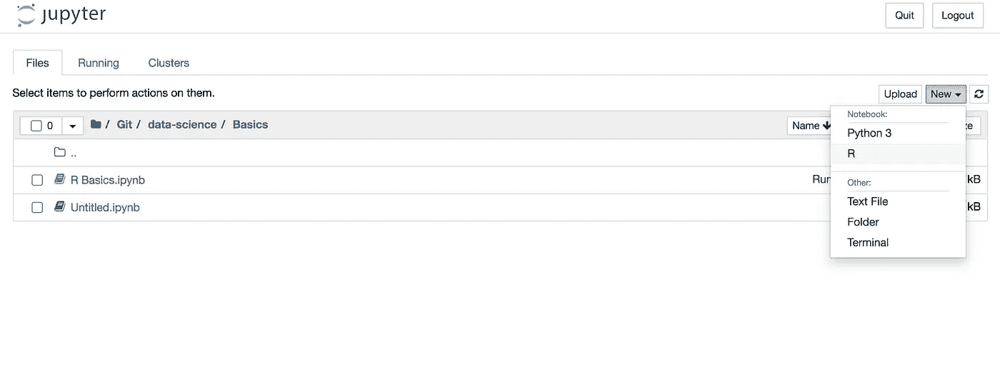

# 如何在 Jupyter 中运行 R 脚本

> 原文：<https://towardsdatascience.com/how-to-run-r-scripts-in-jupyter-15527148d2a?source=collection_archive---------1----------------------->

## 环境设置

## 关于如何在 Jupyter 中安装并运行 R 内核的简短教程


图片由 [Carlos Andrés Ruiz Palacio](https://pixabay.com/users/caruizp-8136980/?utm_source=link-attribution&utm_medium=referral&utm_campaign=image&utm_content=5354969) 来自 [Pixabay](https://pixabay.com/?utm_source=link-attribution&utm_medium=referral&utm_campaign=image&utm_content=5354969)

Jupyter Notebook 是一个允许用不同语言创建实时代码的网络应用程序。通常，开发人员利用 Jupyter 笔记本用 Python 编写代码。但是，Jupyter 也支持其他编程语言，包括 Java、R、Julia、Matlab、Octave、Scheme、Processing、Scala 等等。

## Jupyter 是如何工作的

Jupyter 不提供任何编译器或解释器。相反，它是一个与实际的编译器/解释器进行通信的过程。实际上，它将代码发送给编译器/解释器，并返回结果。

为了在 Jupyter 单元中运行(给定语言的)代码片段，安装该语言的相应内核就足够了。

## R 的核

在本教程中，我将演示如何为 R 软件安装 Jupyter 内核。

首先，我需要在你的电脑上安装 R 软件。我可以从[的官方网站](https://www.r-project.org/)下载 R 软件。安装完成后，我可以打开一个终端并启动 R，只需在控制台上输入`R`，然后输入 Enter 命令。

注意:如果使用 Mac OS，需要从安装 R 的目录下运行 R 软件。通常，该目录是

```
/Library/Frameworks/R.framework/Versions/<version>/Resources/bin
```

其中`<version>`表示 R 版本。我可以通过在控制台上键入以下命令来运行 R:

```
./R
```

一旦启动了 R 控制台，我必须通过以下命令下载`devtools`包:

```
install.packages("devtools")
```

我选择镜像编号(例如，意大利是 48)，然后按 Enter 键。

一旦安装完成，我可以从 Github 安装 IRKernel。我运行以下命令:

```
devtools::install_github("IRkernel/IRkernel")
```

前面的命令可能会失败。在这种情况下，我可以通过以下命令强制安装:

```
devtools::install_github("IRkernel/IRkernel", force=TRUE)
```

之后我安装了`IRkernel`:

```
IRkernel::installspec()
```

现在我可以通过输入退出 R

```
quit()
```

我可以经营朱庇特。当 Jupyter 在浏览器中打开时，我可以点击右上角的 New 并选择 R 作为内核。快乐享受:)



作者图片

# 摘要

在本教程中，我已经演示了如何在 Jupyter 中安装 R 内核。这个过程非常简单快捷。

如果你仍然遇到安装问题，请查看我的 Youtube 安装教程。

如果你想了解我的研究和其他活动的最新情况，你可以在 [Twitter](https://twitter.com/alod83) 、 [Youtube](https://www.youtube.com/channel/UC4O8-FtQqGIsgDW_ytXIWOg?view_as=subscriber) 和 [Github](https://github.com/alod83) 上关注我。

# 相关文章

[](/how-to-install-python-and-jupyter-notebook-onto-an-android-device-900009df743f) [## 如何在 Android 设备上安装 Python 和 Jupyter Notebook

towardsdatascience.com](/how-to-install-python-and-jupyter-notebook-onto-an-android-device-900009df743f) [](https://alod83.medium.com/how-to-install-xampp-bcb43fb11912) [## 如何安装 XAMPP

### 为了创建一个完整的 web 应用程序，首先要做的是安装一个 Web 服务器。有几个…

alod83.medium.com](https://alod83.medium.com/how-to-install-xampp-bcb43fb11912) [](https://alod83.medium.com/how-to-import-and-export-a-dataset-in-phpmyadmin-b108288a3ca3) [## 如何在 PhpMyadmin 中导入和导出数据集

### Phpmyadmin

alod83.medium.com](https://alod83.medium.com/how-to-import-and-export-a-dataset-in-phpmyadmin-b108288a3ca3) 

# 新到中？您可以每月订阅几美元，并解锁无限的文章— [单击此处](https://alod83.medium.com/membership)。