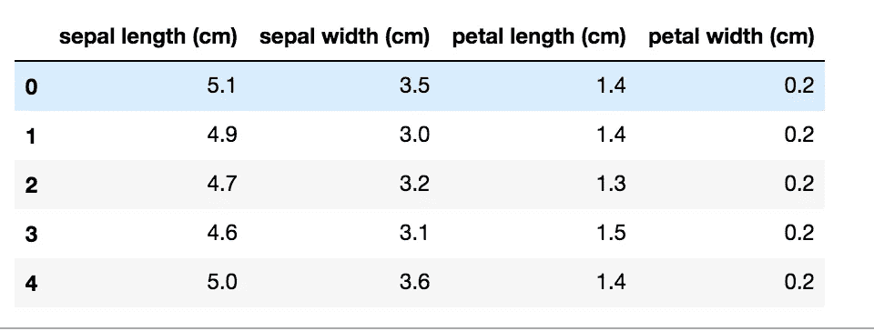
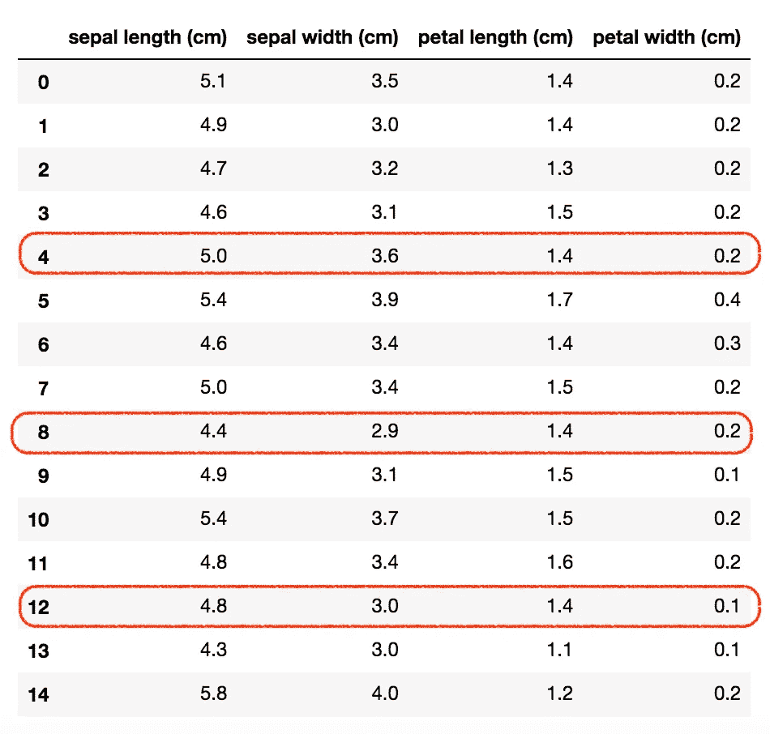

# 如何在 Python Pandas 中对数据帧进行采样

> 原文：<https://towardsdatascience.com/how-to-sample-a-dataframe-in-python-pandas-d18a3187139b?source=collection_archive---------1----------------------->

## 数据预处理

## 使用不同的技术对 Python Pandas 中的数据集进行采样的现成代码


图片来自 [Pixabay](https://pixabay.com/?utm_source=link-attribution&utm_medium=referral&utm_campaign=image&utm_content=1026499)

您可能只需要 Python 数据帧中的一些行。你可以通过**不同的采样技术**达到这个结果。

在本教程中，我演示了通过 **Python Pandas** 执行行采样的以下技术:

*   随意采样
*   有条件抽样
*   以恒定速率采样

完整的代码可以从我的 [Github 库](https://github.com/alod83/data-science/blob/master/Preprocessing/DataSampling/Data%20Sampling.ipynb)下载。

# 加载数据集

在本教程中，我利用了由`scikit-learn`库提供的`iris`数据集，并将其转换为`pandas`数据帧:

```
from sklearn.datasets import load_iris
import pandas as pddata = load_iris()
df = pd.DataFrame(data.data, columns=data.feature_names)
```



作者图片

数据集由 4 列 150 行组成。

# 随意采样

给定一个有 N 行的数据帧，随机抽样从数据帧中抽取 X 个随机行，其中 X ≤ N. Python `pandas`提供了一个名为`sample()`的函数来执行随机抽样。

要提取的样本数量可以用两种可选方式表示:

*   指定要提取的随机行数
*   指定要提取的随机行的百分比。百分比以 0 到 1 之间的数字表示。

## 确切数量

在这种情况下，您可以将参数`n`传递给`sample()`函数，如下所示:

```
subset = df.sample(n=100)
```

在前面的例子中，`sample()`函数提取了 100 个随机行。您可以通过`shape`功能检查`subset`结果数据集的形状:

```
subset.shape
```

它给出了以下输出:

```
(100, 4)
```

## 百分率

如果您想要指定要提取的随机行的百分比，您可以将`frac`参数作为`sample()`函数的输入:

```
subset = df.sample(frac=0.5)
```

在前面的例子中，`sample()`函数提取了 50%的随机行。注意，您只能在`n`和`frac`参数之间指定一个。

# 有条件抽样

有条件抽样只允许提取满足给定条件的一些行。首先，必须指定条件。例如，作为一个条件，您可以只选择`sepal width (cm)`列的值小于 3 的行:

```
condition = df['sepal width (cm)'] < 3
```

变量`condition`是一个与`df`大小相同的数列，包含`True/False`，取决于行是否满足条件。

然后，检索与满足上述条件的行相关联的索引:

```
true_index = condition[condition == True].index
```

在当前示例中，57 行满足条件，因此您最多可以采样 57 行。

`sample()`功能可用于执行采样，条件如下:

```
subset = df[condition].sample(n = 10)
```

# 以恒定速率采样

另一种采样策略是以恒定速率采样，这意味着您希望两个相邻样本之间的距离恒定。例如，您可能希望以 4 的速率进行采样，如下图所示:



作者图片

在这种情况下，首先指定速率:

```
rate = 10
```

然后，你可以简单地提取样本:

```
subset = df[::rate]
```

在`iris`数据集中，样本数为 150，因此 10 的采样率将产生 15 行的子集:

```
subset.shape
```

它给出了以下输出:

```
(15, 4)
```

# 获取数据集的剩余部分

一旦提取了数据集的子集，还可以提取剩余部分。例如，如果您想在训练和测试集中分割数据集，可以使用这种策略，而不使用`scikit-learn`库提供的`train_test_split()`函数。

可以采用两种可能的解决方案来提取数据集的剩余部分。这两种解决方案产生了相同的结果。

## 第一种解决方案

第一种解决方案删除原始数据帧`df`中提取的数据帧`subset`的行，并将结果存储在新的数据帧中。这可以通过将待删除的索引列表传递给`drop()`函数来实现:

```
remaining = df.drop(labels=subset.index)
```

## 第二种解决方案

第二种解决方案仅选择原始数据帧`df`中的行，其中索引不在提取的数据帧`subset`的索引列表中:

```
remaining = df[~df.index.isin(subset.index)]
```

# 摘要

在本教程中，我演示了如何以不同的方式执行数据帧采样:

*   随机抽样，抽取 N 个随机行；
*   带条件抽样，应用一个条件，然后随机抽取 N 行；
*   以恒定速率采样。

如果你想了解我的研究和其他活动的最新情况，你可以在 [Twitter](https://twitter.com/alod83) 、 [Youtube](https://www.youtube.com/channel/UC4O8-FtQqGIsgDW_ytXIWOg?view_as=subscriber) 和 [Github](https://github.com/alod83) 上关注我。

# 相关文章

</data-preprocessing-in-python-pandas-part-6-dropping-duplicates-e35e46bcc9d6>  </how-to-load-huge-csv-datasets-in-python-pandas-d306e75ff276>  </data-preprocessing-with-scikit-learn-missing-values-8dff2c266db> 