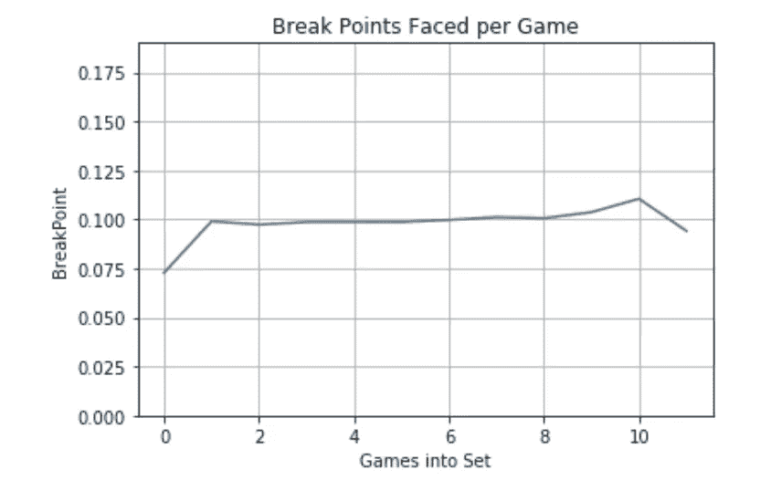
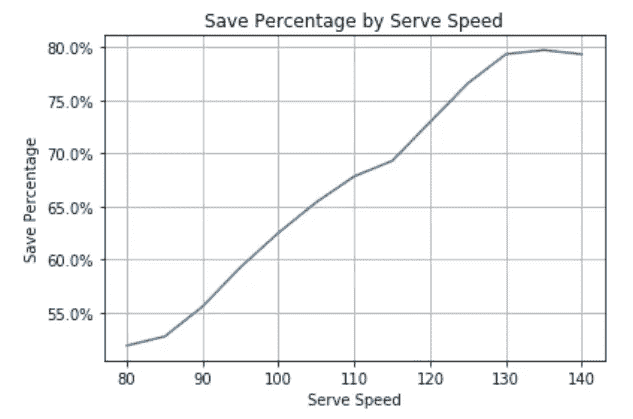
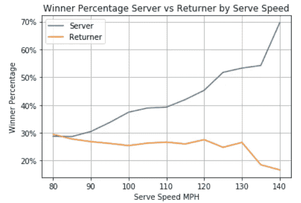
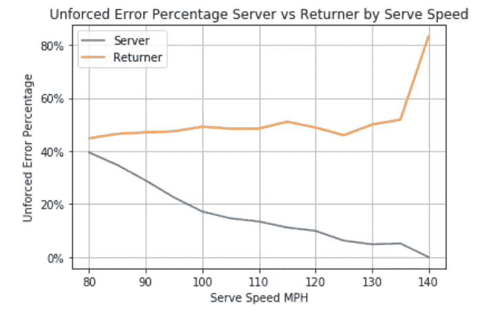
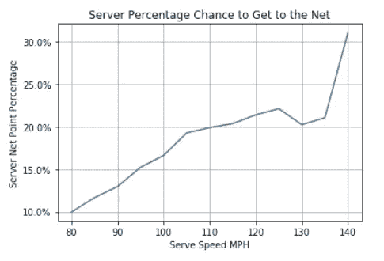
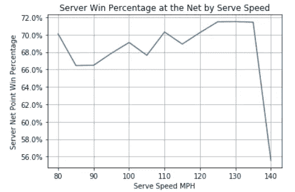
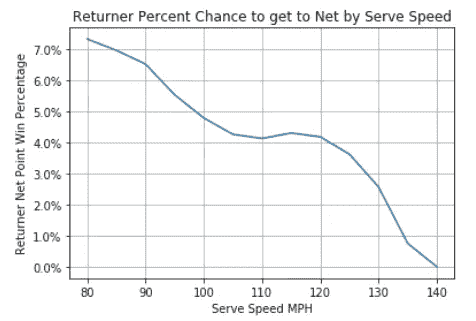
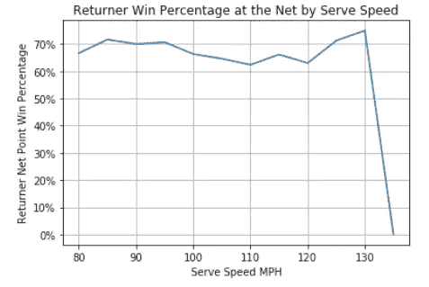

# 如何利用数据挽救网球中的破发点

> 原文：<https://towardsdatascience.com/how-to-save-break-points-in-tennis-using-data-f0b32c026a88?source=collection_archive---------31----------------------->

任何网球比赛的关键之一是挽救破发点的能力。看一看 [ATP 排行榜](https://www.atptour.com/en/stats/leaderboard?boardType=pressure&timeFrame=52Week&surface=all&versusRank=all&formerNo1=false)，你会想起这个事实，因为你会看到游戏中的顶级职业选手始终保持在破发点挽救百分比的最顶端。但是是什么让一个球员擅长挽救破发点呢？借助杰夫·萨克曼(Jeff Sackman)过去 10 年每个大满贯的逐点数据集，我们可以深入了解职业选手如何在网球的最大舞台上挽救破发点。

首先，我们开始导入相关库的:

```
import pandas as pd
import seaborn as sn
import matplotlib.pyplot as plt
import numpy as np
```

然后我们需要导入数据。从 2018 年开始，澳大利亚网球公开赛和法国网球公开赛的数据被不同地打包，所以我们现在放弃了这几场比赛。

```
years = [i for i in range(2011, 2021)]
slams = ['ausopen', 'frenchopen', 'usopen', 'wimbledon']
data = pd.DataFrame()for year in years:
    for slam in slams:
        if year >= 2018 and slam in ['ausopen', 'frenchopen']: #these slams did not have the same data collected
            continue
        try:
            new_data = pd.read_csv('./tennis_slam_pointbypoint-master/' + str(year) + '-' + slam + '-points.csv')
            if year == 2011 and slam == 'ausopen':
                data = new_data
            else:
                data = pd.concat([new_data, data])
        except FileNotFoundError:
            print(year, slam)
            continue
```

接下来，我删除了没有对打数据的行(在这种情况下，这些行没有发球速度读数)，并收集了相关的特征，如 ace、净得分、非受迫性失误、获胜者等。我会推荐任何感兴趣的人参考 [Github](https://github.com/dcaustin33/Medium-hosting/blob/main/Break%20Point%20Save%20%25.py) 文件，因为把所有内容都发布到文章中会让人不知所措。

终于我们可以开始分析了。在网球场上做出的第一个决定是是否先发球。如下所示，先发球似乎有很大的帮助，因为第一场比赛的破发点比第二场少得多(大约减少了 25%)。善于挽救破发点的最好方法是首先不要面对它们，首先发球可以最大限度地减少球员在整场比赛中面临的破发点。

```
#imported library's include (Seaborn, Matplotlib.pyplot, pandas)
#sets the x axis to be 12 games and then uses a pandas groupby statementa_plot = sn.lineplot(x = [i for i in range(0,12)], y = data.groupby('GamesPlayed').mean()['BreakPoint'][0:11])a_plot.set(ylim = (0, .19))
plt.title("Break Points Faced per Game")
plt.grid()
plt.xlabel("Games into Set")
```



第一场比赛显示，与其他比赛相比，面临的破发点减少了 25%

接下来我们要研究的是如何在破发点发球，毕竟这是网球场上你可以完全控制的事情。虽然我们在某种程度上受到限制，因为如果球员错过了第一次发球(即他们试图击球的力度)，我们仍然可以检查发球速度如何影响破发点挽救百分比的一些关键因素。

我将发球速度从每小时 80-140 英里，每 5 英里一组。所有指标都与这个循环相关联，每个指标的名称都应该相当直观

```
for i in range(80, 145, 5): #bucketing by fives and then appending to lists corresponding to different metricsbucket_data = data[(data.ServeSpeed >= i) & (data.ServeSpeed <= i + 5)]
    trimmed_data = bucket_data[bucket_data.BreakPoint]

    x = bucket_data.groupby('BreakPoint').mean()#all data
    y = trimmed_data.groupby('BreakPointWon').mean()#just bp data

    save_percentage.append(1 - x.loc[True, 'BreakPointWon'])#doing the one because has two entries True and False
    rally_length.append(y.loc[True, 'Rally'])

    buckets.append(i)

    winner_percentage_loss.append(y.loc[False, 'Winner'])
    winner_percentage_save.append(y.loc[True, 'Winner'])

    unforced_error_percentage_loss.append(y.loc[True, 'UnforcedError'])
    unforced_error_percentage_save.append(y.loc[False, 'UnforcedError'])

    net_point.append(x.loc[True, 'ServerNetPoint'])
    net_point_won.append(x.loc[True, 'ServerNetPointWon'] / x.loc[True, 'ServerNetPoint'])

    return_net_point.append(x.loc[True, 'NetPoint'] - x.loc[True, 'ServerNetPoint'])
    return_net_point_won.append((x.loc[True, 'NetPointWon'] - x.loc[True, 'ServerNetPointWon']) / (x.loc[True, 'NetPoint'] - x.loc[True, 'ServerNetPoint']))
```

正如你所料，发球速度的提高与破发点挽救率相关。然而，一旦你达到 130，这种影响似乎变平了。最终发球速度可以公式化为一个决策方程。如果一名球员可以量化每增加一英里他们错过第一次发球的可能性有多大，以及他们在第二次发球时赢得分数的可能性有多大，他们就能够计算出他们应该发球的最佳速度。

```
import matplotlib.ticker as mtick #imports to enable percentage reading#graphs save percentage by serve speed
ax = sn.lineplot(x = buckets, y = [i * 100 for i in save_percentage])
ax.yaxis.set_major_formatter(mtick.PercentFormatter())#sets y axis as a percentplt.grid()
plt.title("Save Percentage by Serve Speed")plt.ylabel("Save Percentage")
plt.xlabel("Serve Speed")
```



130 英里/小时后，图表稳定增长，影响有限

接下来，我们考虑赢家和非受迫性失误。正如我们从下面看到的，当你的发球速度提高时，胜率稳步上升，而当你的对手击中胜方的几率保持相对稳定。作为服务器，这可能会导致重要的战术决策。例如，如果你正在打一个打了很多致胜球的大击球手，打一个较慢的发球可能没问题，因为发球速度似乎不会影响他们打致胜球的机会。然而，如果你不得不打致胜球来赢得你的大部分分数，你可以冒险在你的第一次和第二次发球时打得更用力一点，以增加打致胜球的可能性。

```
#uses two lines on one plot to visualize Winner percentage
ax1 = sn.lineplot(x = buckets, y = [i *100 for i in winner_percentage_loss], label = 'Server')
ax2 = sn.lineplot(x = buckets, y = [i * 100 for i in winner_percentage_save], label = 'Returner')
ax1.yaxis.set_major_formatter(mtick.PercentFormatter())
ax2.yaxis.set_major_formatter(mtick.PercentFormatter())plt.grid()
plt.title("Winner Percentage Server vs Returner by Serve Speed")plt.ylabel("Winner Percentage")
plt.xlabel("Serve Speed MPH")
```



对于返回者来说，赢家比例保持不变

我们还必须考虑发生非受迫性失误的可能性。正如下图所示，如果你的发球速度是 90 英里/小时，而不是 135 英里/小时，你的对手基本上不会犯非受迫性错误——140 英里/小时的百分比可能是由样本量低造成的。然而，随着你发球速度的提高，你的发球出现非受迫性失误的几率会稳步下降。这同样会导致重要的战术变化。如果你的对手是零星的，犯了很多非受迫性错误，你可能想打一个更软的第一次发球，因为发球速度不会影响他们犯错误的倾向。然而，如果作为一个发球者，你一直不稳定，通过更努力的发球来降低非受迫性失误的概率可能是正确的举动。

```
#uses two lines on one plot to visualize unforced errors
ax1 = sn.lineplot(x = buckets, y = [i * 100 for i in unforced_error_percentage_save], label = 'Server')
ax2 = sn.lineplot(x = buckets, y = [i * 100 for i in unforced_error_percentage_loss], label = 'Returner')
ax1.yaxis.set_major_formatter(mtick.PercentFormatter())
ax2.yaxis.set_major_formatter(mtick.PercentFormatter())plt.grid()
plt.title("Unforced Error Percentage Server vs Returner by Serve Speed")plt.ylabel("Unforced Error Percentage")
plt.xlabel("Serve Speed MPH")
```



服务器的非受迫性错误百分比随着速度的增加而降低

最后，我们发现当一个球员来到网前，他们有 68%的机会赢得这一分。上网是一个成功的策略，尤其是在破发点，当你迫使对手在高压情况下进行艰难的射门时。正如我们所看到的，随着你发球速度的增加，网前胜率保持不变，这两种情况都可能是由于样本量小，但你上网的能力显著增加——从 80 英里/小时的 10%增加到 120-130 英里/小时的 20%左右。

```
#graphs by percentage chance to get to the Net
ax = sn.lineplot(x = buckets, y = [i * 100 for i in net_point])ax.yaxis.set_major_formatter(mtick.PercentFormatter())plt.grid()
plt.title("Percentage Chance to Get to the Net")plt.ylabel("Server Net Point Percentage")
plt.xlabel("Serve Speed MPH") #graphs by win percentage at the net
ax = sn.lineplot(x = buckets, y = [i * 100 for i in net_point_won])
ax.yaxis.set_major_formatter(mtick.PercentFormatter())plt.grid()
plt.title("Win Percentage at the Net by Serve Speed")plt.ylabel("Server Net Point Win Percentage")
plt.xlabel("Serve Speed MPH")
```



同样，这些信息取决于你的对手和你的实力。如果网络机会是你战略的一个关键部分，你可能会通过增加你的 MPH 得到更好的服务。此外，增加你的 MPH 也会降低你的对手入网的概率，而他们的胜率保持不变，除非是 135 MPH 的异常值。

```
#Returner percent chance to get to the net
ax = sn.lineplot(x = buckets, y = [i * 100 for i in return_net_point])
ax.yaxis.set_major_formatter(mtick.PercentFormatter())plt.grid()
plt.title("Oppenent Percent Chance to get to Net by Serve Speed")plt.ylabel("Returner Net Point Win Percentage")
plt.xlabel("Serve Speed MPH") #Returner win percentage at the net
ax = sn.lineplot(x = buckets, y = [i * 100 for i in return_net_point_won])
ax.yaxis.set_major_formatter(mtick.PercentFormatter())plt.grid()
plt.title("Returner Win Percentage at the Net by Serve Speed")plt.ylabel("Returner Net Point Win Percentage")
plt.xlabel("Serve Speed MPH")
```



虽然比赛中做出的每个决定都完全取决于你和对手的比赛风格，但这些统计数据为在破发点上做出明智的选择提供了一些证据。显然，不是每个人都能够发球超过 130 英里/小时，但是发球速度显然是节省破发点的一个重要部分，可能是你下次练习时的一个重要考虑因素。杰夫·萨克曼的数据为网球和网球统计数据提供了宝贵的视角，我们只能希望 ATP 像 MLB 一样开放 IBM 和 InfoSys 的跟踪数据，以增加对这项运动的分析关注。

接下来，我希望做我上一篇文章做的事情([聚类](/atp-tennis-cluster-analysis-91bbcce61595))，同时使用大满贯的逐点数据，看看是否可以找到任何额外的见解。

github:[https://github . com/dcaustin 33/Medium-hosting/blob/main/Break % 20 point % 20 save % 20% 25 . py](https://github.com/dcaustin33/Medium-hosting/blob/main/Break%20Point%20Save%20%25.py)