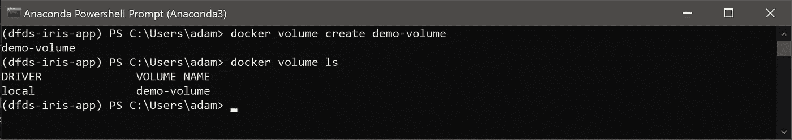
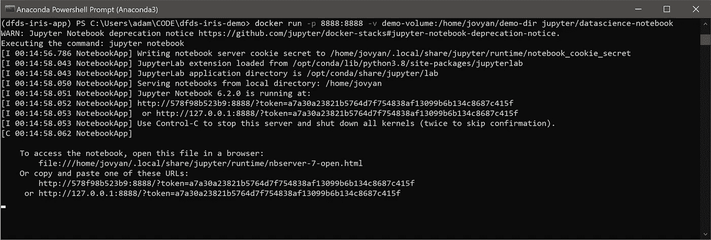
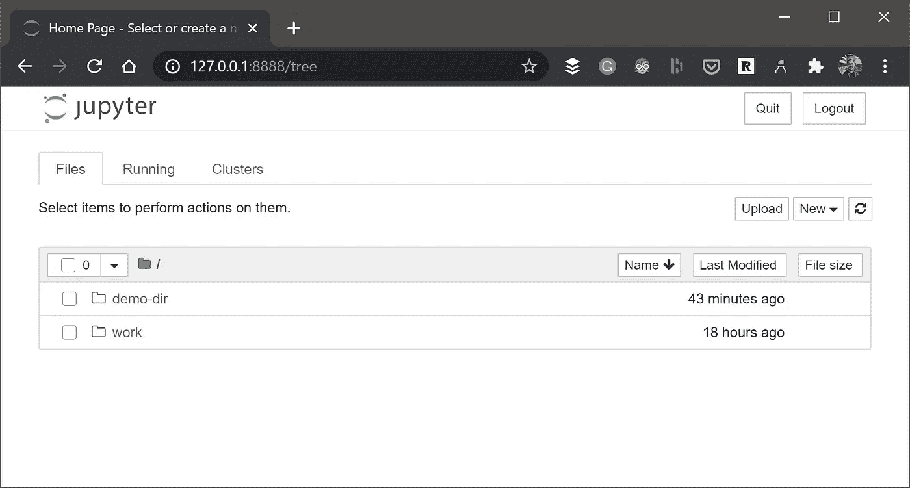

# 如何在 Docker 中保存状态——数据科学家指南

> 原文：<https://towardsdatascience.com/how-to-save-state-in-docker-a-data-scientists-guide-18bb05589010?source=collection_archive---------20----------------------->

使用数据科学容器时，从持久化数据和状态开始。Docker 中的数据存储和持久性指南。


弗雷迪·雅各布在 [Unsplash](https://unsplash.com?utm_source=medium&utm_medium=referral) 上拍摄的照片

# 介绍

在这篇文章中，我们将讨论 Docker 中的数据持久性，以及如何让您的图像与容器外部的数据进行交互。如果你熟悉 Docker 或者已经浏览过本系列的前几篇文章，请跳到下一个标题！

到目前为止，在这个系列中，我们已经介绍了如何获得一个基本的 Hello World！使用 Flask 和 Python 构建并使用 Docker 部署的 web 应用程序。在第 2 部分中，我们浏览了一个端到端的机器学习示例，为 Iris 数据集构建了一个随机森林分类器，并使用 Flask 将其作为一个预测 web 应用程序，然后将其共享到公共 Docker Hub 存储库。

如果你错过了他们:

[](/docker-for-data-scientists-part-1-41b0725d4a50) [## 面向数据科学家的 Docker 第 1 部分

### 最基本的。数据科学家和机器学习工程师快速入门指南

towardsdatascience.com](/docker-for-data-scientists-part-1-41b0725d4a50) [](/docker-for-data-scientists-part-2-7655c02fe975) [## 数据科学家的 Docker 第 2 部分

### 开发机器学习模型、编写 API、打包到 Docker 中、在任何地方运行、分享的完整指南…

towardsdatascience.com](/docker-for-data-scientists-part-2-7655c02fe975) 

现在你可能不想在任何情况下公开分享你的图片。幸运的是，有许多选项可供您构建和维护私有存储库。每个主要的云提供商 Azure、AWS 和 GCP 都有托管存储库选项，这些选项很容易启动和运行。对于那些热衷于使用 Azure 的人，我还写了一个快速指南，介绍如何使用 Docker 和 Azure CLI 运行私有存储库:

[](/private-docker-repositories-for-data-science-with-azure-cccb2b37a647) [## 使用 Azure 的数据科学专用 Docker 存储库

### 机器学习工程师精要——如何建立私有容器库，保护它们，在…

towardsdatascience.com](/private-docker-repositories-for-data-science-with-azure-cccb2b37a647) 

如果您已经启动并运行了，并且只是想开始使用数据持久性，那么让我们开始吧。

# 数据持久性

使用容器时有两个核心假设:

*   容器应该是一次性的。这意味着他们应该是无国籍的。容器提供了完成工作所需的计算能力、应用程序、配置和代码。然后，在退出时，当他们退出时，一切都被清除。
*   为了支持微服务方法，容器应该被设计成专家——尽可能专注于几件事情。这允许系统设计者组合多个简单的容器来创建复杂的行为，而不用担心相互依赖。

这种方法有很多好处。无状态支持可伸缩性、可移植性和弹性。如果您正在运行多个容器，并且其中一个出现故障，那么重启它或者启动一个替换容器是很简单的。

为了捕捉状态，它应该在图像之外。这使得微服务可以轻松地共享信息，而无需考虑每个容器的性能或准确性的复杂性，这在传统的应用程序设计中是一个挑战。

> 将数据管理从应用程序中分离出来可以导致更快的开发和更低的维护开销(阅读:为我们赢得一些时间，这是每个数据科学家都需要的！).

对于在外部何处保持该状态，有几个选项:

*   磁盘上——这可能是容器可以访问的 Docker 主机本地保存的另一个文件夹
*   Docker 定义的卷—可以在多个容器之间共享的装载存储卷
*   数据库—有了足够的凭证和配置，每个容器都可以读写本地/网络/云数据库的状态
*   网络资源——容器可以从另一种类型的网络资源(如服务总线或消息队列)获取状态

在本文中，我们将介绍如何使用 Docker 卷来存储状态。

Docker [volumes](https://docs.docker.com/storage/volumes/) 允许您将容器的特定文件系统路径连接回主机。当容器中的一个目录被挂载时，该目录中的更改也会在主机上看到。然后，您可以跨容器重启挂载相同的目录，您将看到相同的文件。

我将使用来自 [Docker Hub](https://hub.docker.com/r/jupyter/datascience-notebook/) 的标准 Jupyter 笔记本图像来强调在 Docker 环境中移动数据和熟悉的应用程序是多么容易。您可以使用以下命令从 Docker Hub 中提取映像:

```
docker pull jupyter/datascience-notebook
```

请注意，这是一个相当大的映像(4.16 GB)，如果空间或时间不足，请尝试使用最小的笔记本映像(1.49 GB)，并相应地更改以下所有代码。您可以使用以下方法提取最小图像:

```
docker pull jupyter/minimal-notebook
```

# 创建 Docker 卷

首先，让我们从 Docker 卷开始——这是一种由 Docker 管理的资源，容器可以轻松访问它以将其用作存储。要在 Docker 中创建卷，请使用以下语法:

```
docker volume create <volume_name> 
```

您可以使用如下所示的`docker volume ls`来检查这是否成功。



在 Docker 中创建和检查卷(图片由作者提供)。

现在，如果我们想把一些本地文件放到一个容器中，我们可以用几种方法。首先，让我们运行一个容器，并在其中挂载一个目录。然后，我们可以将 Docker 卷装载到同一个容器中，从而允许我们跨容器复制内容。

在这里，我们将刚刚创建的`demo-volume`挂载到容器内的一个目录中。我们将使用`/home/jovyan/demo-dir`把它放在默认的 Jupyter 位置。语法如下:

```
docker run -v <volume_name>:<container_directory> <image_name>
```

因为我们在这里使用 Jupyter，我们还需要记住映射端口。因此，该命令如下所示:

```
docker run -p 8888:8888 -v demo-volume:/home/jovyan/demo-dir jupyter/datascience-notebook
```



运行 Jupyter 笔记本容器的命令，包括端口映射和 Docker 卷安装(图片由作者提供)。

然后，您只需要转到带有令牌的链接，并且(输出中的第二个链接对我来说更加一致):

```
http://127.0.0.1:8888/?token=a7a30a23821b5764d7f754838af13099b6b134c8687c415f
```

你应该被认证和重定向，然后你会看到熟悉的 Jupyter 前屏幕和我们的`demo-dir`安装在我们能看到的地方:



我们的 Docker 卷挂载到容器中的/demo-dir(图片由作者提供)。

这允许我们在卷中存储内容，并像对待任何挂载的文件夹一样对待它。当使用容器和服务时，这实际上是在 Docker 中持久化数据的首选方式。一些更强的卷使用情形包括:

*   如果您想在多个运行的容器之间共享数据，卷是最好的选择。当已装载的容器停止、崩溃或被删除时，卷仍然存在。这意味着其他容器仍然可以连接到它，并与其中的数据进行交互。
*   您还可以使用它将包含服务不同部分(例如机器学习服务和数据库)的不同图像连接到相同的数据。
*   当主机可能没有所需的目录结构时，卷是很好的选择。使用卷允许您通过显式装载主机来放松对主机的这一要求。
*   卷使跨主机备份和迁移数据变得更加容易。
*   如果您需要本地文件系统行为，Docker volumes 可以帮助您解决这个问题。

# 结论

在这篇文章中，我们已经看到了在使用 Docker 时持久化数据的一些选项。我们还介绍了一种最方便的方法，用于在容器之外保存数据，以及在同一主机上运行的容器之间保存数据。

有希望的是，可以看到以这种方式组合 Docker 容器——作为原子的、自包含的单元——允许数据科学家开始构建强大的系统，这些系统保持可伸缩性、灵活性和难以置信的模块化。

# 进一步阅读

Docker 中的数据持久性还有很多。由 [Lorenz Vanthillo](https://medium.com/u/fd5f8bfe0baa?source=post_page-----18bb05589010--------------------------------) 撰写的这篇文章介绍了如何将 Docker 容器连接到 PostgreSQL 数据库:

[](https://medium.com/better-programming/connect-from-local-machine-to-postgresql-docker-container-f785f00461a7) [## 从本地机器连接到 Docker 中的 PostgreSQL 数据库

### 一个简单的方法让你开始使用 Docker

medium.com](https://medium.com/better-programming/connect-from-local-machine-to-postgresql-docker-container-f785f00461a7) 

在这里， [Thiago S. Adriano](https://medium.com/u/bfc537e02cdc?source=post_page-----18bb05589010--------------------------------) 写了一篇关于连接 SQL Server 的精彩指南:

[](https://medium.com/dockerbr/accessing-sql-server-on-docker-container-86b84efcaa1c) [## Ubuntu -访问 Docker 容器上的 SQL Server

### 今天我们将看到如何在 Ubuntu 中使用 sqlcmd 访问 Docker 容器中的数据库。

medium.com](https://medium.com/dockerbr/accessing-sql-server-on-docker-container-86b84efcaa1c) 

再次感谢您的阅读，如果您对进一步的内容有任何反馈或要求，请务必告诉我。