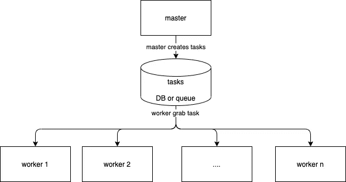
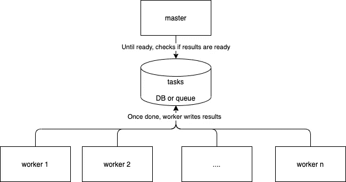
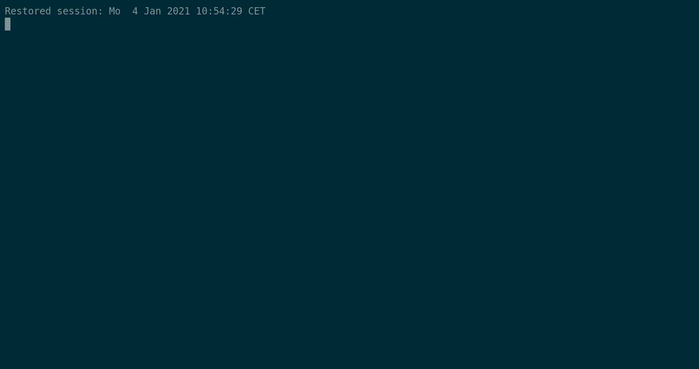

# 如何对几款车型进行规模化训练

> 原文：<https://towardsdatascience.com/how-to-scale-the-training-of-several-models-64180480ca3d?source=collection_archive---------70----------------------->

## 基于 python 和 celery 的简单解决方案

# 动机

让我们考虑以下任务:预测几个城市对某种东西的需求。这是一个时间序列预测问题。预测在本地模型和全球模型之间存在差异。对于本地模型，您为每个城市训练一个模型。使用全局模型，您可以为所有城市训练一个模型。总而言之:训练多个相似的模型有时是必要的。

简单的解决方案是依次训练模型:一个接一个的模型。想象你需要 10 分钟训练一个城市的模型，你有 100 个城市。你需要 1 000 分钟来训练所有的模型(16 小时)。这是生产力杀手。由于适应模型是部署的一部分，这将违反持续集成和持续开发的原则。

为了在相同的持续时间内完成训练，与模型的数量无关，解决方案是在 n 台计算机(也称为工人)之间分配训练。本文将描述一个 python 解决方案。解决方案基于著名的图书馆芹菜。github 上有一个原型[。](https://github.com/gobert/medium/tree/master/distributed-training-celery)

# 解决方案概述

这个问题通常用任务队列管理器来解决。在 python 中，最著名的任务队列管理器是 celery。我们将拥有:

*   1 个主机，创建任务
*   n 个工人，每个人都符合一个模型



作者图片

对于培训模型，有两个更重要的要求:

*   指标:我们想知道所有模型的平均指标。
*   成本:一旦培训结束，工人必须停工。



作者图片

# 履行

该实现可在 g [ithub](https://github.com/gobert/medium/tree/master/distributed-training-celery) 上获得。

**第一步——第一根芹菜用法&原型骨架**

先决条件:安装芹菜包；安装并启动 redis 并了解[芹菜的第一步](https://docs.celeryproject.org/en/stable/getting-started/first-steps-with-celery.html)。

首先，定义一个名为“fit”的芹菜任务。它将由工人来执行。它是为适应模型而执行的代码，它返回精度。

然后，主人将计算委托给工人。添加此代码，例如在 bin/master.py 中。

最后，执行原型，如下所示:

```
# start a worker
celery -A tasks worker# start the leader
python bin/master.py
```

注意:在 github 上，已经创建了一个文件(bin/worker.sh)用于启动一个 worker。

**步骤 2——等待任务处理**

主设备可能必须等待任务被处理。这很可能发生在部署管道中。这是以下代码的责任:

**步骤 3——获得每次训练的平均准确度**

为了更好地了解和跟踪精确度，主服务器可以打印每个城市的平均精确度。下面的代码演示了主服务器如何读取其工作线程的结果。

**第四步——停止工人**

在 src/tasks.py 中定义一个任务“shutdown ”,一个 worker 的单次执行将关闭所有 worker。但是工人将首先完成他们当前任务的执行

主机将任务“关机”委托给工作机(在 bin/master.py 中):

**第五步——运行一切！**

在一个选项卡中启动 3 个流程(1 个主流程和 2 个工作流程):



作者图片

# 其他可能性

*   RabbitMQ :以及所有其他实现 AMQP 协议的消息队列。
*   不是**卡夫卡**:用卡夫卡解决这个问题很难，也不是最优的。卡夫卡不是解决这个问题的好工具，因为它的设计。它不允许您将几个用户连接到同一个分区。

# **结论**

这篇文章表明，芹菜是一个简单的解决方案，分布培训的几个模型。Celery 是最著名的用于任务处理的 python 库。你用芹菜赢得的知识和技能可以转移到其他问题上。开箱即用，Celery 自带了很棒的特性，比如“关闭所有工作器”或者“从工作器返回一个值给主控器”。尽管如此，其他任务队列管理器可以解决同样的问题。您可以直接使用数据库(例如 Redis)或 AMQP 消息代理(例如 RabbitMQ)来开发解决方案。即使这看起来像是编写自己的任务队列管理器，但它可能是一个更具成本效益的解决方案。

如果你对更多细节感兴趣，请留言告诉我！