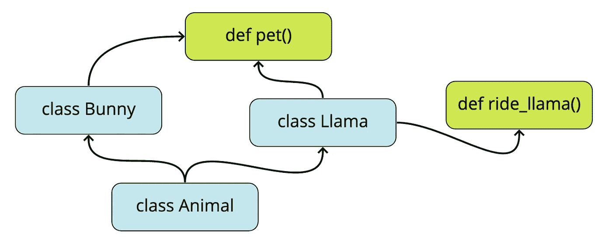
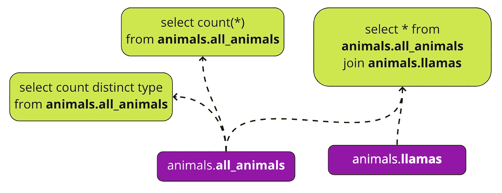
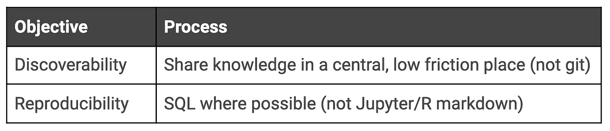

# 如何通过采用 SQL(有时抛弃 Git)来扩展您的分析组织

> 原文：<https://towardsdatascience.com/how-to-scale-your-analytics-org-by-ditching-git-3d8d4ce398d1?source=collection_archive---------17----------------------->

## 为什么分析工作应该优先考虑可发现性和可再现性，而不是版本控制和代码审查。

[图片来自 Freepik]

# 流程对于组织的扩展至关重要，而我们对分析流程的理解是错误的。

扩展组织的一个关键方面是过程。过程允许您规范化和合并最佳实践，以确保事情顺利和可伸缩地工作，即使没有人注意控制。但是，分析组织中的流程是经常被忽略的东西，我们经常默认工程遵守的相同流程:即使用 git 和相关模式来共享和存储分析工作。

对于数据科学/分析的某些部分，这样的工程行为转移是合适的:分析基础设施、分析工程、机器学习模型的部署、库-所有这些工作流都是固有的基于代码的，并受益于工程组织中熟悉的严格的测试+ PR 文化。但是对于剩余的分析工作——在 SQL IDEs 和 Jupyter 笔记本中每天都会发生的那种——拟合度很差。作为分析师和数据科学家，我们 90%的工作都是探索性的。不幸的是，在这里，工程实践不仅达不到要求，而且可能对组织有害。为什么？

> 盲目地将版本控制和代码审查作为共享探索性工作的看门人，会导致非共享的探索性工作。

所以我认为我们需要一个不同的过程。为了理解需要什么样的流程，我们首先需要确立分析组织的目标。在工程中，可维护性、可靠性和可伸缩性是支撑诸如版本控制、代码审查、代码覆盖、验证测试等实践的目标。但是在分析工作中，潜在的目标必然是不同的:可靠性、可维护性和可伸缩性仍然是重要的，但是它们表现得不同。让我们扔掉皇帝的衣服，用我们真正想要的东西来代替这些概念:**可发现性**和**再现性**。换句话说，我们需要将“科学”放回数据科学(和分析)中。

记住这些概念后，我将在本文中讨论以下内容:

*   为什么可发现性和再现性在分析和数据科学组织中至关重要。
*   如何将过程导向这些目标。

# 第一个支柱:可发现性

## 为什么我们需要可发现性:代码天生就是可发现的。分析工作不是。

这是一个过于简化的工程代码库，其中箭头表示导入。

图片作者。

任何在现代 IDE 中呆过一段时间的人都知道遍历这个图很容易。每一个现代的 IDE 都有“跳转到”功能，您可以立即跳转到对象引用。从`def pet()`开始，你可以很容易地跳到`class Llama`的定义，然后沿着面包屑轨迹一路回到父类`Animal`。

另一方面，您的分析代码库看起来有些不同:

图片作者。

仍然存在互连性(通过数据本身)，但是这些连接不能通过您的 IDE 发现(因此线是虚线)。这使得很难像工程师看到函数引用那样看到表引用。那么解决办法是什么呢？

## 如何获得可发现性:使用一个低摩擦、网络化的系统来做(或至少文档化)查询工作。

不过，在深入探讨之前，让我们先来谈谈采用工程最佳实践的分析组织的首选解决方案: **git** 。许多组织求助于 git 来跟踪任何一种推动洞察力的查询。这是合理的，并且允许通过比如说表名来搜索数据，但是根据我的经验，git 有一些不便之处:

*   **验证繁琐/盲目**。对于 SQL，您必须复制、粘贴并重新执行查询来验证 repo 中的工作。这是一个小小的不便，但是因为 git 中通常不跟踪结果，所以如果自己不重新运行查询，就很难跟踪查询之间的逻辑流。对于基于代码的笔记本电脑来说，这甚至会变得更糟—您需要在获取必要数据的基础上复制虚拟环境。不像在工程中，数据工作的输出几乎和代码本身一样重要，所以如果你只是看代码，你就错过了故事的一半。Git 不适合追踪逻辑的审查过程。
*   工作往往缺乏足够的背景。特别是，对于原始 SQL，git 提供的上下文很少，查询只能在编写它们的上下文中使用。当然，您可以在查询中添加一个自述文件，但是您编写的所有假设和用来验证这些假设的片段呢？你把那些放进去了吗？如果是这样的话，你是否愿意对它们进行版本控制？
*   Git 中的工作是可搜索的，但不是合格的。筛选过去的工作是粗糙的，因为 git 没有提供查询或分析的健壮性或可重用性的指示——只是说它以前被写过。
*   在理想的世界中，代码评审是很棒的，但是评审跟不上分析的步伐。代码仍然应该被检查，但是商业决策的速度经常需要在事后和/或逐案的基础上进行检查，而不是强制性的同行评审。一旦发现，见解的有用性通常会呈指数衰减，因此用正式的评审周期来阻碍业务不是一个好主意。当然，你可以在没有代码评审的情况下使用 git，但是总是有潜在的压力要退回到正式的评审过程中——养成在没有评审的情况下合并代码的习惯也可能是个坏主意。😉

我从以上几点得出有争议的结论:

> Git 不适合分享大多数分析工作。

最终，这些不便仅仅是不便，但是，也许令人惊讶的是，这些不便经常足以导致人们不分享他们的工作。我在 Airbnb、Wayfair 和其他一些试图实施同样措施的公司亲眼目睹了这种情况。虽然一些非常精美的作品会被分享(例如通过 Airbnb 的[知识回购](https://github.com/airbnb/knowledge-repo))，但这只占完成作品的 1%。剩余的工作存在于 SQL IDEs 的选项卡、本地文件、本地 Jupyter 笔记本中，因此这些工作会被不同的分析师和数据科学家一遍又一遍地重复。

解决办法？不惜一切代价让作品被发现**。一个合理的方法是在一个非 git 支持的地方分享你的工作。我们已经为这类事情专门构建了 [hyperquery.ai](https://hyperquery.ai/?utm_source=medium&utm_medium=organic-content&utm_campaign=2021-08-30-scale-analytics) ，但是我已经看到使用更通用的笔记解决方案取得了相当大的成功，比如使用 concept、Confluence 或 Library(h/t[Brittany Bennett](https://medium.com/u/6363936853d?source=post_page-----3d8d4ce398d1--------------------------------)),如果你不介意将 IDE 和查询共享环境分开的话。对于 Jupyter/R markdown 来说，不幸的是，git 可能仍然是所有罪恶中最小的。但这让我想到了我的第二个目标:再现性。**

# **第二个支柱:再现性**

## **再现性很重要，因为分析是科学。**

**分析/数据科学就是科学。因此，它需要是可复制的。你产生的任何洞见都是两件事:洞见本身和你为获得洞见所采取的步骤。**

**可复制性尤其重要，因为我已经告诉过你不要在托管的 git 平台中进行同行评审。虽然避免强制性的同行评审流程阻碍洞察力的使用很重要，但让同事检查关键的、决定决策的工作片段仍然非常重要，优先考虑可重复性可以实现这一点。此外，与代码评审相比，可再现性更好地促进了对结果的仔细验证，正如我所提到的，代码评审在数据输出方面通常是不透明的。**

## **使用 SQL 最容易获得再现性，而不是 Python/R。**

**为什么？因为 SQL 减少了复制工作的摩擦。与可发现性一样，减少摩擦也很重要，否则没有人会经历如实再现您的努力和验证您的结论的痛苦。正如他们所说，如果你有一个 5 行 git commit，你将得到 50 个请求的修改。如果你有一个 500 行的提交，你会得到一个 LGTM。要求用户建立虚拟环境，并与基于代码的笔记本中充满的隐藏状态进行斗争，这意味着其他人根本不会试图复制你的工作。没有什么比因为你没有仔细检查你的工作而把生意推向错误的方向更糟糕的了。**

**所以现在我们来看我这篇文章的第二个有争议的陈述:**

> **尽可能使用 SQL，而不是 Python/R。**

**Python/R 爱好者:在你关闭浏览器并永远屏蔽我之前，请听我说完。我*喜欢* Python 和 R，并且是 IPython 和 Jupyter 的最早用户之一(我整个研究生院都在用 Python 研究 rivers)。我甚至发布了几个 Python 开源库。**

**也就是说，你必须承认:Jupyter 笔记本和 R Markdown 并不是存储可复制作品的最佳地方。隐藏状态、缺乏易执行性、需求文件和缓存数据提供了许多失败点。在一天结束时，运动中的数据*打破*，并且 SQL 的使用最小化了运动。**

**当然，假设你不买这个——你是制造完美可复制笔记本的大师。这是完全可能的，如果你有一个基于 odbc 的库，它直接从你的仓库中提取数据，如果你确保在共享你的代码之前总是从头开始重新执行你的所有单元格，如果你确保你有一个好的系统来共享这些笔记本而不意外地存储大量的数据(哎呀，你执行了`df`并以明文列出了几百兆字节的数据)。但即便如此，如果你把这些事情都做对了，Jupyter 笔记本还是有一定程度的不透明性(尤其是利益相关者无法访问)，这将不可避免地降低对你分析的信任度。另一方面，SQL 片段是自包含的，开箱即用。如果利益相关者有疑问，他们可以(并且愿意)执行 SQL，只要您的组织有合理的数据卫生，可复制性是免费的。**

# **要实施的流程:(1)共享知识和(2) SQL(如果可能)**

**在本文的这一点上，您可能已经很清楚了，但是在我看来，只有两个必要的过程，当实现时，将推动可发现性和可再现性向前飞跃。我会把它们放在一个多余的表格里，帮助你消化它们:**

****

**希望这些建议不会像我之前的观点让你期待的那样激烈:**

*   **对于可发现性，我甚至不是说要放弃任何基于 git 的版本控制分析，只是建立一些可以共享和更容易发现查询和特别工作的东西。如果你被要求做某件事，并且你的组织足够大，保证有人以前做过。**
*   **为了再现性，**敦促分析师和 DS 尽可能使用 SQL*，而不是 python、R 或 excel。当你在研究一个模糊的研究问题时，一头扎进熊猫或潮汐中显然是好的，但要把它作为例外而不是常规。当您的 DS 在 pandas 中运行基本的聚合时，他们天生会牺牲可见性和可重复性，以换取他们认为这样做的好处(在我的例子中，通常只是熟悉度)。*****

# ***结束语***

***我建议的改变很小。在你的 analytics onboarding 文档中明确说明“SQL(尽可能)”,并建立一个支持知识共享的 SQL 编写环境(参见 [hyperquery.ai](https://hyperquery.ai/?utm_source=medium&utm_medium=organic-content&utm_campaign=2021-08-30-scale-analytics) )。但是除此之外，没有什么需要改变的了。***

***试一试，让我知道这些调整对你有什么效果(或者你是否通过其他方式成功地推动了可发现性和可再现性)。这些微小的变化可能意味着沮丧、超负荷工作的数据团队与通过可重用、自由共享的 SQL 来简化和减轻这种工作负载的团队之间的差异。***

****推文*[*@ imrobertyi*](https://twitter.com/imrobertyi)*/*[*@*hyperquery](http://twitter.com/hyperquery)*来问好。👋
关注我们*[*LinkedIn*](https://www.linkedin.com/company/hyperquery/)*。🙂* ***要了解更多关于 Hyperquery 的信息(并注册我们的私人测试版)，请访问***[***Hyperquery . ai***](https://hyperquery.ai/?utm_source=medium&utm_medium=organic-content&utm_campaign=2021-08-30-scale-analytics)***。*** *(如果你对帮助建立感兴趣，我们正在招聘——查看我们的* [*空缺职位*](https://www.notion.so/Careers-at-Dataframe-3e861dab875443269ee612e9159c2071) *)。)****