# 如何在 Google Cloud 上安排 Python 脚本

> 原文：<https://towardsdatascience.com/how-to-schedule-a-python-script-on-google-cloud-721e331a9590?source=collection_archive---------7----------------------->

## 如何使用 Google Cloud Scheduler 和 Cloud Function 安排一个递归 Python 脚本

照片由[尼古拉·塔拉先科](https://unsplash.com/@beautyoftechnology?utm_source=unsplash&utm_medium=referral&utm_content=creditCopyText)在 [Unsplash](https://unsplash.com/s/photos/macbook?utm_source=unsplash&utm_medium=referral&utm_content=creditCopyText) 拍摄

没有在您的服务器中设置气流？没有任何设置 cron 作业来调度脚本的经验？别担心。今天我们将学习如何用最少的 cron 作业知识在 Google 云平台中调度您的 Python 脚本。

> Cloud Scheduler 是一个受管理的 [Google 云平台](https://cloud.google.com/) (GCP)产品，它允许您指定一个频率来计划一个重复的作业。简而言之，它是一个轻量级的托管任务调度程序。

为什么我们需要一个调度程序？调度程序允许您在任何时间运行工作流。它在失败的情况下重试，甚至让你在凌晨 3 点运行一些东西，这样你就不需要在半夜醒来。

# 入门指南

## 创建云调度程序

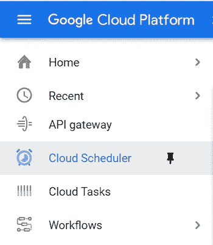

让我们从创建云调度程序开始。去[谷歌云平台](https://console.cloud.google.com/)找云调度器或者直接去这个[链接](https://console.cloud.google.com/cloudscheduler)。

> 注意:您必须设置您的计费帐户才能使用云调度程序。你将每月 3 个免费工作，每个计费帐户。更多详情，可以参考[云调度器定价](https://cloud.google.com/scheduler/pricing)。

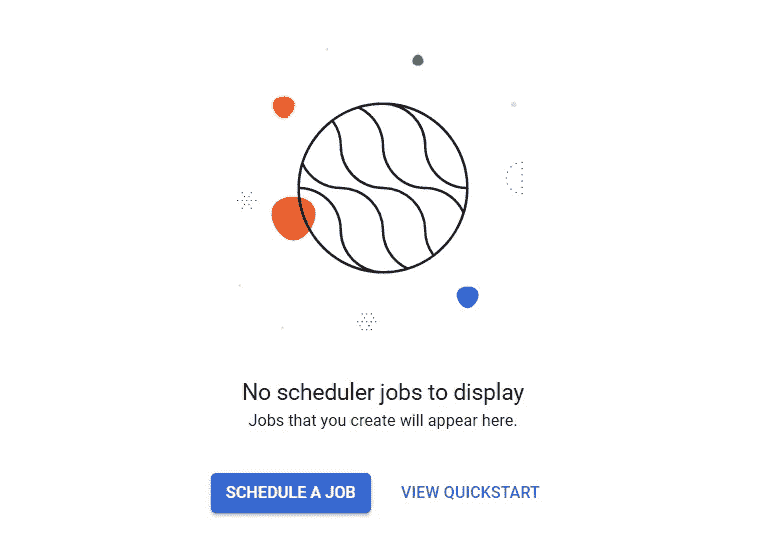

让我们从“安排工作”开始。

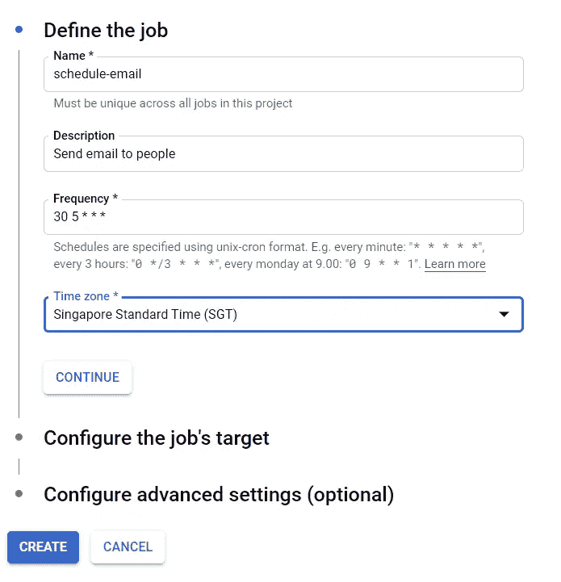

在本例中，我将安排一个 Python 脚本来发送电子邮件，因此作业的名称将是`schedule-email`。

计划频率采用 unix-cron 格式。如果不熟悉 unx-cron，可以参考 [crontab guru 网站](https://crontab.guru/)。我总是参考这个网站，以确保我设置了正确的时间表。

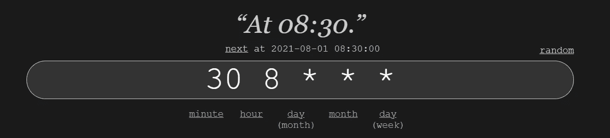

例如，`30 8 * * *`表示该作业将在每天的 08:30 运行。

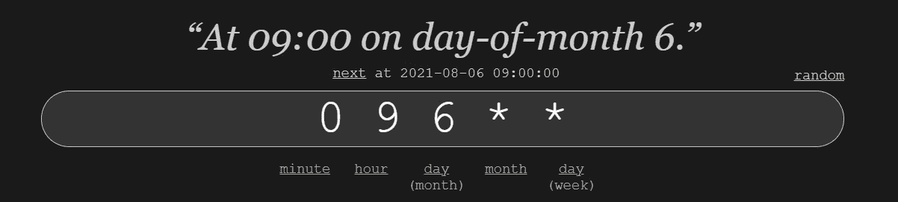

`0 9 6 * *`表示该作业将在每月 6 日 09:00 运行。

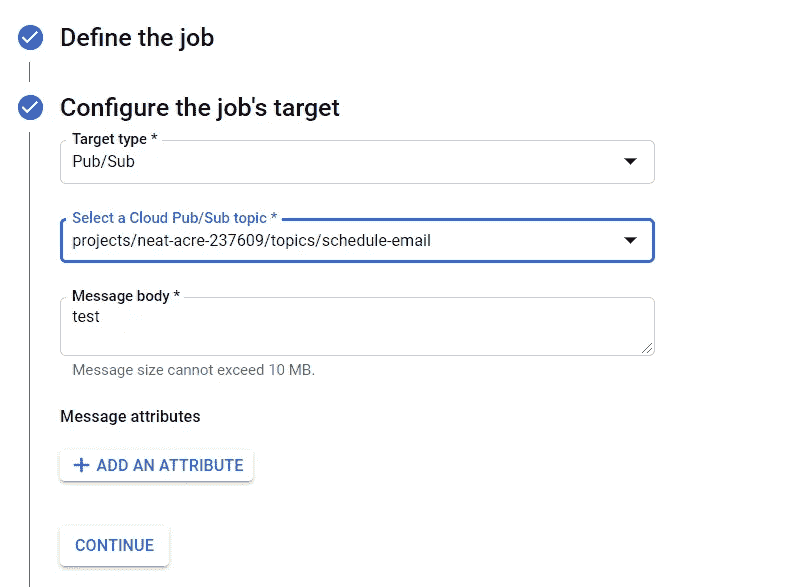

接下来，我们必须配置作业的目标。在本例中，我们将使用发布/订阅作为目标类型。新主题`schedule-email`为该作业创建了一个新主题。

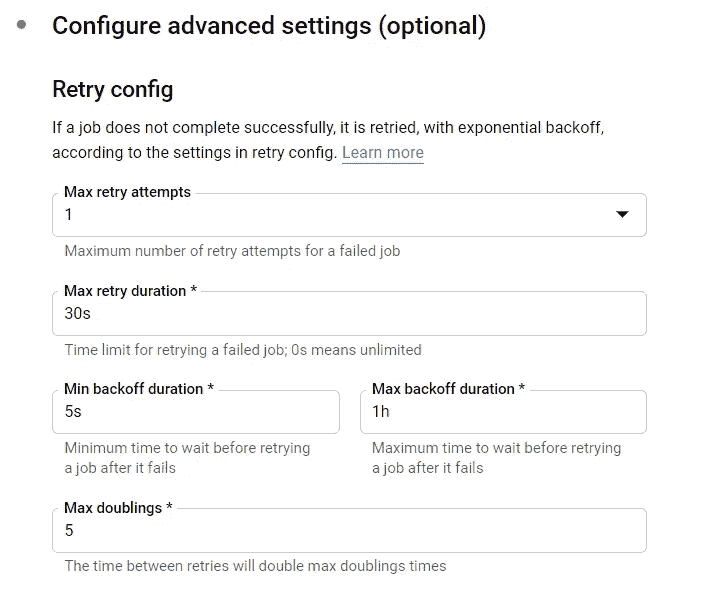

这里的高级设置是可选的。但是为了安全起见，让我们设置一个重试尝试。之后，让我们单击“创建”按钮来创建云调度程序。

## 创建云函数

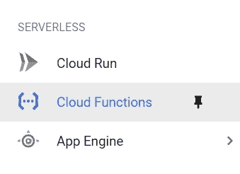

接下来我们去[云函数](https://console.cloud.google.com/functions)创建一个云函数。

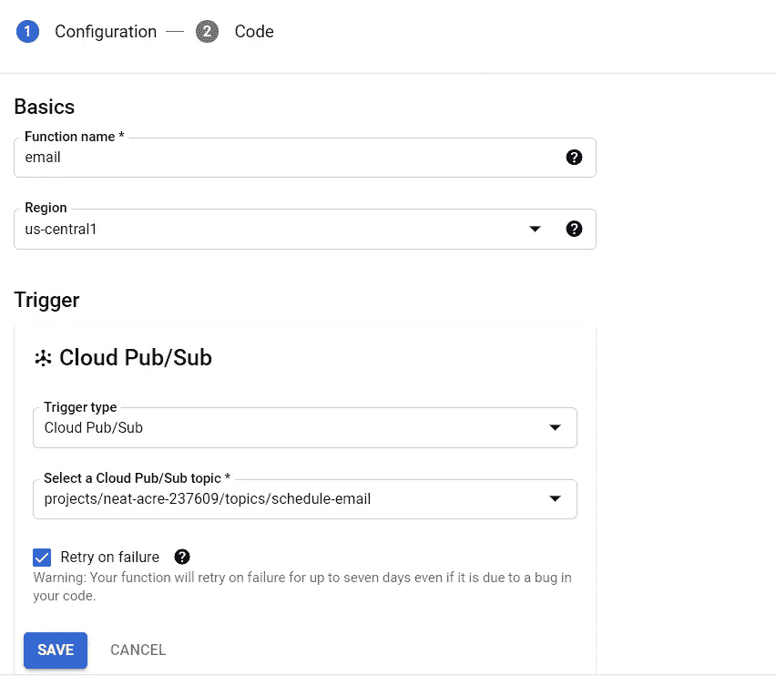

让我们用名称和地区来配置我们的云函数。触发器类型将是发布/订阅，主题将是我们刚刚创建的主题`schedule-email`。

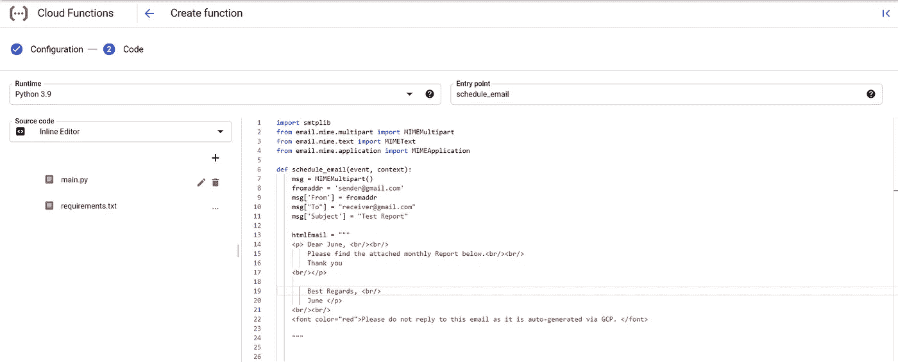

接下来，我们必须用`main.py`和`requirement.txt`设置脚本。

在本例中，我们将发送一封带有此调度程序的简单电子邮件。因此，这个脚本不需要额外的包/库。我将保持`requirement.txt`不变。

如果你有兴趣安排一封带附件的邮件，请参考我的另一篇文章。

 [## 如何使用 Python 发送带附件的电子邮件

### 作为一名数据分析师，我经常会收到这样的请求:“你能每周给我发一份报告吗？”或者…

towardsdatascience.com](/how-to-send-email-with-attachments-by-using-python-41a9d1a3860b) 

**入口点**将是您定义在脚本中运行的函数，在本例中是`schedule_email`。

您还可以选择配置分配的内存、超时和运行时环境变量。如果你运行一个很长的脚本，请记住分配更多的时间和内存。

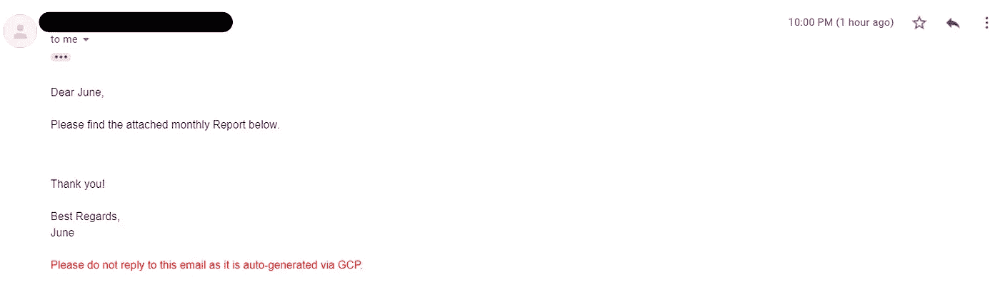

耶！邮件成功安排在晚上 10 点。

现在你已经学会了如何使用 Google Cloud Scheduler 来调度 Python 脚本。您可以将该调度器用于其他任务，如临时批处理作业、大数据处理作业或基础设施自动化工具。好的一面是云调度程序为您处理所有繁重的工作！

可以在我的 [**Github 要诀**](https://gist.github.com/chingjunetao/d175394d39420a79a3ad84ef35be4e8f) 中查看`main.py`。干杯！

**如果你喜欢读这篇文章，你可能也会喜欢这些:**

 [## 如何用熊猫用 Python 重写 SQL 查询

### 在 Python 中再现相同的 SQL 查询结果

towardsdatascience.com](/how-to-rewrite-your-sql-queries-in-python-with-pandas-8d5b01ab8e31)  [## 如何用 Python 设计你的数据框架

### 如何使用 Python 高亮显示、格式化或着色您的数据框

towardsdatascience.com](/how-to-style-your-dataframe-with-python-eabf376d1efd) 

**你可以在 Medium 上找到我其他作品的链接，关注我** [**这里**](https://medium.com/@chingjunetao) **。感谢阅读！**